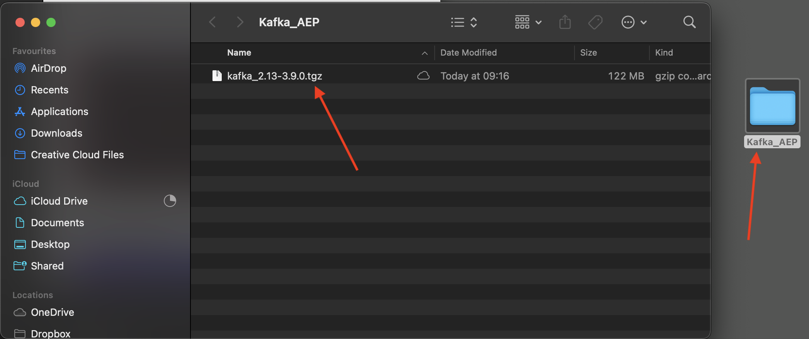
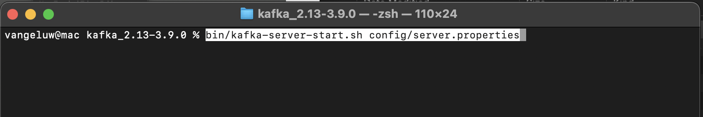

# 2.6.2 Kafka 클러스터 설치 및 구성

## Apache Kafka 다운로드

[https://kafka.apache.org/downloads](https://kafka.apache.org/downloads)(으)로 이동하여 최신 버전을 다운로드합니다. 최신 바이너리 릴리스(이 경우 **3.9.0**)를 선택하십시오. 다운로드가 시작됩니다.

바탕 화면 **Kafka_AEP**&#x200B;에 폴더를 만들고 다운로드한 파일을 해당 디렉터리에 배치합니다.

폴더를 마우스 오른쪽 단추로 클릭하고 **폴더에서 새 터미널**&#x200B;을 클릭하여 **터미널** 창을 엽니다.

터미널 창에서 다음 명령을 실행하여 다운로드한 파일의 압축을 풉니다.

`tar -xvf kafka_2.13-3.9.0.tgz`

>[!NOTE]
>
>위의 명령이 다운로드한 파일의 버전과 일치하는지 확인하십시오. 버전이 최신 버전인 경우 해당 버전과 일치하도록 위의 명령을 업데이트해야 합니다.

그러면 다음과 같은 결과가 표시됩니다.

해당 파일의 압축을 해제하면 다음과 같은 디렉토리가 생성됩니다.

그리고 해당 디렉토리에는 다음과 같은 하위 디렉토리가 있습니다.

터미널 창으로 돌아갑니다. 다음 명령을 입력합니다.

`cd kafka_2.13-3.9.0`

>[!NOTE]
>
>위의 명령이 다운로드한 파일의 버전과 일치하는지 확인하십시오. 버전이 최신 버전인 경우 해당 버전과 일치하도록 위의 명령을 업데이트해야 합니다.

그런 다음 `bin/kafka-topics.sh` 명령을 입력합니다.

그러면 이 응답이 표시됩니다. 이는 Kafka가 제대로 설치되어 있고 Java가 제대로 작동하고 있음을 의미합니다. (미리 알림: 작동하려면 Java 23 JDK가 설치되어 있어야 합니다!. `java -version` 명령을 사용하여 설치한 Java 버전을 확인할 수 있습니다.)

## 시작 Kafka

Kafka를 시작하려면 Kafka Zookeeper 및 Kafka를 이 순서대로 시작해야 합니다.

**kafka_2.13-3.9.0** 폴더를 마우스 오른쪽 단추로 클릭하고 **폴더에서 새 터미널**&#x200B;을 클릭하여 **터미널** 창을 엽니다.

다음 명령을 입력합니다.

`bin/zookeeper-server-start.sh config/zookeeper.properties`

그러면 다음과 같은 결과가 표시됩니다.

이러한 연습을 진행하는 동안 이 창을 열어 두십시오!

**kafka_2.13-3.9.0** 폴더를 마우스 오른쪽 단추로 클릭하고 **폴더에 새 터미널**&#x200B;을 클릭하여 다른 새 **터미널** 창을 엽니다.

다음 명령을 입력합니다.

`bin/kafka-server-start.sh config/server.properties`

그러면 다음과 같은 결과가 표시됩니다.

이러한 연습을 진행하는 동안 이 창을 열어 두십시오!

## Kafka 주제 만들기

**kafka_2.13-3.9.0** 폴더를 마우스 오른쪽 단추로 클릭하고 **폴더에서 새 터미널**&#x200B;을 클릭하여 **터미널** 창을 엽니다.

이 명령을 입력하여 이름이 **aeptest**&#x200B;인 새 Kafka 주제를 만듭니다. 이 항목은 이 연습에서 테스트하는 데 사용됩니다.

`bin/kafka-topics.sh --create --topic aeptest --bootstrap-server localhost:9092`

그러면 확인이 표시됩니다.

이 명령을 입력하여 이름이 **aep**&#x200B;인 새 Kafka 주제를 만듭니다. 이 항목은 다음 연습에서 구성할 Adobe Experience Platform 싱크 커넥터에서 사용됩니다.

`bin/kafka-topics.sh --create --topic aep --bootstrap-server localhost:9092`

그러면 유사한 확인이 표시됩니다.

## 이벤트 생성

첫 번째 Kafka 주제를 만든 터미널 창으로 돌아가 다음 명령을 입력합니다.

`bin/kafka-console-producer.sh --broker-list 127.0.0.1:9092 --topic aeptest`

그러면 이걸 보게 될 거야. Enter 단추를 누를 때마다 새 메시지가 **aeptest** 주제로 전송됩니다.

`Hello AEP`을(를) 입력하고 Enter 키를 누릅니다. 이제 첫 번째 이벤트가 로컬 Kafka 인스턴스로 **aeptest** 주제로 전송되었습니다.

`Hello AEP again.`을(를) 입력하고 Enter 키를 누릅니다.

`AEP Data Collection is the best.`을(를) 입력하고 Enter 키를 누릅니다.

이제 3개의 이벤트를 **aeptest** 주제에 생성했습니다. 이제 해당 데이터가 필요할 수 있는 애플리케이션에서 이러한 이벤트를 사용할 수 있습니다.

키보드에서 `Control` 및 `C`을(를) 동시에 클릭하여 프로듀서를 닫습니다.

## 이벤트 사용

이벤트를 생성하는 데 사용한 터미널 창에 다음 명령을 입력합니다.

`bin/kafka-console-consumer.sh --bootstrap-server 127.0.0.1:9092 --topic aeptest --from-beginning`

그러면 소비자에 표시되는 **aeptest** 주제에 대한 이전 연습에서 생성된 모든 메시지가 표시됩니다. Apache Kafka의 작동 방식: 생산자는 이벤트를 파이프라인으로 만들고 소비자는 이러한 이벤트를 소비합니다.

키보드에서 `Control` 및 `C`을(를) 동시에 클릭하여 프로듀서를 닫습니다.

이 연습에서는 로컬 Kafka 클러스터를 설정하고, Kafka 주제를 만들고, 이벤트를 만들고, 이벤트를 소비하는 모든 기본 사항을 살펴보았습니다.

이 모듈의 목표는 실제 조직이 Apache Kafka 클러스터를 이미 구현하고 Kafka 클러스터의 데이터를 Adobe Experience Platform으로 스트리밍하고자 하는 경우 발생할 수 있는 상황을 시뮬레이션하는 것입니다.

이러한 구현을 용이하게 하기 위해 Kafka Connect를 사용하여 구현할 수 있는 Adobe Experience Platform 싱크 커넥터가 생성되었습니다. 해당 Adobe Experience Platform 싱크 커넥터에 대한 설명서는 [https://github.com/adobe/experience-platform-streaming-connect](https://github.com/adobe/experience-platform-streaming-connect)에서 확인할 수 있습니다.

다음 연습에서는 로컬 Kafka 클러스터 내에서 해당 Adobe Experience Platform 싱크 커넥터를 사용하는 데 필요한 모든 사항을 구현합니다.

터미널 창을 닫습니다.

이 연습을 완료했습니다.

다음 단계: [2.6.3 Adobe Experience Platform에서 HTTP API 끝점 구성](./ex3.md)

[모듈 2.6으로 돌아가기](./aep-apache-kafka.md)

[모든 모듈로 돌아가기](../../../overview.md)
