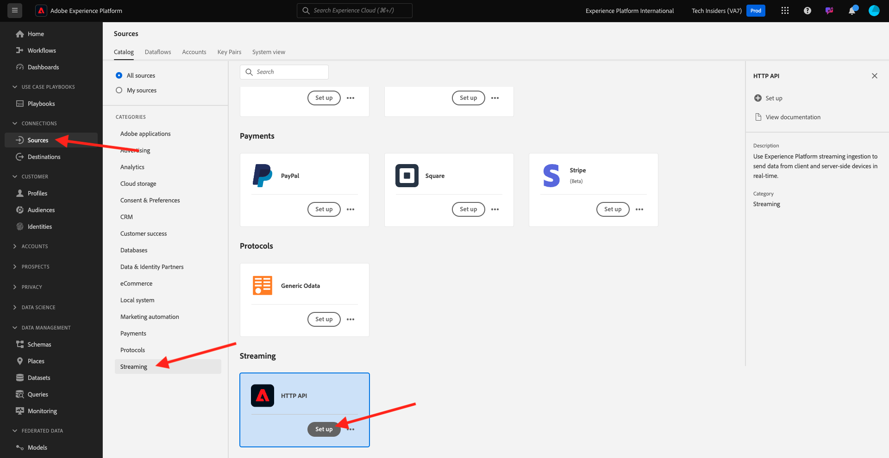

# 2.6.3 Adobe Experience Platform에서 HTTP API 스트리밍 끝점 구성

Kafka에서 Adobe Experience Platform 싱크 커넥터를 설정하려면 먼저 Adobe Experience Platform에서 HTTP API Source 커넥터를 만들어야 합니다. Adobe Experience Platform 싱크 커넥터를 설정하려면 HTTP API 스트리밍 끝점 URL이 필요합니다.

HTTP API Source 커넥터를 만들려면 [https://experience.adobe.com/platform](https://experience.adobe.com/platform) URL로 이동하여 Adobe Experience Platform에 로그인합니다.

로그인하면 Adobe Experience Platform 홈페이지에 접속하게 됩니다.

계속하려면 **샌드박스**&#x200B;를 선택해야 합니다. 선택할 샌드박스 이름이 ``--aepSandboxId--``입니다. 화면 상단의 파란색 선에 있는 텍스트 **[!UICONTROL 프로덕션]**&#x200B;을(를) 클릭하면 됩니다. 적절한 샌드박스를 선택하면 화면이 변경되고 이제 전용 샌드박스에 있습니다.

왼쪽 메뉴에서 **소스**(으)로 이동한 다음 **HTTP API**&#x200B;가 표시될 때까지 **소스 카탈로그**&#x200B;에서 아래로 스크롤합니다. **데이터 추가**&#x200B;를 클릭합니다.

**새 계정**&#x200B;을 클릭합니다. HTTP API 연결의 이름으로 `--demoProfileLdap-- - Kafka`을(를) 사용합니다(이 경우 **vangeluw - Kafka**). **XDM 호환**&#x200B;에 대한 확인란을 활성화하십시오. **소스에 연결**&#x200B;을 클릭합니다.

그러면 이 메시지가 표시됩니다. **다음**&#x200B;을 클릭하세요.

**기존 데이터 세트**&#x200B;를 선택하고 드롭다운 메뉴를 엽니다. 데이터 집합 **데모 시스템 - 콜 센터(전역 v1.1)에 대한 이벤트 데이터 집합**&#x200B;을(를) 검색하여 선택하십시오.

**다음**&#x200B;을 클릭합니다.

**다음**&#x200B;을 클릭합니다.

**마침을 클릭합니다**.

그러면 방금 만든 HTTP API Source 커넥터에 대한 개요가 표시됩니다.

다음 연습에서 필요하므로 아래 URL과 같은 **스트리밍 끝점** URL을 복사해야 합니다.

`https://dcs.adobedc.net/collection/d282bbfc8a540321341576275a8d052e9dc4ea80625dd9a5fe5b02397cfd80dc`

이 연습을 완료했습니다.

다음 단계: [2.6.4 Kafka Connect 및 Adobe Experience Platform 싱크 커넥터 설치 및 구성](./ex4.md)

[모듈 2.6으로 돌아가기](./aep-apache-kafka.md)

[모든 모듈로 돌아가기](../../../overview.md)
