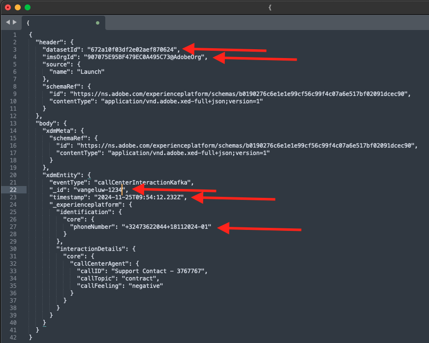
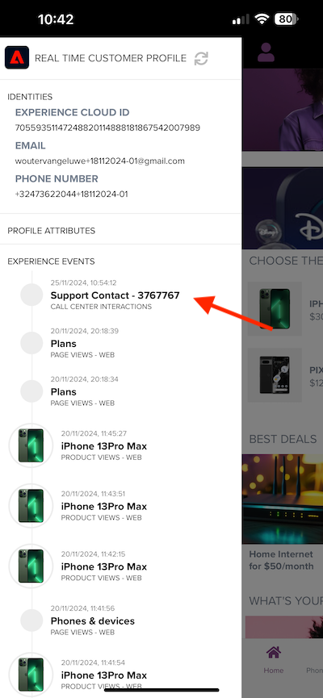

# 2.6.4 Kafka Connect 및 Adobe Experience Platform 싱크 커넥터 설치 및 구성

## 2.6.4.1 Adobe Experience Platform 싱크 커넥터 다운로드

[https://github.com/adobe/experience-platform-streaming-connect/releases](https://github.com/adobe/experience-platform-streaming-connect/releases)(으)로 이동하여 Adobe Experience Platform 싱크 커넥터의 최신 공식 릴리스를 다운로드합니다.


다운로드 파일 **streaming-connect-sink-0.0.14-java-11.jar**&#x200B;을(를) 바탕 화면에 배치합니다.


## 2.6.4.2 Kafka 연결 구성

바탕 화면의 **Kafka_AEP** 폴더로 이동한 다음 `kafka_2.13-3.1.0/config` 폴더로 이동합니다.
해당 폴더에서 텍스트 편집기를 사용하여 **connect-distributed.properties** 파일을 엽니다.


텍스트 편집기에서 34행과 35행으로 이동하여 필드 `key.converter.schemas.enable` 및 `value.converter.schemas.enable`을(를) `false`(으)로 설정해야 합니다.

```json
key.converter.schemas.enable=false
value.converter.schemas.enable=false
```

이 파일에 변경 사항을 저장합니다.


그런 다음 `kafka_2.13-3.1.0` 폴더로 돌아가서 수동으로 새 폴더를 만들고 이름을 `connectors`(으)로 지정합니다.


폴더를 마우스 오른쪽 단추로 클릭하고 **폴더의 새 터미널**&#x200B;을 클릭합니다.


그러면 이걸 보게 될 거야. `pwd` 명령을 입력하여 해당 폴더의 전체 경로를 검색합니다. 전체 경로를 선택하고 클립보드에 복사합니다.


텍스트 편집기로 돌아가서 **connect-distributed.properties** 파일로 이동한 다음 마지막 줄(스크린샷의 86행)까지 아래로 스크롤합니다. `# plugin.path=`(으)로 시작하는 줄의 주석 처리를 제거하고 `connectors` 폴더의 전체 경로를 붙여넣어야 합니다. 결과는 다음과 유사해야 합니다.

`plugin.path=/Users/woutervangeluwe/Desktop/Kafka_AEP/kafka_2.13-3.1.0/connectors`

**connect-distributed.properties** 파일에 변경 사항을 저장하고 텍스트 편집기를 닫습니다.


그런 다음 다운로드한 Adobe Experience Platform Sink Connector의 최신 공식 릴리스를 `connectors` 폴더에 복사합니다. 이전에 다운로드한 파일의 이름은 **streaming-connect-sink-0.0.14-java-11.jar**&#x200B;이므로 `connectors` 폴더로 간단히 이동할 수 있습니다.


그런 다음 **kafka_2.13-3.1.0** 폴더 수준에서 새 터미널 창을 엽니다. 해당 폴더를 마우스 오른쪽 단추로 클릭하고 **폴더의 새 터미널**&#x200B;을 클릭합니다.

터미널 창에 `bin/connect-distributed.sh config/connect-distributed.properties` 명령을 붙여 넣고 **Enter**&#x200B;를 클릭합니다. 이 명령은 Kafka Connect를 시작하고 Adobe Experience Platform 싱크 커넥터의 라이브러리를 로드합니다.


몇 초 후에 다음과 같은 것을 볼 수 있습니다.


## 2.6.4.3 Postman을 사용하여 Adobe Experience Platform 싱크 커넥터 만들기

이제 Postman을 사용하여 Kafka Connect와 상호 작용할 수 있습니다. 이렇게 하려면 [이 Postman 컬렉션](./../../../assets/postman/postman_kafka.zip)을 다운로드하고 바탕 화면의 로컬 컴퓨터에 압축을 풉니다. 그러면 이름이 `Kafka_AEP.postman_collection.json`인 파일이 만들어집니다.


Postman에서 이 파일을 가져와야 합니다. 이렇게 하려면 Postman을 열고 **가져오기**&#x200B;를 클릭하고 `Kafka_AEP.postman_collection.json` 파일을 팝업으로 끌어다 놓은 다음 **가져오기**&#x200B;를 클릭합니다.


그런 다음 Postman의 왼쪽 메뉴에서 이 컬렉션을 찾을 수 있습니다. GET 첫 번째 요청인 **사용 가능한 Kafka Connect 커넥터**&#x200B;를 클릭하여 엽니다.


그러면 이걸 보게 될 거야. 파란색 **보내기** 단추를 클릭하세요. 그 후에는 빈 응답 `[]`이(가) 표시됩니다. 빈 응답은 현재 정의된 Kafka Connect 커넥터가 없기 때문입니다.


커넥터를 만들려면 Kafka 컬렉션에서 두 번째 요청인 **AEP 싱크 커넥터 만들기 POST**&#x200B;를 클릭하여 엽니다. 그러면 이걸 보게 될 거야. **&quot;aep.endpoint&quot;: &quot;&quot;**&#x200B;이(가) 표시된 11행에서 연습 [15.3](./ex3.md)이(가) 끝날 때 받은 HTTP API 스트리밍 끝점 URL에 붙여넣어야 합니다. HTTP API 스트리밍 끝점 URL은 다음과 같습니다. `https://dcs.adobedc.net/collection/d282bbfc8a540321341576275a8d052e9dc4ea80625dd9a5fe5b02397cfd80dc`.


붙여넣은 후 요청 본문은 다음과 같아야 합니다. 파란색 **보내기** 단추를 클릭하여 커넥터를 만듭니다. 커넥터 생성에 대한 즉각적인 응답을 받게 됩니다.


첫 번째 요청인 **사용 가능한 Kafka Connect 커넥터**&#x200B;를 클릭하여 다시 열고 파란색 **GET** 단추를 다시 클릭합니다. 이제 Kafka Connect 커넥터가 생성되었음을 알 수 있습니다.


GET 그런 다음 Kafka 컬렉션에서 세 번째 요청인 **Kafka Connect 커넥터 상태 확인**&#x200B;을 엽니다. 파란색 **보내기** 단추를 클릭하면 커넥터가 실행 중임을 나타내는 아래 단추와 같은 응답을 받게 됩니다.


## 2.6.4.4 경험 이벤트 생성

**kafka_2.13-3.1.0** 폴더를 마우스 오른쪽 단추로 클릭하고 **폴더에서 새 터미널**&#x200B;을 클릭하여 새 **터미널** 창을 엽니다.


다음 명령을 입력합니다.

`bin/kafka-console-producer.sh --broker-list 127.0.0.1:9092 --topic aep`


그러면 이걸 보게 될 거야. Enter 단추를 누를 때마다 새 메시지가 **aep** 주제로 전송됩니다.


이제 메시지를 보내어 Adobe Experience Platform 싱크 커넥터에서 소비하고 실시간으로 Adobe Experience Platform으로 수집할 수 있습니다.

이를 테스트하기 위해 간단한 데모를 해보겠습니다.

[https://builder.adobedemo.com/projects](https://builder.adobedemo.com/projects)(으)로 이동합니다. Adobe ID으로 로그인하면 이 메시지가 표시됩니다. 웹 사이트 프로젝트를 클릭하여 엽니다.


**Screens** 페이지에서 **실행**&#x200B;을 클릭합니다.


그러면 데모 웹 사이트가 열리는 것을 볼 수 있습니다. URL을 선택하고 클립보드에 복사합니다.


새 시크릿 브라우저 창을 엽니다.


이전 단계에서 복사한 데모 웹 사이트의 URL을 붙여 넣습니다. 그런 다음 Adobe ID을 사용하여 로그인하라는 메시지가 표시됩니다.


계정 유형을 선택하고 로그인 프로세스를 완료합니다.


그러면 웹 사이트가 시크릿 브라우저 창에 로드되는 것을 볼 수 있습니다. 모든 데모에 대해 새로운 시크릿 브라우저 창을 사용하여 데모 웹 사이트 URL을 로드해야 합니다.


화면 왼쪽 상단 모서리에 있는 Adobe 로고 아이콘을 클릭하여 프로필 뷰어를 엽니다.


프로필 뷰어 패널과 현재 알 수 없는 이 고객의 기본 식별자로 **Experience Cloud ID**&#x200B;를 사용하는 실시간 고객 프로필을 살펴보십시오.


등록/로그인 페이지로 이동합니다. **계정 만들기**&#x200B;를 클릭합니다.


자세한 내용을 입력하고 **등록**&#x200B;을 클릭하면 이전 페이지로 리디렉션됩니다.


프로필 뷰어 패널을 열고 실시간 고객 프로필로 이동합니다. 프로필 뷰어 패널에 새로 추가된 이메일 및 전화 식별자와 같은 모든 개인 데이터가 표시됩니다.


지난 활동을 기반으로 일부 경험 이벤트가 표시될 수 있습니다.


이를 변경하고 Kafka의 Callcenter 경험 이벤트를 Adobe Experience Platform으로 전송하겠습니다.

아래 샘플 경험 이벤트 페이로드를 가져와서 텍스트 편집기에 복사합니다.

```json
{
  "header": {
    "datasetId": "61fe23fd242870194a6d779c",
    "imsOrgId": "--aepImsOrgID--",
    "source": {
      "name": "Launch"
    },
    "schemaRef": {
      "id": "https://ns.adobe.com/experienceplatform/schemas/b0190276c6e1e1e99cf56c99f4c07a6e517bf02091dcec90",
      "contentType": "application/vnd.adobe.xed-full+json;version=1"
    }
  },
  "body": {
    "xdmMeta": {
      "schemaRef": {
        "id": "https://ns.adobe.com/experienceplatform/schemas/b0190276c6e1e1e99cf56c99f4c07a6e517bf02091dcec90",
        "contentType": "application/vnd.adobe.xed-full+json;version=1"
      }
    },
    "xdmEntity": {
      "eventType": "callCenterInteractionKafka",
      "_id": "",
      "timestamp": "2022-02-23T09:54:12.232Z",
      "_experienceplatform": {
        "identification": {
          "core": {
            "phoneNumber": ""
          }
        },
        "interactionDetails": {
          "core": {
            "callCenterAgent": {
              "callID": "Support Contact - 3767767",
              "callTopic": "contract",
              "callFeeling": "negative"
            }
          }
        }
      }
    }
  }
}
```

그러면 이걸 보게 될 거야. 다음 2개의 필드를 수동으로 업데이트해야 합니다.

- **_id**: `--aepUserLdap--1234`과(와) 같은 임의의 id로 설정하십시오.
- **타임스탬프**: 현재 날짜 및 시간으로 타임스탬프를 업데이트합니다.
- **전화 번호**: 데모 웹 사이트에서 방금 만든 계정의 전화 번호를 입력합니다. 프로필 뷰어 패널의 **ID**&#x200B;에서 찾을 수 있습니다.

또한 다음 필드를 확인하고 업데이트해야 합니다.
- **datasetId**: 데이터 세트 데모 시스템 - 콜 센터의 이벤트 데이터 세트(전역 v1.1)에 대한 데이터 세트 ID를 복사해야 합니다
- **imsOrgID**: IMS 조직 ID는 `--aepImsOrgId--`입니다.

>[!NOTE]
>
>필드 **_id**&#x200B;은(는) 모든 데이터 수집에 대해 고유해야 합니다. 여러 이벤트를 생성하는 경우 매번 필드 **_id**&#x200B;을(를) 새로운 고유 값으로 업데이트하십시오.


그런 다음 다음과 같은 것이 필요합니다.



그런 다음 전체 경험 이벤트를 클립보드에 복사합니다. JSON 페이로드의 공백을 제거해야 하며 이를 위해 온라인 도구를 사용합니다. [http://jsonviewer.stack.hu/](http://jsonviewer.stack.hu/)(으)로 이동하여 이 작업을 수행합니다.


경험 이벤트를 편집기에 붙여 넣고 **공백 제거**&#x200B;를 클릭합니다.


그런 다음 출력 텍스트를 모두 선택하고 클립보드에 복사합니다.


터미널 창으로 돌아갑니다.


Terminal 창에 공백 없이 새 페이로드를 붙여 넣고 **Enter**&#x200B;를 클릭합니다.


그런 다음 데모 웹 사이트로 돌아가 페이지를 새로 고칩니다. 이제 프로필의 **기타 이벤트** 아래에 아래와 같은 경험 이벤트가 표시됩니다.



>[!NOTE]
>
>콜 센터 상호 작용을 프로필 뷰어 패널에 표시하려면 **프로필 뷰어** 탭으로 이동하여 [https://builder.adobedemo.com/projects](https://builder.adobedemo.com/projects)에서 프로젝트에 아래 레이블을 추가하고 필터링해야 합니다.


이 연습을 완료했습니다.

다음 단계: [요약 및 이점](./summary.md)

[모듈 2.6으로 돌아가기](./aep-apache-kafka.md)

[모든 모듈로 돌아가기](../../../overview.md)
