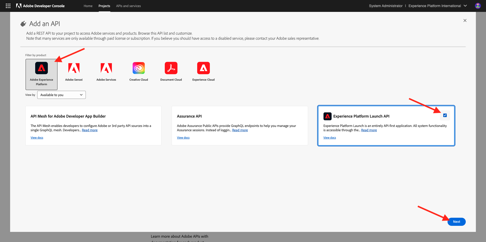
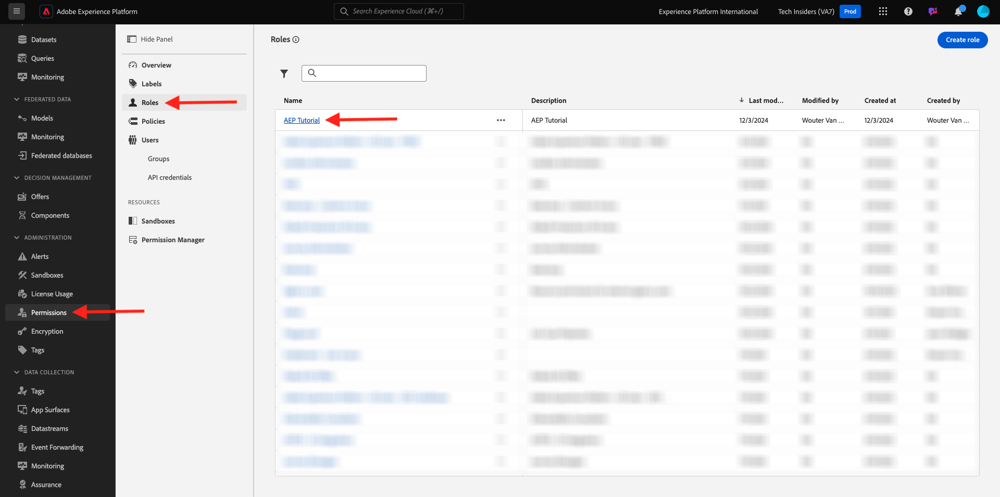
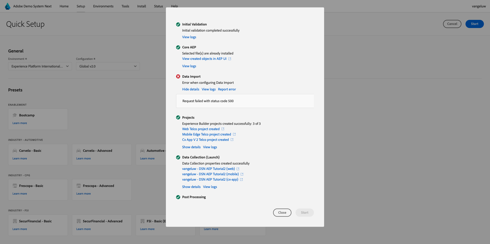

# 설정

>[!IMPORTANT]
>
>이 페이지는 시스템 관리자 역할만을 위한 페이지입니다. 아래 단계를 수행하려면 특정 인스턴스에 대한 시스템 관리자 액세스 권한이 필요합니다. Adobe Experience Cloud 조직의 시스템 관리자가 아닌 경우 아래 단계를 계속 진행하기 전에 시스템 관리자에게 문의하여 승인 및 도움을 요청하십시오.

## 개요

이러한 모든 튜토리얼을 실습으로 사용하려면 다음 Adobe Experience Cloud 애플리케이션을 IMS Org에서 프로비저닝해야 합니다.

- Adobe Real-time CDP
- Adobe Experience Platform 데이터 수집
- Adobe Journey Optimizer
- Customer Journey Analytics
- Data Distiller
- 페더레이션된 대상자 구성

특정 애플리케이션 서비스가 IMS Org에 대해 프로비저닝되지 않는 경우 해당 특정 연습을 실습으로 수행할 수 없습니다.

## 샌드박스 만들기

자체 AEP 인스턴스에서 자습서를 수행하려면 먼저 새 개발 샌드박스를 설정하는 것이 좋습니다. 새 샌드박스를 만들려면 [https://experience.adobe.com/platform](https://experience.adobe.com/platform)(으)로 이동하고 샌드박스로 이동한 다음 **찾아보기**(으)로 이동합니다. **샌드박스 만들기**&#x200B;를 클릭합니다.

다음과 같이 샌드박스를 만듭니다.

- 형식: **개발**
- 이름: **aep-tutorial**
- 제목: **AEP 자습서**

**만들기**&#x200B;를 클릭합니다.

이제 샌드박스가 생성됩니다. 2~3분 정도 지나면 이 메시지가 표시됩니다.

## 설정 권한

**권한**(으)로 이동한 다음 **역할**(으)로 이동합니다.

이 자습서를 진행할 학습자가 사용할 특정 **역할**&#x200B;을(를) 열려면 클릭하세요. **역할 만들기**&#x200B;를 클릭합니다.

역할에 **AEP 튜토리얼**&#x200B;과(와) 같은 이름을 지정하고 **확인**&#x200B;을 클릭합니다.

**샌드박스** 드롭다운 메뉴에서 방금 만든 샌드박스를 선택하고 다른 샌드박스를 제거해야 합니다(**Prod** 제거).

다양한 리소스를 추가하고 권한을 설정합니다. **샌드박스 관리**&#x200B;에 대한 권한을 추가하지 마십시오.

표시된 대로 리소스를 더 추가하고 권한을 설정합니다.

표시된 대로 리소스를 더 추가하고 권한을 설정합니다. **저장**&#x200B;을 클릭합니다. 그런 다음 **닫기**&#x200B;를 클릭합니다.

## 설정 Adobe I/O

다음으로 이동
[https://developer.adobe.com/console/integrations](https://developer.adobe.com/console/integrations). 올바른 인스턴스에 있는지 확인합니다. **새 프로젝트 만들기**&#x200B;를 클릭합니다.

**+ 프로젝트에 추가**&#x200B;를 클릭한 다음 **API**&#x200B;를 클릭합니다.

**Adobe Experience Platform**&#x200B;을 클릭한 다음 **Experience Platform API**&#x200B;을(를) 활성화합니다. **다음**&#x200B;을 클릭합니다.

**자격 증명 이름**&#x200B;에 대해 **DSN AEP 자습서**&#x200B;를 사용하십시오. **다음**&#x200B;을 클릭합니다.

사용 가능한 제품 프로필 중 하나를 선택합니다. 이 제품 프로필은 이 Adobe I/O 프로젝트에 대한 권한을 결정하지 않습니다. 이 작업은 다음 단계에서 수행됩니다. **구성된 API 저장**&#x200B;을 클릭합니다.

**+ 프로젝트에 추가**&#x200B;를 클릭한 다음 **API**&#x200B;를 다시 클릭합니다.

**Adobe Experience Platform**&#x200B;을 클릭한 다음 **Experience Platform Launch API**&#x200B;을(를) 활성화합니다. **다음**&#x200B;을 클릭합니다.

**다음**&#x200B;을 클릭합니다.

데이터 수집 속성을 만들고 관리할 수 있는 제품 프로필을 선택하십시오. **구성된 API 저장**&#x200B;을 클릭합니다.

그러면 이걸 보게 될 거야. 현재 **프로젝트 XXX** 이름을 클릭합니다.

**프로젝트 편집**&#x200B;을 클릭합니다.

**DSN AEP 자습서**&#x200B;와 같은 새 **프로젝트 제목**&#x200B;을 입력하십시오. **저장**&#x200B;을 클릭합니다.

이제 Adobe I/O 프로젝트가 준비되었습니다.

## Adobe I/O 프로젝트를 역할에 연결

**권한**, **역할**(으)로 이동한 다음 이전에 만든 새 역할을 클릭합니다.

**API 자격 증명**(으)로 이동합니다. **+ API 자격 증명 추가**&#x200B;를 클릭합니다.

그러면 이전 단계에서 만든 Adobe I/O 자격 증명이 표시됩니다. 선택한 다음 **저장**&#x200B;을 클릭합니다.

이제 Adobe I/O 프로젝트가 Adobe Experience Platform API에 액세스하는 데 필요한 권한으로 설정되었습니다.

>[!IMPORTANT]
>
>데모 시스템 다음 의 다음 단계를 계속하려면 최소 10분을 기다려야 합니다.

## 데모 시스템에서 환경 설정 다음

[https://dsn.adobe.com/tools/org-admin](https://dsn.adobe.com/tools/org-admin)(으)로 이동합니다. **+ 조직 추가**&#x200B;를 클릭합니다.

필수 필드를 입력합니다.

- IMS 조직 ID
- 이름
- 테넌트 ID(**밑줄**&#x200B;을(를) 포함하지 않음)
- 지역

시스템 관리자가 이러한 필드의 값을 도와줄 수 있어야 합니다.

**저장**&#x200B;을 클릭합니다.

이제 환경이 목록에 포함됩니다. 목록에서 찾은 다음 **링크** 아이콘을 클릭합니다.

이제 Adobe I/O 프로젝트 자격 증명의 일부로 만든 값을 입력해야 합니다. 여기에서 **클라이언트 ID**, **클라이언트 암호** 및 **범위**&#x200B;를 찾을 수 있습니다.

**기술 계정 ID**:

여기에 복사하여 붙여 넣으려면 **저장**&#x200B;을 클릭하세요.

이제 DSN 환경이 올바르게 설정되었습니다.

## DSN 환경에 대한 액세스 설정

[https://dsn.adobe.com/tools/environment-admin](https://dsn.adobe.com/tools/environment-admin)(으)로 이동합니다. 방금 만든 IMS 조직을 선택하고 사용자를 선택한 다음 **샌드박스**&#x200B;에서 **+ 할당**&#x200B;을 클릭합니다.

위의 첫 번째 단계에서 정의한 **샌드박스 이름**&#x200B;을(를) 입력하십시오. 다음과 같이 표시되어야 합니다.

- 이름: **aep-tutorial**

**확인**&#x200B;을 클릭합니다.

이제 선택한 사용자가 샌드박스를 사용할 수 있습니다.

## DSN 빠른 설정

[https://dsn.adobe.com/quick-setup](https://dsn.adobe.com/quick-setup)(으)로 이동합니다. **환경** 드롭다운 메뉴를 열고 IMS 조직/샌드박스를 선택합니다.

**구성**&#x200B;에 대해 **전역 v2.0**&#x200B;을(를) 선택하십시오.

**산업 - 통신**(으)로 스크롤한 다음 **Citi 신호 - 고급**&#x200B;을 선택합니다.

위로 스크롤하고 **시작**&#x200B;을 클릭합니다.

**제목**&#x200B;을 입력하고 **시작**&#x200B;을 클릭하세요.

>[!NOTE]
>
>샌드박스에서 기본 병합 정책을 만들지 않은 경우 오류가 발생할 수 있습니다. 이 경우 병합 정책이 자동으로 생성될 때까지 잠시 기다리거나 수동으로 Adobe Experience Platform으로 이동하여 프로필 > 병합 정책으로 이동하고 새 기본 병합 정책을 만듭니다.

그런 다음 진행 중인 설치의 진행 상황을 확인할 수 있으며, 이 작업은 2분 정도 소요됩니다.

모든 것이 성공적으로 완료되면 AEP 인스턴스가 성공적으로 구성되고 학습자가 튜토리얼을 수강할 수 있게 준비됩니다.

>[!NOTE]
>
>데이터 가져오기 단계는 자습서에서 사용되지 않으므로 해당 단계가 실패하면 걱정하지 말고 계속하십시오.

[https://experience.adobe.com/platform](https://experience.adobe.com/platform), **데이터 세트**(으)로 이동합니다. 이제 DSN 빠른 설정에서 만든 유사한 데이터 세트 목록이 표시됩니다.

>[!NOTE]
>
>Adobe Experience Platform과 애플리케이션에 대해 알아야 할 모든 것을 학습하는 데 시간을 투자해 주셔서 감사합니다. 질문이 있는 경우 향후 콘텐츠에 대한 제안 사항에 대한 일반적인 피드백을 공유하려면 기술 인사이더에게 **techinsiders@adobe.com**&#x200B;로 전자 메일을 보내 직접 문의하십시오.

[모든 모듈로 돌아가기](./overview.md)