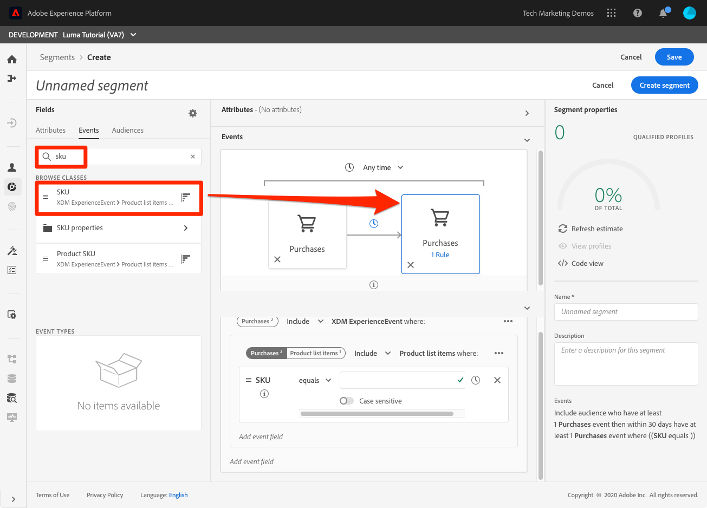

# 세그먼트 작성

<!-- 30 min-->
이 단원에서는 이전 단원에서 수집한 프로필 데이터를 기반으로 몇 가지 세그먼트를 빌드합니다.

실시간 고객 프로필이 있으면 유사한 트레이트를 공유하고 마케팅 전략에 유사하게 응답할 수 있는 개인 사용자의 세그먼트를 만들 수 있습니다. 이러한 세그먼트의 빌딩 블록은 이전에 만든 XDM 필드입니다.

**데이터 설계자**&#x200B;는 이 자습서 외부에서 세그먼트를 만들고 이 작업으로 동료를 지원해야 합니다.

연습을 시작하기 전에 이 짧은 비디오를 시청하여 세그먼트 만들기에 대해 자세히 알아보십시오.
>[!VIDEO](https://video.tv.adobe.com/v/27254?learn=on&enablevpops)

## 권한 필요

[권한 구성](configure-permissions.md) 단원에서 이 단원을 완료하는 데 필요한 모든 액세스 제어, 특히 다음을 설정합니다.

* 권한 항목 **[!UICONTROL 프로필 관리]** > **[!UICONTROL 세그먼트 관리]**, **[!UICONTROL 세그먼트 보기]** 및 **[!UICONTROL 대상 세그먼트 내보내기]**
* 권한 항목 **[!UICONTROL 프로필 관리]** > **[!UICONTROL 프로필 보기]** 및 **[!UICONTROL 프로필 관리]**
* 권한 항목 **[!UICONTROL 샌드박스]** > `Luma Tutorial`
* `Luma Tutorial Platform` 제품 프로필에 대한 사용자 역할 액세스
* `Luma Tutorial Platform` 제품 프로필에 대한 개발자 역할 액세스(API용)

## 기본 세그먼트 작성

골드 또는 플래티넘 상태의 충성도 프로그램 고객을 위한 간단한 세그먼트를 만들어 보겠습니다

1. Platform 사용자 인터페이스에서 왼쪽 탐색 메뉴의 **[!UICONTROL 세그먼트]**(으)로 이동합니다.
1. **[!UICONTROL 세그먼트 만들기]** 단추 선택
1. 스키마 빌더 왼쪽에는 속성(레코드 데이터), 이벤트(시계열 데이터) 및 대상에 대한 세 개의 탭이 있습니다
1. 톱니바퀴 아이콘을 선택하면 세그먼트 빌더에 데이터가 있는 필드만 기본적으로 표시되고 병합 정책을 변경할 수 있습니다
1. 특성 탭에서 **XDM 개별 프로필 > 충성도** 폴더로 이동합니다(&quot;충성도&quot;를 검색할 수도 있음).
1. 특성 필드 메뉴에서 세그먼트 빌더 캔버스로 `Tier`을(를) 끌어서 놓습니다.
1. `Tier` 선택: `Gold` 또는 `Platinum`
1. 세그먼트에 적합한 프로필 수를 확인하려면 **[!UICONTROL 예상 새로 고침]**&#x200B;을 선택하세요.
1. **[!UICONTROL 이름]**(으)로 `Luma customers with level Gold or Above`을(를) 입력하십시오.
1. **[!UICONTROL 저장]** 선택
   

<!--## Build a sequential segment-->

## 동적 세그먼트 작성

이 연습에서는 30일 이내에 동일한 제품을 두 번 구매한 고객을 위한 세그먼트를 만듭니다. 동적 세그먼트를 사용하면 필드를 변수로 사용하여 세그먼테이션의 크기를 조정할 수 있습니다.

1. 왼쪽 탐색에서 **[!UICONTROL 세그먼트]**(으)로 이동
1. **[!UICONTROL 세그먼트 만들기]** 단추 선택
1. **[!UICONTROL 이벤트]** 탭 선택
1. 목록을 `purchases`(으)로 필터링
1. **[!UICONTROL 구매]** 이벤트 유형을 캔버스로 _두 번 드래그하세요_
1. 두 **[!UICONTROL 구매]** 이벤트 중 하나에서 시계 아이콘을 선택하고 &quot;30일 내&quot;를 선택합니다.
1. 이때 세그먼트 정의가 **인지 확인하십시오.&quot;구매 이벤트가 1개 이상 있는 대상자를 포함했다가 30일 이내에 구매 이벤트가 1개 이상 있는 경우&quot;**
   
1. 이제 이벤트 필터를 `sku`(으)로 변경합니다.
1. SKU 필드를 두 번째 구매 이벤트로 드래그합니다.
   
1. 이제 이벤트 필터 지우기
1. **[!UICONTROL 변수 찾아보기]** 섹션에 두 개의 구매 이벤트에 대한 폴더가 있습니다. **[!UICONTROL 구입 항목 1]**&#x200B;을 살펴보려면 클릭\
   
1. **[!UICONTROL 제품 목록 항목]** 폴더로 드릴다운하고 **[!UICONTROL SKU]** 필드를 선택한 다음 **[!UICONTROL 같음]** 피연산자의 오른쪽으로 드래그합니다. 해당 영역을 마우스로 가리키면 &quot;피연산자 비교를 위해 추가&quot; 섹션에 놓습니다
1. 세그먼트 이름을 `Bought same product within 30 days`로 지정합니다.
1. 대상 정의가 **인지 확인합니다.&quot;(SKU가 Purchases1 SKU와 같음)&quot;**&#x200B;에서 최소 1개의 구매 이벤트가 있는 대상을 포함하면 30일 이내에 최소 1개의 구매 이벤트가 있는 것입니다.
1. **[!UICONTROL 저장]** 단추 선택

   

## 다중 엔티티 세그먼트 작성

이전 단원에서 `Luma Offline Purchase Events Schema`과(와) `Luma Product Catalog Schema` 간의 관계를 만든 방법을 기억하십니까? 다중 엔티티 세그먼테이션을 사용하여 스키마의 관계를 사용할 수 있도록 그렇게 했습니다.

고급 다중 엔티티 세그멘테이션 기능을 사용하면 여러 XDM 클래스를 사용하여 세그먼트를 만들어 스키마를 확장할 수 있습니다. 따라서 세그먼트 빌더는 프로필 데이터 저장소의 기본인 것처럼 추가 필드에 액세스할 수 있습니다

`Luma Product Catalog Schema`과(와) `Luma Offline Purchase Events Schema` 간에 빌드한 관계를 적용하여 다음 세그먼트를 만듭니다.

1. 왼쪽 탐색에서 **[!UICONTROL 세그먼트]**(으)로 이동
1. **[!UICONTROL 세그먼트 만들기]** 단추 선택
1. **[!UICONTROL 이벤트]** 탭 선택
1. 목록을 `purchases`(으)로 필터링
1. **[!UICONTROL 구매]** 이벤트 유형을 캔버스로 드래그합니다.
1. 이벤트 위에서 시계 드롭다운을 선택하고 최근 30일 동안 **[!UICONTROL 을(를) 선택합니다]**
1. **[!UICONTROL 이벤트]** 목록을 `category`(으)로 필터링한 다음 **[!UICONTROL 제품 범주]** 필드를 **[!UICONTROL 구매]**(으)로 끌어옵니다.
1. 연산자를 **[!UICONTROL 다음으로 시작]**(으)로 변경하고 텍스트 상자에 `men`을(를) 입력하십시오.
1. **[!UICONTROL 이름]**(으)로 `Purchased a Men's product in the last 30 days`을(를) 입력하십시오.
1. 대상 정의 `(Include audience who have at least 1 Purchases event where ((Product Category starts with men)) ) and occurs in last 30 day(s)` 확인
1. **[!UICONTROL 저장]** 단추 선택

   

## 일괄 처리 및 스트리밍 세분화

왼쪽 탐색에서 **[!UICONTROL 세그먼트]**&#x200B;를 클릭하고 잠시 다음 세 가지 세그먼트를 검토해 보겠습니다.

* 세그먼트 중 두 개는 일괄 처리 세그먼트이고 한 개는 스트리밍 세그먼트입니다.
* Platform은 가능하면 기본적으로 스트리밍 세그먼테이션으로 설정하므로 기준을 충족하는 즉시 세그먼트를 얻을 수 있습니다. 세그먼트 정의가 스트리밍하기에 너무 복잡한 경우 자동으로 배치로 변환됩니다. 이 경우, 구매 이벤트의 전환 확인 기간이 7일 이상이었으므로 두 세그먼트는 뱃치로 기본 설정되었습니다. 스트리밍 제한 사항의 전체 및 최신 목록은 [설명서](https://experienceleague.adobe.com/docs/experience-platform/segmentation/ui/streaming-segmentation.html)를 참조하세요.
* 배치 작업은 매일 일정으로 실행되며 전환할 수 있습니다.

## 추가 리소스

* [세그먼테이션 서비스 설명서](https://experienceleague.adobe.com/docs/experience-platform/segmentation/home.html?lang=ko)
* [세그먼테이션 서비스 API 참조](https://www.adobe.io/experience-platform-apis/references/segmentation/)

세분화, 특히 세그먼트 활성화와 관련된 내용이 더 있습니다. 이러한 주제는 다른 튜토리얼에서 다루어질 것입니다.

모든 연습을 다 마쳤구나! [결론](conclusion.md)을 진행하십시오.
