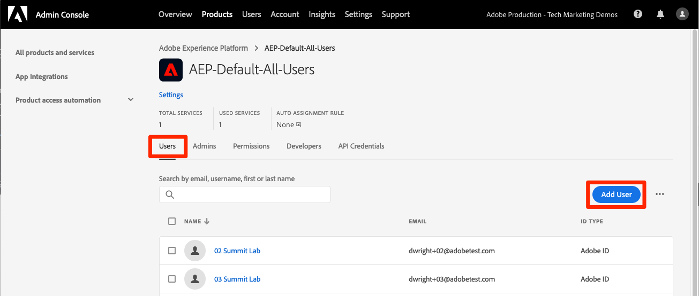
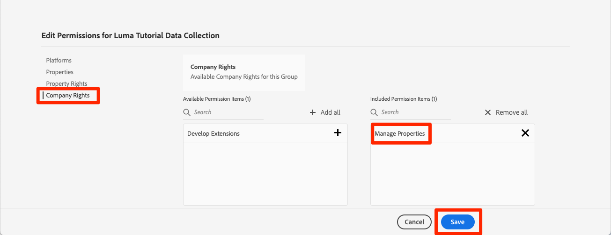

# 권한 구성

<!--30min-->

이 단원에서는 다음을 사용하여 Adobe Experience Platform 사용자 권한을 구성합니다 [!DNL Adobe's Admin Console] 및 [!UICONTROL 권한] Platform 인터페이스의 화면입니다.

액세스 제어는 Experience Platform의 주요 개인 정보 보호 기능이며, 직원들이 직무 기능을 수행하는 데 필요한 최소한으로 권한을 제한하는 것이 좋습니다. 다음을 참조하십시오. [액세스 제어 설명서](https://experienceleague.adobe.com/docs/experience-platform/access-control/home.html?lang=ko) 추가 정보.

데이터 설계자 및 데이터 엔지니어는 Adobe Experience Platform의 고급 사용자이며, 이 자습서를 완료하고 일상적인 작업을 나중에 수행하려면 많은 권한이 필요합니다. 데이터 설계자는 의 관리에 관여할 가능성이 높습니다. *기타 Platform 사용자* 마케터, 분석가 및 데이터 과학자와 같은 회사에서. 이 단원을 완료하면서 이러한 기능을 사용하여 회사의 다른 사용자를 관리하는 방법에 대해 생각해 보십시오.

**데이터 설계자** 종종 이 자습서 외부에서 다른 사용자에 대한 권한을 구성합니다.

>[!IMPORTANT]
>
>Adobe Experience Cloud 제품의 시스템 관리자는 섹션 머리글에 나와 있는 이 단원의 일부 단계를 완료해야 합니다. 시스템 관리자가 아닌 경우 회사의 관리자에게 연락하여 이 작업을 완료하도록 요청하십시오. 다음 기간 동안 완료해야 하는 작업도 있습니다. [개발자 콘솔 및 Postman 설정](set-up-developer-console-and-postman.md) 레슨.

## Admin Console 정보

다음 [!DNL Admin Console] 는 모든 Adobe Experience Cloud 제품에 대한 사용자 액세스를 관리하는 데 사용되는 인터페이스입니다. 플랫폼에 액세스하려면 Admin Console에 사용자 또는 을 추가해야 하며 이렇게 하면 세분화된 모든 권한 항목이 Adobe Experience Platform의 권한 화면에서 관리됩니다.

다음은 플랫폼에 존재하는 역할에 대한 간략한 요약입니다.

* **사용자** 제품 프로필의 은 제품 프로필에서 할당된 권한에 따라 플랫폼의 사용자 인터페이스에서 작업을 완료할 수 있습니다.
* **개발자** 은 Experience Platform API를 사용하기 위해 Adobe Developer 콘솔에서 API 자격 증명 및 프로젝트를 만들 수 있습니다
* **제품 관리자** 은 Adobe Admin Console의 Adobe Experience Platform 제품에 사용자 및 개발자를 추가할 수 있을 뿐만 아니라 플랫폼 인터페이스의 권한 화면에서 세부적인 사용자 액세스를 관리할 수 있습니다.
* **시스템 관리자** 제품 관리자를 추가하고 기본적으로 모든 Adobe Experience Cloud 제품에 대한 권한을 관리할 수 있습니다.

## 에 사용자 및 개발자 추가 `AEP-Default-All-Users` 제품 프로필(시스템 관리자 또는 제품 관리자 필요)

이 연습에서는 사용자, 시스템 관리자 또는 제품 관리자가 사용자를 Adobe Admin Console의 Adobe Experience Platform 제품에서 사용자 및 개발자로 추가합니다.

>[!NOTE]
>
>이 자습서를 보는 동료를 지원하는 시스템 관리자인 경우 동료를으로 추가하는 것이 좋습니다. *제품 관리자* Adobe Experience Platform용 제품 관리자는 이러한 단계를 직접 수행하고 향후 다른 Experience Platform 사용자를 관리할 수 있습니다.

튜토리얼 참가자를 로 추가하려면 [!UICONTROL 사용자] 및 [!UICONTROL 개발자]:

1. 에 로그인합니다 [Adobe Admin Console](https://adminconsole.adobe.com)
1. 선택 **[!UICONTROL 제품]** 위쪽 탐색
1. 선택 **Adobe Experience Platform**
   
1. Experience Platform 인스턴스에 이미 여러 개의 프로필이 있을 수 있습니다. 다음 항목 선택 `AEP-Default-All-Users` 프로필
   

1. 로 이동 **[!UICONTROL 사용자]** 탭
1. 다음 항목 선택 **[!UICONTROL 사용자 추가]** 단추
   
1. 워크플로우를 완료하여 튜토리얼 참가자를 제품 프로필에 사용자로 추가합니다.

1. 로 이동 **[!UICONTROL 개발자]** 탭
1. 다음 항목 선택 **[!UICONTROL 개발자 추가]** 단추
   
1. 워크플로우를 완료하여 튜토리얼 참가자를 제품 프로필에 개발자로 추가합니다

## Adobe Experience Platform에서 역할 추가(시스템 관리자 또는 제품 관리자 필요)

Experience Platform에 대한 세분화된 권한은 Platform 인터페이스의 권한 화면에서 관리됩니다. 시스템 및 제품 관리자만 이 화면에 액세스할 수 있으므로 관리자 권한이 없는 경우 권한이 있는 사람의 지원이 필요합니다.

권한은 역할에서 관리됩니다. 자습서에 대한 역할 만들기:

1. 에 로그인 [Adobe Experience Platform](https://platform.adobe.com)
1. 선택 **[!UICONTROL 권한]** 을(를) 왼쪽 탐색에서 [!UICONTROL 역할] 화면
1. 선택 **[!UICONTROL 역할 만들기]**

   
1. 역할 이름 지정 `Luma Tutorial Platform` (회사에서 여러 사람이 이 튜토리얼을 수강하는 경우 튜토리얼 참가자 이름을 끝에 추가) 다음을 선택합니다. **[!UICONTROL 확인]**

   

1. 다음을 사용하여 다음 리소스에 대한 모든 권한 항목을 추가합니다.  **[!UICONTROL +]** 및 **[!UICONTROL 모두 추가]**:

   1. 데이터 모델링
   1. 데이터 관리
   1. 프로필 관리
   1. ID 관리
   1. 샌드박스 관리
   1. 쿼리 서비스
   1. 데이터 수집
   1. 데이터 거버넌스
   1. 대시보드
   1. 경고

      

1. 데이터 수집에서 소스 관리 및 소스 보기 권한 항목을 추가합니다.

1. 모든 권한 항목을 추가한 후 저장 단추를 선택해야 합니다.
   

다음 이후 이 역할에 대한 몇 가지 작은 업데이트를 수행합니다. [샌드박스 만들기](create-a-sandbox.md) 및 [개발자 콘솔 및 Postman 설정](set-up-developer-console-and-postman.md) 레슨.

## 데이터 수집 제품 프로필 만들기(시스템 관리자 또는 제품 관리자 필요)

이 연습에서는 사용자 또는 회사의 시스템 관리자가 데이터 수집(이전의 Adobe Experience Platform Launch)에 대한 제품 프로필을 만들고 사용자를 제품 프로필 관리자로 추가합니다.

>[!NOTE]
>
>이 자습서에서 동료를 지원하는 시스템 관리자인 경우 동료를으로 추가하는 것이 좋습니다 *제품 관리자* 데이터 수집용. 제품 관리자는 이러한 단계를 직접 수행하고 향후 데이터 수집의 다른 사용자를 관리할 수 있습니다.

제품 프로필을 만들려면:

1. 다음에서 [!DNL Adobe Admin Console] Adobe Experience Platform 데이터 수집 제품으로 이동
1. (이)라는 새 프로필 추가 `Luma Tutorial Data Collection` (회사에서 여러 사람이 이 튜토리얼을 수강하는 경우 튜토리얼 참가자 이름을 끝에 추가하십시오.)
1. 끄기 **[!UICONTROL 속성]** > **[!UICONTROL 자동 포함]** 설정
1. 이 시점에서 속성 또는 권한을 할당하지 않음
1. 튜토리얼 참가자를 이 프로필의 관리자로 추가

이 단계를 완료하면 `Luma Tutorial Data Collection` 프로필이 관리자 1명으로 설정되었습니다.

## 데이터 수집 제품 프로필 구성

이제 의 관리자입니다. `Luma Tutorial Data Collection` 제품 프로필 자습서를 완료하는 데 필요한 권한 및 역할을 구성할 수 있습니다.

### 권한 추가

이제 프로필에 개별 권한 항목을 추가합니다.

1. 다음에서 [Adobe Admin Console](https://adminconsole.adobe.com)로 이동합니다. **[!UICONTROL 제품]** > **[!UICONTROL 데이터 수집]**
1. 를 엽니다. `Luma Tutorial Data Collection` 프로필
1. 로 이동 **[!UICONTROL 권한]** 탭
1. 열기 **[!UICONTROL 플랫폼]**
1. 사용 가능한 모든 플랫폼이 선택되어 있는지 확인합니다(라이센스에 따라 다른 옵션이 표시될 수 있음)
1. 모든 변경 내용을 **[!UICONTROL 저장]**합니다
   
1. 열기 **[!UICONTROL 속성]**
1. 다음을 확인합니다. **[!UICONTROL 자동 포함]** 토글이 꺼지므로 속성에 액세스할 수 없습니다(나중에 추가하겠습니다).
1. 모든 변경 내용을 **[!UICONTROL 저장]**합니다
   
1. 열기 **[!UICONTROL 속성 권한]**
1. 선택 **[!UICONTROL 모두 추가]** 모든 속성 권한을 추가하려면
1. **[!UICONTROL 저장]**
   
1. 열기 **[!UICONTROL 회사 권한]**
1. 추가 **[!UICONTROL 속성 관리]**
1. **[!UICONTROL 저장]**을 선택합니다
   

### 자신을 사용자로 추가

이제 자신을 데이터 수집 프로필에 사용자로 추가합니다.

1. 로 이동 **[!UICONTROL 사용자]** 탭
1. 다음 항목 선택 **[!UICONTROL 사용자 추가]** 단추
   
1. 워크플로우를 완료하여 자신을 제품 프로필에 사용자로 추가합니다

데이터 수집을 위해 자신을 개발자로 추가할 필요는 없습니다.

이제 자습서를 완료하는 데 필요한 거의 모든 권한이 있습니다! 안에 두 가지 수정만 더 있을 것입니다. [!DNL Adobe Admin Console], 다음 한 개 포함 [샌드박스 만들기](create-a-sandbox.md)!
