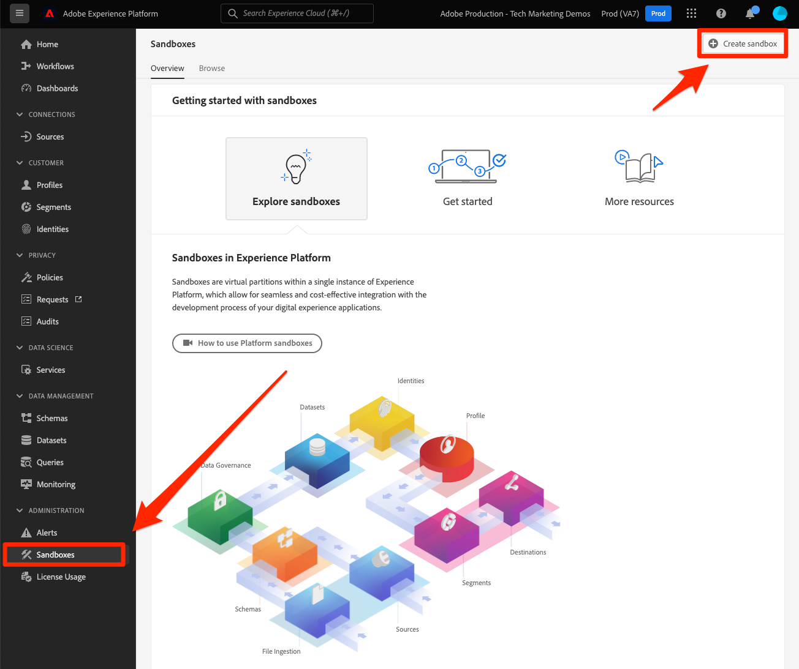
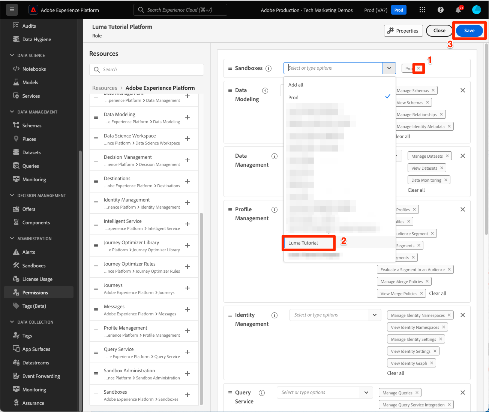

# 샌드박스 만들기

<!--25min-->

이 단원에서는 자습서의 나머지 부분에서 사용할 개발 환경 샌드박스를 만듭니다.

샌드박스는 프로덕션 환경과 리소스 및 데이터를 혼합하지 않고 기능을 사용해 볼 수 있는 격리된 환경을 제공합니다. 자세한 내용은 [샌드박스 설명서](https://experienceleague.adobe.com/docs/experience-platform/sandbox/home.html?lang=ko-KR).

**데이터 설계자** 및 **데이터 엔지니어** 이 자습서 외부에서 샌드박스를 만들어야 합니다.

연습을 시작하기 전에 이 짧은 비디오를 통해 샌드박스에 대해 자세히 알아보십시오.
>[!VIDEO](https://video.tv.adobe.com/v/29838/?quality=12&learn=on)

## 권한 필요

다음에서 [권한 구성](configure-permissions.md) 단원, 이 단원을 완료하는 데 필요한 모든 액세스 제어를 설정합니다.

<!--
* Permission items **[!UICONTROL Sandbox Administration]** > **[!UICONTROL View Sandboxes]** and **[!UICONTROL Manage Sandboxes]**
* Permission item **[!UICONTROL Sandboxes]** > **[!UICONTROL Prod]**
* User-role access to the `Luma Tutorial Platform` product profile
* Admin-level access to the `Luma Tutorial Platform` product profile
-->

## 샌드박스 만들기

샌드박스를 만들어 보겠습니다.

1. 에 로그인합니다 [Adobe Experience Platform](https://experience.adobe.com/platform) 인터페이스
1. 다음으로 이동 **[!UICONTROL 샌드박스]** 왼쪽 탐색
1. 선택 **[!UICONTROL 샌드박스 만들기]** 오른쪽 위에
   

1. 선택 **[!UICONTROL 개발]** (으)로 **[!UICONTROL 유형]**
1. 샌드박스 이름 지정 `luma-tutorial` (이름을 끝에 추가하는 것이 좋습니다.)
1. 튜토리얼 제목 `Luma Tutorial` (이름을 끝에 추가하는 것이 좋습니다.)
1. **[!UICONTROL 만들기]** 버튼을 선택합니다
   
   >[!NOTE]
   >
   >샌드박스 이름 및 제목에 임의의 값을 사용할 수 있지만 튜토리얼 전체에서 이러한 레이블을 참조할 때 제안된 값을 유지하는 것이 좋습니다. 조직에 이 자습서를 완료하는 여러 사람이 있는 경우 샌드박스 제목과 이름 끝에 이름을 추가해 보십시오(예: luma-tutorial-ignatiusjreilly).

샌드박스를 생성하는 데 약 30초 정도 걸리며 이 시간 동안에는 &quot;[!UICONTROL 생성 중]상태가 표시됩니다. 샌드박스가 완전히 생성되면 &quot;&quot;로 표시됩니다.[!UICONTROL 활성]&quot;:

샌드박스가 &quot;&quot;일 때까지 대기[!UICONTROL 활성]다음 연습을 계속하기 전에 &quot;.

## 역할에 새 샌드박스 추가

샌드박스가 활성화되면 이를 사용하려면 해당 샌드박스를 역할에 포함해야 합니다. 역할에 추가하려면(시스템 관리자 또는 제품 관리자 권한 필요):

1. 로 이동 [!UICONTROL 권한] 화면
1. 를 엽니다. `Luma Tutorial Platform` 역할
1. 선택 사항 _제거_ 다음 `Prod` 역할의 샌드박스
1. 추가 `Luma Tutorial` 샌드박스
1. **[!UICONTROL 저장]**&#x200B;을 선택합니다
1. 다음에서 [!UICONTROL 샌드박스] 행, 선택 **[!UICONTROL 편집]**

   

1. 페이지를 다시 로드(또는 Shift 키를 누른 상태에서 다시 로드하면 `Luma Tutorial` 샌드박스 또는 샌드박스 드롭다운에 표시됩니다.
1. 다음으로 전환 `Luma Tutorial` 아직 속해 있지 않은 경우 샌드박스

   

좋습니다. 샌드박스를 만들었으며 다음을 수행할 준비가 되었습니다. [개발자 콘솔 및 Postman 설정](set-up-developer-console-and-postman.md)!
