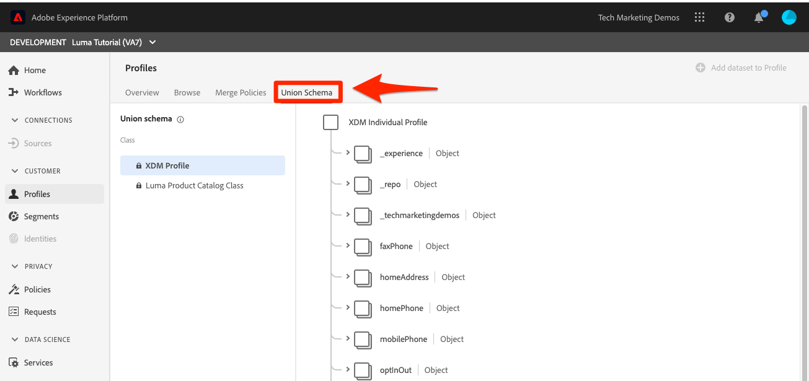
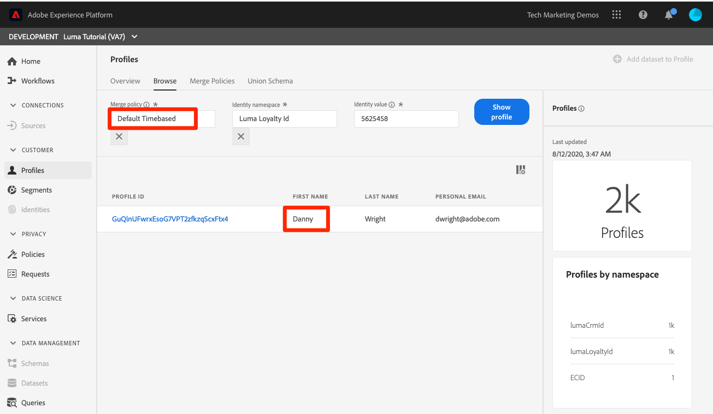

# 병합 정책 만들기

<!--20 min-->

이 단원에서는 병합 정책을 만들어 여러 데이터 소스가 프로필로 병합되는 방식의 우선 순위를 지정합니다.

Adobe Experience Platform을 사용하면 여러 소스에서 데이터를 결합하여 각 개별 고객에 대한 전체 보기를 볼 수 있습니다. 이 데이터를 결합할 때 병합 정책은 데이터의 우선 순위 지정 방법과 어떤 데이터를 결합하여 해당 통합 보기를 만들지 결정합니다.

이 단원에서는 사용자 인터페이스를 사용하지만 병합 정책을 생성하기 위한 API 옵션도 있습니다.

**데이터 설계자** 이 자습서 외부에서 병합 정책을 만들어야 합니다.

연습을 시작하기 전에 이 짧은 비디오를 통해 병합 정책에 대해 자세히 알아보십시오.
>[!VIDEO](https://video.tv.adobe.com/v/330433?learn=on)

## 권한 필요

다음에서 [권한 구성](configure-permissions.md) 단원, 이 단원을 완료하는 데 필요한 모든 액세스 제어를 설정합니다.

<!--* Permission items **[!UICONTROL Profile Management]** > **[!UICONTROL View Merge Policies]** and **[!UICONTROL Manage Merge Policies]**
* Permission item **[!UICONTROL Profile Management]** > **[!UICONTROL View Profiles]** and **[!UICONTROL Manage Profiles]**
* Permission item **[!UICONTROL Sandboxes]** > `Luma Tutorial`
* User-role access to the `Luma Tutorial Platform` product profile
-->

## 병합 정책 및 결합 스키마 정보

일괄 처리 수집 단원에서 동일한 고객에 대해 약간 다른 정보가 있는 두 개의 레코드를 업로드했음을 상기할 수 있습니다. 다음에서 [!DNL Loyalty] 데이터, 고객의 이름은 `Daniel` 그리고 그는 살았습니다 `New York City`: 그러나 CRM 데이터에서 고객의 이름은 입니다. `Danny` 그리고 그는 살았습니다 `Portland`. 고객 데이터는 시간이 지남에 따라 변경됩니다. 아마 이사왔나 보군요 `Portland` 끝 `New York City`. 전화번호나 이메일 주소 같은 다른 것도 변합니다. 병합 정책은 두 데이터 소스가 동일한 사용자에 대해 서로 다른 정보를 제공할 때 이러한 유형의 충돌을 처리하는 방법을 결정하는 데 도움이 됩니다.

그렇다면, 왜 `Danny` 이름을 따서? 다음 항목을 살펴보겠습니다.

1. Platform 사용자 인터페이스에서 를 선택합니다. **[!UICONTROL 프로필]** 왼쪽 탐색
1. 로 이동 **[!UICONTROL 정책 병합]** 탭
1. 기본 병합 정책 순서는 타임스탬프입니다. 충성도 데이터 다음에 CRM 데이터를 업로드했기 때문에 `Danny` 을(를) 프로필의 이름으로 내보냈습니다.

프로필에 대해 여러 스키마를 사용할 수 있는 경우 [!UICONTROL 유니온 스키마] 기본 클래스를 공유하는 모든 프로필이 활성화된 레코드 스키마에 대해 자동으로 만들어집니다. 다음을 볼 수 있습니다. [!UICONTROL 유니온 스키마] 로 이동 **[!UICONTROL 유니온 스키마]** 탭.

ExperienceEvent 클래스에 대한 유니온 스키마는 없습니다. ExperienceEvent 데이터가 여전히 프로필에 도착하지만, 시계열 기반이므로 각 이벤트에는 타임스탬프와 ID가 포함되어 있으며 충돌은 문제가 되지 않습니다.

기본 병합 정책이 마음에 들지 않으면 어떻게 해야 합니까? 충돌이 있을 때 Luma가 CRM 시스템이 진실의 소스가 되어야 한다고 결정하면 어떻게 됩니까? 이를 위해 병합 정책을 만듭니다.

## UI에서 병합 정책 만들기

1. 병합 정책 화면에서 다음을 선택합니다 **[!UICONTROL 병합 정책 만들기]** 오른쪽 상단의 단추
1. 다음으로: **[!UICONTROL 이름]**, 입력 `Loyalty Prioritized`
1. 다음으로: **[!UICONTROL 스키마]**, 선택 **[!UICONTROL XDM 프로필]** 사용자 정의 클래스는 레코드 데이터이므로 병합 정책에도 사용할 수 있습니다.
1. 대상 **[!UICONTROL Id 결합]**, 선택 **[!UICONTROL 비공개 그래프]**
1. 대상 **[!UICONTROL 속성 병합]**, 선택 **[!UICONTROL 데이터 세트 우선 순위]**
1. 드래그 앤 드롭 `Luma Loyalty Dataset` 및 `Luma CRM Dataset` (으)로 **[!UICONTROL 데이터 세트]** 패널.
1. 다음을 확인하십시오. `Luma Loyalty Dataset` 을(를) 끌어서 위에 놓아 맨 위에 있음 `Luma CRM Dataset`
1. **[!UICONTROL 저장]** 버튼을 선택합니다
   <!--do i need to explain Private Graph? Is that GA?-->
   

## 병합 정책 유효성 검사

병합 정책이 예상대로 작동하는지 살펴보겠습니다.

1. 로 이동 **[!UICONTROL 찾아보기]** 탭
1. 변경 **[!UICONTROL 병합 정책]** 새 사용자에게 `Loyalty Prioritized` 정책
1. 다음으로: **[!UICONTROL ID 네임스페이스]**, 사용 `Luma CRM Id`
1. 다음으로: **[!UICONTROL ID 값]** 사용 `112ca06ed53d3db37e4cea49cc45b71e`
1. 다음 항목 선택 **[!UICONTROL 프로필 표시]** 단추
1. `Daniel` 돌아왔어요!

## 제한된 데이터 세트를 사용하여 병합 정책 만들기

데이터 세트 우선 순위를 사용하여 병합 정책을 생성할 때 오른쪽에 포함하는 동일한 기본 클래스의 데이터 세트만 프로필에 포함됩니다. 다른 병합 정책을 설정하겠습니다.

1. 병합 정책 화면에서 다음을 선택합니다 **[!UICONTROL 병합 정책 만들기]** 오른쪽 상단의 단추
1. 다음으로: **[!UICONTROL 이름]**, 입력  `Loyalty Only`
1. 다음으로: **[!UICONTROL 스키마]**, 선택 **[!UICONTROL XDM 프로필]**
1. 대상 **[!UICONTROL Id 결합]**, 선택 **[!UICONTROL 없음]**
1. 대상 **[!UICONTROL 속성 병합]**, 선택 **[!UICONTROL 데이터 세트 우선 순위]**
1. 다음 항목만 드래그 앤 드롭 `Luma Loyalty Dataset` 끝 **[!UICONTROL 선택한 데이터 세트]** 패널.
1. **[!UICONTROL 저장]** 버튼을 선택합니다

## 병합 정책 유효성 검사

이제 이 병합 정책이 수행하는 작업을 살펴보겠습니다.

1. 로 이동 **[!UICONTROL 찾아보기]** 탭
1. 변경 **[!UICONTROL 병합 정책]** 새 사용자에게 `Loyalty Only` 정책
1. 다음으로: **[!UICONTROL ID 네임스페이스]**, 사용 `Luma CRM Id`
1. 다음으로: **[!UICONTROL ID 값]** 사용 `112ca06ed53d3db37e4cea49cc45b71e`
1. 다음 항목 선택 **[!UICONTROL 프로필 표시]** 단추
1. 프로필을 찾을 수 없음 확인:
   

CRM ID는 의 ID 필드입니다 `Luma Loyalty Dataset`, 그러나 기본 ID만 프로필 검색에 사용할 수 있습니다. 기본 ID를 사용하여 프로필을 조회하고 `Luma Loyalty Id`&quot;

1. 변경 **[!UICONTROL ID 네임스페이스]** 끝 `Luma Loyalty Id`
1. 다음으로: **[!UICONTROL ID 값]** 사용 `5625458`
1. 다음 항목 선택 **[!UICONTROL 프로필 표시]** 단추
1. 프로필 ID를 선택하여 프로필 열기
1. 로 이동 **[!UICONTROL 속성]** 탭
1. 휴대폰 번호 및 이메일 주소와 같은 CRM 데이터 세트의 다른 프로필 세부 정보는 다음 이유 때문에 사용할 수 없습니다
   
1. 로 이동 **[!UICONTROL 이벤트]** 탭
1. ExperienceEvent 데이터는 병합 정책 데이터 세트에 명시적으로 포함하지 않더라도 사용할 수 있습니다.
   

## 병합 정책에 대한 자세한 정보

프로필 검색에서 사용된 병합 정책을 다시 다음으로 변경합니다. `Default Timebased` 및 선택 **[!UICONTROL 프로필 표시]** 단추를 클릭합니다. 대니가 돌아왔어!

무슨 일이 일어나고 있는 거죠? 프로필 병합은 일회성이 아닙니다. 실시간 고객 프로필은 어떤 병합 정책이 사용되는지 등 다양한 요인을 기반으로 즉석으로 조립됩니다. 원하는 고객 보기에 따라 다른 컨텍스트에서 사용할 여러 병합 정책을 생성할 수 있습니다.

병합 정책의 주요 사용 사례는 데이터 거버넌스용입니다. 예를 들어, 개인화 사용 사례에 사용할 수 없는 타사 데이터를 Platform에 수집한다고 가정해 보겠습니다. _can_ 광고 사용 사례에 사용됩니다. 이 타사 데이터 세트를 제외하는 병합 정책을 만들고 이 병합 정책을 사용하여 광고 사용 사례에 대한 세그먼트를 작성할 수 있습니다.

## 추가 리소스

* [병합 정책 설명서](https://experienceleague.adobe.com/docs/experience-platform/profile/merge-policies/overview.html)
* [병합 정책 API(실시간 고객 프로필 API의 일부) 참조](https://www.adobe.io/experience-platform-apis/references/profile/#tag/Merge-policies)

이제 다음으로 이동하겠습니다. [데이터 거버넌스 프레임워크](apply-data-governance-framework.md).
