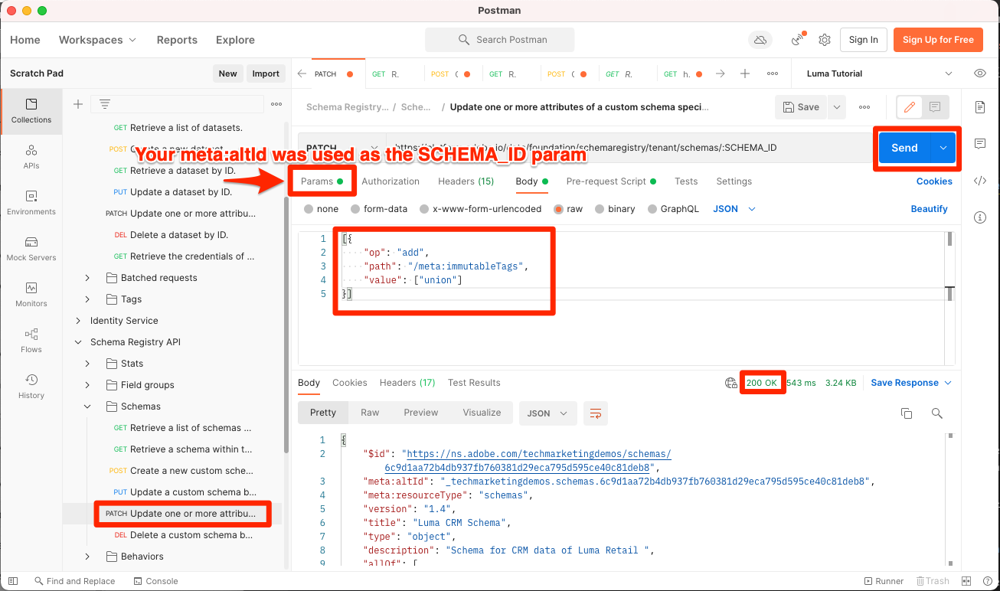
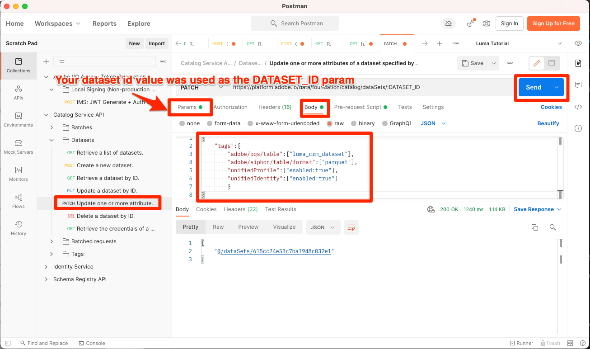

# 실시간 고객 프로필 활성화

<!-- 15min-->
이 단원에서는 실시간 고객 프로필에 대해 스키마 및 데이터 세트를 활성화합니다.

예, 데이터 세트 단원이 이 자습서에서 가장 짧은 단원이라고 말했을 때 거짓말을 했습니다. 이 단원은 시간이 훨씬 덜 걸릴 것입니다! 말 그대로 토글 한 다발을 뒤집기만 하면 됩니다. 그러나 이러한 전환을 전환할 때 발생하는 일은 _정말로_&#x200B;중요하므로 전체 페이지를 전환에 할애하려고 합니다.

실시간 고객 프로필을 사용하면 온라인, 오프라인, CRM 및 서드파티 데이터를 비롯한 여러 채널의 데이터를 결합하는 각 개별 고객에 대한 거시적인 보기를 확인할 수 있습니다. 프로필을 사용하면 서로 다른 고객 데이터를 하나의 통합 보기로 통합하여 모든 고객 상호 작용에 대해 실행 가능한 타임스탬프 계정을 제공할 수 있습니다.

정말 놀랍습니다. 프로필에 대해 *모든 데이터*&#x200B;를 활성화할 필요가 없습니다. 실제로 활성화 사용 사례에 필요한 데이터만 활성화해야 합니다. 강력한 고객 프로필에 빠르게 액세스해야 하는 마케팅 사용 사례, 콜 센터 통합 등에 사용할 데이터를 활성화합니다. 분석용으로만 데이터를 업로드하는 경우에는 프로필에 대해 활성화해서는 안 됩니다.

실시간 고객 프로필 데이터에 사용할 수 있는 중요한 [보호 기능](https://experienceleague.adobe.com/docs/experience-platform/profile/guardrails.html?lang=ko)이 있습니다. 이러한 보호 기능은 프로필에 사용할 수 있는 데이터를 결정할 때 검토해야 합니다.

<!--is this accurate. Are there other considerations to point out? -->

**데이터 설계자**&#x200B;는 이 자습서 외부에서 실시간 고객 프로필을 활성화해야 합니다.

연습을 시작하기 전에 이 짧은 비디오를 통해 실시간 고객 프로필에 대해 자세히 알아보십시오.
>[!VIDEO](https://video.tv.adobe.com/v/27251?learn=on&enablevpops)

## 권한 필요

[권한 구성](configure-permissions.md) 단원에서 이 단원을 완료하는 데 필요한 모든 액세스 제어를 설정합니다.


<!--* Permission items **[!UICONTROL Data Modeling]** > **[!UICONTROL View Schemas]** and **[!UICONTROL Manage Schemas]**
* Permission items **[!UICONTROL Data Management]** > **[!UICONTROL View Datasets]** and **[!UICONTROL Manage Datasets]**
* Permission item **[!UICONTROL Sandboxes]** > `Luma Tutorial`
* User-role access to the `Luma Tutorial Platform` product profile
* Developer-role access to the `Luma Tutorial Platform` product profile (for API)
-->

## Platform 사용자 인터페이스를 사용하여 실시간 고객 프로필에 대한 스키마 활성화

간단한 스키마 활성화 작업부터 시작하겠습니다.

1. 플랫폼 사용자 인터페이스에서 **Luma 충성도 스키마**&#x200B;를 엽니다.
1. **[!UICONTROL 스키마 속성]**&#x200B;에서 **프로필** 스위치를 전환합니다.
1. 확인 모달에서 **[!UICONTROL 사용]** 단추를 눌러 확인합니다
1. 변경 내용을 저장하려면 **[!UICONTROL 저장]** 단추를 선택하십시오.

   >[!IMPORTANT]
   >
   >프로필에 대해 스키마를 활성화하면 비활성화하거나 삭제할 수 없습니다. 또한 이 시점 이후에는 스키마에서 필드를 제거할 수 없습니다. 이러한 의미는 프로덕션 환경에서 자체 데이터를 사용하여 작업할 때 나중에 기억해야 합니다. 이 자습서에서는 언제든지 삭제할 수 있는 개발 샌드박스를 사용해야 합니다.
   >
   >이 자습서의 통제 환경에서 데이터를 수집하기 전에 프로필 _에 대해 스키마와 데이터 세트를 사용하도록 설정합니다_. 자체 데이터로 작업할 때는 다음 순서로 수행하는 것이 좋습니다.
   >
   > 1. 먼저 일부 데이터를 데이터 세트에 수집합니다.
   > 1. 데이터 수집 프로세스 중에 발생하는 모든 문제(예: 데이터 유효성 검사 또는 매핑 문제)를 해결합니다.
   > 1. 프로필에 대해 데이터 세트 및 스키마 활성화
   > 1. 데이터 수집


   

쉽죠? 이러한 다른 스키마에 대해 위의 단계를 반복합니다.

1. Luma 제품 카탈로그 스키마
1. Luma 오프라인 구매 이벤트 스키마
1. Luma 웹 이벤트 스키마(확인 모달에서 &quot;이 스키마에 대한 데이터에 identityMap 필드의 기본 ID가 포함됩니다.&quot; 상자를 선택합니다.)

## Platform API를 사용하여 실시간 고객 프로필에 대한 스키마 활성화

이제 API로 `Luma CRM Schema`을(를) 사용하도록 설정할 차례입니다. 이 연습을 건너뛰고 사용자 인터페이스에서 활성화하려면 바로 진행하십시오.

### 스키마의 meta:altId 가져오기

먼저 `Luma CRM Schema`의 `meta:altId`을(를) 가져오겠습니다.

1. [!DNL Postman] 열기
1. 액세스 토큰이 없는 경우 [!DNL Postman] 단원에서 수행한 것처럼 **[!DNL OAuth: Request Access Token]** 요청을 열고 **보내기**&#x200B;를 선택하여 새 액세스 토큰을 요청합니다.
1. **[!DNL Schema Registry API > Schemas > Retrieve a list of schemas within the specified container.]** 요청 열기
1. **보내기** 단추 선택
1. 200개의 응답을 받아야 합니다.
1. `Luma CRM Schema` 항목에 대한 응답을 찾은 다음 `meta:altId` 값을 복사합니다.
   

### 스키마 활성화

스키마의 meta:altId가 있으므로 프로필에 대해 활성화할 수 있습니다.

1. **[!DNL Schema Registry API > Schemas > Update one or more attributes of a custom schema specified by ID.]** 요청 열기
1. **매개 변수**&#x200B;에서 `meta:altId` 값을 `SCHEMA_ID` 매개 변수 값으로 붙여 넣습니다.
1. **본문** 탭에서 다음 코드를 붙여넣습니다.

   ```json
   [{
       "op": "add",
       "path": "/meta:immutableTags",
       "value": ["union"]
   }]
   ```

1. **보내기** 단추 선택
1. 200개의 응답을 받아야 합니다.

   

사용자 인터페이스에서 프로필에 대해 5개의 모든 스키마가 활성화되었음을 확인할 수 있어야 합니다. `Luma CRM Schema`이(가) 활성화되었는지 확인하려면 SHIFT 키를 누른 상태에서 다시 로드해야 할 수 있습니다.


## Platform 사용자 인터페이스를 사용하여 실시간 고객 프로필에 대한 데이터 세트 활성화

프로필에 대해서도 데이터 세트를 활성화해야 하며 프로세스가 훨씬 간단합니다.

1. 플랫폼 사용자 인터페이스에서 `Luma Loyalty Dataset`을(를) 엽니다.
1. **[!UICONTROL 프로필]** 스위치 전환
1. 확인 모달에서 **[!UICONTROL 사용]** 단추를 눌러 확인합니다

   

이러한 다른 데이터 세트에 대해 위의 단계를 반복합니다.

1. Luma 제품 카탈로그 데이터 세트
1. Luma 오프라인 구매 이벤트 데이터 세트
1. Luma 웹 이벤트 데이터 세트

>[!NOTE]
>
>스키마와 달리 프로필에서 데이터 세트를 비활성화할 수 있지만 이전에 수집된 모든 데이터는 프로필에 유지됩니다.

## Platform API를 사용하여 실시간 고객 프로필에 대한 데이터 세트 활성화

이제 API를 사용하여 프로필에 대한 데이터 세트를 활성화합니다. 위의 방법을 사용하여 사용자 인터페이스를 통해 활성화하려는 경우에도 마찬가지입니다.

### 데이터 세트 ID 가져오기

먼저 `Luma CRM Dataset`의 `id`을(를) 가져와야 합니다.

1. [!DNL Postman] 열기
1. 액세스 토큰이 없는 경우 [!DNL Postman] 단원에서 수행한 것처럼 **[!DNL OAuth: Request Access Token]** 요청을 열고 **보내기**&#x200B;를 선택하여 새 액세스 토큰을 요청합니다.
1. **[!DNL Catalog Service API > Datasets > Retrieve a list of datasets.]** 요청 열기
1. **보내기** 단추 선택
1. 200개의 응답을 받아야 합니다.
1. `Luma CRM Dataset` 항목에 대한 응답을 찾은 다음 ID를 복사합니다.
   

### 데이터 세트 활성화

이제 데이터 세트의 ID가 있으므로 프로필에 대해 활성화할 수 있습니다.

1. **[!DNL Catalog Service API > Datasets > Update one or more attributes of a dataset specified by ID.]** 요청 열기
1. **Params**&#x200B;에서 `DATASET_ID` 값을 자신의 값으로 업데이트합니다.
1. **본문** 탭에서 다음 코드를 붙여넣습니다. 처음 두 값은 이전 응답에서 볼 수 있는 기존 태그입니다. 다음 두 개의 새 태그를 추가하는 것 외에도 본문에 포함해야 합니다.

   ```json
   {
       "tags":{
           "adobe/pqs/table":["luma_crm_dataset"],
           "adobe/siphon/table/format":["parquet"],
           "unifiedProfile":["enabled:true"],
           "unifiedIdentity":["enabled:true"]
           }
   }
   ```

1. **보내기** 단추 선택
1. 200개의 응답을 받아야 합니다.

   

사용자 인터페이스에 활성화된 데이터 세트가 표시되는지 확인할 수도 있습니다.


>[!IMPORTANT]
>
> 프로필에 대해 스키마 및 데이터 세트를 활성화하기 전에 데이터를 수집하는 경우 나중에 해당 데이터를 다시 수집해야 합니다.

## 추가 리소스

* [실시간 고객 프로필 설명서](https://experienceleague.adobe.com/docs/experience-platform/profile/home.html?lang=ko)
* [실시간 고객 프로필 API 참조](https://www.adobe.io/experience-platform-apis/references/profile/)


**데이터 엔지니어**&#x200B;는 [데이터 수집 이벤트 구독](subscribe-to-data-ingestion-events.md) 단원을 계속 진행해야 합니다.
**데이터 설계자** _건너뛰고_ [일괄 처리 수집 단원](ingest-batch-data.md)으로 이동할 수 있습니다.
