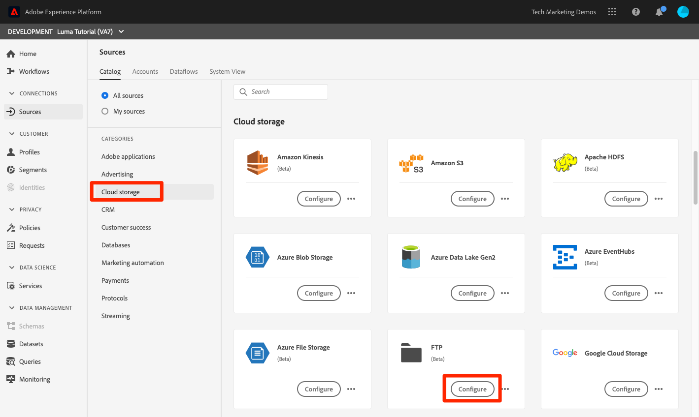
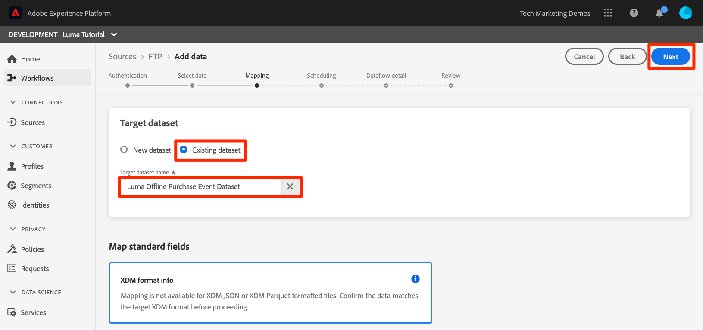

# 배치 데이터 수집

<!-- 1hr-->
이 단원에서는 다양한 방법을 사용하여 배치 데이터를 Experience Platform에 수집합니다.

배치 데이터 섭취 를 사용하면 많은 양의 데이터를 한 번에 Adobe Experience Platform에 수집할 수 있습니다. 플랫폼의 인터페이스 내에서 또는 API를 사용하여 한 번에 배치 데이터를 업로드할 수 있습니다. 소스 커넥터를 사용하여 클라우드 스토리지 서비스와 같은 타사 서비스에서 정기적으로 예약된 배치 업로드를 구성할 수도 있습니다.

**데이터 엔지니어** 는 이 자습서를 제외하고 배치 데이터를 수집해야 합니다.

연습을 시작하기 전에 이 짧은 비디오에서 데이터 처리에 대해 자세히 알아보십시오.
>[!VIDEO](https://video.tv.adobe.com/v/27106?quality=12&learn=on)


## 필요한 권한

에서 [권한 구성](configure-permissions.md) 이 단원을 완료하는 데 필요한 모든 액세스 컨트롤을 설정합니다.

<!--
* Permission item **[!UICONTROL Data Management]** > **[!UICONTROL View Datasets]**, **[!UICONTROL Manage Datasets]** and **[!UICONTROL Data Monitoring]**
* Permission items **[!UICONTROL Data Ingestion]** > **[!UICONTROL View Sources]** and **[!UICONTROL Manage Sources]**
* Permission item **[!UICONTROL Profile Management]** > **[!UICONTROL View Profiles]**
* Permission item **[!UICONTROL Sandboxes]** > `Luma Tutorial`
* User-role access to the `Luma Tutorial Platform` product profile
* Developer-role access to the `Luma Tutorial Platform` product profile (for API)
-->

소스 연습을 위해서는 (S) FTP 서버 또는 클라우드 스토리지 솔루션에 액세스할 수 있어야 합니다. 해결 방법이 없는 경우 이 방법이 있습니다.

## Platform 사용자 인터페이스를 사용하여 데이터를 일괄로 수집

데이터는 JSON 및 Parquet 형식으로 데이터 세트 화면의 데이터 세트에 직접 업로드할 수 있습니다. 이 메서드는 만들기 후에 데이터 중 일부를 테스트하는 좋은 방법입니다

### 데이터 다운로드 및 준비

먼저 샘플 데이터를 가져와서 테넌트에 대해 사용자 지정합니다.

>[!NOTE]
>
>에 포함된 데이터 [luma-data.zip](assets/luma-data.zip) 파일은 가상 파일이며 데모용으로만 사용됩니다.

1. 다운로드 [luma-data.zip](assets/luma-data.zip) 아래와 같이 **Luma 자습서 자산** 폴더를 입력합니다.
1. 파일의 압축을 풀고 다음 폴더를 만듭니다. `luma-data` 여기에는 이 단원에서 사용할 4개의 데이터 파일이 포함되어 있습니다
1. 열기 `luma-loyalty.json` 텍스트 편집기에서 `_techmarketingdemos` 자체 스키마에서 볼 수 있듯이 고유한 밑줄 테넌트 id 사용:
   

1. 업데이트된 파일을 저장합니다

### 데이터 수집

1. Platform 사용자 인터페이스에서 을(를) 선택합니다 **[!UICONTROL 데이터 세트]** 왼쪽 탐색
1. 다음 문서를 엽니다. `Luma Loyalty Dataset`
1. 을 볼 때까지 아래로 스크롤합니다. **[!UICONTROL 데이터 추가]** 오른쪽 열의 섹션
1. 업로드 `luma-loyalty.json` 파일.
1. 파일이 업로드되면 배치에 대한 행이 나타납니다
1. 몇 분 후에 페이지를 다시 로드하는 경우 일괄 처리가 1000개의 레코드 및 1000개의 프로필 조각으로 성공적으로 업로드되었음을 확인해야 합니다.

   
<!--do i need to explain error diagnostics and partial ingestion-->

>[!NOTE]
>
>몇 가지 방법이 있습니다 **[!UICONTROL 오류 진단]** 및 **[!UICONTROL 부분 수집]**: 이 단원에서 다양한 화면에서 보게 됩니다. 이러한 옵션은 자습서에서 다루지 않습니다. 일부 빠른 정보:
>
>* 오류 진단을 활성화하면 데이터 처리에 대한 데이터가 생성되며, 그런 다음 데이터 액세스 API를 사용하여 검토할 수 있습니다. 에서 자세한 내용을 알아보십시오 [설명서](https://experienceleague.adobe.com/docs/experience-platform/data-access/home.html).
>* 부분 수집에서는 오류가 포함된 데이터를 지정할 수 있는 특정 임계값까지 수집할 수 있습니다. 에서 자세한 내용을 알아보십시오 [설명서](https://experienceleague.adobe.com/docs/experience-platform/ingestion/batch/partial.html)


### 데이터 유효성 검사

데이터를 성공적으로 수집했는지 확인하는 방법에는 몇 가지가 있습니다.

#### 플랫폼 사용자 인터페이스에서 유효성 검사

데이터가 데이터 집합에 수집되었는지 확인하려면:

1. 데이터를 수집한 동일한 페이지에서 **[!UICONTROL 데이터 세트 미리 보기]** 오른쪽 상단의 단추
1. 을(를) 선택합니다 **미리 보기** 버튼을 클릭하면 수집된 데이터 중 일부를 볼 수 있습니다.

   


데이터가 프로필에 도착했는지 확인하려면(데이터가 도착하는 데 몇 분 정도 걸릴 수 있음):

1. 이동 **[!UICONTROL 프로필]** 왼쪽 탐색
1. 옆에 있는 아이콘을 선택합니다 **[!UICONTROL ID 네임스페이스 선택]** 모달을 여는 필드
1. 을(를) 선택합니다 `Luma Loyalty Id` namespace
1. 다음 중 하나를 입력합니다 `loyaltyId` 데이터 세트의 값,  `5625458`
1. 선택 **[!UICONTROL 보기]**

   

#### 데이터 수집 이벤트를 사용한 유효성 검사

이전 단원에서 데이터 수집 이벤트를 구독한 경우 고유한 webhook.site URL을 확인합니다. 다음 순서로 세 개의 요청이 표시되고, 그 사이에 약간의 시간이 포함되며, 다음이 표시됩니다 `eventCode` 값:

1. `ing_load_success`- 수집된 일괄 처리
1. `ig_load_success`—일괄 처리를 id 그래프로 수집했습니다.
1. `ps_load_success`—일괄 처리를 프로필 서비스에 수집했습니다.


자세한 내용은 [설명서](https://experienceleague.adobe.com/docs/experience-platform/ingestion/quality/subscribe-events.html#available-status-notification-events) 알림에 대한 자세한 내용을 참조하십시오.

## 플랫폼 API를 사용하여 데이터를 일괄로 수집

이제 API를 사용하여 데이터를 업로드하겠습니다.

>[!NOTE]
>
>데이터 설계자는 사용자 인터페이스 방법을 통해 자유롭게 CRM 데이터를 업로드합니다.

### 데이터 다운로드 및 준비

1. 이미 다운로드하여 압축을 풀었어야 합니다 [luma-data.zip](assets/luma-data.zip) 내 `Luma Tutorial Assets` 폴더를 입력합니다.
2. 열기 `luma-crm.json` 텍스트 편집기에서 `_techmarketingdemos` 스키마에 표시된대로 고유한 밑줄 테넌트 id 사용
3. 업데이트된 파일을 저장합니다

### 데이터 세트 ID 가져오기

먼저 데이터를 수집할 데이터 세트의 데이터 세트 ID를 가져오겠습니다.

1. 열기 [!DNL Postman]
1. 지난 24시간 동안 요청을 하지 않은 경우 인증 토큰이 만료되었을 수 있습니다. 요청을 엽니다. **[!DNL Adobe I/O Access Token Generation > Local Signing (Non-production use-only) > IMS: JWT Generate + Auth via User Token]** 을(를) 선택합니다. **보내기** 새 JWT 및 액세스 토큰을 요청하려면 [!DNL Postman] 단원.
1. 환경 변수를 열고 값이 **CONTAINER_ID** : 아직 `tenant`
1. 요청을 엽니다. **[!DNL Catalog Service API > Datasets > Retrieve a list of datasets.]** 을(를) 선택합니다. **보내기**
1. 당신은 `200 OK` 응답
1. 의 ID를 복사합니다. `Luma CRM Dataset` 응답 본문에서
   

### 배치 만들기

이제 데이터 세트에서 일괄 처리를 만들 수 있습니다.

1. 다운로드 [데이터 수집 API.postman_collection.json](https://raw.githubusercontent.com/adobe/experience-platform-postman-samples/master/apis/experience-platform/Data%20Ingestion%20API.postman_collection.json) 아래와 같이 `Luma Tutorial Assets` 폴더
1. 컬렉션 가져오기 [!DNL Postman]
1. 요청을 선택합니다 **[!DNL Data Ingestion API > Batch Ingestion > Create a new batch in Catalog Service.]**
1. 다음 내용을 **본문** 요청해서 ***datasetId 값을 고유한 값으로 바꾸기***:

   ```json
   {
       "datasetId":"REPLACE_WITH_YOUR_OWN_DATASETID",
       "inputFormat": {
           "format": "json"
       }
   }
   ```

1. 을(를) 선택합니다 **보내기** 버튼
1. 새 일괄 처리의 ID가 포함된 201 생성 응답이 있어야 합니다!
1. 를 복사합니다. `id` 새 일괄 처리
   

### 데이터 수집

이제 데이터를 배치에 업로드할 수 있습니다.

1. 요청을 선택합니다 **[!DNL Data Ingestion API > Batch Ingestion > Upload a file to a dataset in a batch.]**
1. 에서 **매개 변수** 탭에서 데이터 세트 id와 배치 id를 해당 필드에 입력합니다
1. 에서 **매개 변수** 탭, 입력 `luma-crm.json` 로서의 **filePath**
1. 에서 **본문** 탭에서 을 선택합니다 **이진** 옵션
1. 다운로드한 항목을 선택합니다 `luma-crm.json` 지역 `Luma Tutorial Assets` 폴더
1. 선택 **보내기** 그리고 응답 본문에서 &#39;1&#39;이 있는 200 OK 응답을 받아야 합니다

   

이때 Platform 사용자 인터페이스에서 배치를 보면 배치가 &quot;[!UICONTROL 로드 중]&quot; 상태:


배치 API는 여러 파일을 업로드하는 데 종종 사용되므로 일괄 처리가 완료되면 Platform에 알려 주어야 하며, 이 작업은 다음 단계에서 수행합니다.

### 일괄 처리를 완료합니다

배치를 완료하려면

1. 요청을 선택합니다 **[!DNL Data Ingestion API > Batch Ingestion > Finish uploading a file to a dataset in a batch.]**
1. 에서 **매개 변수** 탭, 입력 `COMPLETE` 로서의 **작업**
1. 에서 **매개 변수** 탭에서 배치 id를 입력합니다. 데이터 세트 ID나 filePath가 있는 경우 걱정하지 마십시오.
1. POST URL이 `https://platform.adobe.io/data/foundation/import/batches/:batchId?action=COMPLETE` 그리고 여기에 대한 `datasetId` 또는 `filePath`
1. 선택 **보내기** 그리고 응답 본문에서 &#39;1&#39;이 있는 200 OK 응답을 받아야 합니다

   

### 데이터 유효성 검사

#### 플랫폼 사용자 인터페이스에서 유효성 검사

충성도 데이터 세트에 대해 그랬던 것처럼 데이터가 Platform 사용자 인터페이스에 도달했는지 확인합니다.

먼저, 1000개의 레코드가 수집되었음을 나타내는 일괄 처리를 확인합니다.


그런 다음 미리 보기 데이터 세트를 사용하여 배치를 확인합니다.


마지막으로 다음 방법으로 프로필 중 하나를 검색하여 프로필 중 하나가 만들어졌는지 확인합니다. `Luma CRM Id` 네임스페이스(예: ) `112ca06ed53d3db37e4cea49cc45b71e`


제가 지적하고 싶은 한가지 흥미로운 사실이 있습니다. 열기 `Danny Wright` 프로필 참조. 프로필에는 두 가지 모두 가 있습니다 `Lumacrmid` 그리고 `Lumaloyaltyid`. 다음 사항을 기억하십시오 `Luma Loyalty Schema` 에는 Luma 충성도 ID 및 CRM ID라는 두 개의 ID 필드가 포함되어 있습니다. 두 데이터 세트를 모두 업로드했으므로 하나의 프로필에 병합되었습니다. 충성도 데이터의 `Daniel` 에는 CRM 데이터가 있는 동안, 에는 이름과 &quot;New York 시&quot;가 홈 주소로 사용됩니다 `Danny` 이름 및 `Portland` 를 동일한 충성도 ID를 가진 고객의 홈 주소로 사용할 수 있습니다. 이름이 표시되는 이유에 대해 다시 살펴보겠습니다 `Danny` 병합 정책에 대한 단원에서.

축하합니다. 프로필을 병합했습니다.


#### 데이터 수집 이벤트를 사용한 유효성 검사

이전 단원에서 데이터 수집 이벤트를 구독한 경우 고유한 webhook.site URL을 확인합니다. 충성도 데이터와 마찬가지로 세 개의 요청이 들어오는 것을 볼 수 있습니다.


자세한 내용은 [설명서](https://experienceleague.adobe.com/docs/experience-platform/ingestion/quality/subscribe-events.html#available-status-notification-events) 알림에 대한 자세한 내용을 참조하십시오.

## 워크플로우를 사용하여 데이터 수집

데이터를 업로드하는 다른 방법을 살펴보겠습니다. 워크플로우 기능을 사용하면 XDM에서 아직 모델링되지 않은 CSV 데이터를 수집할 수 있습니다.

### 데이터 다운로드 및 준비

1. 이미 다운로드하여 압축을 풀었어야 합니다 [luma-data.zip](assets/luma-data.zip) 내 `Luma Tutorial Assets` 폴더를 입력합니다.
1. 확인`luma-products.csv`

### 워크플로우 만들기

이제 워크플로우를 설정하겠습니다.

1. 이동 **[!UICONTROL 워크플로우]** 왼쪽 탐색
1. 선택 **[!UICONTROL XDM 스키마에 CSV 매핑]** 을(를) 선택하고 을(를) 선택합니다. **[!UICONTROL Launch]** 버튼
   
1. 을(를) 선택합니다 `Luma Product Catalog Dataset` 을(를) 선택하고 을(를) 선택합니다. **[!UICONTROL 다음]** 버튼
   
1. 추가 `luma-products.csv` 다운로드한 파일 및 을 선택합니다 **[!UICONTROL 다음]** 버튼
   
1. 이제 매퍼 인터페이스에 있습니다. 이 인터페이스에서 소스 데이터의 필드(의 열 이름 중 하나)를 매핑할 수 있습니다 `luma-products.csv` 파일)을 대상 스키마의 XDM 필드에 추가하는 방법을 설명합니다. 이 예제에서 열 이름은 매퍼가 올바른 매핑을 자동으로 감지할 수 있는 스키마 필드 이름과 충분히 비슷합니다. 매퍼가 올바른 필드를 자동으로 감지할 수 없는 경우 대상 필드의 오른쪽에 있는 아이콘을 선택하여 올바른 XDM 필드를 선택합니다. 또한 CSV에서 열 중 하나를 수집하지 않으려면 매퍼에서 행을 삭제할 수 있습니다. 언제든지 의 열 제목을 바꾸고 `luma-products.csv` 를 사용하여 매퍼 작동 방식을 숙지할 수 있습니다.
1. 을(를) 선택합니다 **[!UICONTROL 완료]** 버튼
   

### 데이터 유효성 검사

일괄 처리가 업로드되면 데이터 세트를 미리 보고 업로드를 확인합니다.

다음 이후 `Luma Product SKU` 는 사람이 아닌 네임스페이스이므로 제품 sku에 대한 프로필이 표시되지 않습니다.

웹 후크에 대한 세 개의 히트가 표시됩니다.

## 소스를 사용하여 데이터 처리

그래, 넌 힘든 일을 했어 이제 약속된 _자동화된_ 일괄 수집 &quot;SET IT!&quot;라고 말하면 &quot;잊어버려!&quot;라고 하시는군요. &quot;설정!&quot; &quot;잊어버려!&quot; &quot;설정!&quot; &quot;잊어버려!&quot; 농담입니다, 절대로 그런 짓을 하지 않을 겁니다! 좋아, 다시 일하자 거의 다 끝났어

이동 **[!UICONTROL 소스]** 왼쪽 탐색에서 소스 카탈로그를 엽니다. 여기서는 업계 최고의 데이터 및 스토리지 공급자와 완벽하게 통합되는 다양한 기능을 확인할 수 있습니다.


좋아요, 소스 커넥터를 사용하여 데이터를 수집합시다.

이 운동은 선택-자신만의 모험 스타일이 될 것이다. FTP 소스 커넥터를 사용하는 워크플로우를 표시합니다. 회사에서 사용하는 다른 클라우드 스토리지 소스 커넥터를 사용하거나 충성도 데이터를 사용하여 작업한 데이터 세트 사용자 인터페이스를 사용하여 json 파일을 업로드할 수 있습니다.

많은 소스에는 다음과 유사한 구성 워크플로우가 있으며, 이 워크플로우는 다음과 같습니다.

1. 인증 세부 정보를 입력합니다
1. 수집할 데이터를 선택합니다
1. 수집할 Platform 데이터 세트를 선택합니다
1. 필드를 XDM 스키마에 매핑
1. 해당 위치에서 데이터를 수집할 빈도를 선택합니다

>[!NOTE]
>
>이 연습에서 사용할 오프라인 구매 데이터에는 datetime 데이터가 포함됩니다. Datetime 데이터는 다음 중 하나여야 합니다. [ISO 8061 형식 문자열](https://www.iso.org/iso-8601-date-and-time-format.html) (&quot;2018-07-10T15&quot;:05:59.000-08:00&quot;) 또는 Unix 시간(밀리초)(1531263959000)으로 포맷되며 수집 시 대상 XDM 유형으로 변환됩니다. 데이터 변환 및 기타 제한에 대한 자세한 내용은 [배치 수집 API 설명서](https://experienceleague.adobe.com/docs/experience-platform/ingestion/batch/api-overview.html#types).

### 선호하는 클라우드 스토리지 공급업체로 데이터를 다운로드, 준비 및 업로드합니다

1. 이미 다운로드하여 압축을 풀었어야 합니다 [luma-data.zip](assets/luma-data.zip) 내 `Luma Tutorial Assets` 폴더를 입력합니다.
1. 열기 `luma-offline-purchases.json` 텍스트 편집기에서 `_techmarketingdemos` 스키마에 표시된대로 고유한 밑줄 테넌트 id 사용
1. 선호하는 클라우드 스토리지 공급자를 선택하여 [!UICONTROL 소스] 카탈로그
1. 업로드 `luma-offline-purchases.json` 원하는 클라우드 스토리지 공급자의 위치에

### 데이터를 원하는 클라우드 스토리지 위치에 수집

1. Platform 사용자 인터페이스에서 를 필터링합니다. [!UICONTROL 소스] 카탈로그 대상 **[!UICONTROL 클라우드 스토리지]**
1. 아래에 편리한 설명서 링크가 있습니다. `...`
1. 선호하는 클라우드 스토리지 공급업체의 상자에서 **[!UICONTROL 구성]** 버튼
   
1. **[!UICONTROL 인증]** 는 첫 번째 단계입니다. 계정 이름을 입력합니다(예: ) `Luma's FTP Account` 및 인증 세부 사항 이 단계는 필드가 약간 다를 수 있지만 모든 클라우드 스토리지 소스에서 매우 유사해야 합니다. 계정에 대한 인증 세부 정보를 입력하면 동일한 계정의 다른 파일과 다른 일정에 있는 다른 데이터를 전송할 수 있는 다른 소스 연결에 대해 다시 사용할 수 있습니다
1. 을(를) 선택합니다 **[!UICONTROL 소스에 연결 단추]**
1. Platform이 소스에 성공적으로 연결되면 **[!UICONTROL 다음]** 버튼
   

1. 설정 **[!UICONTROL 데이터 선택]** 1단계에서 사용자 인터페이스는 자격 증명을 사용하여 클라우드 스토리지 솔루션의 폴더를 엽니다
1. 수집할 파일(예: `luma-offline-purchases.json`
1. 로서의 **[!UICONTROL 데이터 형식]**, 선택 `XDM JSON`
1. 그런 다음 파일에서 json 구조 및 샘플 데이터를 미리 볼 수 있습니다
1. 을(를) 선택합니다 **[!UICONTROL 다음]** 버튼
   

1. 설정 **[!UICONTROL 매핑]** 1단계에서 `Luma Offline Purchase Events Dataset` 을(를) 선택하고 을(를) 선택합니다. **[!UICONTROL 다음]** 버튼을 클릭합니다. 수집 중인 데이터가 JSON 파일이므로 소스 필드를 대상 필드에 매핑하는 매핑 단계가 없다는 메시지 내용을 참조하십시오. JSON 데이터는 이미 XDM에 있어야 합니다. CSV를 수집하는 경우 이 단계에서 전체 매핑 사용자 인터페이스가 표시됩니다.
   
1. 설정 **[!UICONTROL 예약]** 단계에서 소스에서 데이터를 수집할 빈도를 선택합니다. 잠시 옵션을 살펴보십시오. 우리는 단지 1회 수집을 하려고 하므로, **[!UICONTROL 빈도]** on **[!UICONTROL 한 번]** 을(를) 선택하고 을(를) 선택합니다. **[!UICONTROL 다음]** 버튼:
   
1. 설정 **[!UICONTROL 데이터 흐름 세부 정보]** 1단계에서 데이터 흐름의 이름을 선택하고, 선택적 설명을 입력하고, 오류 진단을 설정하고, 부분 수집을 설정할 수 있습니다. 설정을 그대로 두고 를 선택합니다. **[!UICONTROL 다음]** 버튼:
   
1. 설정 **[!UICONTROL 검토]** 한 단계, 모든 설정을 함께 검토하고 편집하거나 선택할 수 있습니다 **[!UICONTROL 완료]** 버튼
1. 저장한 후에 다음과 같은 화면에 표시됩니다.
   

### 데이터 유효성 검사

일괄 처리가 업로드되면 데이터 세트를 미리 보고 업로드를 확인합니다.

웹 후크에 대한 세 개의 히트가 표시됩니다.

값을 사용하여 프로필 조회 `5625458` 에서 `loyaltyId` 다시 네임스페이스로 업데이트하여 프로필에 구매 이벤트가 있는지 확인하십시오. 구매가 한 개 표시됩니다. 을(를) 선택하여 구매 세부 사항을 알 수 있습니다 **[!UICONTROL JSON 보기]**:


## ETL 도구

Adobe은 여러 ETL 공급업체와 협력하여 Experience Platform으로 데이터 수집을 지원합니다. 다양한 타사 공급업체로 인해 ETL은 이 자습서에서 다루지 않지만, 다음 리소스 중 일부를 검토할 수는 있습니다.

* [Adobe Experience Platform용 ETL 통합 개발](https://experienceleague.adobe.com/docs/experience-platform/etl/home.html)
* [Adobe Exchange의 Informatica Adobe Experience Platform 커넥터 페이지](https://exchange.adobe.com/experiencecloud.details.101570.informatica-adobe-experience-cloud-connector.html)
* [Adobe Experience Platform Connector 설명서 ](https://docs.informatica.com/integration-cloud/cloud-data-integration-connectors/current-version/adobe-experience-platform-connector/preface.html)
* [데이터에서 파생된 고유 대상 경험: Unifi 및 Adobe Experience Platform](https://unifisoftware.com/solutions/adobe-experience-platform/)
* [[!DNL Snaplogic] Adobe Experience Platform 스냅 팩](https://www.snaplogic.com/resources/videos/august-2020-aep)

## 추가 리소스

* [배치 수집 설명서](https://experienceleague.adobe.com/docs/experience-platform/ingestion/batch/overview.html)
* [배치 수집 API 참조](https://www.adobe.io/experience-platform-apis/references/data-ingestion/#tag/Batch-Ingestion)

이제 [웹 SDK를 사용하여 데이터를 스트리밍합니다](ingest-streaming-data.md)
