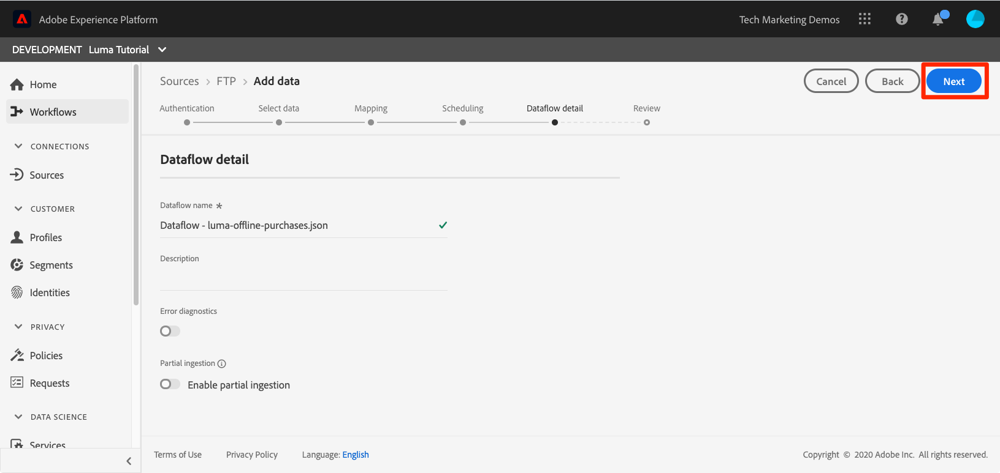

# 일괄 처리 데이터 수집

<!-- 1hr-->
이 단원에서는 다양한 방법을 사용하여 배치 데이터를 Experience Platform에 수집합니다.

일괄 데이터 수집을 사용하면 한 번에 많은 양의 데이터를 Adobe Experience Platform으로 수집할 수 있습니다. Platform의 인터페이스 내에서 또는 API를 사용하여 일괄 데이터를 한 번에 업로드할 수 있습니다. 소스 커넥터를 사용하여 클라우드 스토리지 서비스와 같은 서드파티 서비스에서 정기적으로 예약된 일괄 업로드를 구성할 수도 있습니다.

**데이터 엔지니어** 이 자습서 외부에서 일괄 데이터를 수집해야 합니다.

연습을 시작하기 전에 이 짧은 비디오를 시청하여 데이터 수집에 대해 자세히 알아보십시오.

>[!VIDEO](https://video.tv.adobe.com/v/27106?learn=on)


## 권한 필요

다음에서 [권한 구성](configure-permissions.md) 단원, 이 단원을 완료하는 데 필요한 모든 액세스 제어를 설정합니다.

<!--
* Permission item **[!UICONTROL Data Management]** > **[!UICONTROL View Datasets]**, **[!UICONTROL Manage Datasets]** and **[!UICONTROL Data Monitoring]**
* Permission items **[!UICONTROL Data Ingestion]** > **[!UICONTROL View Sources]** and **[!UICONTROL Manage Sources]**
* Permission item **[!UICONTROL Profile Management]** > **[!UICONTROL View Profiles]**
* Permission item **[!UICONTROL Sandboxes]** > `Luma Tutorial`
* User-role access to the `Luma Tutorial Platform` product profile
* Developer-role access to the `Luma Tutorial Platform` product profile (for API)
-->

소스 연습을 수행하려면 (S)FTP 서버 또는 클라우드 스토리지 솔루션에 액세스해야 합니다. 없는 경우 해결 방법이 있습니다.

## Platform 사용자 인터페이스를 사용하여 데이터 배치 수집

데이터는 JSON 및 Parquet 형식으로 데이터 세트 화면의 데이터 세트에 직접 업로드할 수 있습니다. 이는 을(를) 만든 후 일부 데이터의 수집을 테스트하는 좋은 방법입니다

### 데이터 다운로드 및 준비

먼저 샘플 데이터를 가져와 테넌트에 맞게 사용자 지정합니다.

>[!NOTE]
>
>에 포함된 데이터 [luma-data.zip](assets/luma-data.zip) 파일은 가상 파일이며 데모용으로만 사용됩니다.

1. 다운로드 [luma-data.zip](assets/luma-data.zip) (으)로 **Luma 튜토리얼 에셋** 폴더를 삭제합니다.
1. 파일 압축을 풀고 라는 폴더를 만듭니다. `luma-data` 이 단원에서 사용할 4개의 데이터 파일이 포함되어 있습니다.
1. 열기 `luma-loyalty.json` 텍스트 편집기에서 `_techmarketingdemos` 스키마에서 확인할 수 있듯이 고유한 밑줄 임차인 id로:
   

1. 업데이트된 파일 저장

### 데이터 수집

1. Platform 사용자 인터페이스에서 를 선택합니다. **[!UICONTROL 데이터 세트]** 왼쪽 탐색
1. 을(를) 엽니다 `Luma Loyalty Dataset`
1. 다음 항목이 표시될 때까지 아래로 스크롤합니다. **[!UICONTROL 데이터 추가]** 오른쪽 열의 섹션
1. 업로드 `luma-loyalty.json` 파일.
1. 파일이 업로드되면 배치에 대한 행이 나타납니다
1. 몇 분 후 페이지를 다시 로드하면 1000개의 레코드와 1000개의 프로필 조각과 함께 배치가 성공적으로 업로드된 것을 볼 수 있습니다.

   
   <!--do i need to explain error diagnostics and partial ingestion-->

>[!NOTE]
>
>몇 가지 옵션이 있는데, **[!UICONTROL 오류 진단]** 및 **[!UICONTROL 부분 수집]**, 이 단원에서 다양한 화면에서 보게 됩니다. 이러한 옵션은 자습서에서 다루지 않습니다. 몇 가지 빠른 정보:
>
>* 오류 진단을 활성화하면 데이터 수집에 대한 데이터가 생성되고 이 데이터는 Data Access API를 사용하여 검토할 수 있습니다. 다음에서 자세히 알아보기 [설명서](https://experienceleague.adobe.com/docs/experience-platform/data-access/home.html).
>* 부분 수집을 사용하면 지정 가능한 특정 임계값까지, 오류가 포함된 데이터를 수집할 수 있습니다. 다음에서 자세히 알아보기 [설명서](https://experienceleague.adobe.com/docs/experience-platform/ingestion/batch/partial.html)

### 데이터 유효성 검사

데이터가 성공적으로 수집되었는지 확인하는 방법에는 몇 가지가 있습니다.

#### Platform 사용자 인터페이스에서 유효성 검사

데이터가 데이터 세트에 수집되었는지 확인하려면:

1. 데이터를 수집한 동일한 페이지에서 **[!UICONTROL 데이터 세트 미리 보기]** 오른쪽 상단 단추
1. 다음 항목 선택 **미리 보기** 단추를 클릭하면 수집된 데이터 중 일부를 볼 수 있습니다.

   


데이터가 프로필에 도달했는지 확인하려면(데이터가 도착하는 데 몇 분 정도 걸릴 수 있음):

1. 다음으로 이동 **[!UICONTROL 프로필]** 왼쪽 탐색
1. 다음 옆에 있는 아이콘을 선택합니다. **[!UICONTROL ID 네임스페이스 선택]** 모달을 여는 필드
1. 다음 항목 선택 `Luma Loyalty Id` 네임스페이스
1. 그런 다음 다음 중 하나를 입력합니다. `loyaltyId` 데이터 세트의 값,  `5625458`
1. 선택 **[!UICONTROL 보기]**
   

#### 데이터 수집 이벤트로 유효성 검사

이전 단원에서 데이터 수집 이벤트를 구독한 경우 고유한 webhook.site URL을 확인합니다. 세 개의 요청이 다음 순서로 표시되고 그 사이에 시간이 좀 있으며 다음이 표시됩니다 `eventCode` 값:

1. `ing_load_success`- 수집된 일괄 처리
1. `ig_load_success`- 배치가 id 그래프에 수집되었습니다.
1. `ps_load_success`- 배치가 프로필 서비스에 수집되었습니다.


다음을 참조하십시오. [설명서](https://experienceleague.adobe.com/docs/experience-platform/ingestion/quality/subscribe-events.html#available-status-notification-events) 알림에 대한 자세한 내용은 을 참조하십시오.

## Platform API를 사용하여 데이터 배치 수집

이제 API를 사용하여 데이터를 업로드하겠습니다.

>[!NOTE]
>
>데이터 설계자는 사용자 인터페이스 메서드를 통해 CRM 데이터를 자유롭게 업로드할 수 있습니다.

### 데이터 다운로드 및 준비

1. 이미 다운로드하고 압축을 해제했어야 합니다. [luma-data.zip](assets/luma-data.zip) 에 `Luma Tutorial Assets` 폴더를 삭제합니다.
2. 열기 `luma-crm.json` 텍스트 편집기에서 `_techmarketingdemos` 스키마에 표시된 대로 고유한 밑줄 임차인 id로
3. 업데이트된 파일 저장

### 데이터 세트 ID 가져오기

먼저 데이터를 수집할 데이터 세트의 데이터 세트 ID를 가져옵니다.

1. 열기 [!DNL Postman]
1. 액세스 토큰이 없는 경우 요청을 엽니다 **[!DNL OAuth: Request Access Token]** 및 선택 **보내기** 에서 수행한 것과 같은 방식으로 새 액세스 토큰을 요청합니다. [!DNL Postman] 레슨.
1. 환경 변수를 열고 다음 값을 확인합니다. **CONTAINER_ID** 정지 `tenant`
1. 요청 열기 **[!DNL Catalog Service API > Datasets > Retrieve a list of datasets.]** 및 선택 **보내기**
1. You should get a `200 OK` 응답
1. 의 ID 복사 `Luma CRM Dataset` 응답 본문에서
   

### 일괄 처리 만들기

이제 데이터 세트에 일괄 처리를 만들 수 있습니다.

1. 다운로드 [데이터 수집 API.postman_collection.json](https://raw.githubusercontent.com/adobe/experience-platform-postman-samples/master/apis/experience-platform/Data%20Ingestion%20API.postman_collection.json) (으)로 `Luma Tutorial Assets` 폴더
1. 컬렉션 가져오기 [!DNL Postman]
1. 요청 선택 **[!DNL Data Ingestion API > Batch Ingestion > Create a new batch in Catalog Service.]**
1. 다음을 로 붙여넣기 **본문** 요청 중, ***datasetId 값을 자신의 값으로 바꾸기***:

   ```json
   {
       "datasetId":"REPLACE_WITH_YOUR_OWN_DATASETID",
       "inputFormat": {
           "format": "json"
       }
   }
   ```

1. 다음 항목 선택 **보내기** 단추
1. 새 일괄 처리의 ID가 포함된 201 Created 응답을 가져와야 합니다!
1. 다음을 복사합니다. `id` 새 일괄 처리 중
   

### 데이터 수집

이제 데이터를 배치에 업로드할 수 있습니다.

1. 요청 선택 **[!DNL Data Ingestion API > Batch Ingestion > Upload a file to a dataset in a batch.]**
1. 다음에서 **매개 변수** 탭에서 해당 필드에 데이터 세트 id 및 배치 id를 입력합니다
1. 다음에서 **매개 변수** 탭, 입력 `luma-crm.json` (으)로 **파일 경로**
1. 다음에서 **본문** 탭에서 **이진** 옵션
1. 다운로드한 항목 선택 `luma-crm.json` (내 로컬) `Luma Tutorial Assets` 폴더
1. 선택 **보내기** 응답 본문에 &#39;1&#39;을 사용하여 200 OK 응답을 받아야 합니다.

   

이때 Platform 사용자 인터페이스에서 배치를 보면 배치에 이 포함되어 있음을 볼 수 있습니다.[!UICONTROL 로드 중]&quot; 상태:


일괄 처리 API는 여러 파일을 업로드하는 데 자주 사용되므로 일괄 처리가 완료되면 플랫폼에게 알려 주어야 합니다. 이 작업은 다음 단계에서 수행합니다.

### 일괄 처리 완료

배치를 완료하려면

1. 요청 선택 **[!DNL Data Ingestion API > Batch Ingestion > Finish uploading a file to a dataset in a batch.]**
1. 다음에서 **매개 변수** 탭, 입력 `COMPLETE` (으)로 **작업**
1. 다음에서 **매개 변수** 탭에서 배치 id를 입력합니다. 데이터 세트 ID 또는 filePath가 있는 경우 걱정하지 마십시오.
1. POST URL이 `https://platform.adobe.io/data/foundation/import/batches/:batchId?action=COMPLETE` 및 `datasetId` 또는 `filePath`
1. 선택 **보내기** 응답 본문에 &#39;1&#39;을 사용하여 200 OK 응답을 받아야 합니다.

   

### 데이터 유효성 검사

#### Platform 사용자 인터페이스에서 유효성 검사

충성도 데이터 세트에 대해 수행한 것처럼 데이터가 Platform 사용자 인터페이스에 포함되었는지 확인합니다.

먼저, 배치가 1000개의 레코드가 수집되었음을 확인합니다.


그런 다음 미리 보기 데이터 세트를 사용하여 일괄 처리를 확인합니다.


마지막으로, 다음을 수행하여 프로필 중 하나를 조회하여 프로필 중 하나가 생성되었는지 확인합니다. `Luma CRM Id` 네임스페이스, 예 `112ca06ed53d3db37e4cea49cc45b71e`


방금 일어났던 한 가지 흥미로운 사실을 지적하고 싶다. 열기 `Danny Wright` 프로필. 프로필에 `Lumacrmid` 및 a `Lumaloyaltyid`. 다음을 기억하십시오. `Luma Loyalty Schema` 에는 Luma 충성도 ID 및 CRM ID라는 두 개의 ID 필드가 포함되어 있습니다. 이제 두 데이터 세트를 모두 업로드했으므로 하나의 프로필로 병합되었습니다. 충성도 데이터의 `Daniel` 를 로 사용하고 &quot;New York City&quot;를 홈 주소로 사용하는 반면 CRM 데이터에는 `Danny` 을(를) 이름 및 로 `Portland` 동일한 고객 충성도 ID를 사용하는 고객의 홈 주소입니다. 이름이 표시되는 이유를 다시 살펴보겠습니다 `Danny` 병합 정책에 대한 단원에서 을 참조하십시오.

축하합니다. 방금 프로필을 병합했습니다!


#### 데이터 수집 이벤트로 유효성 검사

이전 단원에서 데이터 수집 이벤트를 구독한 경우 고유한 webhook.site URL을 확인합니다. 충성도 데이터와 마찬가지로 다음 세 가지 요청이 들어오는 것을 볼 수 있습니다.


다음을 참조하십시오. [설명서](https://experienceleague.adobe.com/docs/experience-platform/ingestion/quality/subscribe-events.html#available-status-notification-events) 알림에 대한 자세한 내용은 을 참조하십시오.

## 워크플로우를 사용하여 데이터 수집

데이터를 업로드하는 다른 방법에 대해 살펴보겠습니다. 워크플로우 기능을 사용하면 XDM에서 아직 모델링되지 않은 CSV 데이터를 수집할 수 있습니다.

### 데이터 다운로드 및 준비

1. 이미 다운로드하고 압축을 해제했어야 합니다. [luma-data.zip](assets/luma-data.zip) 에 `Luma Tutorial Assets` 폴더를 삭제합니다.
1. 다음을 보유하고 있는지 확인`luma-products.csv`

### 워크플로 만들기

이제 워크플로우를 설정하겠습니다.

1. 다음으로 이동 **[!UICONTROL 워크플로]** 왼쪽 탐색
1. 선택 **[!UICONTROL CSV를 XDM 스키마에 매핑]** 및 선택 **[!UICONTROL 시작]** 단추
   
1. 다음 항목 선택 `Luma Product Catalog Dataset` 및 선택 **[!UICONTROL 다음]** 단추
   
1. 추가 `luma-products.csv` 다운로드한 파일을 선택하고 **[!UICONTROL 다음]** 단추
   
1. 이제 소스 데이터의 필드(의 열 이름 중 하나)를 매핑할 수 있는 매퍼 인터페이스에 있습니다. `luma-products.csv` file)을 타겟 스키마의 XDM 필드에 추가합니다. 이 예제에서 열 이름은 매퍼가 올바른 매핑을 자동으로 감지할 수 있을 만큼 스키마 필드 이름에 가깝습니다. 매퍼가 오른쪽 필드를 자동 감지할 수 없는 경우 대상 필드 오른쪽에 있는 아이콘을 선택하여 올바른 XDM 필드를 선택합니다. 또한 CSV에서 열 중 하나를 수집하지 않으려는 경우 매퍼에서 행을 삭제할 수 있습니다. 자유롭게 재생하고 의 열 제목을 변경합니다. `luma-products.csv` 매퍼 작동 방식을 이해합니다.
1. 다음 항목 선택 **[!UICONTROL 완료]** 단추
   

### 데이터 유효성 검사

배치가 업로드되면 데이터 세트를 미리 보고 업로드를 확인합니다.

다음 이후 `Luma Product SKU` 는 비사용자 네임스페이스이므로 제품 sku에 대한 프로필은 표시되지 않습니다.

웹후크에 대한 세 개의 히트를 볼 수 있습니다.

## 소스를 사용하여 데이터 수집

그래, 넌 힘든 일을 했어. 이제 약속의 땅으로 들어갑시다 _자동화_ 일괄 처리 수집! 내가 &quot;설정해!&quot; 라고 하면 &quot;잊어 버려!&quot; &quot;설정해!&quot; &quot;됐어!&quot; &quot;설정해!&quot; &quot;됐어!&quot; 농담이야, 넌 절대 그런 짓 안 할 거야! 좋아, 일하러 가 거의 다 됐어

다음으로 이동 **[!UICONTROL 소스]** 을 클릭하여 소스 카탈로그를 엽니다. 업계 최고의 데이터 및 스토리지 공급업체와의 다양한 기본 통합을 살펴볼 수 있습니다.


좋습니다. 소스 커넥터를 사용하여 데이터를 수집하겠습니다.

이 연습은 나만의 모험 스타일로 할 것입니다. FTP 소스 커넥터를 사용하는 워크플로우를 표시하려고 합니다. 회사에서 사용하는 다른 클라우드 스토리지 소스 커넥터를 사용하거나 충성도 데이터를 사용한 것과 같은 데이터 세트 사용자 인터페이스를 사용하여 json 파일을 업로드할 수 있습니다.

대부분의 소스에는 다음과 같은 유사한 구성 워크플로가 있습니다.

1. 인증 세부 정보 입력
1. 수집할 데이터 선택
1. 수집할 Platform 데이터 세트를 선택합니다
1. 필드를 XDM 스키마에 매핑
1. 해당 위치에서 데이터를 수집할 빈도를 선택합니다

>[!NOTE]
>
>이 연습에서 사용할 오프라인 구매 데이터에는 날짜/시간 데이터가 포함되어 있습니다. 날짜/시간 데이터는 다음 중 하나여야 합니다. [ISO 8061 형식의 문자열](https://www.iso.org/iso-8601-date-and-time-format.html) (&quot;2018-07-10T15:05:59.000-08:00&quot;) 또는 밀리초(1531263959000) 단위의 Unix 시간 형식이 지정되며, 수집 시 대상 XDM 유형으로 변환됩니다. 데이터 변환 및 기타 제약 조건에 대한 자세한 내용은 [일괄 처리 수집 API 설명서](https://experienceleague.adobe.com/docs/experience-platform/ingestion/batch/api-overview.html#types).

### 원하는 클라우드 스토리지 공급업체에 데이터 다운로드, 준비 및 업로드

1. 이미 다운로드하고 압축을 해제했어야 합니다. [luma-data.zip](assets/luma-data.zip) 에 `Luma Tutorial Assets` 폴더를 삭제합니다.
1. 열기 `luma-offline-purchases.json` 텍스트 편집기에서 `_techmarketingdemos` 스키마에 표시된 대로 고유한 밑줄 임차인 id로
1. 이벤트가 지난 달에 발생하도록 모든 타임스탬프를 업데이트합니다(예: 검색 `"timestamp":"2022-06` 및 연도 및 월 대체)
1. 선호하는 클라우드 스토리지 공급자를 선택하여에서 사용할 수 있는지 확인합니다. [!UICONTROL 소스] 카탈로그
1. 업로드 `luma-offline-purchases.json` 선호하는 클라우드 스토리지 공급자의 위치로

### 데이터를 원하는 클라우드 스토리지 위치로 수집

1. Platform 사용자 인터페이스에서 를 필터링합니다. [!UICONTROL 소스] 카탈로그 대상 **[!UICONTROL 클라우드 스토리지]**
1. 아래 설명서에 대한 편리한 링크가 있습니다. `...`
1. 선호하는 클라우드 스토리지 공급업체의 상자에서 **[!UICONTROL 구성]** 단추
   
1. **[!UICONTROL 인증]** 는 첫 번째 단계입니다. 계정 이름 입력(예: ) `Luma's FTP Account` 및 인증 세부 정보. 필드가 약간 다를 수 있지만 이 단계는 모든 클라우드 스토리지 소스의 경우와 상당히 유사해야 합니다. 계정에 대한 인증 세부 정보를 입력하면 동일한 계정의 다른 파일과 다른 일정에 따라 다른 데이터를 전송할 수 있는 다른 소스 연결에 이를 다시 사용할 수 있습니다
1. 다음 항목 선택 **[!UICONTROL 소스에 연결 버튼]**
1. 플랫폼이 소스에 성공적으로 연결되면 **[!UICONTROL 다음]** 단추
   

1. 다음에서 **[!UICONTROL 데이터 선택]** 단계에서 사용자 인터페이스는 자격 증명을 사용하여 클라우드 스토리지 솔루션에서 폴더를 엽니다
1. 수집할 파일 선택(예: ) `luma-offline-purchases.json`
1. 다음으로: **[!UICONTROL 데이터 형식]**, 선택 `XDM JSON`
1. 그런 다음 JSON 구조 및 파일의 샘플 데이터를 미리 볼 수 있습니다
1. 다음 항목 선택 **[!UICONTROL 다음]** 단추
   

1. 다음에서 **[!UICONTROL 매핑]** 단계, 선택 `Luma Offline Purchase Events Dataset` 및 선택 **[!UICONTROL 다음]** 단추를 클릭합니다. 수집하는 데이터가 JSON 파일이므로 소스 필드를 타겟 필드에 매핑하는 매핑 단계가 없다는 메시지에 주의하십시오. JSON 데이터는 이미 XDM에 있어야 합니다. CSV를 수집하는 경우 이 단계에서 전체 매핑 사용자 인터페이스가 표시됩니다.
   
1. 다음에서 **[!UICONTROL 예약]** 단계에서는 소스에서 데이터를 수집할 빈도를 선택합니다. 잠시 옵션을 살펴보십시오. 일회성 섭취만 할 예정이니 **[!UICONTROL 빈도]** 날짜 **[!UICONTROL 한 번]** 및 선택 **[!UICONTROL 다음]** 단추:
   
1. 다음에서 **[!UICONTROL 데이터 흐름 세부 정보]** 단계에서는 데이터 흐름의 이름을 선택하고, 선택적 설명을 입력하고, 오류 진단을 켜고, 부분 수집을 할 수 있습니다. 설정을 그대로 두고 다음을 선택합니다. **[!UICONTROL 다음]** 단추:
   
1. 다음에서 **[!UICONTROL 리뷰]** 단계에서 모든 설정을 함께 검토하고 편집하거나 **[!UICONTROL 완료]** 단추
1. 저장한 후 다음과 같은 화면에 랜딩합니다.
   

### 데이터 유효성 검사

배치가 업로드되면 데이터 세트를 미리 보고 업로드를 확인합니다.

웹후크에 대한 세 개의 히트를 볼 수 있습니다.

값으로 프로필 조회 `5625458` 다음에서 `loyaltyId` 네임스페이스를 다시 사용하여 프로필에 구매 이벤트가 있는지 확인합니다. 한 번 구매하시는 게 보일 겁니다. 을(를) 선택하여 구매 세부 정보를 파악할 수 있습니다. **[!UICONTROL JSON 보기]**:


## ETL 도구

Adobe은 여러 ETL 공급업체와 협력하여 Experience Platform에 데이터 수집을 지원합니다. 다양한 서드파티 공급업체로 인해 ETL은 이 자습서에서 다루지 않지만, 다음 리소스 중 일부를 검토할 수 있습니다.

* [Adobe Experience Platform용 ETL 통합 개발](https://experienceleague.adobe.com/docs/experience-platform/etl/home.html)
* [Adobe Exchange의 Informatica Adobe Experience Platform 커넥터 페이지](https://exchange.adobe.com/experiencecloud.details.101570.informatica-adobe-experience-cloud-connector.html)
* [Adobe Experience Platform 커넥터의 Informatica 설명서](https://docs.informatica.com/integration-cloud/cloud-data-integration-connectors/current-version/adobe-experience-platform-connector/preface.html)
* [[!DNL Snaplogic] Adobe Experience Platform Snap Pack](https://www.snaplogic.com/resources/videos/august-2020-aep)

## 추가 리소스

* [일괄 처리 수집 설명서](https://experienceleague.adobe.com/docs/experience-platform/ingestion/batch/overview.html)
* [일괄 처리 수집 API 참조](https://developer.adobe.com/experience-platform-apis/references/batch-ingestion/)

이제 [웹 SDK를 사용하여 데이터 스트리밍](ingest-streaming-data.md)
