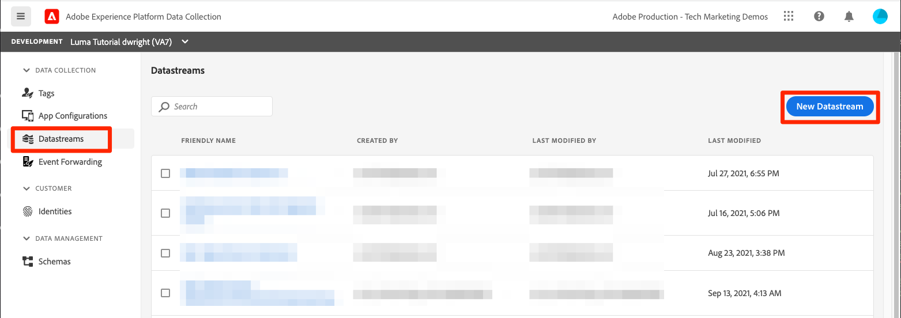
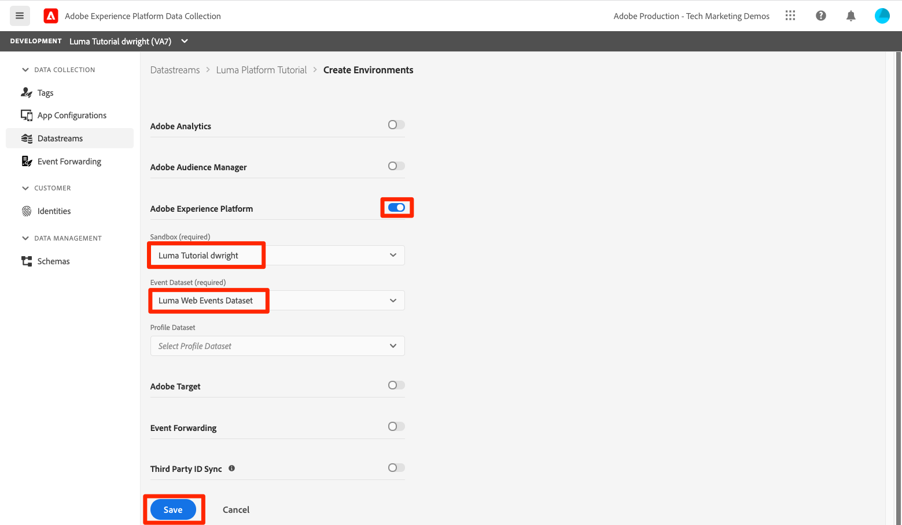
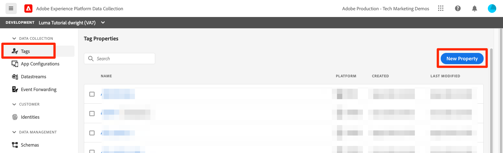
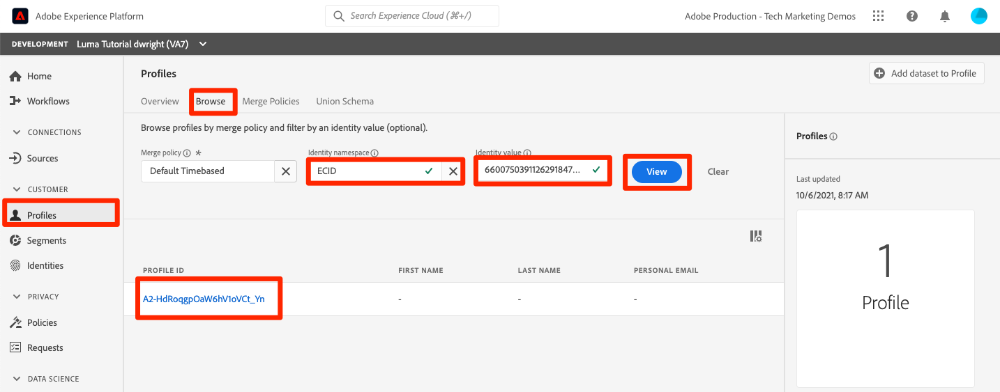
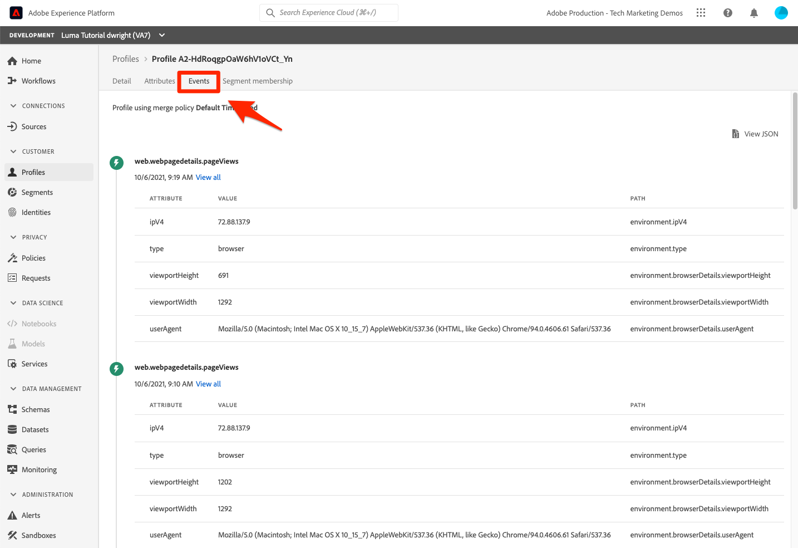
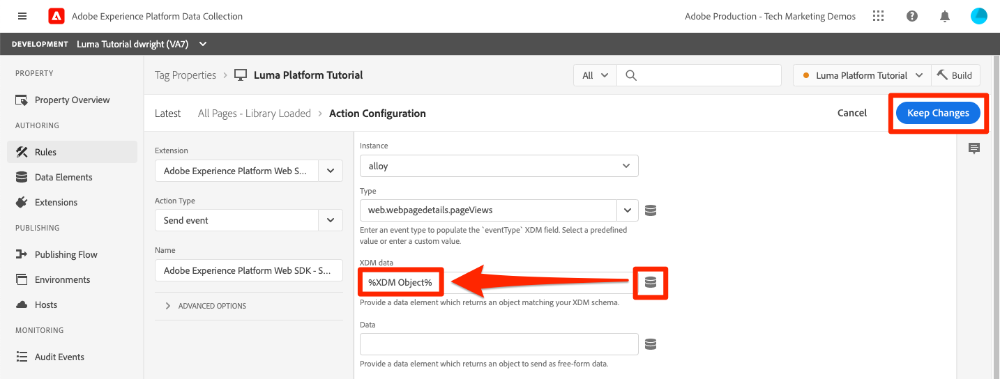

# 스트리밍 데이터 수집

<!--1hr-->

이 단원에서는 Adobe Experience Platform Web SDK를 사용하여 데이터를 스트리밍합니다.

데이터 수집 인터페이스에서 완료해야 하는 두 가지 주요 작업이 있습니다.

* 웹 사이트의 방문자 활동에 대한 데이터를 Adobe Edge 네트워크로 보내려면 Luma 웹 사이트에서 웹 SDK를 구현해야 합니다. 태그를 사용하여 간단한 구현을 수행합니다(이전 Launch)

* 데이터를 전달할 위치를 에지 네트워크에 알려 주는 데이터 스트림을 구성해야 합니다. 데이터를 로 보내도록 구성합니다. `Luma Web Events` platform 샌드박스의 데이터 세트입니다.

**데이터 엔지니어** 이 자습서 외부에서 스트리밍 데이터를 수집해야 합니다. Adobe Experience Platform의 웹 또는 모바일 SDK를 구현할 때 일반적으로 웹 또는 모바일 개발자는 데이터 레이어 만들기 및 태그 속성 구성에 관여합니다.

연습을 시작하기 전에 다음 두 개의 짧은 비디오를 시청하여 데이터 수집 및 웹 SDK 스트리밍에 대해 자세히 알아보십시오.

>[!VIDEO](https://video.tv.adobe.com/v/28425?quality=12&learn=on)

>[!VIDEO](https://video.tv.adobe.com/v/34141?quality=12&learn=on)

>[!NOTE]
>
>이 튜토리얼에서는 Web SDK를 사용하는 웹 사이트에서의 스트리밍 수집에 중점을 두고 있지만, [Adobe 모바일 SDK](https://developer.adobe.com/client-sdks/documentation/), [Apache Kafka 연결](https://github.com/adobe/experience-platform-streaming-connect)및 기타 메커니즘.

## 권한 필요

다음에서 [권한 구성](configure-permissions.md) 단원, 이 단원을 완료하는 데 필요한 모든 액세스 제어를 설정합니다.

<!--
* Permission items **[!UICONTROL Launch]** > **[!UICONTROL Property Rights]** > **[!UICONTROL Approve]**, **[!UICONTROL Develop]**, **[!UICONTROL Manage Environments]**, **[!UICONTROL Manage Extensions]**, and **[!UICONTROL Publish]**
* Permission item **[!UICONTROL Launch]** > **[!UICONTROL Company Rights]** > **[!UICONTROL Manage Properties]**
* User-role access to the `Luma Tutorial Launch` product profile
* Admin-role access to the `Luma Tutorial Launch` product profile
* Permission items **[!UICONTROL Platform]** > **[!UICONTROL Data Ingestion]** > **[!UICONTROL View Sources]** and **[!UICONTROL Manage Sources]**
* Permission items **[!UICONTROL Platform]** > **[!UICONTROL Data Management]** > **[!UICONTROL View Datasets]** and **[!UICONTROL Manage Datasets]**
* Permission items **[!UICONTROL Platform]** > **[!UICONTROL Profiles]** > **[!UICONTROL View Profiles]**, **[!UICONTROL Manage Profiles]** and **[!UICONTROL Export Audience Segment]**
* Permission item **[!UICONTROL Platform]** > **[!UICONTROL Sandbox Administration]** > **[!UICONTROL View Sandboxes]**
* Permission item **[!UICONTROL Platform]** > **[!UICONTROL Sandboxes]** > `Luma Tutorial`
* User-role access to the `Luma Tutorial Platform` product profile
-->

<!--## Create a streaming source

1. Log into the [Experience Platform  user interface](https://experience.adobe.com/platform/)
1. Go to **[!UICONTROL Sources]** in the left navigation
1. Filter the list by selecting **[!UICONTROL Streaming]**
1. In the **[!UICONTROL HTTP API]** section, select the **[!UICONTROL Configure]** button
    
1. On the **[!UICONTROL Authentication]** step, enter `Luma Web Events Source` as the **[!UICONTROL Account name]** and select the **[!UICONTROL Connect to source]** button (we don't need to enable authentication since the data will be originating from website visitors)
    
1. Once connected, select the **[!UICONTROL Next]** button to proceed to the next step in the workflow
1. On the **[!UICONTROL Select data]** step, choose **[!UICONTROL Existing Dataset]**, select your `Luma Web Events Dataset`, and then select the **[!UICONTROL Next]** button
    
1. On the **[!UICONTROL Dataflow detail]** step, select the **[!UICONTROL Next]** button:
    
    <!--What is a good practice for naming the data flow vs the source-->
<!--
1. On the **[!UICONTROL Review]** step, review your source details and select the **[!UICONTROL Finish]** button:
    
-->

## 데이터 스트림 구성

먼저 데이터 스트림을 구성하겠습니다. 데이터 스트림은 Web SDK 호출에서 데이터를 받은 후 데이터를 보낼 위치를 Adobe Edge 네트워크에 알려줍니다. 예를 들어 데이터를 Experience Platform, Adobe Analytics 또는 Adobe Target으로 전송하시겠습니까? 데이터 스트림은 데이터 수집 사용자 인터페이스(이전 Launch)에서 관리되며, Web SDK를 사용한 데이터 수집에 중요합니다.

다음을 만들려면 [!UICONTROL 데이터스트림]:

1. 에 로그인합니다 [Experience Platform 데이터 수집 사용자 인터페이스](https://experience.adobe.com/launch/)
   <!--when will the edge config go live?-->

1. 선택 **[!UICONTROL 데이터스트림]** 왼쪽 탐색
1. 다음 항목 선택 **[!UICONTROL 새 데이터스트림]** 오른쪽 상단 모서리의 단추

   

1. 의 경우 **[!UICONTROL 알기 쉬운 이름]**, 입력 `Luma Platform Tutorial` (회사에서 여러 사람이 이 튜토리얼을 수강하는 경우 이름 추가)
1. **[!UICONTROL 저장]** 버튼을 선택합니다

   

다음 화면에서는 데이터를 보낼 위치를 지정합니다. 데이터를 Experience Platform에 보내려면:

1. 켜기 **[!UICONTROL Adobe Experience Platform]** 추가 필드를 표시하려면
1. 대상 **[!UICONTROL 샌드박스]**, 선택 `Luma Tutorial`
1. 대상 **[!UICONTROL 이벤트 데이터 세트]**, 선택 `Luma Web Events Dataset`
1. 다른 Adobe 애플리케이션을 사용하는 경우 언제든지 다른 섹션을 탐색하여 이러한 다른 솔루션의 Edge 구성에 필요한 정보를 확인하십시오. Web SDK는 데이터를 Experience Platform으로 스트리밍할 뿐만 아니라 다른 Adobe 애플리케이션에서 사용하는 모든 이전 JavaScript 라이브러리를 대체하기 위해 개발되었습니다. Edge 구성은 데이터를 전송하려는 각 애플리케이션의 계정 세부 사항을 지정하는 데 사용됩니다.
1. **[!UICONTROL 저장]**을 선택합니다
   

Edge 구성이 저장되면 결과 화면에 개발, 스테이징 및 프로덕션용으로 만들어진 세 가지 환경이 표시됩니다. 추가 개발 환경을 추가할 수 있습니다.

세 가지 환경 모두 방금 입력한 플랫폼 세부 정보를 포함합니다. 하지만 이러한 세부 정보는 환경별로 다르게 구성할 수 있습니다. 예를 들어 각 환경에서 데이터를 다른 Platform 샌드박스로 보내도록 할 수 있습니다. 이 자습서에서는 데이터 스트림에 대한 추가 사용자 지정을 수행하지 않습니다.

## 웹 SDK 확장 설치

### 속성 추가

먼저 태그 속성(이전의 태그 속성)을 만들어야 합니다. 속성은 웹 페이지에서 세부 정보를 수집하여 여러 위치로 보내는 데 필요한 모든 JavaScript, 규칙 및 기타 기능을 위한 컨테이너입니다.

속성을 만들려면 다음 작업을 수행하십시오.

1. 다음으로 이동 **[!UICONTROL 속성]** 왼쪽 탐색
1. **[!UICONTROL 새 속성]** 버튼을 선택합니다
   
1. 다음으로: **[!UICONTROL 이름]**, 입력 `Luma Platform Tutorial` (회사에서 여러 사람이 이 튜토리얼을 수강하는 경우 이름 추가)
1. 다음으로: **[!UICONTROL 도메인]**, 입력 `enablementadobe.com` (나중에 설명)
1. **[!UICONTROL 저장]**을 선택합니다
   

<!--
After saving the property, you might see an error message like the one below. If so, this is because you don't actually have access to the property you just created. To fix this, we need to go to the Admin Console to give yourself access:
    

To give yourself access to the property:

1. In a separate browser tab, log into the [Admin Console](https://adminconsole.adobe.com/)
1. Go to **[!UICONTROL Products]** from the top navigation
1. Select **[!UICONTROL Adobe Experience Platform Launch]** on the left navigation
1. Go to your `Luma Tutorial Launch` product profile
1. Go to the **[!UICONTROL Permissions]** tab
1. On the **[!UICONTROL Properties]** row, select **[!UICONTROL Edit]**
    
1. Select the "+" icon to move your `Luma Platform Tutorial` property to the right-hand side and select the **[!UICONTROL Save]** button to update the permissions
   
    

Now switch back to your browser tab with the Data Collection interface still open. Reload the page and the `Luma Platform Tutorial` property should display in the list. Select to open the property:

-->

## 웹 SDK 확장 추가

이제 속성이 있으므로 확장을 사용하여 웹 SDK를 추가할 수 있습니다. 확장은 데이터 수집 인터페이스 및 기능을 확장하는 코드 패키지입니다. 확장을 추가하려면:

1. 태그 속성 열기
1. 다음으로 이동 **[!UICONTROL 확장]** 왼쪽 탐색
1. 로 이동 **[!UICONTROL 카탈로그]** 탭
1. 태그에 사용할 수 있는 확장 프로그램이 많이 있습니다. 용어로 카탈로그 필터링 `Web SDK`
1. 다음에서 **[!UICONTROL Adobe Experience Platform 웹 SDK]** 확장에서 **[!UICONTROL 설치]** 단추
   
1. 웹 SDK 확장에는 몇 가지 구성이 있지만, 이 자습서에 대해 두 가지 구성만 수행할 수 있습니다. 업데이트 **[!UICONTROL Edge 도메인]** 끝 `data.enablementadobe.com`. 이 설정을 사용하면 웹 SDK 구현을 사용하여 자사 쿠키를 설정할 수 있습니다. 이는 권장되는 현상입니다. 이 단원의 후반부에 `enablementadobe.com` 도메인을 태그 속성에 추가합니다. 의 CNAME `enablementadobe.com` 도메인이 이미 구성되었습니다. `data.enablementadobe.com` 은 Adobe 서버로 전달됩니다. 자체 웹 사이트에서 Web SDK를 구현하는 경우 다음과 같은 데이터 수집 목적을 위해 CNAME를 만들어야 합니다. `data.YOUR_DOMAIN.com`
1. 다음에서 **[!UICONTROL 데이터스트림]** 드롭다운, 다음 중 하나를 선택합니다. `Luma Platform Tutorial` 데이터스트림.
1. 다른 구성 옵션을 자유롭게 살펴보십시오(하지만 변경하지 마십시오!). 다음을 선택합니다. **[!UICONTROL 저장]**
   <!--is edge domain required for first party? when will it break?-->
   <!--any other fields that should be highlighted-->
   

## 데이터를 전송할 규칙 만들기

이제 Platform으로 데이터를 전송하는 규칙을 만듭니다. 규칙은 태그에게 작업을 수행하도록 지시하는 이벤트, 조건 및 작업의 조합입니다. 규칙을 만들려면:

1. 다음으로 이동 **[!UICONTROL 규칙]** 왼쪽 탐색
1. 다음 항목 선택 **[!UICONTROL 새 규칙 만들기]** 단추
   
1. 규칙 이름을 지정합니다 `All Pages - Library Loaded`
1. 아래 **[!UICONTROL 이벤트]**&#x200B;를 선택하고 **[!UICONTROL 추가]** 단추
   
1. 사용 **[!UICONTROL 코어]** **[!UICONTROL 확장]** 및 선택 **[!UICONTROL 라이브러리가 로드됨 (페이지 상단)]** (으)로 **[!UICONTROL 이벤트 유형]**. 이 설정은 Launch 라이브러리가 페이지에 로드될 때마다 규칙이 실행됨을 의미합니다.
1. 선택 **[!UICONTROL 변경 내용 유지]** 기본 규칙 화면으로 돌아가기
   
1. 나가기 **[!UICONTROL 조건]** 비어 있음. 지정한 이름에 따라 이 규칙이 모든 페이지에서 실행되기 전에
1. 아래 **[!UICONTROL 작업]**&#x200B;를 선택하고 **[!UICONTROL 추가]** 단추
1. 사용 **[!UICONTROL Adobe Experience Platform 웹 SDK]** **[!UICONTROL 확장]** 및 선택 **[!UICONTROL 이벤트 보내기]** (으)로 **[!UICONTROL 작업 유형]**
1. 오른쪽에서 을 선택합니다. **[!UICONTROL web.webpagedetails.pageViews]** 다음에서 **[!UICONTROL 유형]** 드롭다운입니다. 이는 의 XDM 필드 중 하나입니다. `Luma Web Events Schema`
1. 선택 **[!UICONTROL 변경 내용 유지]** 기본 규칙 화면으로 돌아가기
   
1. 선택 **[!UICONTROL 저장]** 규칙을 저장하려면\
   

## 라이브러리에 규칙 게시

그런 다음 규칙이 작동하는지 확인할 수 있도록 개발 환경에 규칙을 게시합니다.

<!--
There are a few quick steps we must take in the **[!UICONTROL Publishing]** section of Launch.

### Create a host

Launch libraries can be hosted on Adobe's Content Delivery Network (CDN) or on your own servers. In this tutorial, we will use Adobe's CDN since it is faster to set up:

1. Go to **[!UICONTROL Hosts]** in the left navigation
1. Select the **[!UICONTROL Create New Host]** button
       
1. For the **[!UICONTROL Name]**, enter `Adobe CDN`
1. For the **[!UICONTROL Type]**, select **[!UICONTROL Managed by Adobe]**
1. Select the **[!UICONTROL Save]** button to complete the setup of the host
       

### Create an environment

Environments allow you to have different versions of a library in different publishing environments to accommodate your publishing workflow. For example, the fully tested version of your library can be published to a Production environment, while new changes are being created in a Development environment. You can also use different hosts for each environment. To create an environment:

1. Go to **[!UICONTROL Environments]** in the left navigation
1. Select the **[!UICONTROL Create New Environment]** button
     
1. Under **[!UICONTROL Development]** select **[!UICONTROL Select]**   
     
1. For the **[!UICONTROL Name]**, enter `Development`
1. For the **[!UICONTROL Select Host]** dropdown, select `Adobe CDN`
1. Select the **[!UICONTROL Save]** button to complete the setup of the environment
    
1. You will see a modal with URL and other implementation details of this library. These are critical for a real Launch implementation, but we don't need to worry about them for this tutorial. Select the **[!UICONTROL Close]** button to exit the modal.

### Create and publish the library

Now let's bundle the contents of our property&mdash;currently an extension and a rule&mdash;into a library. 
-->

라이브러리를 만들려면 다음 작업을 수행하십시오.

1. 다음으로 이동 **[!UICONTROL 게시 플로우]** 왼쪽 탐색
1. 선택 **[!UICONTROL 라이브러리 추가]**
   
1. 의 경우 **[!UICONTROL 이름]**, 입력 `Luma Platform Tutorial`
1. 의 경우 **[!UICONTROL 환경]**, 선택 `Development`
1. 다음 항목 선택 **[!UICONTROL 변경된 모든 리소스 추가]** 단추를 클릭합니다. (외) [!UICONTROL Adobe Experience Platform 웹 SDK] 확장 및 `All Pages - Library Loaded` 규칙, 다음 항목도 표시됩니다 [!UICONTROL 코어] 모든 Launch 웹 속성에 필요한 기본 JavaScript를 포함하는 확장이 추가되었습니다.)
1. 다음 항목 선택 **[!UICONTROL 개발을 위한 저장 및 구축]** 단추
   

라이브러리를 빌드하는 데 몇 분 정도 소요될 수 있으며 완료되면 라이브러리 이름 왼쪽에 녹색 점이 표시됩니다.

에서 볼 수 있듯이 [!UICONTROL 게시 플로우] 화면, 게시 프로세스에는 이 자습서의 범위를 벗어나는 많은 내용이 있습니다. 개발 환경에서 단일 라이브러리를 사용할 예정입니다.

## 요청의 데이터 유효성 검사

### Adobe Experience Platform Debugger 추가

Experience Platform 디버거는 Chrome 및 Firefox 브라우저에서 사용할 수 있는 확장 프로그램으로, 웹 페이지에서 구현된 Adobe 기술을 볼 수 있도록 도와줍니다. 원하는 브라우저용 버전을 다운로드합니다.

* [Firefox 확장](https://addons.mozilla.org/ko-KR/firefox/addon/adobe-experience-platform-dbg/)
* [Chrome 확장 프로그램](https://chrome.google.com/webstore/detail/adobe-experience-platform/bfnnokhpnncpkdmbokanobigaccjkpob)

이전에 Debugger를 사용한 적이 없고 이전 Adobe Experience Cloud Debugger와 다른 경우 다음 5분 길이의 개요 비디오를 시청해 보십시오.

>[!VIDEO](https://video.tv.adobe.com/v/32156?quality=12&learn=on)

### Luma 웹 사이트를 엽니다.

이 자습서에서는 공개적으로 호스팅된 Luma 데모 웹 사이트 버전을 사용합니다. 열어 책갈피에 추가:

1. 새 브라우저 탭에서 [Luma 웹 사이트](https://luma.enablementadobe.com/content/luma/us/en.html).
1. 자습서의 나머지 부분에서 사용할 페이지에 책갈피를 지정합니다

이 호스팅된 웹 사이트가 `enablementadobe.com` 다음에서 [!UICONTROL 도메인] 초기 태그 속성 구성 필드 및 을 사용한 이유 `data.enablementadobe.com` 에서 자사 도메인으로 [!UICONTROL Adobe Experience Platform 웹 SDK] 확장명. 난 계획이 있었어!

### Experience Platform 디버거를 사용하여 태그 속성에 매핑

Experience Platform 디버거에는 기존 태그 속성을 다른 속성으로 바꿀 수 있는 멋진 기능이 있습니다. 이 기능은 유효성 검사에 유용하며, 이 자습서에서는 많은 구현 단계를 건너뛸 수 있습니다.

1. Luma 사이트가 열려 있는지 확인하고 Experience Platform 디버거 확장 아이콘을 선택합니다.
1. 디버거가 열리고 이 자습서와 관련이 없는 하드코딩된 구현에 대한 일부 세부 정보가 표시됩니다(디버거를 연 후 Luma 사이트를 다시 로드해야 할 수 있음).
1. 디버거가 &quot;&quot;인지 확인합니다.**[!UICONTROL Luma에 연결됨]**&#x200B;아래 그림과 같이 &quot;을(를) 선택한 다음 &quot;**[!UICONTROL 잠금]**&quot; 아이콘을 클릭하여 Luma 사이트에 디버거를 잠급니다.
1. 다음 항목 선택 **[!UICONTROL 로그인]** 오른쪽 상단의 버튼을 클릭하여 인증합니다.
1. 이제 다음으로 이동 **[!UICONTROL 시작]** 왼쪽 탐색
1. 구성 탭을 선택합니다.
1. 오른쪽에 표시되는 **[!UICONTROL 페이지 포함 코드]**&#x200B;를 열고 **[!UICONTROL 작업]** 드롭다운, 선택 **[!UICONTROL 바꾸기]**
   
1. 사용자가 인증되었으므로 디버거는 사용 가능한 Launch 속성 및 환경을 가져옵니다. 다음 항목 선택 `Luma Platform Tutorial` 속성
1. 다음 항목 선택 `Development` 환경
1. 다음 항목 선택 **[!UICONTROL 적용]** 단추
   
1. 이제 Luma 웹 사이트가 다시 로드됩니다. _태그 속성 포함_. 도와줘요, 해킹당했습니다! 농담입니다.
   
1. 다음으로 이동 **[!UICONTROL 요약]** 왼쪽 탐색에서 의 세부 정보를 확인합니다. [!UICONTROL 시작] 속성
   
1. 이제 다음으로 이동 **[!UICONTROL AEP 웹 SDK]** 을(를) 클릭하여 왼쪽 탐색 창에서 **[!UICONTROL 네트워크 요청]**
1. 를 엽니다. **[!UICONTROL events]** 행

   
1. 다음을 확인하는 방법에 주목하십시오. `web.webpagedetails.pageView` 에 지정한 이벤트 유형 [!UICONTROL 이벤트 보내기] 작업 및 기타 기본 제공 변수 `AEP Web SDK ExperienceEvent Mixin` 형식
   
1. 이러한 유형의 요청 세부 사항은 브라우저의 웹 개발자 도구에도 표시됩니다 **네트워크** 탭. 페이지를 열고 다시 로드합니다. 다음을 포함한 호출 필터링 `interact` 호출을 찾으려면 해당 호출을 선택한 다음 **헤더** 탭, **요청 페이로드** 영역입니다.
   
1. 로 이동 **응답** 를 탭하고 ECID 값이 응답에 어떻게 포함되는지 확인합니다. 다음 연습에서 프로필 정보의 유효성을 검사하는 데 사용할 값으로 이 값을 복사하십시오.
   

## Experience Platform의 데이터 유효성 검사

에 도착하는 데이터 일괄 처리를 확인하여 데이터가 플랫폼에 도달하는지 확인할 수 있습니다. `Luma Web Events Dataset`. (예: 스트리밍 데이터 수집이라고 하지만 이제 여러 개가 일괄적으로 도착한다고 말하고 있습니다.) 프로필로 실시간 스트리밍되므로 실시간 세그멘테이션 및 활성화에 사용할 수 있지만, 15분마다 데이터 레이크로 일괄적으로 전송됩니다.)

데이터의 유효성을 검사하려면

1. Platform 사용자 인터페이스에서 **[!UICONTROL 데이터 세트]** 왼쪽 탐색
1. 를 엽니다. `Luma Web Events Dataset` 그리고 배치가 도착했는지 확인합니다. 15분마다 전송되므로 일괄 처리가 표시될 때까지 기다려야 한다는 것을 기억하십시오.
1. 다음 항목 선택 **[!UICONTROL 데이터 세트 미리 보기]** 단추
   
1. 미리 보기 모달에서 왼쪽의 스키마의 여러 필드를 선택하여 특정 데이터 포인트를 미리 보는 방법을 확인합니다.
   

새 프로필이 표시되는지 확인할 수도 있습니다.

1. Platform 사용자 인터페이스에서 **[!UICONTROL 프로필]** 왼쪽 탐색
1. 다음 항목 선택 **[!UICONTROL ECID]** 네임스페이스를 설정하고 ECID 값을 검색합니다(응답에서 복사). 프로필에는 ECID와 별도의 자체 ID가 있습니다.
1. 다음 항목 선택 **[!UICONTROL 프로필 ID]** 프로파일을 열려면
   
1. 다음 항목 선택 **[!UICONTROL 이벤트]** 탭하여 본 페이지 보기
   \
   <!---->

## 이벤트에 사용자 정의 데이터 추가

### 페이지 이름에 대한 데이터 요소 만들기

1. 데이터 수집 태그 인터페이스의 오른쪽 상단 `Luma Platform Tutorial` 속성, 열기 **[!UICONTROL 작업 라이브러리 선택]** 드롭다운 및 선택 `Luma Platform Tutorial` 라이브러리입니다. 이 설정을 사용하면 라이브러리에 추가 업데이트를 더 쉽게 게시할 수 있습니다.
1. 이제 다음으로 이동 **[!UICONTROL 데이터 요소]** 왼쪽 탐색
1. 다음 항목 선택 **[!UICONTROL 새 데이터 요소 만들기]** 단추

   
1. 다음으로: **[!UICONTROL 이름]**, 입력 `Page Name`
1. 다음으로: **[!UICONTROL 데이터 요소 유형]**, 선택 `JavaScript Variable`
1. 다음으로: **[!UICONTROL JavaScript 변수 이름]**, 입력 `digitalData.page.pageInfo.pageName`
1. 값의 형식을 표준화하려면 상자를 선택합니다. **[!UICONTROL 소문자 강제 적용 값]** 및 **[!UICONTROL 텍스트 정리]**
1. 다음을 확인합니다. `Luma Platform Tutorial` 이(가) 작업 라이브러리로 선택되었습니다.
1. 선택 **[!UICONTROL 라이브러리에 저장]**
   

### 페이지 이름을 XDM 개체 데이터 요소에 매핑합니다

이제 페이지 이름을 웹 SDK에 매핑하겠습니다.

>[!IMPORTANT]
>
>이 작업을 완료하려면 먼저 사용자가 Prod 샌드박스에 액세스할 수 있는지 확인해야 합니다. 다른 제품 프로필에서 Prod 샌드박스에 액세스할 수 없는 경우 `Luma Tutorial Platform` 프로필 작성 및 권한 항목 추가 **[!UICONTROL 샌드박스]** > **[!UICONTROL Prod]**. 그런 다음 데이터 요소 페이지에서 SHIFT 키를 누른 상태로 다시 로드하여 캐시를 지웁니다
>

다음에서 **[!UICONTROL 데이터 요소]** 페이지:

1. 새 데이터 요소 만들기
1. 다음으로: **[!UICONTROL 이름]**, 입력 `XDM Object`
1. 다음으로: **[!UICONTROL 확장]**, 선택 `Adobe Experience Platform Web SDK`
1. 다음으로: **[!UICONTROL 데이터 요소 유형]**, 선택 `XDM object`
1. 다음으로: **[!UICONTROL 샌드박스]**&#x200B;을(를) 선택합니다 `Luma Tutorial` 샌드박스
1. 다음으로: **[!UICONTROL 스키마]**&#x200B;을(를) 선택합니다 `Luma Web Events Schema`
1. 다음 항목 선택 `web.webPageDetails.name` 필드
1. 다음으로: **[!UICONTROL 값]**&#x200B;아이콘을 선택하여 데이터 요소 선택 모달을 열고 다음을 선택합니다. `Page Name` 데이터 요소
1. 선택 **[!UICONTROL 라이브러리에 저장]**
   

동일한 프로세스를 사용하여 웹 사이트의 추가 사용자 정의 데이터를 XDM 필드에 매핑합니다.

### 이벤트 보내기 작업에 XDM 데이터 추가

이제 데이터가 XDM 필드에 매핑되었으므로 이벤트 보내기 작업에 포함할 수 있습니다.

1. 로 이동 **[!UICONTROL 규칙]** 화면
1. 을(를) 엽니다 `All Pages - Library Loaded` 규칙
1. 를 엽니다. `Adobe Experience Platform Web SDK - Send Event` 작업
1. 다음으로: **[!UICONTROL XDM 데이터]**&#x200B;아이콘을 선택하여 데이터 요소 선택 모달을 열고 다음을 선택합니다. `XDM Object` 데이터 요소
1. 다음 항목 선택 **[!UICONTROL 변경 내용 유지]** 단추
   
1. 이제, 네가 `Luma Platform Tutorial` 지난 몇 번의 연습에서 작업 라이브러리로 선택된 경우 최근 변경 사항이 라이브러리에 직접 저장되었습니다. 플로우 게시 화면을 통해 변경 사항을 게시하지 않고 파란색 버튼의 드롭다운을 열고 을 선택할 수 있습니다. **[!UICONTROL 라이브러리 및 빌드에 저장]**
   

이렇게 하면 방금 변경한 세 가지 사항으로 새 태그 라이브러리를 빌드하기 시작합니다.

### XDM 데이터의 유효성 검사

이제 이전에 학습한 대로 디버거를 사용하여 태그 속성에 매핑되면서 Luma 홈 페이지를 다시 로드하고 페이지 이름 필드가 요청에 채워지는지 확인할 수 있습니다.

데이터 세트와 프로필을 미리 보고 Platform에서 페이지 이름 데이터가 수신되었는지 확인할 수도 있습니다.

## 추가 ID 보내기

웹 SDK 구현에서 이제 Experience Cloud ID(ECID)를 기본 식별자로 사용하는 이벤트를 보냅니다. ECID는 웹 SDK에 의해 자동으로 생성되며 디바이스 및 브라우저별로 고유합니다. 단일 고객은 사용 중인 디바이스 및 브라우저에 따라 여러 ECID를 가질 수 있습니다. 그렇다면 어떻게 이 고객에 대한 통합된 뷰를 얻고 고객의 온라인 활동을 CRM, 충성도 및 오프라인 구매 데이터에 연결할 수 있습니까? 세션 중에 추가 ID를 수집하고 ID 결합을 통해 프로필을 결정적으로 연결하여 이를 수행합니다.

상기하면 ECID 및 CRM ID를 웹 데이터의 ID로 [ID 매핑](map-identities.md) 레슨. 웹 SDK를 사용하여 CRM ID를 수집해 보겠습니다!

### CRM ID에 대한 데이터 요소 추가

먼저 데이터 요소에 CRM ID를 저장합니다.

1. 태그 인터페이스에서 라는 데이터 요소를 추가합니다. `CRM Id`
1. 다음으로: **[!UICONTROL 데이터 요소 유형]**, 선택 **[!UICONTROL JavaScript 변수]**
1. 다음으로: **[!UICONTROL JavaScript 변수 이름]**, 입력 `digitalData.user.0.profile.0.attributes.username`
1. 다음 항목 선택 **[!UICONTROL 라이브러리에 저장]** 단추(`Luma Platform Tutorial` 는 여전히 작업 라이브러리여야 합니다.)
   

### ID 맵 데이터 요소에 CRM ID 추가

이제 CRM ID 값을 캡처했으므로 이라는 특수 데이터 요소 유형과 연결해야 합니다. [!UICONTROL ID 맵] 데이터 요소:

1. 이름이 인 데이터 요소 추가 `Identities`
1. 다음으로: **[!UICONTROL 확장]**, 선택 **[!UICONTROL Adobe Experience Platform 웹 SDK]**
1. 다음으로: **[!UICONTROL 데이터 요소 유형]**, 선택 **[!UICONTROL ID 맵]**
1. 다음으로: **[!UICONTROL 네임스페이스]**, 입력 `Luma CRM Id`, - [!UICONTROL 네임스페이스] 우리는 이전 단원에서 만들었습니다

   >[!WARNING]
   >
   >Adobe Experience Platform 웹 SDK 확장 버전 2.2에서는 Platform 계정의 실제 값을 사용하여 미리 채워진 드롭다운에서 네임스페이스를 선택할 수 있습니다. 안타깝게도 이 기능은 아직 &quot;샌드박스 인식&quot;이 아니므로 `Luma CRM Id` 값이 드롭다운에 표시되지 않을 수 있습니다. 이 경우 이 연습을 완료하지 못할 수 있습니다. 확인 후 해결 방법을 게시하겠습니다.

1. 다음으로: **[!UICONTROL ID]**&#x200B;아이콘을 선택하여 데이터 요소 선택 모달을 열고 다음을 선택합니다. `CRM Id` 데이터 요소
1. 다음으로: **[!UICONTROL 인증 상태]**, 선택 **[!UICONTROL 인증됨]**
1. 나가기 **[!UICONTROL 기본]** _선택되지 않음_. CRM ID가 Luma 웹 사이트의 대부분의 방문자에 대해 표시되지 않으므로 다음을 수행해야 합니다 _기본 식별자로 ECID를 재정의하지 않음_. ECID 이외의 항목을 기본 식별자로 사용하는 경우는 거의 없습니다. 일반적으로 이러한 지침에서 기본 설정은 언급하지 않지만 나중에 사용자 자신의 구현에서 두통을 피할 수 있도록 지원하기 위해 이 설정을 호출합니다.
1. 다음 항목 선택 **[!UICONTROL 라이브러리에 저장]** 단추(`Luma Platform Tutorial` 는 여전히 작업 라이브러리여야 합니다.)
   

>[!NOTE]
>
>를 사용하여 여러 식별자를 전달할 수 있습니다. [!UICONTROL ID 맵] 데이터 유형.

### XDM 개체에 ID 맵 데이터 요소 추가

업데이트해야 하는 데이터 요소가 하나 더 있습니다. XDM 개체 데이터 요소입니다. 이 하나의 ID를 전달하기 위해 세 개의 개별 데이터 요소를 업데이트해야 하는 것이 이상하게 보일 수 있지만, 이 프로세스는 여러 ID에 대해 확장되도록 설계되었습니다. 걱정 마, 이 수업은 거의 끝났어!

1. XDM 개체 데이터 요소를 엽니다.
1. IdentityMap XDM 필드 열기
1. 다음으로: **[!UICONTROL 데이터 요소]**&#x200B;아이콘을 선택하여 데이터 요소 선택 모달을 열고 다음을 선택합니다. `Identities` 데이터 요소
1. 이제, 네가 `Luma Platform Tutorial` 지난 몇 번의 연습에서 작업 라이브러리로 선택된 경우 최근 변경 사항이 라이브러리에 직접 저장되었습니다. 게시 플로우 화면을 통해 변경 사항을 게시하지 않고 파란색 버튼의 드롭다운을 열고 을 선택할 수 있습니다. **[!UICONTROL 라이브러리 및 빌드에 저장]**
   

### ID 유효성 검사

이제 웹 SDK에서 CRM ID를 보내고 있는지 확인하려면:

1. 를 엽니다. [Luma 웹 사이트](https://luma.enablementadobe.com/content/luma/us/en.html)
1. 이전 지침에 따라 디버거를 사용하여 태그 속성에 매핑합니다
1. 다음 항목 선택 **로그인** luma 웹 사이트의 오른쪽 상단에 있는 링크
1. 자격 증명을 사용하여 로그인 `test@adobe.com`/`test`
1. 인증되면 디버거에서 Experience Platform 웹 SDK 호출을 검사합니다(**[!UICONTROL Adobe Experience Platform 웹 SDK]** > **[!UICONTROL 네트워크 요청]** > **[!UICONTROL events]** 을(를) 참조하시기 바랍니다. `lumaCrmId`:
   
1. ECID 네임스페이스 및 값을 사용하여 사용자 프로필을 다시 조회합니다. 프로필에는 CRM ID와 고객 충성도 ID 및 프로필 세부 사항(예: 이름 및 전화번호)이 표시됩니다. 모든 ID 및 데이터가 하나의 실시간 고객 프로필에 결합되었습니다!
   

## 추가 리소스

* [Web SDK를 사용하여 Adobe Experience Cloud 구현](/help/tutorial-web-sdk/overview.md)
* [스트리밍 수집 설명서](https://experienceleague.adobe.com/docs/experience-platform/ingestion/streaming/overview.html?lang=ko)
* [스트리밍 수집 API 참조](https://developer.adobe.com/experience-platform-apis/references/streaming-ingestion/)

좋습니다! 웹 SDK 및 Launch에 대한 많은 정보였습니다. 본격적인 구현에 더 많은 참여가 있지만, 이러한 참여는 플랫폼에서 시작하고 결과를 확인하는 데 도움이 되는 기본 사항입니다.

>[!NOTE]
>
>스트리밍 수집 단원을 완료했으므로 [!UICONTROL Prod] 의 샌드박스 `Luma Tutorial Platform` 제품 프로필

데이터 엔지니어(원하는 경우) [쿼리 실행 단원](run-queries.md).

데이터 설계자, 다음으로 이동할 수 있습니다. [병합 정책](create-merge-policies.md)!
