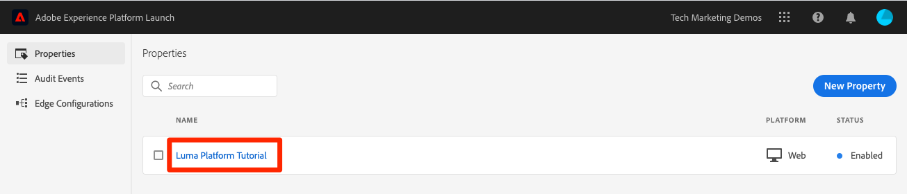

# 스트리밍 데이터 수집

<!--1hr-->

이 단원에서는 Adobe Experience Platform Web SDK를 사용하여 데이터를 스트리밍합니다.

데이터 수집 인터페이스에서 완료해야 하는 두 가지 주요 작업이 있습니다.

* 웹 사이트에서 Adobe Edge 네트워크로 방문자 활동에 대한 데이터를 전송하려면 Luma 웹 사이트에서 Web SDK를 구현해야 합니다. 태그(이전 Launch)를 사용하여 간단한 구현을 수행합니다

* Edge 네트워크에 데이터를 전달할 위치를 알리는 데이터 스트림을 구성해야 합니다. 데이터를 Adobe에 보내도록 구성합니다 `Luma Web Events` 데이터 세트를 사용할 수 있습니다.

**데이터 엔지니어** 는 이 자습서를 벗어나는 스트리밍 데이터를 수집해야 합니다. Adobe Experience Platform의 웹 또는 Mobile SDK를 구현할 때 일반적으로 웹 또는 모바일 개발자는 데이터 레이어 만들기 및 태그 속성 구성에 관련되어 있습니다.

연습을 시작하기 전에 다음 두 개의 짧은 비디오를 시청하여 스트리밍 데이터 섭취 및 웹 SDK에 대해 자세히 알아보십시오.
>[!VIDEO](https://video.tv.adobe.com/v/28425?quality=12&learn=on)

>[!VIDEO](https://video.tv.adobe.com/v/34141?quality=12&learn=on)

>[!NOTE]
>
>이 자습서에서는 Web SDK를 사용하여 웹 사이트에서 수집하는 스트리밍에 중점을 두지만 [Adobe Mobile SDK](https://aep-sdks.gitbook.io/), [Apache Kafka 연결](https://github.com/adobe/experience-platform-streaming-connect), 및 기타 메커니즘.

## 필요한 권한

에서 [권한 구성](configure-permissions.md) 이 단원을 완료하는 데 필요한 모든 액세스 컨트롤을 설정합니다.

<!--
* Permission items **[!UICONTROL Launch]** > **[!UICONTROL Property Rights]** > **[!UICONTROL Approve]**, **[!UICONTROL Develop]**, **[!UICONTROL Manage Environments]**, **[!UICONTROL Manage Extensions]**, and **[!UICONTROL Publish]**
* Permission item **[!UICONTROL Launch]** > **[!UICONTROL Company Rights]** > **[!UICONTROL Manage Properties]**
* User-role access to the `Luma Tutorial Launch` product profile
* Admin-role access to the `Luma Tutorial Launch` product profile
* Permission items **[!UICONTROL Platform]** > **[!UICONTROL Data Ingestion]** > **[!UICONTROL View Sources]** and **[!UICONTROL Manage Sources]**
* Permission items **[!UICONTROL Platform]** > **[!UICONTROL Data Management]** > **[!UICONTROL View Datasets]** and **[!UICONTROL Manage Datasets]**
* Permission items **[!UICONTROL Platform]** > **[!UICONTROL Profiles]** > **[!UICONTROL View Profiles]**, **[!UICONTROL Manage Profiles]** and **[!UICONTROL Export Audience Segment]**
* Permission item **[!UICONTROL Platform]** > **[!UICONTROL Sandbox Administration]** > **[!UICONTROL View Sandboxes]**
* Permission item **[!UICONTROL Platform]** > **[!UICONTROL Sandboxes]** > `Luma Tutorial`
* User-role access to the `Luma Tutorial Platform` product profile
-->

<!--## Create a streaming source

1. Log into the [Experience Platform  user interface](https://experience.adobe.com/platform/)
1. Go to **[!UICONTROL Sources]** in the left navigation
1. Filter the list by selecting **[!UICONTROL Streaming]**
1. In the **[!UICONTROL HTTP API]** section, select the **[!UICONTROL Configure]** button
    
1. On the **[!UICONTROL Authentication]** step, enter `Luma Web Events Source` as the **[!UICONTROL Account name]** and select the **[!UICONTROL Connect to source]** button (we don't need to enable authentication since the data will be originating from website visitors)
    
1. Once connected, select the **[!UICONTROL Next]** button to proceed to the next step in the workflow
1. On the **[!UICONTROL Select data]** step, choose **[!UICONTROL Existing Dataset]**, select your `Luma Web Events Dataset`, and then select the **[!UICONTROL Next]** button
    
1. On the **[!UICONTROL Dataflow detail]** step, select the **[!UICONTROL Next]** button:
    
    <!--What is a good practice for naming the data flow vs the source-->
<!--
1. On the **[!UICONTROL Review]** step, review your source details and select the **[!UICONTROL Finish]** button:
    
-->

## 데이터 스트림 구성

먼저 데이터 스트림을 구성합니다. 데이터 스트림은 Web SDK 호출에서 데이터를 수신한 후 데이터를 보낼 위치를 Adobe Edge 네트워크에 알려줍니다. 예를 들어 데이터를 Experience Platform, Adobe Analytics 또는 Adobe Target으로 보내시겠습니까? 데이터 저장소는 데이터 수집 사용자 인터페이스(이전 Launch)에서 관리되며 웹 SDK를 사용한 데이터 수집에 중요합니다.

을(를) 만들려면 [!UICONTROL 데이터 스트림]:

1. 에 로그인합니다. [Experience Platform 데이터 수집 사용자 인터페이스](https://experience.adobe.com/launch/)

   <!--when will the edge config go live?-->

1. 선택 **[!UICONTROL 데이터 스트림]** 왼쪽 탐색
1. 을(를) 선택합니다 **[!UICONTROL 새 데이터 스트림]** 오른쪽 상단 모서리의 단추

   

1. 대상 **[!UICONTROL 친숙한 이름]**, 입력 `Luma Platform Tutorial` (회사의 여러 사용자가 이 자습서를 사용하고 있는 경우 끝에 이름을 추가합니다.)
1. **[!UICONTROL 저장]** 버튼을 선택합니다

   

다음 화면에서 데이터를 전송할 위치를 지정합니다. 데이터를 Experience Platform에 보내려면

1. 켜기/끄기 **[!UICONTROL Adobe Experience Platform]** 추가 필드 표시
1. 대상 **[!UICONTROL 샌드박스]**, 선택 `Luma Tutorial`
1. 대상 **[!UICONTROL 이벤트 데이터 세트]**, 선택 `Luma Web Events Dataset`
1. 다른 Adobe 응용 프로그램을 사용하는 경우 다른 섹션을 자유롭게 탐색하여 이러한 다른 솔루션의 Edge 구성에서 필요한 정보를 확인할 수 있습니다. Web SDK는 데이터를 Experience Platform으로 스트리밍할 뿐만 아니라 다른 Adobe 애플리케이션에서 사용하는 모든 이전 JavaScript 라이브러리를 대체하기 위해 개발되었습니다. 에지 구성은 데이터를 전송할 각 애플리케이션의 계정 세부 사항을 지정하는 데 사용됩니다.
1. **[!UICONTROL 저장]**을 선택합니다

   

Edge 구성이 저장되면 결과 화면에 개발, 스테이징 및 프로덕션에 대해 만들어진 세 가지 환경이 표시됩니다. 추가 개발 환경을 추가할 수 있습니다.

세 가지 환경 모두 방금 입력한 플랫폼 세부 사항이 포함됩니다. 하지만 이러한 세부 사항은 환경에 따라 다르게 구성할 수 있습니다. 예를 들어 각 환경에서 다른 Platform 샌드박스에 데이터를 보내도록 할 수 있습니다. 이 자습서에서는 데이터 스트림에 대한 추가 사용자 지정을 수행하지 않습니다.

## 웹 SDK 확장 설치

### 속성 추가

먼저 태그 속성(이전의 태그 속성)을 만들어야 합니다. 속성은 웹 페이지에서 세부 정보를 수집하고 다양한 위치로 전송하는 데 필요한 모든 JavaScript, 규칙 및 기타 기능을 위한 컨테이너입니다.

속성을 만들려면:

1. 이동 **[!UICONTROL 속성]** 왼쪽 탐색
1. **[!UICONTROL 새 속성]** 버튼을 선택합니다
   
1. 로서의 **[!UICONTROL 이름]**, 입력 `Luma Platform Tutorial` (회사의 여러 사용자가 이 자습서를 사용하고 있는 경우 끝에 이름을 추가합니다.)
1. 로서의 **[!UICONTROL 도메인]**, 입력 `enablementadobe.com` (나중에 설명)
1. **[!UICONTROL 저장]**을 선택합니다

   

<!--
After saving the property, you might see an error message like the one below. If so, this is because you don't actually have access to the property you just created. To fix this, we need to go to the Admin Console to give yourself access:
    

To give yourself access to the property:

1. In a separate browser tab, log into the [Admin Console](https://adminconsole.adobe.com/)
1. Go to **[!UICONTROL Products]** from the top navigation
1. Select **[!UICONTROL Adobe Experience Platform Launch]** on the left navigation
1. Go to your `Luma Tutorial Launch` product profile
1. Go to the **[!UICONTROL Permissions]** tab
1. On the **[!UICONTROL Properties]** row, select **[!UICONTROL Edit]**
    
1. Select the "+" icon to move your `Luma Platform Tutorial` property to the right-hand side and select the **[!UICONTROL Save]** button to update the permissions
   
    

Now switch back to your browser tab with the Data Collection interface still open. Reload the page and the `Luma Platform Tutorial` property should display in the list. Select to open the property:

-->

## 웹 SDK 확장 추가

이제 속성이 있으므로 확장을 사용하여 웹 SDK를 추가할 수 있습니다. 확장은 데이터 수집 인터페이스 및 기능을 확장하는 코드 패키지입니다. 확장을 추가하려면:

1. 태그 속성을 엽니다
1. 이동 **[!UICONTROL 확장]** 왼쪽 탐색
1. 로 이동합니다. **[!UICONTROL 카탈로그]** 탭
1. 태그에 사용할 수 있는 많은 확장이 있습니다. 용어를 사용하여 카탈로그를 필터링합니다. `Web SDK`
1. 에서 **[!UICONTROL Adobe Experience Platform Web SDK]** 확장을 사용하려면 **[!UICONTROL 설치]** 버튼
   
1. Web SDK 확장에 사용할 수 있는 구성은 몇 가지 있지만 이 자습서에는 두 가지 구성만 구성할 수 있습니다. 업데이트 **[!UICONTROL Edge 도메인]** to `data.enablementadobe.com`. 이 설정을 사용하면 웹 SDK 구현을 통해 자사 쿠키를 설정할 수 있으므로 권장됩니다. 이 단원의 뒷부분에서 웹 사이트를 `enablementadobe.com` 도메인 을 태그 속성에 추가합니다. 에 대한 CNAME `enablementadobe.com` 도메인이 이미 `data.enablementadobe.com` 은 Adobe 서버에 전달됩니다. 자체 웹 사이트에서 Web SDK를 구현하는 경우, 예를 들어, 고유한 데이터 수집 목적을 위해 CNAME을 만들어야 합니다. `data.YOUR_DOMAIN.com`
1. 에서 **[!UICONTROL 데이터 스트림]** 드롭다운에서 을(를) 선택합니다. `Luma Platform Tutorial` 데이터 스트림.
1. 다른 구성 옵션을 자유롭게 볼 수 있습니다(하지만 변경하지 마십시오!). 그런 다음 **[!UICONTROL 저장]**
   <!--is edge domain required for first party? when will it break?-->
   <!--any other fields that should be highlighted-->
   

## 데이터를 보내는 규칙 만들기

이제 Platform으로 데이터를 전송하는 규칙을 만들겠습니다. 규칙은 태그에 작업을 지시하는 이벤트, 조건 및 작업의 조합입니다. 규칙을 만들려면:

1. 이동 **[!UICONTROL 규칙]** 왼쪽 탐색
1. 을(를) 선택합니다 **[!UICONTROL 새 규칙 만들기]** 버튼
   
1. 규칙 이름을 지정합니다 `All Pages - Library Loaded`
1. 아래 **[!UICONTROL 이벤트]**&#x200B;에서 을(를) 선택합니다. **[!UICONTROL 추가]** 버튼
   
1. 를 사용하십시오 **[!UICONTROL 코어]** **[!UICONTROL 확장]** 을(를) 선택합니다. **[!UICONTROL 라이브러리가 로드됨(페이지 상단)]** 로서의 **[!UICONTROL 이벤트 유형]**. 이 설정은 Launch 라이브러리가 페이지에 로드될 때마다 규칙이 실행됨을 의미합니다.
1. 선택 **[!UICONTROL 변경 내용 유지]** 기본 규칙 화면으로 돌아갑니다.
   
1. Leave **[!UICONTROL 조건]** 비어 있습니다. 지정한 이름에 따라 이 규칙이 모든 페이지에서 실행되도록 합니다
1. 아래 **[!UICONTROL 작업]**&#x200B;에서 을(를) 선택합니다. **[!UICONTROL 추가]** 버튼
1. 를 사용하십시오 **[!UICONTROL Adobe Experience Platform Web SDK]** **[!UICONTROL 확장]** 을(를) 선택합니다. **[!UICONTROL 이벤트 보내기]** 로서의 **[!UICONTROL 작업 유형]**
1. 오른쪽에서 을 선택합니다 **[!UICONTROL web.webpagedetails.pageViews]** 에서 **[!UICONTROL 유형]** 드롭다운. XDM 필드 중 하나입니다 `Luma Web Events Schema`
1. 선택 **[!UICONTROL 변경 내용 유지]** 기본 규칙 화면으로 돌아갑니다.
   
1. 선택 **[!UICONTROL 저장]** 규칙을 저장하려면\
   

## 라이브러리에 규칙 게시

다음으로, 규칙이 작동하는지 확인할 수 있도록 개발 환경에 규칙을 게시합니다.

<!--
There are a few quick steps we must take in the **[!UICONTROL Publishing]** section of Launch.

### Create a host

Launch libraries can be hosted on Adobe's Content Delivery Network (CDN) or on your own servers. In this tutorial, we will use Adobe's CDN since it is faster to set up:

1. Go to **[!UICONTROL Hosts]** in the left navigation
1. Select the **[!UICONTROL Create New Host]** button
       
1. For the **[!UICONTROL Name]**, enter `Adobe CDN`
1. For the **[!UICONTROL Type]**, select **[!UICONTROL Managed by Adobe]**
1. Select the **[!UICONTROL Save]** button to complete the setup of the host
       

### Create an environment

Environments allow you to have different versions of a library in different publishing environments to accommodate your publishing workflow. For example, the fully tested version of your library can be published to a Production environment, while new changes are being created in a Development environment. You can also use different hosts for each environment. To create an environment:

1. Go to **[!UICONTROL Environments]** in the left navigation
1. Select the **[!UICONTROL Create New Environment]** button
     
1. Under **[!UICONTROL Development]** select **[!UICONTROL Select]**   
     
1. For the **[!UICONTROL Name]**, enter `Development`
1. For the **[!UICONTROL Select Host]** dropdown, select `Adobe CDN`
1. Select the **[!UICONTROL Save]** button to complete the setup of the environment
    
1. You will see a modal with URL and other implementation details of this library. These are critical for a real Launch implementation, but we don't need to worry about them for this tutorial. Select the **[!UICONTROL Close]** button to exit the modal.

### Create and publish the library

Now let's bundle the contents of our property&mdash;currently an extension and a rule&mdash;into a library. 
-->

라이브러리를 만들려면:

1. 이동 **[!UICONTROL 게시 흐름]** 왼쪽 탐색
1. 선택 **[!UICONTROL 라이브러리 추가]**
   
1. 대상 **[!UICONTROL 이름]**, 입력 `Luma Platform Tutorial`
1. 대상 **[!UICONTROL 환경]**, 선택 `Development`
1. 을(를) 선택합니다 **[!UICONTROL 변경된 모든 리소스 추가]** 버튼을 클릭합니다. (추가 정보 [!UICONTROL Adobe Experience Platform Web SDK] 확장 및 `All Pages - Library Loaded` 규칙, [!UICONTROL 코어] 모든 Launch 웹 속성에 필요한 기본 JavaScript를 포함하는 확장이 추가되었습니다.
1. 을(를) 선택합니다 **[!UICONTROL 개발을 위한 저장 및 구축]** 버튼
   

라이브러리를 빌드하는 데 몇 분이 걸릴 수 있고 라이브러리가 완료되면 라이브러리 이름 왼쪽에 녹색 점이 표시됩니다.

보시다시피 [!UICONTROL 게시 흐름] 여기서는 이 자습서의 범위를 벗어난 게시 프로세스에 더 많은 작업이 있습니다. 개발 환경에서 단일 라이브러리를 사용할 것입니다.

## 요청에서 데이터의 유효성 검사

### Adobe Experience Platform Debugger 추가

Experience Platform 디버거는 웹 페이지에서 구현된 Adobe 기술을 보는 데 도움이 되는 Chrome 및 Firefox 브라우저에서 사용할 수 있는 확장입니다. 기본 브라우저의 버전을 다운로드합니다.

* [Firefox 확장](https://addons.mozilla.org/ko-KR/firefox/addon/adobe-experience-platform-dbg/)
* [Chrome 확장 프로그램](https://chrome.google.com/webstore/detail/adobe-experience-platform/bfnnokhpnncpkdmbokanobigaccjkpob)

이전에 디버거를 사용한 적이 없고 기존 Adobe Experience Cloud Debugger와 다른 경우 이 5분 개요 비디오를 볼 수 있습니다.

>[!VIDEO](https://video.tv.adobe.com/v/32156?quality=12&learn=on)

### Luma 웹 사이트 를 엽니다.

이 자습서에서는 Luma 데모 웹 사이트의 공개 호스팅 버전을 사용합니다. 열어 책갈피로 지정합니다.

1. 새 브라우저 탭에서 을(를) 엽니다. [Luma 웹 사이트](https://luma.enablementadobe.com/content/luma/us/en.html).
1. 자습서의 나머지 부분에서 사용할 페이지를 책갈피로 지정합니다

이 호스팅된 웹 사이트가 `enablementadobe.com` 에서 [!UICONTROL 도메인] 초기 태그 속성 구성 및 사용 이유 필드 `data.enablementadobe.com` 에서 자사 도메인으로 사용 [!UICONTROL Adobe Experience Platform Web SDK] 확장. 계획이 있어!

### Experience Platform 디버거를 사용하여 태그 속성에 매핑

Experience Platform 디버거에는 기존 태그 속성을 다른 태그 속성으로 바꿀 수 있는 멋진 기능이 있습니다. 이 메서드는 유효성 검사에 유용하며 이 자습서에서 여러 구현 단계를 건너뛸 수 있도록 해줍니다.

1. Luma 사이트가 열려 있는지 확인하고 Debugger 확장 프로그램 아이콘을 선택합니다.
1. 디버거가 열리고 이 자습서와 관련이 없는 하드코딩된 구현의 세부 정보가 표시됩니다(디버거를 연 후 Luma 사이트를 다시 로드해야 할 수 있음)
1. 디버거가 &quot; 인지 확인합니다.**[!UICONTROL Luma에 연결됨]**&quot; 아래 그림과 같이 &quot;**[!UICONTROL 잠금]**&quot; 아이콘을 사용하여 디버거를 Luma 사이트에 잠급니다.
1. 을(를) 선택합니다 **[!UICONTROL 로그인]** 인증할 오른쪽 상단의 단추.
1. 이제 로 이동합니다. **[!UICONTROL Launch]** 왼쪽 탐색
1. 구성 탭을 선택합니다
1. 오른쪽에 가 표시됩니다. **[!UICONTROL 페이지 포함 코드]**&#x200B;를 열고 **[!UICONTROL 작업]** 드롭다운을 선택하고 **[!UICONTROL 바꾸기]**

   
1. 인증되므로 디버거가 사용 가능한 Launch 속성 및 환경을 가져옵니다. 을(를) 선택합니다 `Luma Platform Tutorial` 속성
1. 을(를) 선택합니다 `Development` 환경
1. 을(를) 선택합니다 **[!UICONTROL 적용]** 버튼
   
1. 이제 Luma 웹 사이트가 다시 로드됩니다. _태그 속성을 사용하여_. 도와줘! 해킹 당했어! 농담이지
   
1. 이동 **[!UICONTROL 요약]** 왼쪽 탐색에서 를 클릭하여 [!UICONTROL Launch] 속성
   
1. 이제 로 이동합니다. **[!UICONTROL AEP 웹 SDK]** 왼쪽 탐색에서 를 클릭하여 **[!UICONTROL 네트워크 요청]**
1. 를 엽니다. **[!UICONTROL events]** row

   
1. 표시되는 방법을 확인합니다. `web.webpagedetails.pageView` 지정한 이벤트 유형 [!UICONTROL 이벤트 보내기] 작업 및 기타 기본 변수를 `AEP Web SDK ExperienceEvent Mixin` 포맷
   
1. 이러한 유형의 요청 세부 사항은 브라우저의 웹 개발자 도구에서도 볼 수 있습니다 **네트워크** 탭. 페이지를 열고 페이지를 다시 로드합니다. 을 사용하여 호출 필터링 `interact` 호출을 찾으려면 호출을 선택한 다음 **머리글** 탭, **요청 페이로드** 영역.
   
1. 로 이동합니다. **응답** 탭에서 ECID 값이 응답에 포함되는 방법을 확인합니다. 다음 연습에서 프로필 정보의 유효성을 검사하는 데 사용할 것처럼 이 값을 복사합니다.
   

## Experience Platform의 데이터 유효성 검사

에 도착하는 데이터 배치를 확인하여 데이터가 플랫폼에 랜딩되는지 확인할 수 있습니다 `Luma Web Events Dataset`. (스트리밍 데이터 수집이라고 하지만 지금은 일괄 처리로 도착하고 있습니다.) 이 변수는 Profile에 실시간으로 스트리밍되므로 실시간 세그먼테이션 및 활성화에 사용할 수 있지만 15분마다 데이터 레이크로 일괄적으로 전송됩니다.)

데이터의 유효성을 검사하려면:

1. Platform 사용자 인터페이스에서 로 이동합니다. **[!UICONTROL 데이터 세트]** 왼쪽 탐색
1. 를 엽니다. `Luma Web Events Dataset` 그리고 일괄 처리가 도착했는지 확인합니다. 15분마다 전송되므로 일괄 처리가 표시될 때까지 기다려야 할 수 있습니다.
1. 을(를) 선택합니다 **[!UICONTROL 데이터 세트 미리 보기]** 버튼
   
1. 미리 보기 모달에서 왼쪽에 있는 스키마의 다른 필드를 선택하여 해당 특정 데이터 포인트를 미리 보는 방법을 확인합니다.
   

새 프로필이 표시되는지 확인할 수도 있습니다.

1. Platform 사용자 인터페이스에서 로 이동합니다. **[!UICONTROL 프로필]** 왼쪽 탐색
1. 을(를) 선택합니다 **[!UICONTROL ECID]** 네임스페이스를 사용하여 ECID 값을 검색합니다(응답에서 복사합니다. 프로필에는 ECID와 별도의 자체 ID가 있습니다.
1. 을(를) 선택합니다 **[!UICONTROL 프로필 ID]** 프로파일을 열려면
   
1. 을(를) 선택합니다 **[!UICONTROL 이벤트]** 탭을 클릭하여 본 페이지를 확인합니다.
   
   <!---->

## 이벤트에 사용자 지정 데이터 추가

### 페이지 이름에 대한 데이터 요소 만들기

1. 데이터 수집 태그 인터페이스의 오른쪽 상단 모서리에서 `Luma Platform Tutorial` 속성을 열고 **[!UICONTROL 작업 라이브러리 선택]** 드롭다운을 선택하고 을(를) 선택합니다. `Luma Platform Tutorial` 라이브러리. 이 설정을 사용하면 라이브러리에 추가 업데이트를 쉽게 게시할 수 있습니다.
1. 이제 로 이동합니다. **[!UICONTROL 데이터 요소]** 왼쪽 탐색
1. 을(를) 선택합니다 **[!UICONTROL 새 데이터 요소 만들기]** 버튼

   
1. 로서의 **[!UICONTROL 이름]**, 입력 `Page Name`
1. 로서의 **[!UICONTROL 데이터 요소 유형]**, 선택 `JavaScript Variable`
1. 로서의 **[!UICONTROL JavaScript 변수 이름]**, 입력 `digitalData.page.pageInfo.pageName`
1. 값의 형식을 표준화하려면 **[!UICONTROL 소문자 강제 적용 값]** 및 **[!UICONTROL 텍스트 정리]**
1. 확인 `Luma Platform Tutorial` 작업 라이브러리로 선택됨
1. 선택 **[!UICONTROL 라이브러리에 저장]**
   

### 페이지 이름을 XDM 개체 데이터 요소에 매핑합니다

이제 페이지 이름을 웹 SDK에 매핑합니다.

>[!IMPORTANT]
>
>이 작업을 완료하려면 사용자가 먼저 Prod Sandbox에 액세스할 수 있는지 확인해야 합니다. 다른 제품 프로필에서 Prod 샌드박스에 액세스할 수 없는 경우 빠르게 `Luma Tutorial Platform` 프로필 및 권한 항목 추가 **[!UICONTROL 샌드박스]** > **[!UICONTROL Prod]**. 그런 다음 데이터 요소 페이지에서 SHIFT-Reload를 수행하여 캐시를 지웁니다
>

설정 **[!UICONTROL 데이터 요소]** 페이지:

1. 새 데이터 요소 만들기
1. 로서의 **[!UICONTROL 이름]**, 입력 `XDM Object`
1. 로서의 **[!UICONTROL 확장]**, 선택 `Adobe Experience Platform Web SDK`
1. 로서의 **[!UICONTROL 데이터 요소 유형]**, 선택 `XDM object`
1. 로서의 **[!UICONTROL 샌드박스]**, 을(를) 선택합니다. `Luma Tutorial` 샌드박스
1. 로서의 **[!UICONTROL 스키마]**, 을(를) 선택합니다. `Luma Web Events Schema`
1. 을(를) 선택합니다 `web.webPageDetails.name` 필드
1. 로서의 **[!UICONTROL 값]**&#x200B;아이콘을 선택하여 데이터 요소 선택 모달을 열고 를 선택합니다. `Page Name` 데이터 요소
1. 선택 **[!UICONTROL 라이브러리에 저장]**

   

이와 동일한 프로세스를 사용하여 웹 사이트의 추가 사용자 지정 데이터를 XDM 필드에 매핑합니다.

### 이벤트 보내기 작업에 XDM 데이터 추가

이제 XDM 필드에 데이터가 매핑되었으므로 이벤트 보내기 작업에 이 데이터를 포함할 수 있습니다.

1. 로 이동합니다. **[!UICONTROL 규칙]** screen
1. 다음 문서를 엽니다. `All Pages - Library Loaded` 규칙
1. 를 엽니다. `Adobe Experience Platform Web SDK - Send Event` 작업
1. 로서의 **[!UICONTROL XDM 데이터]**&#x200B;아이콘을 선택하여 데이터 요소 선택 모달을 열고 를 선택합니다. `XDM Object` 데이터 요소
1. 을(를) 선택합니다 **[!UICONTROL 변경 내용 유지]** 버튼
   
1. 이제, 당신이 `Luma Platform Tutorial` 최근 몇 가지 연습에서 작업 라이브러리로 선택한 최근 변경 사항이 라이브러리에 직접 저장되었습니다. 게시 흐름 화면을 통해 변경 사항을 게시하지 않고 파란색 단추에서 드롭다운을 열고 을 선택할 수 있습니다 **[!UICONTROL 라이브러리 및 빌드에 저장]**
   

이렇게 하면 방금 수행한 세 가지 변경 사항으로 새 태그 라이브러리를 빌드하기 시작합니다.

### XDM 데이터 유효성 검사

이전에 학습한 대로 디버거를 사용하여 태그 속성에 매핑되는 동안 이제 Luma 홈 페이지를 다시 로드할 수 있으며 페이지 이름 필드가 요청에서 채워지는지 확인해야 합니다.

데이터 세트 및 프로필을 미리 보고 Platform에서 페이지 이름 데이터가 수신되었는지 확인할 수도 있습니다.

## 추가 ID 보내기

이제 웹 SDK 구현에서 Experience Cloud ID(ECID)가 있는 이벤트를 기본 식별자로 보냅니다. ECID는 웹 SDK에 의해 자동으로 생성되며 장치 및 브라우저별로 고유합니다. 단일 고객은 사용 중인 장치 및 브라우저에 따라 여러 ECID를 가질 수 있습니다. 그러면 이 고객에 대한 통합 보기를 가져오고 해당 온라인 활동을 CRM, 충성도 및 오프라인 구매 데이터에 어떻게 연결할 수 있습니까? 이렇게 하려면 세션 중에 추가 ID를 수집하고 ID 결합을 통해 프로필을 결정적으로 연결합니다.

기억하시다면, 저는 우리가 [ID 매핑](map-identities.md) 단원. 따라서 웹 SDK로 CRM ID를 수집하겠습니다.

### CRM ID에 대한 데이터 요소 추가

먼저 데이터 요소에 CRM ID를 저장합니다.

1. 태그 인터페이스에서 라는 데이터 요소를 추가합니다. `CRM Id`
1. 로서의 **[!UICONTROL 데이터 요소 유형]**, 선택 **[!UICONTROL JavaScript 변수]**
1. 로서의 **[!UICONTROL JavaScript 변수 이름]**, 입력 `digitalData.user.0.profile.0.attributes.username`
1. 을(를) 선택합니다 **[!UICONTROL 라이브러리에 저장]** 버튼(`Luma Platform Tutorial` 는 여전히 작업 라이브러리여야 함)
   

### CRM ID를 ID 맵 데이터 요소에 추가합니다

이제 CRM Id 값을 캡처했으므로, 이 값을 라는 특수 데이터 요소 유형과 연결해야 합니다 [!UICONTROL ID 맵] 데이터 요소:

1. 이름이 인 데이터 요소 추가 `Identities`
1. 로서의 **[!UICONTROL 확장]**, 선택 **[!UICONTROL Adobe Experience Platform Web SDK]**
1. 로서의 **[!UICONTROL 데이터 요소 유형]**, 선택 **[!UICONTROL ID 맵]**
1. 로서의 **[!UICONTROL 네임스페이스]**, 입력 `Luma CRM Id`: [!UICONTROL namespace] 우리는 이전 단원에서 만들었습니다

   >[!WARNING]
   >
   >Adobe Experience Platform Web SDK 확장 버전 2.2를 사용하면 Platform 계정의 실제 값을 사용하여 미리 채워진 드롭다운에서 네임스페이스 를 선택할 수 있습니다. 안타깝게도 이 기능은 아직 &quot;샌드박스 인식&quot;이 아니므로 `Luma CRM Id` 드롭다운에 값이 표시되지 않을 수 있습니다. 이 경우 이 연습을 완료하지 못할 수 있습니다. 확인되면 해결 방법을 게시합니다.

1. 로서의 **[!UICONTROL ID]**&#x200B;아이콘을 선택하여 데이터 요소 선택 모달을 열고 를 선택합니다. `CRM Id` 데이터 요소
1. 로서의 **[!UICONTROL 인증 상태]**, 선택 **[!UICONTROL 인증됨]**
1. Leave **[!UICONTROL 기본]** _선택 안 함_. Luma 웹 사이트의 대부분의 방문자에 대해 CRM ID가 없으므로 반드시 _ECID를 기본 식별자로 재정의하지 않음_. ECID 이외의 항목을 기본 식별자로 사용하는 경우는 거의 없습니다. 일반적으로 이러한 지침에 기본 설정을 언급하지는 않지만, 나중에 자체 구현에서 두통을 방지하는 데 도움이 되도록 이 설정을 호출됩니다.
1. 을(를) 선택합니다 **[!UICONTROL 라이브러리에 저장]** 버튼(`Luma Platform Tutorial` 는 여전히 작업 라이브러리여야 함)
   

>[!NOTE]
>
>를 사용하여 여러 식별자를 전달할 수 있습니다 [!UICONTROL ID 맵] 데이터 유형.

### ID 맵 데이터 요소를 XDM 개체에 추가합니다

업데이트해야 하는 데이터 요소 즉, XDM 개체 데이터 요소가 한 개 더 있습니다. 이 하나의 ID를 전달하기 위해 세 개의 개별 데이터 요소를 업데이트해야 하는 것이 이상하게 보일 수 있지만 이 프로세스는 여러 ID에 대해 크기가 조정되도록 설계되었습니다. 걱정 마, 이 수업 다 끝냈어!

1. XDM Object 데이터 요소를 엽니다.
1. IdentityMap XDM 필드를 엽니다
1. 로서의 **[!UICONTROL 데이터 요소]**&#x200B;아이콘을 선택하여 데이터 요소 선택 모달을 열고 를 선택합니다. `Identities` 데이터 요소
1. 이제, 당신이 `Luma Platform Tutorial` 최근 몇 가지 연습에서 작업 라이브러리로 선택한 최근 변경 사항이 라이브러리에 직접 저장되었습니다. 게시 흐름 화면을 통해 변경 사항을 게시하지 않고 파란색 단추에서 드롭다운을 열고 을 선택할 수 있습니다 **[!UICONTROL 라이브러리 및 빌드에 저장]**
   

### ID의 유효성 검사

이제 웹 SDK에서 CRM ID를 전송하고 있는지 확인하려면:

1. 를 엽니다. [Luma 웹 사이트](https://luma.enablementadobe.com/content/luma/us/en.html)
1. 이전 지침에 따라 디버거를 사용하여 태그 속성에 매핑합니다
1. 을(를) 선택합니다 **로그인** Luma 웹 사이트의 오른쪽 위에 있는 링크
1. 자격 증명을 사용하여 로그인 `test@adobe.com`/`test`
1. 인증되면 디버거에서 Experience Platform 웹 SDK 호출을 검사하십시오(**[!UICONTROL Adobe Experience Platform Web SDK]** > **[!UICONTROL 네트워크 요청]** > **[!UICONTROL events]** 최신 요청))에 대해 알고 있어야 합니다. `lumaCrmId`:
   
1. ECID 네임스페이스와 값을 사용하여 사용자 프로필을 다시 조회합니다. 프로필에 CRM ID, 충성도 ID 및 이름 및 전화 번호와 같은 프로필 세부 사항이 표시됩니다. 모든 ID와 데이터가 하나의 실시간 고객 프로필로 결합되었습니다!
   

## 추가 리소스

* [Web SDK를 사용하여 Adobe Experience Cloud 구현](/help/tutorial-web-sdk/overview.md)
* [스트리밍 수집 설명서](https://experienceleague.adobe.com/docs/experience-platform/ingestion/streaming/overview.html?lang=ko)
* [스트리밍 수집 API 참조](https://www.adobe.io/experience-platform-apis/references/data-ingestion/#tag/Streaming-Ingestion)

잘했어요! 웹 SDK 및 Launch에 대한 많은 정보입니다. 전반적인 구현에 더 많은 작업이 포함되어 있지만 이를 통해 Platform을 시작하고 결과를 확인할 수 있습니다.

>[!NOTE]
>
>이제 스트리밍 수집 단원을 완료했으므로 [!UICONTROL Prod] 샌드박스 `Luma Tutorial Platform` 제품 프로필

데이터 엔지니어(원하는 경우) [쿼리 단원 실행](run-queries.md).

데이터 설계자 로 이동하여 [정책 병합](create-merge-policies.md)!
