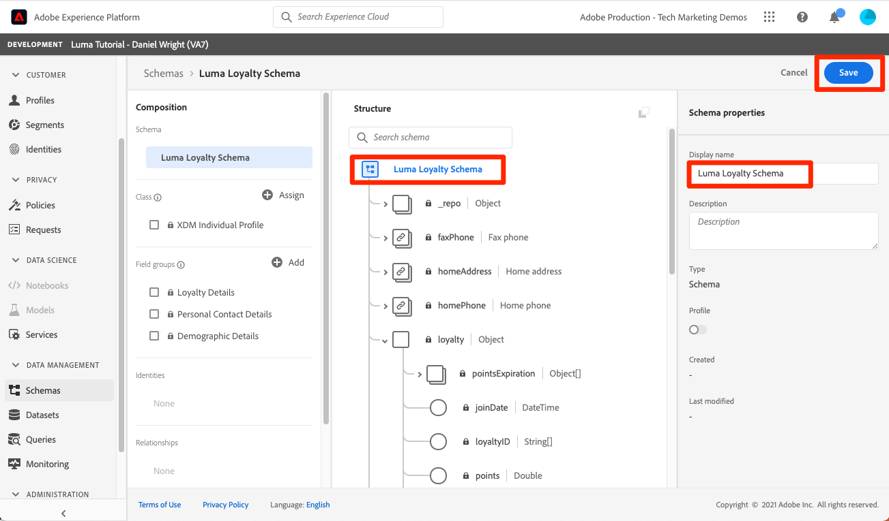

# 스키마의 모델 데이터

<!-- 60min -->
이 단원에서는 Luma의 데이터를 스키마로 모델링합니다. 이것은 자습서에서 가장 긴 수업 중 하나이므로, 물 한 잔을 마시고 버클을 착용하세요!

표준화와 상호 운용성은 Adobe Experience Platform의 핵심 개념입니다. XDM(경험 데이터 모델)은 고객 경험 데이터를 표준화하고 고객 경험 관리를 위한 스키마를 정의하는 작업입니다.

XDM은 디지털 경험의 성능을 개선하기 위해 설계된 공개적으로 문서화된 사양입니다. 플랫폼 서비스와 통신하는 데 사용할 모든 애플리케이션에 대한 일반적인 구조와 정의를 제공합니다. XDM 표준을 준수함으로써 모든 고객 경험 데이터를 일반적인 표현에 통합하여 보다 빠르고 통합적인 방식으로 통찰력을 제공할 수 있습니다. 고객 작업에서 중요한 통찰력을 얻고, 세그먼트를 통해 고객 대상을 정의하고, 개인화 목적으로 고객 속성을 표현할 수 있습니다.

XDM은 Experience Platform을 기반으로 한 Adobe Experience Cloud이 적절한 사람에게 적절한 채널에서 정확한 순간에 올바른 메시지를 전달할 수 있는 기본 프레임워크입니다. Experience Platform이 구축된 방식 **XDM 시스템**&#x200B;는 Platform 서비스에서 사용할 Experience 데이터 모델 스키마를 운영합니다.

<!--
This seems too lengthy. The video should suffice

Key terms:

* **Schema**: a representation of your data. A schema is comprised of a class and optional field groups and is used to create datasets. A schema includes behavioral attributes, timestamp, identity, attribute definitions, and relationships.
* **XDM Profile Class**: a common schema class used to represent record data
* **XDM ExperienceEvent Class**: a common schema class used to represent time-series data
* **Field group**: allows users to extend reusable fields that contain variables defining one or more attribute intended to be included in a schema or added to a class.
* **Standard Field group**: an open-source Field group built to conform to common industry standards, used to accelerate implementation and support repeatable services operating on the data
* **Data type**: a reusable object with properties in a hierarchical representation. These can be standard types or custom-defined defined types to describe your own data in your own way (for example, a collection of fields that you use to describe your products). Unlike Field groups, data types can be used in schemas regardless of the class.
* **Field**: a field is the lowest level element of a schema. Each field has a name for referencing and a type to identify the type of data that it contains. Field types can include, integer, number, string, Boolean and schema.
-->

**데이터 설계자** 이 자습서 외부에 스키마를 만들어야 하지만 **데이터 엔지니어** 는 데이터 설계자가 생성한 스키마와 밀접하게 작동합니다.

연습을 시작하기 전에 이 짧은 비디오를 통해 스키마 및 XDM(Experience Data Model)에 대해 자세히 알아보십시오.
>[!VIDEO](https://video.tv.adobe.com/v/27105?quality=12&learn=on)

>[!TIP]
>
> Experience Platform의 데이터 모델링에 대해 자세히 알아보려면 과정을 수강하는 것이 좋습니다 [XDM으로 고객 경험 데이터 모델링](https://experienceleague.adobe.com/?recommended=ExperiencePlatform-D-1-2021.1.xdm), Experience League 시 무료로 사용 가능!

## 권한 필요

다음에서 [권한 구성](configure-permissions.md) 단원, 이 단원을 완료하는 데 필요한 모든 액세스 제어를 설정합니다.

<!--, specifically:

* Permission items **[!UICONTROL Data Modeling]** > **[!UICONTROL View Schemas]** and **[!UICONTROL Manage Schemas]**
* Permission item **[!UICONTROL Sandboxes]** > `Luma Tutorial`
* User-role access to the `Luma Tutorial Platform` product profile
* Developer-role access to the `Luma Tutorial Platform` product profile (for API)-->


<!--
## Luma's goals
-->

## UI를 통해 충성도 스키마 만들기

이 연습에서는 Luma의 충성도 데이터에 대한 스키마를 만듭니다.

1. Platform 사용자 인터페이스로 이동하여 샌드박스가 선택되었는지 확인합니다.
1. 다음으로 이동 **[!UICONTROL 스키마]** 왼쪽 탐색
1. 오른쪽 위의 **[!UICONTROL 스키마 만들기]** 버튼을 선택합니다
1. 드롭다운 메뉴에서 을(를) 선택합니다 **[!UICONTROL XDM 개별 프로필]**, 개별 고객의 특성(점수, 상태 등)을 모델링할 예정이므로
   

### 표준 필드 그룹 추가

다음으로 스키마에 필드 그룹을 추가하라는 메시지가 표시됩니다. 그룹을 사용하여 스키마에 모든 필드를 추가해야 합니다. Adobe에서 제공하는 다양한 업계 표준 필드 그룹 세트에서 선택하거나 직접 생성할 수 있습니다. Experience Platform에서 고유한 데이터를 모델링하기 시작할 때 Adobe에서 제공하는 업계 표준 필드 그룹에 익숙해지는 것이 좋습니다. 가능하면 고객 AI, Attribution AI 및 Adobe Analytics과 같은 다운스트림 서비스를 지원하기 위해 이를 사용하는 것이 좋습니다.

자체 데이터로 작업할 때 큰 단계는 플랫폼에서 캡처해야 하는 자체 데이터와 모델링 방법을 결정하는 것입니다. 이 큰 주제는 강좌에서 더 깊이 있게 논의된다 [XDM으로 고객 경험 데이터 모델링](https://experienceleague.adobe.com/?recommended=ExperiencePlatform-D-1-2021.1.xdm). 이 자습서에서는 미리 결정된 몇 가지 스키마의 구현을 안내해 드리겠습니다.

필드 그룹을 추가하려면:

1. 다음에서 **[!UICONTROL 필드 그룹 추가]** 모달에서 다음 필드 그룹을 선택합니다.
   1. **[!UICONTROL 인구 통계 세부 정보]** 이름 및 생년월일과 같은 기본 고객 데이터
   1. 이메일 주소와 전화번호 등 기본 연락처 정보를 위한 **[!UICONTROL 개인 연락처 세부 정보]**
1. 행의 오른쪽에 있는 아이콘을 선택하여 필드 그룹에 기여한 필드를 미리 볼 수 있습니다.
   

1. 다음 확인: **[!UICONTROL 업계]** > **[!UICONTROL 소매]** 업계별 필드 그룹을 표시하는 상자입니다.
1. 선택 **[!UICONTROL 충성도]** 충성도 프로그램 필드를 추가합니다.
1. **[!UICONTROL 필드 그룹 추가]**를 선택하여 세 필드 그룹을 모두 스키마에 추가합니다.
   


이제 스키마의 현재 상태를 탐색하는 데 약간의 시간이 소요됩니다. 필드 그룹에는 사용자, 연락처 세부 정보 및 고객 충성도 프로그램 상태와 관련된 표준 필드가 추가되었습니다. 이러한 두 필드 그룹은 회사 데이터에 대한 스키마를 만들 때 유용할 수 있습니다. 특정 필드 그룹 행을 선택하거나 필드 그룹 이름 옆에 있는 상자를 선택하여 시각화가 변경되는 방식을 확인합니다.

스키마를 저장하려면:

1. 스키마의 최상위 노드를 선택합니다.
1. 입력 `Luma Loyalty Schema` (으)로 **[!UICONTROL 표시 이름]**.
1. **[!UICONTROL 저장]**을 선택합니다.
   

>[!NOTE]
>
>필드 그룹이 수집하지 않는 데이터 포인트에 대한 필드를 추가해도 됩니다. 예를 들어 &quot;faxPhone&quot;은 Luma가 데이터를 수집하지 않는 필드일 수 있습니다. 괜찮아. 스키마에 필드가 정의되었다고 해서 그에 대한 데이터가 되는 것은 아닙니다 *필수* 나중에 수집하십시오.

### 사용자 정의 필드 그룹 추가

이제 사용자 정의 필드 그룹을 만들어 보겠습니다.

반면 충성도 필드 그룹에는 `loyaltyID` 필드, Luma는 스키마 간의 일관성을 보장하기 위해 단일 그룹에서 모든 시스템 식별자를 관리하려고 합니다.

스키마 워크플로우에서 필드 그룹을 만들어야 합니다. 필드 그룹을 만들려면 다음 작업을 수행하십시오.

1. 선택 **[!UICONTROL 추가]** 다음 아래에 **[!UICONTROL 스키마 필드 그룹]** 제목
   
1. **[!UICONTROL 새 필드 그룹 만들기]**&#x200B;를 선택합니다
1. 사용 `Luma Identity profile field group` (으)로 **[!UICONTROL 표시 이름]**
1. 사용 `system identifiers for XDM Individual Profile class` (으)로 **[!UICONTROL 설명]**
1. **[!UICONTROL 필드 그룹 추가]**를 선택합니다
   

비어 있는 새 필드 그룹이 스키마에 추가됩니다. 다음 **[!UICONTROL +]** 단추를 사용하여 계층 구조의 모든 위치에 새 필드를 추가할 수 있습니다. 여기서는 루트 수준에 필드를 추가하겠습니다.

1. 스키마 이름 옆의 **[!UICONTROL +]** 버튼을 선택합니다. 이렇게 하면 테넌트 ID 네임스페이스 아래에 새 필드가 추가되어 사용자 정의 필드와 표준 필드 간의 충돌을 관리할 수 있습니다.
1. 다음에서 **[!UICONTROL 필드 속성]** 사이드바 새 필드 세부 사항 추가:
   1. **[!UICONTROL 필드 이름]**: `systemIdentifier`
   1. **[!UICONTROL 표시 이름]**: `System Identifier`
   1. **[!UICONTROL 유형]**: **[!UICONTROL 오브젝트]**
   1. **[!UICONTROL 적용]**&#x200B;을 선택합니다

   

이제 아래에 두 개의 필드를 추가합니다. `systemIdentifier` 개체:

1. 첫 번째 필드
   1. **[!UICONTROL 필드 이름]**: `loyaltyId`
   1. **[!UICONTROL 표시 이름:]** `Loyalty Id`
   1. **[!UICONTROL 유형]**: **[!UICONTROL 문자열]**
1. 두 번째 필드
   1. **[!UICONTROL 필드 이름]**: `crmId`
   1. **[!UICONTROL 표시 이름]**: `CRM Id`
   1. **[!UICONTROL 유형]**: **[!UICONTROL 문자열]**

새 필드 그룹은 다음과 같아야 합니다. 다음 항목 선택 **[!UICONTROL 저장]** 단추를 클릭하여 스키마를 저장하지만 다음 연습을 위해 스키마를 열어 둡니다.


## 데이터 유형 만들기

새 필드 그룹 `Luma Identity profile field group`를 다른 스키마에서 재사용할 수 있으므로 여러 시스템에 표준 데이터 정의를 적용할 수 있습니다. 그러나 재사용만 가능합니다 _클래스를 공유하는 스키마에서_, 이 경우 XDM 개별 프로필 클래스.

데이터 유형은 스키마에서 재사용할 수 있는 또 다른 다중 필드 구성입니다 _여러 클래스에서_. 새로운 기능을 전환해 보겠습니다. `systemIdentifier` 개체를 데이터 형식으로 변환:

포함 `Luma Loyalty Schema` 계속 열려 있는 상태에서 `systemIdentifier` 오브젝트 및 선택  **[!UICONTROL 새 데이터 유형으로 전환]**


다음을 수행하는 경우 **[!UICONTROL 취소]** 스키마에서 다음 위치로 이동 **[!UICONTROL 데이터 유형]** 탭에는 새로 만든 데이터 유형이 표시됩니다. 이 데이터 유형은 단원의 뒷부분에서 사용합니다.


## API를 통해 CRM 스키마 만들기

이제 API를 사용하여 스키마를 만듭니다.

>[!TIP]
>
> API 연습을 건너뛰려면 사용자 인터페이스 메소드를 사용하여 다음 스키마를 생성할 수 있습니다.
>
> 1. 사용 [!UICONTROL XDM 개별 프로필] 클래스
> 1. 이름 지정 `Luma CRM Schema`
> 1. 인구 통계학적 세부 정보, 개인 연락처 세부 정보 및 Luma Identity 프로필 필드 그룹인 필드 그룹을 사용합니다.

먼저 빈 스키마를 만듭니다.

1. 열기 [!DNL Postman]
1. 액세스 토큰이 없는 경우 요청을 엽니다 **[!DNL OAuth: Request Access Token]** 및 선택 **보내기** 새 액세스 토큰을 요청합니다.
1. 환경 변수를 열고 값 변경 **CONTAINER_ID** 출처: `global` 끝 `tenant`. 다음을 사용해야 합니다. `tenant` 스키마 만들기와 같이 플랫폼에서 고유한 사용자 지정 요소와 상호 작용하려는 경우
1. **저장**을 선택합니다
   
1. 요청 열기 **[!DNL Schema Registry API > Schemas > Create a new custom schema.]**
1. 를 엽니다. **본문** 탭을 클릭하고 다음 코드를 붙여넣은 다음 를 선택합니다. **보내기** API를 호출합니다. 이 호출은 를 사용하여 새 스키마를 만듭니다 `XDM Individual Profile` 기본 클래스:

   ```json
   {
     "type": "object",
     "title": "Luma CRM Schema",
     "description": "Schema for CRM data of Luma Retail ",
     "allOf": [{
       "$ref": "https://ns.adobe.com/xdm/context/profile"
     }]
   }
   ```

   >[!NOTE]
   >
   >이 코드 샘플 및 후속 코드 샘플의 네임스페이스 참조(예: `https://ns.adobe.com/xdm/context/profile`)은 목록 API 호출을 사용하여 가져올 수 있습니다. **[!DNL CONTAINER_ID]** 및 accept 헤더가 올바른 값으로 설정되어 있습니다. 일부 기능은 사용자 인터페이스에서도 쉽게 액세스할 수 있습니다.

1. You should get a `201 Created` 응답
1. 복사 `meta:altId` 응답 본문에서 나중에 다른 연습에서 사용할 것입니다.
   

1. 새 스키마는 사용자 인터페이스에 표시되지만 필드 그룹은 표시되지 않아야 합니다
   

>[!NOTE]
>
> 다음 `meta:altId` 또는 API 요청을 통해 스키마 ID를 가져올 수도 있습니다 **[!DNL Schema Registry API > Schemas > Retrieve a list of schemas within the specified container.]** (으)로 **[!UICONTROL CONTAINER_ID]** 을 로 설정 `tenant` 및 accept 헤더 `application/vnd.adobe.xdm+json`.

>[!TIP]
>
> 이 호출과 관련된 일반적인 문제 및 수정 가능성:
>
> * 인증 토큰 없음: 다음을 실행합니다 **OAuth: 액세스 토큰 요청** 새 토큰 생성 요청
> * `401: Not Authorized to PUT/POST/PATCH/DELETE for this path : /global/schemas/`: 를 업데이트합니다 **CONTAINER_ID** 의 환경 변수 `global` 끝 `tenant`
> * `403: PALM Access Denied. POST access is denied for this resource from access control`: Admin Console에서 사용자 권한 확인

### 표준 필드 그룹 추가

이제 스키마에 필드 그룹을 추가할 차례입니다.

1. 위치 [!DNL Postman], 요청을 엽니다. **[!DNL Schema Registry API > Schemas > Update one or more attributes of a custom schema specified by ID.]**
1. 다음에서 **매개 변수** 탭, 붙여넣기 `meta:altId` 이전 응답의 값을 `SCHEMA_ID`
1. Body 탭을 열고 다음 코드를 붙여 넣은 다음 를 선택합니다. **보내기** API를 호출합니다. 이 호출은 표준 필드 그룹을 `Luma CRM Schema`:

   ```json
   [{
       "op": "add",
       "path": "/allOf/-",
       "value": {
         "$ref": "https://ns.adobe.com/xdm/context/profile-personal-details"
       }
     },
     {
       "op": "add",
       "path": "/allOf/-",
       "value": {
         "$ref": "https://ns.adobe.com/xdm/context/profile-person-details"
       }
     }
   ]
   ```

1. 응답에 대해 200 OK 상태를 가져와야 하며 필드 그룹이 UI에서 스키마의 일부로 표시되어야 합니다

   


### 사용자 정의 필드 그룹 추가

이제 다음을 추가하겠습니다. `Luma Identity profile field group` 스키마에 매핑됩니다. 먼저 목록 API를 사용하여 새 필드 그룹의 ID를 찾아야 합니다.

1. 요청 열기 **[!DNL Schema Registry API > Field groups > Retrieve a list of field groups within the specified container.]**
1. 다음 항목 선택 **보내기** 계정의 모든 사용자 지정 필드 그룹 목록을 검색하는 단추
1. 다음 항목을 가져옵니다. `$id` 값 `Luma Identity profile field group` (현재 스크린샷은 이 스크린샷의 값과 다릅니다.)
   
1. 요청 열기 **[!DNL Schema Registry API > Schemas > Update one or more attributes of a custom schema specified by ID.]** 다시
1. 다음 **매개 변수** 탭에는 `$id` 스키마 내
1. 를 엽니다. **본문** 을(를) 탭하고 다음 코드를 붙여넣어 `$ref` 값 포함 `$id` 자신의 `Luma Identity profile field group`:

   ```json
   [{
     "op": "add",
     "path": "/allOf/-",
     "value": {
       "$ref": "REPLACE_WITH_YOUR_OWN_FIELD_GROUP_ID"
     }
   }]
   ```

1. 선택 **보내기**
   

API 응답과 인터페이스를 모두 확인하여 스키마에 필드 그룹이 추가되었는지 확인합니다.

## 오프라인 구매 이벤트 스키마 만들기

이제 를 기반으로 스키마를 만들어 보겠습니다. **[!UICONTROL XDM ExperienceEvent]** luma의 오프라인 구매 데이터에 대한 클래스입니다. 이제 스키마 편집기 사용자 인터페이스에 익숙해졌으므로 지침에 따라 스크린 샷 수를 줄이겠습니다.

1. 를 사용하여 스키마 만들기 **[!UICONTROL XDM ExperienceEvent]** 클래스
1. 표준 필드 그룹 추가 **[!UICONTROL 상거래 세부 정보]** 일반 주문 세부 사항을 캡처합니다. 몇 분 동안 내부의 물체를 탐색합니다.
1. `Luma Identity profile field group`을 검색합니다. 사용할 수 없습니다! 필드 그룹은 클래스에 연결되어 있으므로 이 스키마에 다른 클래스를 사용하고 있으므로 사용할 수 없습니다. ID 필드가 포함된 XDM ExperienceEvent 클래스에 대한 새 필드 그룹을 추가해야 합니다. 데이터 유형을 사용하면 이러한 작업이 매우 쉬워집니다.
1. 다음 항목 선택 **[!UICONTROL 새 필드 그룹 만들기]** 라디오 단추
1. 다음을 입력합니다. **[!UICONTROL 표시 이름]** 다음으로: `Luma Identity ExperienceEvent field group` 및 선택 **[!UICONTROL 필드 그룹 추가]** 단추
1. 다음을 확인합니다. **[!UICONTROL +]** 단추가에 표시됨 **[!UICONTROL 구조]** 새 필드를 추가할 수 있도록 섹션
1. 위치 **[!UICONTROL 구조]** 섹션, 선택 **[!UICONTROL +]** 스키마의 최상위 수준
1. 다음으로: **[!UICONTROL 필드 이름]**, 입력 `systemIdentifier`
1. 다음으로: **[!UICONTROL 표시 이름]**, 입력 `System Identifier`
1. 다음으로: **[!UICONTROL 유형]**, 선택 **시스템 식별자** 은 이전에 만든 사용자 지정 데이터 유형입니다
1. 다음 항목 선택 **[!UICONTROL 적용]** 단추
1. 스키마 이름 지정 `Luma Offline Purchase Events Schema`
1. **[!UICONTROL 저장]** 버튼을 선택합니다

데이터 유형이 모든 필드를 추가하는 방법에 주목하십시오!


또한 을 선택합니다. **[!UICONTROL XDM ExperienceEvent]** 다음 아래에 **[!UICONTROL 클래스]** 제목 을 만들고 이 클래스에서 제공한 일부 필드를 검사합니다. XDM ExperienceEvent 클래스를 사용할 때는 _id 및 타임스탬프 필드가 필요합니다. 이러한 필드는 이 스키마를 사용할 때 수집하는 모든 레코드에 대해 채워야 합니다.


## 웹 이벤트 스키마 만들기

이제 Luma의 웹 사이트 데이터에 대한 스키마를 한 개 더 만듭니다. 이 시점에서 스키마를 만드는 전문가여야 합니다! 다음 속성을 사용하여 다음 스키마를 빌드합니다

| 속성 | 값 |
|---------------|-----------------|
| 클래스 | XDM ExperienceEvent |
| 필드 그룹 | AEP 웹 SDK ExperienceEvent Mixin |
| 필드 그룹 | 고객 경험 이벤트 |
| 스키마 이름 | Luma 웹 이벤트 스키마 |

다음 항목 선택 **[!UICONTROL 고객 경험 이벤트]** 필드 그룹입니다. 이 필드 그룹에는 또한 있던 commerce 및 productListItems 개체가 포함되어 있습니다. [!UICONTROL 상거래 세부 정보]. 실제로 [!UICONTROL 고객 경험 이벤트] 는 별도로 사용할 수도 있는 여러 다른 표준 필드 그룹의 조합입니다. [!UICONTROL AEP 웹 SDK ExperienceEvent Mixin] 필드 그룹에는 의 동일한 필드 그룹 일부를 포함하여 다른 필드 그룹도 포함됩니다. [!UICONTROL 고객 경험 이벤트]. 다행히도, 그들은 완벽하게 혼합됩니다.

을(를) 추가하지 않았습니다. `Luma Identity ExperienceEvent field group` 이 스키마에 매핑됩니다. 웹 SDK에는 ID를 수집하는 방법이 다르기 때문입니다. 을(를) 선택하는 경우 **[!UICONTROL XDM ExperienceEvent]** 클래스 위치: **[!UICONTROL 컴포지션]** 스키마 편집기의 섹션에서 기본적으로 추가하는 필드 중 하나는 입니다. **[!UICONTROL IdentityMap]**. [!DNL IdentityMap] 는 다양한 Adobe 애플리케이션에서 플랫폼에 연결하는 데 사용됩니다. 스트리밍 수집 단원에서 identityMap을 통해 ID가 플랫폼으로 전송되는 방법을 확인할 수 있습니다.


## 제품 카탈로그 스키마 만들기

를 사용하여  [!UICONTROL 상거래 세부 정보] 및 [!UICONTROL 고객 경험 이벤트] 필드 그룹, Luma는 표준 productListItems 데이터 유형을 통해 제품 관련 이벤트의 일부 세부 사항을 보고합니다. 하지만 Platform으로 전송할 추가 제품 세부 사항 필드도 있습니다. Luma는 POS 및 전자 상거래 시스템에서 이러한 모든 필드를 캡처하는 대신 제품 카탈로그 시스템에서 직접 이러한 필드를 수집하는 것을 선호합니다. &quot;스키마 관계&quot;를 사용하면 분류 또는 조회를 위해 두 스키마 간의 관계를 정의할 수 있습니다. Luma는 관계를 사용하여 제품 세부 사항을 분류합니다. 지금 프로세스를 시작하여 다음 단원이 끝날 때 완료하겠습니다.

>[!NOTE]
>
>기존 Analytics 또는 Target 고객인 경우 스키마 관계가 있는 엔티티를 분류하는 것은 SAINT 분류 또는 Recommendations에 대한 제품 카탈로그 업로드와 유사합니다

먼저 사용자 지정 클래스를 사용하여 Luma의 제품 카탈로그에 대한 스키마를 만들어야 합니다.

1. 다음 항목 선택 **[!UICONTROL 스키마 만들기]** 버튼을 클릭하고 다음을 선택합니다. **[!UICONTROL 찾아보기]** 드롭다운의 옵션
   
1. 다음 항목 선택 **[!UICONTROL 새 클래스 만들기]** 라디오 단추
1. 이름 지정 `Luma Product Catalog Class`
1. 나가기 **[!UICONTROL 비헤이비어]** 다음으로: **[!UICONTROL 기록]**
1. 다음 항목 선택 **[!UICONTROL 클래스 할당]** 단추
   
1. 새로 만들기 [!UICONTROL 필드 그룹] 호출됨 `Luma Product Catalog field group` 다음 필드가 포함된 경우:
   1. productName: 제품 이름: 문자열
   1. productCategory: 제품 범주: 문자열
   1. productColor: 제품 색상: 문자열
   1. productSku: 제품 SKU: 문자열 | 필수
   1. productSize: 제품 크기: 문자열
   1. productPrice: 제품 가격: Double
1. 스키마 이름 지정 `Luma Product Catalog Schema` (클래스 이름은 업데이트하지 말고 올바른 필드를 업데이트해야 합니다.)
1. **[!UICONTROL 저장]** 스키마

새 스키마는 다음과 같아야 합니다. 이(가) `productSku` 필드는 다음에 나열됩니다. [!UICONTROL 필수 필드] 섹션:


다음 단계는 두 ExperienceEvent 스키마와 `Luma Product Catalog Schema`그러나 다음 단원에서 수행해야 하는 몇 가지 추가 단계가 있습니다.


## 추가 리소스

* [XDM(경험 데이터 모델) 시스템 설명서](https://experienceleague.adobe.com/docs/experience-platform/xdm/home.html?lang=ko-KR)
* [스키마 레지스트리 API](https://www.adobe.io/experience-platform-apis/references/schema-registry/)


스키마를 확보했으므로 [id 매핑](map-identities.md)!
