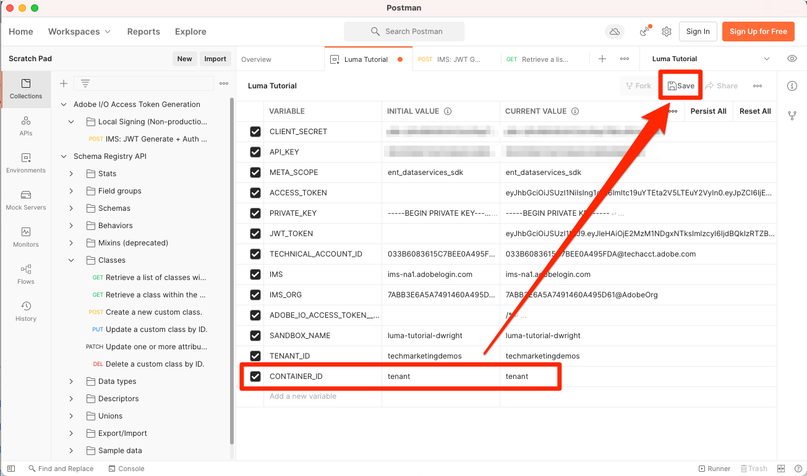

# 스키마의 모델 데이터

<!-- 60min -->
이 단원에서는 Luma의 데이터를 스키마에 모델링합니다. 이것은 이 자습서에서 가장 긴 교훈 중 하나이므로 물 한 잔을 마시고 버클을 하세요!

표준화와 상호 운용성은 Adobe Experience Platform의 주요 개념입니다. XDM(경험 데이터 모델)은 고객 경험 데이터를 표준화하고 고객 경험 관리를 위한 스키마를 정의하려는 노력입니다.

XDM은 디지털 경험의 힘을 향상시키기 위해 설계된 문서화된 사양입니다. 플랫폼 서비스와 통신하는 데 사용할 응용 프로그램에 대한 공통 구조 및 정의를 제공합니다. XDM 표준을 준수함으로써 모든 고객 경험 데이터를 보다 빠르고 통합된 방식으로 통찰력을 제공할 수 있는 공통 표현으로 통합할 수 있습니다. 고객 작업을 통해 유용한 통찰력을 얻을 수 있고, 세그먼트를 통해 고객 대상을 정의하고, 개인화를 위해 고객 속성을 표현할 수 있습니다.

XDM은 Experience Platform을 기반으로 하는 Adobe Experience Cloud이 올바른 사람에게 올바른 메시지를 올바른 채널에 정확히 적절한 시점에 전달할 수 있도록 하는 기본 프레임워크입니다. Experience Platform이 구축되는 방법론 **XDM 시스템**&#x200B;를 사용하면 Platform 서비스에서 사용할 Experience Data Model 스키마를 작동합니다.

<!--
This seems too lengthy. The video should suffice

Key terms:

* **Schema**: a representation of your data. A schema is comprised of a class and optional field groups and is used to create datasets. A schema includes behavioral attributes, timestamp, identity, attribute definitions, and relationships.
* **XDM Profile Class**: a common schema class used to represent record data
* **XDM ExperienceEvent Class**: a common schema class used to represent time-series data
* **Field group**: allows users to extend reusable fields that contain variables defining one or more attribute intended to be included in a schema or added to a class.
* **Standard Field group**: an open-source Field group built to conform to common industry standards, used to accelerate implementation and support repeatable services operating on the data
* **Data type**: a reusable object with properties in a hierarchical representation. These can be standard types or custom-defined defined types to describe your own data in your own way (for example, a collection of fields that you use to describe your products). Unlike Field groups, data types can be used in schemas regardless of the class.
* **Field**: a field is the lowest level element of a schema. Each field has a name for referencing and a type to identify the type of data that it contains. Field types can include, integer, number, string, Boolean and schema.
-->

**데이터 설계자** 는 이 자습서의 외부에서 스키마를 만들어야 하지만, **데이터 엔지니어** 은 Data Architect에서 만든 스키마와 긴밀하게 작동합니다.

연습을 시작하기 전에 이 짧은 비디오에서 스키마 및 XDM(Experience Data Model)에 대한 자세한 내용을 살펴보십시오.
>[!VIDEO](https://video.tv.adobe.com/v/27105?quality=12&learn=on)

>[!TIP]
>
> Experience Platform에서 데이터 모델링을 자세히 살펴보려면 이 교육 과정을 이수하는 것이 좋습니다 [XDM을 사용하여 고객 경험 데이터 모델링](https://experienceleague.adobe.com/?recommended=ExperiencePlatform-D-1-2021.1.xdm): Experience League에서 무료로 사용할 수 있습니다.

## 필요한 권한

에서 [권한 구성](configure-permissions.md) 이 단원을 완료하는 데 필요한 모든 액세스 컨트롤을 설정합니다.

<!--, specifically:

* Permission items **[!UICONTROL Data Modeling]** > **[!UICONTROL View Schemas]** and **[!UICONTROL Manage Schemas]**
* Permission item **[!UICONTROL Sandboxes]** > `Luma Tutorial`
* User-role access to the `Luma Tutorial Platform` product profile
* Developer-role access to the `Luma Tutorial Platform` product profile (for API)-->


<!--
## Luma's goals
-->

## UI를 통해 충성도 스키마 만들기

이 연습에서는 Luma의 충성도 데이터에 대한 스키마를 만듭니다.

1. Platform 사용자 인터페이스로 이동하여 샌드박스가 선택되어 있는지 확인합니다.
1. 이동 **[!UICONTROL 스키마]** 왼쪽 탐색
1. 을(를) 선택합니다 **[!UICONTROL 스키마 만들기]** 오른쪽 상단의 단추
1. 드롭다운 메뉴에서 을(를) 선택합니다 **[!UICONTROL XDM 개별 프로필]**, 개별 고객의 특성(지점, 상태 등)을 모델링할 예정이므로 이 작업을 수행할 수 없습니다.
   

### 표준 필드 그룹 추가

다음으로 스키마에 필드 그룹을 추가하라는 메시지가 표시됩니다. 그룹을 사용하여 모든 필드를 스키마에 추가해야 합니다. Adobe이 제공하는 대규모 업계 표준 필드 그룹 중에서 선택하거나 직접 생성할 수 있습니다. Experience Platform에서 자체 데이터를 모델링하기 시작하면 Adobe에서 제공하는 업계 표준 필드 그룹을 잘 알고 있는 것이 좋습니다. 가능하면 고객 AI, Attribution AI 및 Adobe Analytics과 같은 다운스트림 서비스를 제공하는 경우가 있을 때 사용하는 것이 좋습니다.

자체 데이터를 사용하여 작업하는 경우 Platform에서 캡처해야 하는 데이터와 이를 모델링하는 방법을 결정하는 것이 중요한 단계입니다. 이 큰 주제는 교육 과정에서 보다 심층적으로 논의된다 [XDM을 사용하여 고객 경험 데이터 모델링](https://experienceleague.adobe.com/?recommended=ExperiencePlatform-D-1-2021.1.xdm). 이 자습서에서는 미리 결정된 일부 스키마의 구현을 안내해드리겠습니다.

필드 그룹을 추가하려면 다음을 수행합니다.

1. 에서 **[!UICONTROL 필드 그룹 추가]** 모달, 다음 필드 그룹을 선택합니다.
   1. **[!UICONTROL 인구 통계 세부 정보]** 이름 및 생년월일과 같은 기본 고객 데이터
   1. **[!UICONTROL 개인 연락처 세부 정보]** 이메일 주소 및 전화 번호와 같은 기본 연락처 세부 사항
1. 행 오른쪽에 있는 아이콘을 선택하여 필드 그룹에 기여한 필드를 미리 볼 수 있습니다.
   

1. 을(를) 확인합니다. **[!UICONTROL 업계]** > **[!UICONTROL 소매]** 업종별 필드 그룹을 표시하는 상자입니다.
1. 선택 **[!UICONTROL 충성도]** 를 추가하여 충성도 프로그램 필드를 추가합니다.
1. 선택 **[!UICONTROL 필드 그룹 추가]** 세 필드 그룹을 모두 스키마에 추가하려면
   


이제 스키마의 현재 상태를 탐색하는 데 시간이 좀 걸립니다. 필드 그룹은 개인, 연락처 세부 사항 및 충성도 프로그램 상태와 관련된 표준 필드를 추가했습니다. 이러한 두 필드 그룹은 회사 데이터에 대한 스키마를 생성할 때 유용할 수 있습니다. 특정 필드 그룹 행을 선택하거나 필드 그룹 이름 옆에 있는 상자를 선택하여 시각화가 어떻게 변경되는지 확인합니다.

스키마를 저장하려면 다음을 수행합니다.

1. 스키마의 맨 위 노드를 선택합니다.
1. Enter 키 `Luma Loyalty Schema` 로서의 **[!UICONTROL 표시 이름]**.
1. **[!UICONTROL 저장]**을 선택합니다.
   

>[!NOTE]
>
>필드 그룹이 수집하지 않는 데이터 포인트에 대한 필드를 추가해도 됩니다. 예를 들어 &quot;faxPhone&quot;은 Luma가 데이터를 수집하지 않는 필드일 수 있습니다. 괜찮아요. 스키마에 필드가 정의되어 있다고 해서 해당 데이터에 대한 데이터가 의미하는 것은 아닙니다 *반드시* 나중에 수집할 수 있습니다.

### 사용자 지정 필드 그룹 추가

이제 사용자 지정 필드 그룹을 만들겠습니다.

충성도 필드 그룹에 `loyaltyID` 필드, Luma는 스키마 간에 일관성을 유지하기 위해 단일 그룹의 모든 시스템 식별자를 관리하려고 합니다.

필드 그룹은 스키마 워크플로우에서 만들어야 합니다. 필드 그룹을 만들려면 다음을 수행하십시오.

1. 선택 **[!UICONTROL 추가]** 아래에 **[!UICONTROL 스키마 필드 그룹]** 제목
   
1. 선택 **[!UICONTROL 새 필드 그룹 만들기]**
1. 사용 `Luma Identity profile field group` 로서의 **[!UICONTROL 표시 이름]**
1. 사용 `system identifiers for XDM Individual Profile class` 로서의 **[!UICONTROL 설명]**
1. 선택 **[!UICONTROL 필드 그룹 추가]**

   

새로운 빈 필드 그룹이 스키마에 추가됩니다. 다음 **[!UICONTROL +]** 단추를 사용하여 계층의 모든 위치에 새 필드를 추가할 수 있습니다. 이 경우 루트 수준에서 필드를 추가하려고 합니다.

1. 선택 **[!UICONTROL +]** 스키마 이름 옆에 표시됩니다. 이렇게 하면 사용자 지정 필드와 표준 필드 간의 충돌을 관리하기 위해 테넌트 ID 네임스페이스 아래에 새 필드가 추가됩니다.
1. 에서 **[!UICONTROL 필드 속성]** 사이드바 새 필드의 세부 사항을 추가합니다.
   1. **[!UICONTROL 필드 이름]**: `systemIdentifier`
   1. **[!UICONTROL 디스플레이 이름]**: `System Identifier`
   1. **[!UICONTROL 유형]**: **[!UICONTROL 개체]**
   1. 선택 **[!UICONTROL 적용]**

   

이제 `systemIdentifier` 개체:

1. 첫 번째 필드
   1. **[!UICONTROL 필드 이름]**: `loyaltyId`
   1. **[!UICONTROL 디스플레이 이름:]** `Loyalty Id`
   1. **[!UICONTROL 유형]**: **[!UICONTROL 문자열]**
1. 두 번째 필드
   1. **[!UICONTROL 필드 이름]**: `crmId`
   1. **[!UICONTROL 표시 이름]**: `CRM Id`
   1. **[!UICONTROL 유형]**: **[!UICONTROL 문자열]**

새 필드 그룹은 다음과 같아야 합니다. 을(를) 선택합니다 **[!UICONTROL 저장]** 스키마를 저장하지만 다음 연습에 사용할 수 있도록 스키마를 열어 두는 단추입니다.


## 데이터 유형 만들기

새 필드와 같은 필드 그룹 `Luma Identity profile field group`를 다른 스키마에서 다시 사용할 수 있으므로 여러 시스템에 표준 데이터 정의를 적용할 수 있습니다. 하지만 재사용할 수만 있습니다 _클래스를 공유하는 스키마에서_: 이 경우 XDM 개별 프로필 클래스입니다.

데이터 유형은 스키마에서 다시 사용할 수 있는 또 다른 다중 필드 구성입니다 _여러 클래스_. 새로운 제품을 개종합시다 `systemIdentifier` 개체를 데이터 형식으로 변환:

사용 `Luma Loyalty Schema` 여전히 열려 있는 경우 `systemIdentifier` 개체 및 선택  **[!UICONTROL 새 데이터 유형으로 변환]**


만약 **[!UICONTROL 취소]** 스키마 밖으로 이동하여 **[!UICONTROL 데이터 유형]** 탭에서 새로 만든 데이터 유형을 볼 수 있습니다. 이 데이터 유형은 나중에 단원에서 사용할 것입니다.


## API를 통해 CRM 스키마 만들기

이제 API를 사용하여 스키마를 만들겠습니다.

>[!TIP]
>
> API 연습을 건너뛰려면 사용자 인터페이스 방법을 사용하여 다음 스키마를 만들 수 있습니다.
>
> 1. 를 사용하십시오 [!UICONTROL XDM 개별 프로필] 클래스
> 1. 이름을 지정합니다 `Luma CRM Schema`
> 1. 다음 필드 그룹을 사용합니다. 인구 통계 세부 사항, 개인 연락처 세부 사항 및 Luma Identity 프로필 필드 그룹


먼저 빈 스키마를 만듭니다.

1. 열기 [!DNL Postman]
1. 지난 24시간 동안 요청을 하지 않은 경우 인증 토큰이 만료되었을 수 있습니다. 요청을 엽니다. **[!DNL Adobe I/O Access Token Generation > Local Signing (Non-production use-only) > IMS: JWT Generate + Auth via User Token]** 을(를) 선택합니다. **보내기** 새 JWT 및 액세스 토큰을 요청하려면 다음을 수행하십시오.
1. 환경 변수를 열고 값을 변경합니다. **CONTAINER_ID** 변환 전: `global` to `tenant`. 를 사용해야 합니다. `tenant` 스키마 만들기와 같이 Platform에서 사용자 지정 요소와 상호 작용하려는 경우 마다.
1. **저장**을 선택합니다
   
1. 요청을 엽니다. **[!DNL Schema Registry API > Schemas > Create a new custom schema.]**
1. 를 엽니다. **본문** 탭하여 다음 코드를 붙여 넣은 다음, **보내기** 를 호출하여 API를 호출합니다. 이 호출은 동일한 를 사용하여 새 스키마를 만듭니다 `XDM Individual Profile` 기본 클래스:

   ```json
   {
     "type": "object",
     "title": "Luma CRM Schema",
     "description": "Schema for CRM data of Luma Retail ",
     "allOf": [{
       "$ref": "https://ns.adobe.com/xdm/context/profile"
     }]
   }
   ```

   >[!NOTE]
   >
   >네임스페이스가 이 및 후속 코드 샘플에서 참조됩니다(예 `https://ns.adobe.com/xdm/context/profile`)를 사용할 수도 있고, **[!DNL CONTAINER_ID]** 및 는 올바른 값으로 설정된 헤더를 허용합니다. 일부 사용자는 사용자 인터페이스에서 쉽게 액세스할 수 있습니다.

1. 당신은 `201 Created` 응답
1. 복사 `meta:altId` 응답 본문에서 나중에 또 다른 연습에 사용하겠습니다
   

1. 새 스키마는 사용자 인터페이스에 표시되어야 하지만 필드 그룹은 표시되지 않습니다
   

>[!NOTE]
>
> 다음 `meta:altId` 또는 스키마 id는 API 요청을 통해 얻을 수도 있습니다 **[!DNL Schema Registry API > Schemas > Retrieve a list of schemas within the specified container.]** 사용 **[!UICONTROL CONTAINER_ID]** 설정 `tenant` 및 수락 헤더 `application/vnd.adobe.xdm+json`.

>[!TIP]
>
> 이 호출의 일반적인 문제 및 가능한 수정 사항:
>
> * 인증 토큰이 없습니다. 를 실행합니다. **IMS: 사용자 토큰을 통한 JWT 생성 + 인증** 새 토큰을 생성하기 위해 호출
> * `401: Not Authorized to PUT/POST/PATCH/DELETE for this path : /global/schemas/`: 업데이트 **CONTAINER_ID** 환경 변수 `global` to `tenant`
> * `403: PALM Access Denied. POST access is denied for this resource from access control`: Admin Console에서 사용자 권한 확인


### 표준 필드 그룹 추가

이제 스키마에 필드 그룹을 추가할 차례입니다.

1. in [!DNL Postman], 요청을 엽니다. **[!DNL Schema Registry API > Schemas > Update one or more attributes of a custom schema specified by ID.]**
1. 에서 **매개 변수** 탭에서 붙여넣습니다. `meta:altId` 이전 응답의 값 `SCHEMA_ID`
1. Body 탭을 열고 다음 코드를 붙여넣고 을 선택합니다 **보내기** 를 호출하여 API를 호출합니다. 이 호출은 표준 필드 그룹을 `Luma CRM Schema`:

   ```json
   [{
       "op": "add",
       "path": "/allOf/-",
       "value": {
         "$ref": "https://ns.adobe.com/xdm/context/profile-personal-details"
       }
     },
     {
       "op": "add",
       "path": "/allOf/-",
       "value": {
         "$ref": "https://ns.adobe.com/xdm/context/profile-person-details"
       }
     }
   ]
   ```

1. 응답에 대한 200 확인 상태가 있어야 하며 필드 그룹이 UI에서 스키마의 일부로 표시되어야 합니다

   


### 사용자 지정 필드 그룹 추가

이제 다음을 추가하겠습니다 `Luma Identity profile field group` 를 스키마 로 전환합니다. 먼저 목록 API를 사용하여 새 필드 그룹의 ID를 찾아야 합니다.

1. 요청을 엽니다. **[!DNL Schema Registry API > Field groups > Retrieve a list of field groups within the specified container.]**
1. 을(를) 선택합니다 **보내기** 계정의 모든 사용자 지정 필드 그룹 목록을 검색하는 단추
1. 을 선택합니다. `$id` 값 `Luma Identity profile field group` (이 스크린샷의 값과 다를 것입니다.)
   
1. 요청을 엽니다. **[!DNL Schema Registry API > Schemas > Update one or more attributes of a custom schema specified by ID.]** 다시
1. 다음 **매개 변수** 탭에는 여전히 `$id` 스키마
1. 를 엽니다. **본문** 탭하여 다음 코드를 붙여 넣고 `$ref` 값 `$id` 당신 스스로 `Luma Identity profile field group`:

   ```json
   [{
     "op": "add",
     "path": "/allOf/-",
     "value": {
       "$ref": "REPLACE_WITH_YOUR_OWN_FIELD_GROUP_ID"
     }
   }]
   ```

1. 선택 **보내기**

   

API 응답과 인터페이스에서 모두 확인하여 필드 그룹이 스키마에 추가되었는지 확인합니다.

## 오프라인 구매 이벤트 스키마 만들기

이제 를 기반으로 스키마를 만들겠습니다 **[!UICONTROL XDM ExperienceEvent]** Luma의 오프라인 구매 데이터에 대한 클래스입니다. 이제 스키마 편집기 사용자 인터페이스에 익숙해지므로 다음 지침에 따라 스크린샷 수를 줄이겠습니다.

1. 를 사용하여 스키마 만들기 **[!UICONTROL XDM ExperienceEvent]** 클래스
1. 표준 필드 그룹 추가 **[!UICONTROL 상거래 세부 사항]** 일반적인 주문 세부 사항을 캡처합니다. 안에 있는 개체를 탐색하는 데 몇 분 정도 소요됩니다.
1. `Luma Identity profile field group`을 검색합니다. 사용할 수 없습니다! 필드 그룹은 클래스에 연결되어 있으며 이 스키마에 다른 클래스를 사용하고 있으므로 사용할 수 없습니다. ID 필드가 포함된 XDM ExperienceEvent 클래스에 대한 새 필드 그룹을 추가해야 합니다. 우리의 데이터 타입은 그것을 정말 쉽게 만들 것입니다!
1. 을(를) 선택합니다 **[!UICONTROL 새 필드 그룹 만들기]** 라디오 단추
1. 을(를) 입력합니다. **[!UICONTROL 표시 이름]** 로서의 `Luma Identity ExperienceEvent field group` 을(를) 선택하고 을(를) 선택합니다. **[!UICONTROL 필드 그룹 추가]** 버튼
1. 다음을 확인합니다. **[!UICONTROL +]** 버튼이 **[!UICONTROL 구조]** 새 필드를 추가할 수 있는 섹션
1. in **[!UICONTROL 구조]** 섹션, **[!UICONTROL +]** 스키마의 최상위 수준에서
1. 로서의 **[!UICONTROL 필드 이름]**, 입력 `systemIdentifier`
1. 로서의 **[!UICONTROL 표시 이름]**, 입력 `System Identifier`
1. 로서의 **[!UICONTROL 유형]**, 선택 **시스템 식별자** 는 이전에 만든 사용자 지정 데이터 유형입니다
1. 을(를) 선택합니다 **[!UICONTROL 적용]** 버튼
1. 스키마 이름 지정 `Luma Offline Purchase Events Schema`
1. **[!UICONTROL 저장]** 버튼을 선택합니다

데이터 유형에 모든 필드가 추가된 방법을 확인합니다.


또한, **[!UICONTROL XDM ExperienceEvent]** 아래에 **[!UICONTROL 클래스]** 이 클래스에서 제공하는 필드 중 일부를 제목 및 검사합니다. XDM ExperienceEvent 클래스를 사용하는 경우 _id 및 타임스탬프 필드가 필요합니다. 이 스키마를 사용할 때 수집하는 모든 레코드에 대해 이러한 필드를 채워야 합니다.


## 웹 이벤트 스키마 만들기

이제 Luma의 웹 사이트 데이터를 위한 스키마를 하나 더 만들려고 합니다. 이 시점에서는 스키마를 만드는 데 전문가여야 합니다! 이러한 속성을 사용하여 다음 스키마 작성

| 속성 | 값 |
|---------------|-----------------|
| 클래스 | XDM ExperienceEvent |
| 필드 그룹 | AEP 웹 SDK ExperienceEvent Mixin |
| 필드 그룹 | 소비자 경험 이벤트 |
| 스키마 이름 | Luma 웹 이벤트 스키마 |

을(를) 선택합니다 **[!UICONTROL 소비자 경험 이벤트]** 필드 그룹. 이 필드 그룹에는 또한 있던 상거래 및 productListItems 개체가 포함되어 있습니다 [!UICONTROL 상거래 세부 사항]. 정말로 [!UICONTROL 소비자 경험 이벤트] 는 별도로 사용할 수 있는 여러 다른 표준 필드 그룹의 조합입니다. [!UICONTROL AEP 웹 SDK ExperienceEvent Mixin] 필드 그룹에도 같은 필드 그룹을 비롯한 다른 필드 그룹이 포함되어 있습니다 [!UICONTROL 소비자 경험 이벤트]. 다행히, 그들은 서로 잘 섞인다.

이(가) 추가되지 않았던 점에 주목합니다. `Luma Identity ExperienceEvent field group` 이 스키마로 이동합니다. 웹 SDK에는 다른 방식으로 ID를 수집하는 방법이 있기 때문입니다. 을(를) 선택하는 경우 **[!UICONTROL XDM ExperienceEvent]** 의 클래스 **[!UICONTROL 조성물]** 스키마 편집기의 섹션에서 기본적으로 추가하는 필드 중 하나가 **[!UICONTROL IdentityMap]**. [!DNL IdentityMap] 다양한 Adobe 애플리케이션에서 Platform에 연결하는 데 사용됩니다. 스트리밍 수집 단원에서 identityMap을 통해 Platform으로 ID가 전송되는 방법을 확인할 수 있습니다.


## 제품 카탈로그 스키마 만들기

를 사용하여  [!UICONTROL 상거래 세부 사항] 및 [!UICONTROL 소비자 경험 이벤트] 필드 그룹, Luma는 표준 productListItems 데이터 유형을 통해 제품 관련 이벤트에 대한 일부 세부 사항을 보고합니다. 또한 Platform에 전송할 추가 제품 세부 사항 필드가 있습니다. Luma는 판매 시점 및 전자 상거래 시스템에서 이러한 모든 필드를 캡처하는 대신 제품 카탈로그 시스템에서 직접 이러한 필드를 수집하는 것을 선호합니다. 스키마 관계를 사용하면 분류 또는 조회 목적으로 두 스키마 간의 관계를 정의할 수 있습니다. Luma는 관계를 사용하여 제품 세부 사항을 분류합니다. 지금 프로세스를 시작하고 다음 단원이 끝날 때 완료합니다.

>[!NOTE]
>
>기존 Analytics 또는 Target 고객의 경우 스키마 관계로 엔티티를 분류하는 것은 SAINT 분류 또는 Recommendations용 제품 카탈로그를 업로드하는 것과 유사합니다

먼저 사용자 지정 클래스를 사용하여 Luma의 제품 카탈로그에 대한 스키마를 만들어야 합니다.

1. 을(를) 선택합니다 **[!UICONTROL 스키마 만들기]** 버튼을 클릭하고 **[!UICONTROL 찾아보기]** 드롭다운에서 옵션
   
1. 을(를) 선택합니다 **[!UICONTROL 새 클래스 만들기]** 라디오 단추
1. 이름을 지정합니다 `Luma Product Catalog Class`
1. 을(를) 종료하십시오. **[!UICONTROL 비헤이비어]** 로서의 **[!UICONTROL 레코드]**
1. 을(를) 선택합니다 **[!UICONTROL 클래스 할당]** 버튼
   
1. 새 만들기 [!UICONTROL 필드 그룹] called `Luma Product Catalog field group` 다음 필드를 사용하여 다음을 수행하십시오.
   1. productName: 제품 이름: 문자열
   1. productCategory: 제품 카테고리: 문자열
   1. productColor: 제품 색상: 문자열
   1. productSku: 제품 SKU: 문자열 | 필수
   1. productSize: 제품 크기: 문자열
   1. productPrice: 제품 가격: 이중
1. 스키마 이름을 지정합니다 `Luma Product Catalog Schema` (올바른 필드를 업데이트하고 클래스 이름을 업데이트하지 마십시오.)
1. **[!UICONTROL 저장]** 스키마

새 스키마는 다음과 같습니다. 다음 방법을 참고하십시오 `productSku` 필드에 나열된 필드가 있습니다. [!UICONTROL 필수 필드] 섹션:


다음 단계는 두 ExperienceEvent 스키마와 `Luma Product Catalog Schema`그러나 다음 단원에서 수행할 수 있도록 몇 가지 추가 단계가 있습니다.


## 추가 리소스

* [XDM(Experience Data Model) 시스템 설명서](https://experienceleague.adobe.com/docs/experience-platform/xdm/home.html?lang=ko-KR)
* [스키마 레지스트리 API](https://www.adobe.io/experience-platform-apis/references/schema-registry/)


이제 스키마가 있으므로 [ID 매핑](map-identities.md)!
