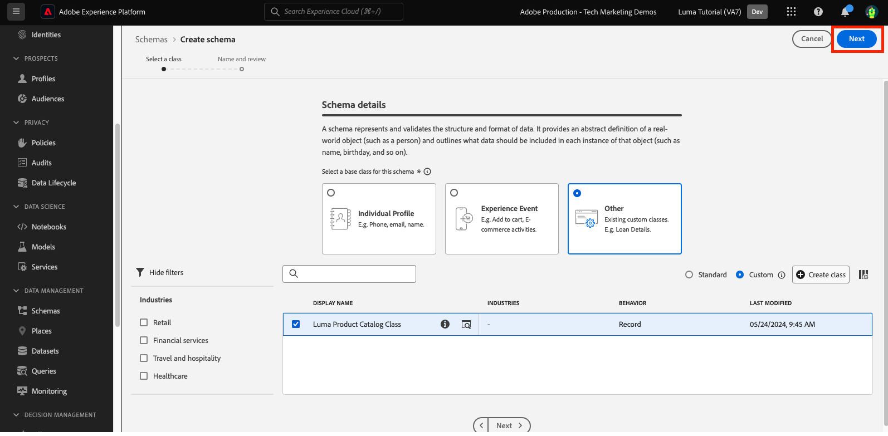

# 스키마의 모델 데이터

<!-- 60min -->
이 단원에서는 Luma의 데이터를 스키마로 모델링합니다. 이것은 자습서에서 가장 긴 수업 중 하나이므로, 물 한 잔을 마시고 버클을 착용하세요!

표준화와 상호 운용성은 Adobe Experience Platform의 핵심 개념입니다. XDM(경험 데이터 모델)은 고객 경험 데이터를 표준화하고 고객 경험 관리를 위한 스키마를 정의하는 작업입니다.

XDM은 디지털 경험의 성능을 개선하기 위해 설계된 공개적으로 문서화된 사양입니다. 플랫폼 서비스와 통신하는 데 사용할 모든 애플리케이션에 대한 일반적인 구조와 정의를 제공합니다. XDM 표준을 준수함으로써 모든 고객 경험 데이터를 일반적인 표현에 통합하여 보다 빠르고 통합적인 방식으로 통찰력을 제공할 수 있습니다. 고객 작업에서 중요한 통찰력을 얻고, 세그먼트를 통해 고객 대상을 정의하고, 개인화 목적으로 고객 속성을 표현할 수 있습니다.

XDM은 Experience Platform에서 제공하는 Adobe Experience Cloud이 정확한 순간에 정확한 메시지를 적합한 사람에게 전달할 수 있는 기본 프레임워크입니다. Experience Platform이 빌드되는 방법론인 **XDM 시스템**&#x200B;은(는) Platform 서비스에서 사용할 Experience Data Model 스키마를 운영합니다.

<!--
This seems too lengthy. The video should suffice

Key terms:

* **Schema**: a representation of your data. A schema is comprised of a class and optional field groups and is used to create datasets. A schema includes behavioral attributes, timestamp, identity, attribute definitions, and relationships.
* **XDM Profile Class**: a common schema class used to represent record data
* **XDM ExperienceEvent Class**: a common schema class used to represent time-series data
* **Field group**: allows users to extend reusable fields that contain variables defining one or more attribute intended to be included in a schema or added to a class.
* **Standard Field group**: an open-source Field group built to conform to common industry standards, used to accelerate implementation and support repeatable services operating on the data
* **Data type**: a reusable object with properties in a hierarchical representation. These can be standard types or custom-defined defined types to describe your own data in your own way (for example, a collection of fields that you use to describe your products). Unlike Field groups, data types can be used in schemas regardless of the class.
* **Field**: a field is the lowest level element of a schema. Each field has a name for referencing and a type to identify the type of data that it contains. Field types can include, integer, number, string, Boolean and schema.
-->

**데이터 설계자**&#x200B;는 이 자습서 외부에서 스키마를 만들어야 하지만 **데이터 엔지니어**&#x200B;는 데이터 설계자가 만든 스키마와 긴밀하게 작업합니다.

연습을 시작하기 전에 이 짧은 비디오를 통해 스키마 및 XDM(Experience Data Model)에 대해 자세히 알아보십시오.
>[!VIDEO](https://video.tv.adobe.com/v/27105?learn=on&enablevpops)

>[!TIP]
>
> Experience Platform에서 데이터 모델링에 대해 자세히 알아보려면 Experience League에서 무료로 사용할 수 있는 재생 목록 [XDM으로 고객 경험 데이터 모델링](https://experienceleague.adobe.com/en/playlists/experience-platform-model-your-customer-experience-data-with-xdm)을 시청하는 것이 좋습니다.

## 권한 필요

[권한 구성](configure-permissions.md) 단원에서 이 단원을 완료하는 데 필요한 모든 액세스 제어를 설정합니다.

<!--, specifically:

* Permission items **[!UICONTROL Data Modeling]** > **[!UICONTROL View Schemas]** and **[!UICONTROL Manage Schemas]**
* Permission item **[!UICONTROL Sandboxes]** > `Luma Tutorial`
* User-role access to the `Luma Tutorial Platform` product profile
* Developer-role access to the `Luma Tutorial Platform` product profile (for API)-->


<!--
## Luma's goals
-->

## UI를 통해 충성도 스키마 만들기

이 연습에서는 Luma의 충성도 데이터에 대한 스키마를 만듭니다.

1. Platform 사용자 인터페이스로 이동하여 샌드박스가 선택되었는지 확인합니다.
1. 왼쪽 탐색 영역에서 **[!UICONTROL 스키마]**(으)로 이동합니다.
1. 오른쪽 상단에서 **[!UICONTROL 스키마 만들기]** 단추를 선택합니다.
   

1. 개별 고객의 특성(포인트, 상태 등)을 모델링하게 되므로 스키마 만들기 워크플로에서 스키마의 기본 클래스로 **[!UICONTROL 개별 프로필]**&#x200B;을 선택합니다.
1. **[!UICONTROL 다음]**&#x200B;을 선택합니다.
   

1. **[!UICONTROL 스키마 표시 이름]** 텍스트 필드에 `Luma Loyalty Schema`을(를) 입력하십시오. 아래 캔버스에서 선택한 클래스에서 제공하는 기본 스키마 구조를 검토하고 확인할 수도 있습니다.
1. 스키마를 만들려면 **[!UICONTROL 완료]**&#x200B;를 선택하십시오.
   

### 표준 필드 그룹 추가

스키마가 만들어지면 스키마에 필드를 추가할 수 있는 스키마 편집기로 리디렉션됩니다. 스키마에 개별 필드를 직접 추가하거나 필드 그룹을 사용할 수 있습니다. 모든 개별 필드는 여전히 클래스 또는 필드 그룹과 연결되어 있다는 점에 유의해야 합니다. Adobe에서 제공하는 다양한 산업 표준 필드 그룹 세트에서 선택하거나 직접 생성할 수 있습니다. Experience Platform에서 고유한 데이터를 모델링하기 시작할 때 Adobe에서 제공하는 업계 표준 필드 그룹에 익숙해지는 것이 좋습니다. 가능하면 Customer AI, Attribution AI 및 Adobe Analytics과 같은 다운스트림 서비스를 제공할 때 이를 사용하는 것이 좋습니다.

자체 데이터를 사용하여 작업할 때 중요한 단계는 플랫폼에서 캡처해야 하는 자체 데이터와 이를 모델링하는 방법을 결정하는 것입니다. 이 큰 주제는 재생 목록 [XDM으로 고객 경험 데이터 모델링](https://experienceleague.adobe.com/en/playlists/experience-platform-model-your-customer-experience-data-with-xdm)에서 자세히 설명합니다. 이 자습서에서는 미리 결정된 몇 가지 스키마의 구현을 안내하겠습니다.

필드 그룹을 추가하려면:

1. **[!UICONTROL 필드 그룹]** 제목 아래에서 **[!UICONTROL 추가]**&#x200B;를 선택합니다.
   
1. **[!UICONTROL 필드 그룹 추가]** 모달에서 다음 필드 그룹을 선택합니다.
   1. 이름 및 생일과 같은 기본 고객 데이터에 대한 **[!UICONTROL 인구 통계 세부 정보]**
   1. 전자 메일 주소 및 전화 번호와 같은 기본 연락처 세부 정보는 **[!UICONTROL 개인 연락처 세부 정보]**
1. 행의 오른쪽에 있는 아이콘을 선택하여 필드 그룹에 기여한 필드를 미리 볼 수 있습니다.
   

1. 산업별 필드 그룹을 표시하려면 **[!UICONTROL Industry]** > **[!UICONTROL Retail]** 상자를 선택합니다.
1. 충성도 프로그램 필드를 추가하려면 **[!UICONTROL 충성도 세부 정보]**&#x200B;를 선택하십시오.
1. 스키마에 세 개의 필드 그룹을 모두 추가하려면 **[!UICONTROL 필드 그룹 추가]**&#x200B;를 선택하십시오.
   


이제 잠시 시간을 내어 스키마의 현재 상태를 살펴보십시오. 필드 그룹에는 사용자, 연락처 세부 정보 및 고객 충성도 프로그램 상태와 관련된 표준 필드가 추가되었습니다. 이러한 두 필드 그룹은 회사 데이터에 대한 스키마를 만들 때 유용할 수 있습니다. 특정 필드 그룹 행을 선택하거나 필드 그룹 이름 옆에 있는 상자를 선택하여 시각화가 변경되는 방식을 확인합니다.

스키마를 저장하려면 **[!UICONTROL 저장]**&#x200B;을 선택합니다.


>[!NOTE]
>
>필드 그룹이 수집하지 않는 데이터 포인트에 대한 필드를 추가해도 됩니다. 예를 들어 &quot;faxPhone&quot;은 Luma가 데이터를 수집하지 않는 필드일 수 있습니다. 괜찮아. 스키마에 필드가 정의되었다고 해서 나중에 *필수*&#x200B;에 대한 데이터를 섭취하는 것은 아닙니다. 스키마에서 필드를 제거할 수도 있습니다.

### 사용자 정의 필드 그룹 추가

이제 사용자 정의 필드 그룹을 만들어 보겠습니다.

충성도 필드 그룹에는 `loyaltyID` 필드가 포함되어 있지만 Luma는 스키마 간의 일관성을 보장하기 위해 단일 그룹에서 모든 시스템 식별자를 관리하려고 합니다.

스키마 워크플로우에서 필드 그룹을 만들어야 합니다. 다음 중 하나를 수행할 수 있습니다.

* 먼저 스키마에 새 사용자 정의 필드를 추가한 다음 사용자 정의 필드 그룹을 만들거나
* 먼저 사용자 정의 필드 그룹을 만든 다음 필드를 추가합니다.

이 자습서에서는 사용자 지정 필드 그룹을 만드는 것부터 시작합니다.

필드 그룹을 만들려면 다음 작업을 수행하십시오.

1. **[!UICONTROL 스키마 필드 그룹]** 머리글 아래에서 **[!UICONTROL 추가]**&#x200B;를 선택합니다.
   
1. **[!UICONTROL 새 필드 그룹 만들기]** 선택
1. `Luma Identity profile field group`을(를) **[!UICONTROL 표시 이름]**(으)로 사용
1. `system identifiers for XDM Individual Profile class`을(를) **[!UICONTROL 설명]**(으)로 사용
1. **[!UICONTROL 필드 그룹 추가]** 선택
   

비어 있는 새 필드 그룹이 스키마에 추가됩니다. **[!UICONTROL +]** 단추를 사용하여 계층 구조의 모든 위치에 새 필드를 추가할 수 있습니다. 여기서는 루트 수준에 필드를 추가하겠습니다.

1. 스키마 이름 옆에 있는 **[!UICONTROL +]**&#x200B;을(를) 선택합니다. 이렇게 하면 테넌트 ID 네임스페이스 아래에 새 필드가 추가되어 사용자 정의 필드와 표준 필드 간의 충돌을 관리할 수 있습니다.
1. **[!UICONTROL 필드 속성]** 사이드바에서 새 필드의 세부 정보를 추가합니다.
   1. **[!UICONTROL 필드 이름]**: `systemIdentifier`
   1. **[!UICONTROL 표시 이름]**: `System Identifier`
   1. **[!UICONTROL 유형]**: **[!UICONTROL 개체]**
   1. **[!UICONTROL 필드 그룹]** 드롭다운에서 만든 **Luma ID 프로필 필드 그룹**&#x200B;을 선택합니다.

      
   1. **[!UICONTROL 적용]** 선택

      

이제 `systemIdentifier` 개체 아래에 두 필드를 추가합니다.

1. 첫 번째 필드
   1. **[!UICONTROL 필드 이름]**: `loyaltyId`
   1. **[!UICONTROL 표시 이름:]** `Loyalty Id`
   1. **[!UICONTROL 유형]**: **[!UICONTROL 문자열]**
1. 두 번째 필드
   1. **[!UICONTROL 필드 이름]**: `crmId`
   1. **[!UICONTROL 표시 이름]**: `CRM Id`
   1. **[!UICONTROL 유형]**: **[!UICONTROL 문자열]**

새 필드 그룹은 다음과 같아야 합니다. **[!UICONTROL 저장]** 단추를 선택하여 스키마를 저장하지만 다음 연습을 위해 스키마를 열어 두십시오.


## 데이터 유형 만들기

새 `Luma Identity profile field group`과(와) 같은 필드 그룹을 다른 스키마에서 다시 사용할 수 있으므로 여러 시스템에 표준 데이터 정의를 적용할 수 있습니다. 그러나 클래스를 공유하는 스키마에서만 _재사용할 수 있습니다_(이 경우 XDM 개별 프로필 클래스).

데이터 형식은 스키마 _여러 클래스_&#x200B;에서 재사용할 수 있는 또 다른 다중 필드 구성입니다. 새 `systemIdentifier` 개체를 데이터 형식으로 변환해 보겠습니다.

`Luma Loyalty Schema`이(가) 열려 있는 상태에서 `systemIdentifier` 개체를 선택하고 **[!UICONTROL 새 데이터 형식으로 변환]**&#x200B;을(를) 선택합니다.


스키마에서 **[!UICONTROL 취소]**&#x200B;하고 **[!UICONTROL 데이터 형식]** 탭으로 이동하면 새로 만든 데이터 형식이 표시됩니다. 이 데이터 유형은 단원의 뒷부분에서 사용합니다.


## API를 통해 CRM 스키마 만들기

이제 API를 사용하여 스키마를 만듭니다.

>[!TIP]
>
> API 연습을 건너뛰려면 사용자 인터페이스 메소드를 사용하여 다음 스키마를 생성할 수 있습니다.
>
> 1. [!UICONTROL 개별 프로필] 클래스 사용
> 1. 이름을 `Luma CRM Schema`로 지정합니다.
> 1. 인구 통계학적 세부 정보, 개인 연락처 세부 정보 및 Luma Identity 프로필 필드 그룹인 필드 그룹을 사용합니다.

먼저 빈 스키마를 만듭니다.

1. [!DNL Postman] 열기
1. 액세스 토큰이 없는 경우 **[!DNL OAuth: Request Access Token]** 요청을 열고 **보내기**&#x200B;를 선택하여 새 액세스 토큰을 요청하세요.
1. 환경 변수를 열고 **CONTAINER_ID**&#x200B;의 값을 `global`에서 `tenant`(으)로 변경합니다. 스키마를 만드는 등 플랫폼에서 사용자 지정 요소와 상호 작용하려면 `tenant`을(를) 사용해야 합니다.
1. **저장** 선택
   
1. **[!DNL Schema Registry API > Schemas > Create a new custom schema.]** 요청 열기
1. **본문** 탭을 열고 다음 코드를 붙여 넣은 다음 **보내기**&#x200B;를 선택하여 API를 호출합니다. 이 호출은 동일한 `XDM Individual Profile` 기본 클래스를 사용하여 새 스키마를 만듭니다.

   ```json
   {
     "type": "object",
     "title": "Luma CRM Schema",
     "description": "Schema for CRM data of Luma Retail ",
     "allOf": [{
       "$ref": "https://ns.adobe.com/xdm/context/profile"
     }]
   }
   ```

   >[!NOTE]
   >
   >이 코드 샘플 및 후속 코드 샘플(예: `https://ns.adobe.com/xdm/context/profile`)의 네임스페이스 참조는 **[!DNL CONTAINER_ID]** 및 accept 헤더가 올바른 값으로 설정된 목록 API 호출을 사용하여 가져올 수 있습니다. 일부 기능은 사용자 인터페이스에서도 쉽게 액세스할 수 있습니다.

1. `201 Created` 응답을 받아야 합니다.
1. 응답 본문에서 `meta:altId` 복사 나중에 다른 연습에서 사용할 것입니다.
   

1. 새 스키마는 사용자 인터페이스에 표시되지만 필드 그룹은 표시되지 않아야 합니다
   

>[!NOTE]
>
> **[!UICONTROL CONTAINER_ID]**&#x200B;이(가) `tenant`(으)로 설정되고 허용 헤더 `application/vnd.adobe.xdm+json`이(가) 있는 API 요청 **[!DNL Schema Registry API > Schemas > Retrieve a list of schemas within the specified container.]**&#x200B;을(를) 수행하여 `meta:altId` 또는 스키마 ID를 가져올 수도 있습니다.

>[!TIP]
>
> 이 호출과 관련된 일반적인 문제 및 수정 가능성:
>
> * 인증 토큰 없음: **OAuth: 액세스 토큰 요청** 요청을 실행하여 새 토큰을 생성합니다.
> * `401: Not Authorized to PUT/POST/PATCH/DELETE for this path : /global/schemas/`: **CONTAINER_ID** 환경 변수를 `global`에서 `tenant`(으)로 업데이트합니다.
> * `403: PALM Access Denied. POST access is denied for this resource from access control`: Admin Console에서 사용자 권한 확인

### 표준 필드 그룹 추가

이제 스키마에 필드 그룹을 추가할 차례입니다.

1. [!DNL Postman]에서 **[!DNL Schema Registry API > Schemas > Update one or more attributes of a custom schema specified by ID.]** 요청을 엽니다.
1. **매개 변수** 탭에서 이전 응답의 `meta:altId` 값을 `SCHEMA_ID`(으)로 붙여 넣습니다.
1. 본문 탭을 열고 다음 코드를 붙여 넣은 다음 **보내기**&#x200B;를 선택하여 API를 호출합니다. 이 호출은 표준 필드 그룹을 `Luma CRM Schema`에 추가합니다.

   ```json
   [{
       "op": "add",
       "path": "/allOf/-",
       "value": {
         "$ref": "https://ns.adobe.com/xdm/context/profile-personal-details"
       }
     },
     {
       "op": "add",
       "path": "/allOf/-",
       "value": {
         "$ref": "https://ns.adobe.com/xdm/context/profile-person-details"
       }
     }
   ]
   ```

1. 응답에 대해 200 OK 상태를 가져와야 하며 필드 그룹이 UI에서 스키마의 일부로 표시되어야 합니다

   


### 사용자 정의 필드 그룹 추가

이제 스키마에 `Luma Identity profile field group`을(를) 추가하겠습니다. 먼저 목록 API를 사용하여 새 필드 그룹의 ID를 찾아야 합니다.

1. **[!DNL Schema Registry API > Field groups > Retrieve a list of field groups within the specified container.]** 요청 열기
1. 계정의 모든 사용자 지정 필드 그룹 목록을 검색하려면 **보내기** 단추를 선택하세요.
1. `Luma Identity profile field group`의 `$id` 값을 가져옵니다(현재 값은 이 스크린샷의 값과 다름).
   
1. **[!DNL Schema Registry API > Schemas > Update one or more attributes of a custom schema specified by ID.]** 요청을 다시 엽니다.
1. **매개 변수** 탭에는 여전히 스키마의 `$id`이(가) 있어야 합니다.
1. **본문** 탭을 열고 다음 코드를 붙여 넣어 `$ref` 값을 `Luma Identity profile field group`의 `$id`(으)로 바꿉니다.

   ```json
   [{
     "op": "add",
     "path": "/allOf/-",
     "value": {
       "$ref": "REPLACE_WITH_YOUR_OWN_FIELD_GROUP_ID"
     }
   }]
   ```

1. **보내기** 선택
   

API 응답과 인터페이스를 모두 확인하여 스키마에 필드 그룹이 추가되었는지 확인합니다.

## 오프라인 구매 이벤트 스키마 만들기

이제 Luma의 오프라인 구매 데이터에 대한 **[!UICONTROL 경험 이벤트]** 클래스를 기반으로 스키마를 만들어 보겠습니다. 이제 스키마 편집기 사용자 인터페이스에 익숙해졌으므로 지침에 따라 스크린 샷 수를 줄이겠습니다.

1. **[!UICONTROL 경험 이벤트]** 클래스로 스키마를 만듭니다.
1. 스키마 이름을 `Luma Offline Purchase Events Schema`(으)로 지정합니다.
1. 일반적인 주문 세부 정보를 캡처하려면 표준 필드 그룹 **[!UICONTROL Commerce 세부 정보]**&#x200B;를 추가하십시오. 몇 분 동안 내부의 물체를 탐색합니다.
1. `Luma Identity profile field group` 검색 사용할 수 없습니다! 필드 그룹은 클래스에 연결되어 있으므로 이 스키마에 다른 클래스를 사용하고 있으므로 사용할 수 없습니다. ID 필드가 포함된 XDM ExperienceEvent 클래스에 대한 새 필드 그룹을 추가해야 합니다. 데이터 유형을 사용하면 이러한 작업이 매우 쉬워집니다.
1. **[!UICONTROL 새 필드 그룹 만들기]** 라디오 단추를 선택합니다.
1. **[!UICONTROL 표시 이름]**&#x200B;을(를) `Luma Identity ExperienceEvent field group`(으)로 입력하고 **[!UICONTROL 필드 그룹 추가]** 단추를 선택하십시오.
1. 스키마 이름 옆의 **[!UICONTROL +]** 버튼을 선택합니다.
1. **[!UICONTROL 필드 이름]**(으)로 `systemIdentifier`을(를) 입력하십시오.
1. **[!UICONTROL 표시 이름]**(으)로 `System Identifier`을(를) 입력하십시오.
1. **[!UICONTROL Type]**(으)로 이전에 만든 사용자 지정 데이터 형식인 **시스템 식별자**&#x200B;를 선택합니다.
1. **[!UICONTROL 필드 그룹]**(으)로 **Luma Identity ExperienceEvent 필드 그룹**&#x200B;을(를) 선택합니다.
1. **[!UICONTROL 적용]** 단추를 선택합니다.
1. **[!UICONTROL 저장]** 단추를 선택하십시오.

데이터 유형이 모든 필드를 추가하는 방법에 주목하십시오!


또한 **[!UICONTROL Class]** 제목 아래에서 **[!UICONTROL XDM ExperienceEvent]**&#x200B;을(를) 선택하고 이 클래스에서 제공한 일부 필드를 검사하십시오. XDM ExperienceEvent 클래스를 사용할 때는 _id 및 타임스탬프 필드가 필요합니다. 이러한 필드는 이 스키마를 사용할 때 수집하는 모든 레코드에 대해 채워야 합니다.


## 웹 이벤트 스키마 만들기

이제 Luma의 웹 사이트 데이터에 대한 스키마를 한 개 더 만듭니다. 이 시점에서 스키마를 만드는 전문가여야 합니다! 다음 속성을 사용하여 다음 스키마를 빌드합니다

| 속성 | 값 |
|---------------|-----------------|
| 클래스 | 경험 이벤트 |
| 스키마 이름 | Luma 웹 이벤트 스키마 |
| 필드 그룹 | AEP 웹 SDK 경험 이벤트 |
| 필드 그룹 | 고객 경험 이벤트 |

**[!UICONTROL 소비자 경험 이벤트]** 필드 그룹을 선택하십시오. 이 필드 그룹에는 [!UICONTROL Commerce 세부 정보]에 있던 commerce 및 productListItems 개체가 포함되어 있습니다. [!UICONTROL 고객 경험 이벤트]는 별도로 사용할 수 있는 여러 다른 표준 필드 그룹의 조합입니다. [!UICONTROL AEP 웹 SDK ExperienceEvent] 필드 그룹에는 [!UICONTROL 소비자 경험 이벤트]에 있는 동일한 필드 그룹을 포함하여 다른 필드 그룹도 포함되어 있습니다. 다행히도, 그들은 완벽하게 혼합됩니다.

이 스키마에 `Luma Identity ExperienceEvent field group`을(를) 추가하지 않았습니다. 웹 SDK은 ID를 수집하는 방식이 다르기 때문입니다. 스키마 편집기의 **[!UICONTROL 컴포지션]** 섹션에서 **[!UICONTROL XDM ExperienceEvent]** 클래스를 선택하면 기본적으로 추가되는 필드 중 하나가 **[!UICONTROL IdentityMap]**&#x200B;입니다. [!DNL IdentityMap]은(는) 다양한 Adobe 애플리케이션에서 플랫폼에 연결하는 데 사용됩니다. 스트리밍 수집 단원에서 identityMap을 통해 ID가 플랫폼으로 전송되는 방법을 확인할 수 있습니다.


## 제품 카탈로그 스키마 만들기

Luma는 [!UICONTROL Commerce 세부 정보] 및 [!UICONTROL 소비자 경험 이벤트] 필드 그룹을 사용하여 표준 productListItems 데이터 형식을 통해 제품 관련 이벤트의 일부 세부 정보를 보고합니다. 하지만 Platform으로 전송할 추가 제품 세부 사항 필드도 있습니다. Luma는 POS 및 전자 상거래 시스템에서 이러한 모든 필드를 캡처하는 대신 제품 카탈로그 시스템에서 직접 이러한 필드를 수집하는 것을 선호합니다. &quot;스키마 관계&quot;를 사용하면 분류 또는 조회를 위해 두 스키마 간의 관계를 정의할 수 있습니다. Luma는 관계를 사용하여 제품 세부 사항을 분류합니다. 지금 프로세스를 시작하여 다음 단원이 끝날 때 완료하겠습니다.

>[!NOTE]
>
>기존 Analytics 또는 Target 고객의 경우 스키마 관계가 있는 엔티티를 분류하는 것은 SAINT 분류 또는 권장 사항에 대한 제품 카탈로그를 업로드하는 것과 유사합니다

먼저 사용자 지정 클래스를 사용하여 Luma의 제품 카탈로그에 대한 스키마를 만들어야 합니다.

1. **[!UICONTROL 스키마 만들기]** 단추를 선택하십시오.
1. 스키마 만들기 워크플로에서 **[!UICONTROL 기타]** 옵션을 선택합니다.
   
1. **[!UICONTROL 클래스 만들기]** 단추 선택
1. 이름을 `Luma Product Catalog Class`로 지정합니다.
1. **[!UICONTROL 동작]**&#x200B;을 **[!UICONTROL 레코드]**(으)로 남기기
1. **[!UICONTROL 만들기]** 단추를 선택하십시오.
   
1. 만든 **Luma 제품 카탈로그 클래스**&#x200B;가 아래 클래스 표에 나타납니다. 클래스를 선택한 다음 **[!UICONTROL 다음]**&#x200B;을(를) 선택하십시오.
   
1. 스키마 이름을 `Luma Product Catalog Schema`(으)로 지정합니다.
1. 다음 필드가 있는 `Luma Product Catalog field group`(이)라는 새 [!UICONTROL 필드 그룹]을(를) 만듭니다.
   1. productName: 제품 이름: 문자열
   1. productCategory: 제품 범주: 문자열
   1. productColor: 제품 색상: 문자열
   1. productSku: 제품 SKU: 문자열 | 필수
   1. productSize: 제품 크기: 문자열
   1. productPrice: 제품 가격: Double
1. 스키마를 **[!UICONTROL 저장]**

새 스키마는 다음과 같아야 합니다. `productSku` 필드가 [!UICONTROL 필수 필드] 섹션에 어떻게 나열되는지 확인합니다.


다음 단계는 두 ExperienceEvent 스키마와 `Luma Product Catalog Schema` 간의 관계를 정의하는 것입니다. 그러나 다음 단원에서 수행해야 하는 몇 가지 추가 단계가 있습니다.


## 추가 리소스

* [XDM(Experience Data Model) 시스템 설명서](https://experienceleague.adobe.com/docs/experience-platform/xdm/home.html?lang=ko-KR)
* [스키마 레지스트리 API](https://www.adobe.io/experience-platform-apis/references/schema-registry/)


스키마가 있으면 [ID를 매핑](map-identities.md)할 수 있습니다!
