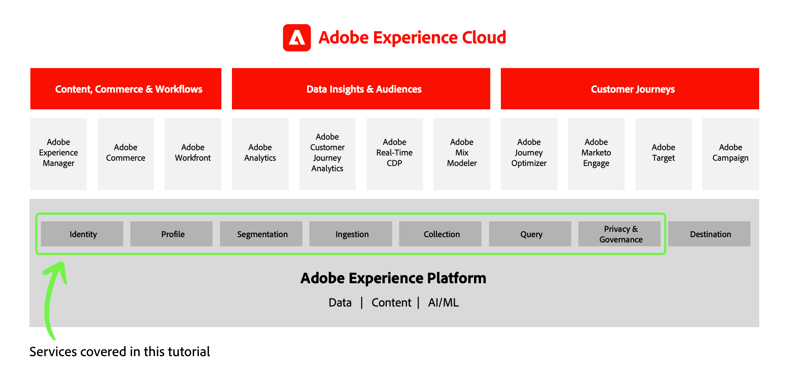

# 데이터 설계자 및 데이터 엔지니어를 위한 Adobe Experience Platform 시작하기

<!--5min-->

_데이터 설계자 및 데이터 엔지니어를 위한 Adobe Experience Platform 시작하기_&#x200B;는 Experience Platform을 직접 체험할 수 있는 완벽한 시작점입니다.

<!--How do we address ETL-->

## 학습 목표

성공적인 Experience Platform 배포를 위해서는 데이터 설계자와 데이터 엔지니어가 긴밀히 협력해야 합니다. 이 실습형 튜토리얼에서는 _두 역할_&#x200B;이 실행하는 주요 작업을 알려주므로 비즈니스를 위한 플랫폼 구현을 시작하는 방법에 대해 알아봅니다. Experience Platform의 주요 용어, 기능, 인터페이스 및 API를 소개하는 연습을 안내합니다. Real-time Customer Data Platform, Customer Journey Analytics 및 Journey Optimizer과 같은 Adobe Experience Cloud 애플리케이션의 고객도 이 콘텐츠를 유용하게 사용할 수 있습니다. 플랫폼 서비스는 이들 애플리케이션의 중요한 기반이기 때문입니다.

주제는 다음과 같습니다.

* 사용자 권한 구성
* 샌드박스 만들기
* Developer Console 프로젝트 설정 및 Platform API 사용
* 스키마, 데이터 세트, ID, 병합 정책 및 데이터 거버넌스 생성 등 데이터 관리
* 일괄 처리 및 스트리밍 모드를 사용한 데이터 수집
* Adobe Experience Platform Web SDK를 사용하여 웹 데이터 캡처
* 실시간 고객 프로필 구축
* 쿼리 서비스를 사용하여 데이터의 유효성을 검사하고 데이터 추출
* 세그먼트 작성

## 비즈니스 시나리오

Adobe Experience Platform은 마케팅 목표를 달성하는 데 도움이 되도록 설계된 기술 플랫폼입니다. 비즈니스 사용 사례는 기술 설계 및 구현 방법을 주도해야 합니다. 이 튜토리얼은 Luma라는 가상의 소매 브랜드에 중점을 둡니다. Luma는 여러 국가에서 오프라인 매장을 운영하고 있으며 웹 사이트 및 모바일 앱을 통해 온라인으로 참여할 수 있습니다. Adobe Experience Platform에 투자하여 충성도, CRM, 웹 및 오프라인 구매 데이터를 실시간 고객 프로필에 결합하고 이러한 프로필을 활성화하여 마케팅을 한 차원 더 발전시키고 있습니다. Luma의 비즈니스 목표는 귀사의 목표와 일치하거나 일치하지 않을 수 있지만, 이 자습서의 실습 단계를 귀사의 비즈니스 목표와 연결할 수 있어야 합니다.

## 전제 조건

* Experience League에서 [Adobe Experience Platform 소개 강의](https://experienceleague.adobe.com/?recommended=ExperiencePlatform-U-1-2020.1)를 완료했으며 플랫폼 기능에 익숙합니다
* Adobe Experience Platform(또는 Real-Time CDP 또는 Journey Optimizer과 같은 플랫폼 기반 애플리케이션) 및 데이터 수집(이전 Launch)으로 프로비저닝된 계정에 액세스할 수 있습니다.
* 해당 계정의 시스템 관리자이거나 [사용자 권한을 구성](configure-permissions.md)할 수 있습니다.

## 이 자습서 사용

이 자습서에서는 데이터 엔지니어와 데이터 설계자 모두의 작업을 결합합니다. 소개 수준의 튜토리얼이므로 두 역할에 대한 작업을 모두 완료할 수 있어야 합니다. 많은 단원이 이전 단원에서 구현된 내용을 기반으로 하기 때문에 단원을 순서대로 진행해야 합니다. 빠질 수 있는 레슨을 다시 불러오겠습니다.

이 자습서 중에 다양한 플랫폼 요소를 만들 때 최대한 권장하는 이름을 사용하십시오. 그러나 조직에서 이 자습서를 동시에 수강하는 사람이 여러 명인 경우 사용자 지정할 수 있는 높은 수준의 요소 이름이 몇 개 있습니다. 예를 들어, &quot;Luma 튜토리얼 플랫폼&quot; 대신 Platform 샌드박스의 이름을 &quot;Luma 튜토리얼 플랫폼 - Ignatius J Reilly&quot;로 지정할 수 있습니다.

문제가 발생하면 먼저 지침을 다시 읽은 다음 각 페이지의 사이드바에 있는  링크를 사용하여 내게 연락하십시오.

## 기술 참고 사항

### 샌드박스 환경

자습서에서는 샌드박스 환경을 만들고 이 환경을 사용하여 연습을 완료합니다. 샌드박스 환경을 사용하면 프로덕션 데이터 손상에 대한 걱정 없이 연습 및 실험을 안전하게 완료할 수 있습니다.

### API

플랫폼은 API를 기반으로 구축됩니다. 인터페이스 워크플로우는 모든 주요 플랫폼 워크플로에 대해 존재하며 주로 사용되지만, 자습서에는 몇 가지 API 중심 연습이 포함되어 있습니다. Adobe Developer Console의 기본 프로젝트 설정을 안내하고 Platform API를 시작할 수 있는 [!DNL Postman] 환경 및 컬렉션을 제공합니다. 자습서를 완료한 후 Platform API를 숙지하고 자체 배포에서 사용하는 것이 유용할 수 있습니다.

### 타사 기술

이 자습서에서는 여러 기술을 사용하지만 거의 완전히 Adobe 에코시스템 내에 있게 됩니다. 자체 플랫폼 구현에서는 Platform을 특정 타사 기술과 통합할 수 있습니다. 모든 고객과 관련된 이 자습서를 유지하기 위해 보다 일반적인 구현을 사용합니다.

## 튜토리얼 업데이트

* 2023년 6월: 새 권한 워크플로를 포함하고 OAuth 서버 간 API 자격 증명을 사용하도록 업데이트되었습니다

이제 첫 번째 단원([권한 구성](configure-permissions.md))으로 넘어가겠습니다.
