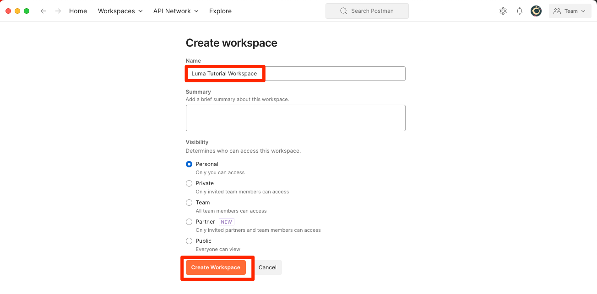

# Developer Console 및 [!DNL Postman] 설정

<!--30min-->

이 단원에서는 Platform API를 사용할 수 있도록 Adobe Developer Console에서 프로젝트를 설정하고 [!DNL Postman] 컬렉션을 다운로드합니다.

이 자습서에서 API 연습을 완료하려면 [운영 체제용 Postman 앱을 다운로드하십시오.](https://www.postman.com/downloads/) Experience Platform API를 사용하는 데 필요하지 않지만, Postman을 사용하면 API 워크플로가 더 쉬워지며, Adobe Experience Platform에서는 API 호출을 실행하고 작동 방법을 학습하는 데 도움이 되는 수십 개의 Postman 컬렉션을 제공합니다. 이 자습서의 나머지 부분에서는 Postman에 대한 일부 작업 지식을 가정합니다. 도움이 필요하면 [Postman 설명서](https://learning.postman.com/)를 참조하십시오.

플랫폼은 API를 기반으로 구축됩니다. 인터페이스 옵션은 모든 주요 작업에 대해 존재하지만, 어느 시점에서 Platform API를 사용할 수도 있습니다. 예를 들어 사용자 인터페이스가 구축되기 전에 데이터를 수집하거나 샌드박스 간에 항목을 이동하고 일상적인 작업을 자동화하거나 새 Platform 기능을 사용합니다.

**데이터 설계자** 및 **데이터 엔지니어**&#x200B;는 이 자습서 외부에서 Platform API를 사용해야 할 수 있습니다.

## 권한 필요

[권한 구성](configure-permissions.md) 단원에서 이 단원을 완료하는 데 필요한 모든 액세스 제어를 설정합니다.

<!--
* Permission item Sandboxes > `Luma Tutorial`
* Developer-role access to the `Luma Tutorial Platform` product profile
-->

## Adobe Developer Console 설정

Adobe Developer Console은 Adobe API 및 SDK에 액세스하거나, 실시간에 가까운 이벤트를 듣거나, 런타임에 함수를 실행하거나, 플러그인 또는 App Builder 애플리케이션을 빌드할 수 있는 개발자 대상입니다. 이 플러그인을 사용하여 Experience Platform API에 액세스합니다. 자세한 내용은 [Adobe Developer Console 설명서](https://www.adobe.io/apis/experienceplatform/console/docs.html)를 참조하세요.

1. 로컬 컴퓨터에 자습서에서 사용되는 파일에 대한 `Luma Tutorial Assets` 폴더를 만듭니다.

1. [Adobe Developer Console](https://console.adobe.io){target="_blank"} 열기

1. 로그인하고 올바른 조직에 속해 있는지 확인하십시오

1. [!UICONTROL 빠른 시작] 메뉴에서 **[!UICONTROL 새 프로젝트 만들기]**&#x200B;를 선택합니다.

   

1. 새로 만든 프로젝트에서 **[!UICONTROL 프로젝트 편집]** 단추를 선택합니다.
1. **[!UICONTROL 프로젝트 제목]**&#x200B;을(를) `Luma Tutorial API Project`(으)로 변경합니다(회사의 여러 사람이 이 자습서를 수강하는 경우 마지막에 이름을 추가하십시오.).
1. **[!UICONTROL 저장]** 선택

   

1. **[!UICONTROL API 추가]** 선택

   

1. **[!UICONTROL Adobe Experience Platform]**&#x200B;을(를) 선택하여 목록 필터링

1. 사용 가능한 API 목록에서 **[!UICONTROL Experience Platform API]**&#x200B;를 선택하고 **[!UICONTROL 다음]**&#x200B;을(를) 선택합니다.

   

1. **[!UICONTROL OAuth 서버 간]**&#x200B;을(를) 자격 증명으로 선택하고 **[!UICONTROL 다음]**&#x200B;을(를) 선택합니다.
   

1. `AEP-Default-All-Users` 제품 프로필을 선택하고 **[!UICONTROL 구성된 API 저장]**&#x200B;을 선택합니다.

   

1. 이제 Developer Console 프로젝트가 생성되었습니다!

1. 페이지의 **[!UICONTROL 사용해 보기]** 섹션에서 **[!UICONTROL Postman용 다운로드]**&#x200B;를 선택한 다음 **[!UICONTROL OAuth 서버 간 다운로드]**&#x200B;를 선택하여 [!DNL Postman] 환경 json 파일을 다운로드합니다. `Luma Tutorial Assets` 폴더에 `oauth_server_to_server.postman_environment.json`을(를) 저장합니다.

   

## 시스템 관리자가 역할에 API 자격 증명을 추가하도록 합니다

API 자격 증명을 사용하여 Experience Platform과 상호 작용하려면 시스템 관리자가 이전 단원에서 만든 역할에 API 자격 증명을 할당하도록 해야 합니다.  시스템 관리자가 아닌 경우 다음 메시지를 보냅니다.

1. API 자격 증명의 [!UICONTROL 이름] (`Credential in Luma Tutorial API Project`)
1. 자격 증명의 [!UICONTROL 기술 계정 전자 메일] (시스템 관리자가 자격 증명을 찾는 데 도움이 됨)

   자격 증명의 ![[!UICONTROL 이름] 및 [!UICONTROL 기술 계정 전자 메일]](assets/postman-credentialDetails.png)

다음은 시스템 관리자의 지침입니다.

1. [Adobe Experience Platform](https://platform.adobe.com)에 로그인
1. 왼쪽 탐색에서 **[!UICONTROL 권한]**&#x200B;을 선택하면 [!UICONTROL 역할] 화면으로 이동합니다.
1. `Luma Tutorial Platform` 역할 열기
   
1. **[!UICONTROL API 자격 증명]** 탭을 선택합니다.
1. **[!UICONTROL API 자격 증명 추가]** 선택
   
1. 목록이 길면 튜토리얼 참가자가 제공한 [!UICONTROL 기술 계정 전자 메일]로 필터링하여 `Credential in Luma Tutorial API Project` 자격 증명을 찾습니다
1. 자격 증명 선택
1. **[!UICONTROL 저장]** 선택

   

## Postman 설정

>[!CAUTION]
>
>Postman 인터페이스는 정기적으로 업데이트됩니다. 이 자습서의 스크린샷은 Mac용 Postman v10.15.1로 촬영되었지만 인터페이스 옵션이 변경되었을 수 있습니다.

1. [[!DNL Postman]](https://www.postman.com/downloads/) 다운로드 및 설치
1. [!DNL Postman]을(를) 열고 작업 영역 만들기
   

1. 다운로드한 JSON 환경 파일 `oauth_server_to_server.postman_environment.json` 가져오기
   
1. [!DNL Postman]의 드롭다운에서 환경을 선택합니다.

1. 아이콘을 선택하여 환경 변수를 확인합니다.

   

### 샌드박스 이름 및 테넌트 ID 추가

`SANDBOX_NAME`, `TENANT_ID` 및 `CONTAINER_ID` 변수는 Adobe Developer Console 내보내기에 포함되지 않으므로 수동으로 추가합니다.

1. [!DNL Postman]에서 **환경 변수**&#x200B;를 엽니다.
1. 환경 이름 오른쪽에 있는 **편집** 링크를 선택하십시오.
1. **새 변수 추가 필드**&#x200B;에서 `SANDBOX_NAME`을(를) 입력하십시오.
1. 두 값 필드 모두에 이전 단원에서 샌드박스에 지정한 이름인 `luma-tutorial`을(를) 입력합니다. 예를 들어 luma-tutorial-ignatiusjreilly와 같은 샌드박스에 다른 이름을 사용한 경우 해당 값을 사용해야 합니다.
1. **새 변수 추가 필드**&#x200B;에서 `TENANT_ID`을(를) 입력하십시오.
1. 웹 브라우저로 전환하고 Experience Platform 인터페이스로 이동하여 @ 기호&#x200B;*뒤에 있는 URL*&#x200B;의 일부를 추출하여 회사의 테넌트 ID를 조회합니다. 예를 들어 내 테넌트 ID는 `techmarketingdemos`이지만 사용자의 테넌트 ID는 다릅니다.

   

1. 이 값을 복사하고 [!DNL Postman] 환경 관리 화면으로 돌아갑니다.
1. 두 값 필드 모두에 테넌트 ID 붙여넣기
1. **새 변수 추가 필드**&#x200B;에서 `CONTAINER_ID`을(를) 입력하십시오.
1. 두 값 필드 모두에 `global`을(를) 입력하십시오.

   >[!NOTE]
   >
   >`CONTAINER_ID`은(는) 자습서 중에 값이 여러 번 변경되는 필드입니다. `global`을(를) 사용하면 API가 Platform 계정의 Adobe 제공 요소와 상호 작용합니다. `tenant`을(를) 사용하면 API가 사용자 지정 요소와 상호 작용합니다.

1. **저장** 선택

   

## API 호출 만들기

### 액세스 토큰 검색

Adobe은 Experience Platform의 API를 탐색하는 데 도움이 되는 다양한 [!DNL Postman] 컬렉션 집합을 제공합니다. 이러한 컬렉션은 [Adobe Experience Platform Postman 샘플 GitHub 저장소](https://github.com/adobe/experience-platform-postman-samples)에 있습니다. 이 자습서 전체에서 이 리포지토리를 여러 번 사용하고 나중에 회사에 대한 Experience Platform을 구현할 때 이 리포지토리를 책갈피로 지정해야 합니다.

첫 번째 컬렉션은 Adobe Identity Management 서비스(IMS) API와 함께 작동합니다. Postman 내에서 액세스 토큰을 검색하는 편리한 방법입니다.

액세스 토큰을 생성하려면:

1. `Luma Tutorial Assets` 폴더에 [Identity Management 서비스 API 컬렉션](https://github.com/adobe/experience-platform-postman-samples/blob/master/apis/ims/Identity%20Management%20Service.postman_collection.json)을(를) 다운로드합니다.
1. 컬렉션을 [!DNL Postman] (으)로 가져오기
1. 요청 **oAuth: 액세스 토큰 요청** 요청을 선택하고 **보내기**&#x200B;를 선택합니다.
1. 응답에 액세스 토큰이 있는 `200 OK` 응답을 가져와야 합니다.

   

1. 액세스 토큰은 [!DNL Postman] 환경의 **ACCESS_TOKEN** 환경 변수로 자동으로 저장되어야 합니다.

   

### Platform API와 상호 작용

이제 모든 것이 올바르게 구성되었는지 확인하기 위해 Platform API 호출을 만들겠습니다.

GitHub에서 [Experience Platform [!DNL Postman] 컬렉션을 엽니다](https://github.com/adobe/experience-platform-postman-samples/tree/master/apis/experience-platform). 이 페이지에는 다양한 Platform API에 대한 많은 컬렉션이 있습니다. 북마킹을 강력히 추천합니다

이제 첫 번째 API 호출을 만들어 보겠습니다.

1. `Luma Tutorial Assets` 폴더에 [스키마 레지스트리 API 컬렉션](https://raw.githubusercontent.com/adobe/experience-platform-postman-samples/master/apis/experience-platform/Schema%20Registry%20API.postman_collection.json)을(를) 다운로드합니다.
1. [!DNL Postman] (으)로 가져오기
1. **스키마 레지스트리 API > 스키마 > 스키마 목록** 열기
1. **Params** 및 **Headers** 탭을 보고 이전에 입력한 환경 변수 중 일부를 포함하는 방법을 참고하십시오.
1. **헤더 > 값 수락 필드**&#x200B;이(가) `application/vnd.adobe.xed-id+json`(으)로 설정되어 있습니다. 스키마 레지스트리 API에는 응답에서 다른 형식을 제공하는 [지정된 Accept 헤더 값](https://experienceleague.adobe.com/docs/experience-platform/xdm/api/getting-started.html?lang=ko#accept) 중 하나가 필요합니다.
1. **보내기**&#x200B;를 선택하여 첫 번째 Platform API를 호출하십시오!

아래 그림과 같이 샌드박스에서 사용 가능한 Adobe 제공 XDM 스키마 목록이 포함된 `200 OK` 응답을 받았으면 합니다.

호출이 성공하지 못한 경우 잠시 API 호출의 오류 응답 세부 정보를 사용하여 디버깅하고 위의 단계를 검토하십시오. 문제가 발생하면 [커뮤니티 포럼](https://experienceleaguecommunities.adobe.com/t5/adobe-experience-platform/ct-p/adobe-experience-platform-community?profile.language=ko)에서 도움을 요청하거나 이 페이지 오른쪽의 링크를 사용하여 &quot;문제를 기록하십시오.&quot;를 참조하십시오.

Platform 권한, 샌드박스 및 [!DNL Postman]이(가) 설정되면 [스키마에서 데이터를 모델링](model-data-in-schemas.md)할 준비가 된 것입니다!
