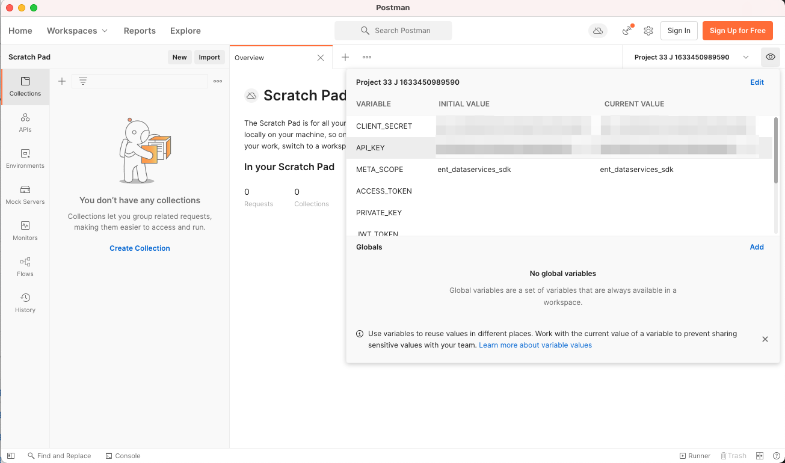

# 개발자 콘솔 설정 및 [!DNL Postman]

<!--30min-->

이 단원에서는 Adobe Developer 콘솔에서 프로젝트를 설정하고 다운로드합니다 [!DNL Postman] 컬렉션 을 통해 Platform API 사용을 시작할 수 있습니다.

이 자습서에서 API 연습을 완료하려면 [운영 체제용 Postman 앱을 다운로드합니다.](https://www.postman.com/downloads/) Experience Platform API를 사용하기 위해 필요하지 않지만 Postman을 사용하면 API 워크플로우를 보다 쉽게 만들 수 있고 Adobe Experience Platform에서는 API 호출을 실행하고 작동 방법을 학습하는 데 도움이 되는 수십 개의 Postman 컬렉션을 제공합니다. 이 자습서의 나머지 부분에서는 Postman에 대한 작업 지식을 가정합니다. 도움이 필요하면 다음을 참조하십시오. [Postman 설명서](https://learning.postman.com/).

플랫폼이 API부터 빌드됩니다. 모든 주요 작업에 대한 인터페이스 옵션도 있지만 어느 시점에서 플랫폼 API를 사용할 수 있습니다. 예를 들어, 데이터를 수집하거나, 샌드박스 간에 항목을 이동하거나, 일상적인 작업을 자동화하거나, 사용자 인터페이스가 빌드되기 전에 새로운 Platform 기능을 사용할 수 있습니다.

**데이터 설계자** 및 **데이터 엔지니어** 이 자습서에서 외부에서 Platform API를 사용해야 할 수도 있습니다.

## 필요한 권한

에서 [권한 구성](configure-permissions.md) 이 단원을 완료하는 데 필요한 모든 액세스 컨트롤을 설정합니다.

<!--
* Permission item Sandboxes > `Luma Tutorial`
* Developer-role access to the `Luma Tutorial Platform` product profile
-->

## Adobe Developer 콘솔 설정

Adobe Developer 콘솔은 Adobe API 및 SDK에 액세스하고, 거의 실시간으로 이벤트를 수신하거나, 런타임 시 함수를 실행하거나, 플러그인 또는 App Builder 앱을 빌드할 수 있는 개발자 대상입니다. 이 파일을 사용하여 Experience Platform API에 액세스합니다. 자세한 내용은 [Adobe Developer 콘솔 설명서](https://www.adobe.io/apis/experienceplatform/console/docs.html)

1. 이름이 인 로컬 컴퓨터에서 폴더를 만듭니다. `Luma Tutorial Assets` 를 참조하십시오.

1. 를 엽니다. [Adobe Developer 콘솔](https://console.adobe.io)

1. 로그인한 다음 올바른 조직에 있는지 확인하십시오

1. 선택 **[!UICONTROL 새 프로젝트 만들기]** in [!UICONTROL 빠른 시작] 메뉴 아래의 제품에서 사용할 수 있습니다.

   

1. 새로 만든 프로젝트에서 **[!UICONTROL 프로젝트에 추가]** 단추를 누른 다음 **[!UICONTROL API]**

   

1. 목록을 선택하여 필터링 **[!UICONTROL Adobe Experience Platform]**

1. 사용 가능한 API 목록에서 를 선택합니다. **[!UICONTROL Experience Platform API]** 을(를) 선택합니다. **[!UICONTROL 다음]**.

   

1. 외부 시스템 인증 [!DNL Postman], 공개/개인 키 쌍이 필요합니다. 새 키 쌍을 생성하려면 **[!UICONTROL 옵션 1]**  그리고 **[!UICONTROL 키 쌍 생성]** 버튼

   

1. 키가 준비되면 로컬 컴퓨터에 키를 다운로드하라는 메시지가 표시될 수 있습니다. 패키지된 키를 저장합니다. `config.zip` 폴더로 `Luma Tutorial Assets`. 다음 연습에서는 필요하실 거예요

1. 키가 생성되면 스크린샷에 표시된 대로 공개 키가 프로젝트에 자동으로 추가됩니다. 을(를) 선택합니다 **[!UICONTROL 다음]** 버튼을 클릭합니다.

   

1. 을(를) 선택합니다 `Luma Tutorial Platform` 제품 프로필을 선택하고 **[!UICONTROL 구성된 API 저장]** 버튼

   

1. 이제 개발자 콘솔 프로젝트가 생성되었습니다!

1. 에서 **[!UICONTROL 사용해 보세요]** 페이지의 섹션에서 **[!UICONTROL Postman 다운로드]** 그런 다음 **[!UICONTROL 서비스 계정(JWT)]** 를 다운로드하려면 [!DNL Postman] 환경 json 파일입니다. 를 저장합니다 `service.postman_environment.json` 다음 위치에서 `Luma Tutorial Assets` 폴더를 입력합니다.

   

   >[!NOTE]
   >
   >조직의 시스템 관리자는 Admin Console의 제품 프로필에서 프로젝트를 &quot;API 자격 증명&quot;으로 볼 수 있습니다
   >
   >

프로젝트에 번호가 할당되었음을 알 수 있습니다(예: &quot;프로젝트 12&quot;).

1. 이동 경로에서 프로젝트 번호를 선택합니다
1. 을(를) 선택합니다 **[!UICONTROL 프로젝트 편집]** 버튼
1. 변경 **[!UICONTROL 프로젝트 제목]** to `Luma Tutorial API Project` (회사의 여러 사용자가 이 자습서를 사용하고 있는 경우 끝에 이름을 추가합니다.)
1. **[!UICONTROL 저장]** 버튼을 선택합니다

   

## Postman 설정

>[!CAUTION]
>
>Postman 인터페이스는 정기적으로 업데이트됩니다. 이 자습서의 스크린샷은 Mac용 Postman v9.0.5에서 찍었지만 인터페이스 옵션이 변경되었을 수 있습니다.

1. 다운로드 및 설치 [[!DNL Postman]](https://www.postman.com/downloads/)
1. 열기 [!DNL Postman] 다운로드한 json 환경 파일, `service.postman_environment.json`
   
1. in [!DNL Postman]를 클릭하고 드롭다운에서 환경을 선택합니다.

   
1. 을(를) 선택합니다 **눈** 아이콘을 사용하여 환경 변수를 확인합니다.

   

### 환경 이름 업데이트

개발자 콘솔에서 내보낸 환경 이름은 임의로 생성되므로 실제 플랫폼 구현 작업을 시작할 때 나중에 환경을 혼동하지 않도록 좀 더 설명적인 이름을 지정합니다.

1. 환경 변수 화면이 계속 열려 있는 상태에서 를 선택합니다 **편집** 오른쪽 위에
1. 업데이트 **환경 이름** to `Luma Tutorial`
1. Leave **환경 관리** 모달을 편집 모드로 연 후 다음 단계에서 추가로 편집할 예정입니다

   

### 개인 키 추가

이제 Postman 환경에 PRIVATE_KEY 값을 추가할 차례입니다

1. 다운로드한 컨텐츠를 추출합니다 `config.zip` 개발자 콘솔 프로젝트를 만드는 동안 이전 연습에서 생성된 파일입니다. 이 zip에는 다음 두 파일이 포함되어 있습니다.
   * `private.key`
   * `certificate_pub.crt`
1. 를 엽니다. `private.key` 파일을 텍스트 편집기에 넣고 컨텐츠를 복사합니다.
1. Postman에서 **환경 관리** > **편집** 마지막 연습에서 아직 열려 있는 모달에서 복사한 값을 **PRIVATE_KEY** 에서 **초기값** 및 **현재 값** 열.
1. **저장**&#x200B;을 선택합니다

   

### JWT 및 액세스 토큰 추가

Adobe은 다양한 [!DNL Postman] 컬렉션으로 Experience Platform의 API를 탐색할 수 있습니다. 이러한 컬렉션은 [Adobe Experience Platform Postman 샘플 GitHub 리포지토리](https://github.com/adobe/experience-platform-postman-samples). 이 자습서에서 여러 번 사용하고 나중에 회사를 위한 Experience Platform을 구현할 때 이 보고서를 책갈피로 지정해야 합니다.

첫 번째 컬렉션은 IMS(Adobe Identity Management Service) API에서 작동합니다. Postman 내에서 JWT_TOKEN 및 ACCESS_TOKEN을 채우는 편리한 방법입니다 *비프로덕션 사용 사례* 샌드박스에서 이 자습서 완료 등. 또는 Adobe Developer 콘솔 내에서 JWT 토큰을 생성할 수 있습니다. 그러나 이 컬렉션이 정기적으로 만료되므로 이 자습서를 완료하는 동안 Adobe Developer 콘솔을 다시 방문하지 않고도 이 컬렉션을 새로 고칠 수 있습니다.

>[!WARNING]
>
>에 언급된 대로 [Adobe Identity Management 서비스 API README](https://github.com/adobe/experience-platform-postman-samples/tree/master/apis/ims)를 지칭하는 생성 방법은 비프로덕션 사용에 적합합니다. 로컬 서명은 타사 호스트에서 JavaScript 라이브러리를 로드하고 원격 서명은 개인 키를 소유 및 운영되는 웹 서비스로 보냅니다. Adobe은 이 개인 키를 저장하지 않지만 프로덕션 키는 다른 사람과 공유해서는 안 됩니다.

토큰을 생성하려면:

1. 다운로드 [개발자 콘솔 액세스 토큰 생성 컬렉션](https://raw.githubusercontent.com/adobe/experience-platform-postman-samples/master/apis/ims/Identity%20Management%20Service.postman_collection.json) 아래와 같이 `Luma Tutorial Assets` 폴더
1. 컬렉션 가져오기 [!DNL Postman]
1. 요청을 선택합니다 **IMS: 사용자 토큰을 통한 JWT 생성 + 인증** 을(를) 선택합니다. **보내기**

   
1. 다음 **JWT_TOKEN** 및 **ACCESS_TOKEN** 의 환경 변수에 자동으로 채우기 [!DNL Postman].

   

### 샌드박스 이름 및 테넌트 ID 추가

다음 `SANDBOX_NAME` 및 `TENANT_ID` 및 `CONTAINER_ID` 변수는 Adobe Developer 콘솔 내보내기에 포함되지 않으므로 수동으로 추가합니다.

1. in [!DNL Postman]를 열고 **환경 변수**
1. 을(를) 선택합니다 **편집** 환경 이름의 오른쪽에 연결되는 링크
1. 에서 **새 변수 필드 추가**, 입력 `SANDBOX_NAME`
1. 두 값 필드에 를 입력합니다. `luma-tutorial`이전 단원에서 샌드박스에 지정한 이름입니다. 샌드박스의 다른 이름(예: luma-tutorial-ignatisjreilly)을 사용한 경우 해당 값을 사용해야 합니다.
1. 에서 **새 변수 필드 추가**, 입력 `TENANT_ID`
1. 웹 브라우저로 전환하고 Experience Platform 인터페이스로 이동하여 URL의 부분을 추출하여 회사의 테넌트 ID를 찾습니다 *@ 기호 후*. 예를 들어, 내 테넌트 ID는 `techmarketingdemos` 하지만 당신의 것은 다릅니다.

   

1. 이 값을 복사하여 [!DNL Postman] 환경 관리 화면
1. 테넌트 ID를 두 값 필드에 모두 붙여넣기
1. 에서 **새 변수 필드 추가**, 입력 `CONTAINER_ID`
1. Enter 키 `global` 두 값 필드 모두

   >[!NOTE]
   >
   >`CONTAINER_ID` 는 자습서 중에 값이 여러 번 변경되는 필드입니다. When `global` 를 사용하면 API가 Platform 계정의 Adobe 제공 요소와 상호 작용합니다. When `tenant` 를 사용하면 API가 고유한 사용자 지정 요소와 상호 작용합니다.

1. **저장**&#x200B;을 선택합니다

   

## 플랫폼 API 호출 만들기

이제 플랫폼 API 호출을 수행하여 모든 것이 올바르게 구성되었는지 확인하겠습니다.

를 엽니다. [Experience Platform [!DNL Postman] GitHub의 컬렉션](https://github.com/adobe/experience-platform-postman-samples/tree/master/apis/experience-platform). 이 페이지에는 다양한 Platform API에 대한 많은 컬렉션이 있습니다. 책갈피를 하는 것이 좋습니다

이제 첫 번째 API 호출을 수행해 보겠습니다.

1. 다운로드 [스키마 레지스트리 API 컬렉션](https://raw.githubusercontent.com/adobe/experience-platform-postman-samples/master/apis/experience-platform/Schema%20Registry%20API.postman_collection.json) 아래와 같이 `Luma Tutorial Assets` 폴더
1. 로 가져옵니다. [!DNL Postman]
1. 열기 **스키마 레지스트리 API > 클래스 > 목록 클래스**
1. 을(를) 봅니다. **매개 변수** 및 **머리글** 탭 및 정보에 이전에 입력한 환경 변수 중 일부가 어떻게 포함되는지 확인합니다.
1. 다음 사항에 유의하십시오. **Headers > Accept value 필드** 가 로 설정되어 있습니다. `application/vnd.adobe.xed-id+json`. 스키마 레지스트리 API에는 다음 중 하나가 필요합니다 [지정한 헤더 값 수락](https://experienceleague.adobe.com/docs/experience-platform/xdm/api/getting-started.html?lang=en#accept) 응답에서 다른 형식을 제공합니다.
1. 선택 **보내기** 첫 번째 플랫폼 API를 호출하려면 다음을 수행하십시오!

성공하셨기를 바랍니다 `200 OK` 아래 그림과 같이 샌드박스에서 사용할 수 있는 표준 XDM 클래스 목록이 포함된 응답입니다.

호출이 실패하면 API 호출의 오류 응답 세부 사항을 사용하여 디버깅하고 위의 단계를 검토하십시오. 문제가 발생하면 [커뮤니티 포럼](https://experienceleaguecommunities.adobe.com/t5/adobe-experience-platform/ct-p/adobe-experience-platform-community) 또는 이 페이지의 오른쪽에 있는 링크를 사용하여 &quot;문제 기록&quot;을 참조하십시오.

플랫폼 권한, 샌드박스 및 [!DNL Postman] 설정, 준비 [스키마의 모델 데이터](model-data-in-schemas.md)!
