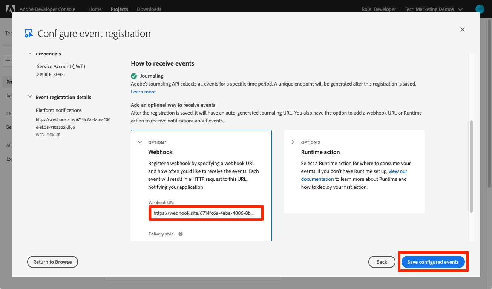

# 데이터 수집 이벤트에 가입

<!--25min-->

이 단원에서는 Adobe Developer 콘솔 및 온라인 웹 후크 개발 도구를 사용하여 웹 후크를 설정하여 데이터 수집 이벤트에 구독합니다. 이 이벤트를 사용하여 후속 단원에서 데이터 수집 작업의 상태를 모니터링합니다.

**데이터 엔지니어** 은 이 자습서의 외부에서 데이터 수집 이벤트에 가입하려고 합니다.
**데이터 설계자** _이 단원을 건너뛸 수 있습니다._ 그리고 [배치 수집 단원](ingest-batch-data.md).

## 필요한 권한

에서 [권한 구성](configure-permissions.md) 단원에서 이 단원을 완료하는 데 필요한 모든 액세스 컨트롤을 설정합니다. 특히

<!--* Developer-role access to the `Luma Tutorial Platform` product profile (for API)
-->

>[!IMPORTANT]
>
> 데이터 수집 이벤트에 의해 트리거되는 이러한 알림은 _모든 샌드박스_&#x200B;뿐만 아니라 `Luma Tutorial`. 계정에서도 다른 데이터 수집 이벤트에서 시작된 알림이 표시될 수 있습니다.

## 웹 후크 설정

이 연습에서는 webhook.site라는 온라인 도구를 사용하여 웹 후크를 만듭니다(사용하고자 하는 다른 웹 후크 개발 도구를 자유롭게 대체함).

1. 다른 브라우저 탭에서 웹 사이트를 엽니다. [https://webhook.site/](https://webhook.site/)
1. 나중에 데이터 수집 단원에서 책갈피로 돌아가면 책갈피를 지정해야 하는 고유 URL이 지정됩니다.

   
1. 을(를) 선택합니다 **편집** 위쪽 탐색에 있는 단추
1. 응답 본문으로 을 입력합니다. `$request.query.challenge$`. 이 단원에서 나중에 설정하는 Adobe I/O 이벤트 알림은 웹 후크에 대한 문제를 전송하며 응답 본문에 이 알림을 포함해야 합니다.
1. **저장** 버튼을 선택합니다

   

## 설정

1. 다른 브라우저 탭에서 을(를) 엽니다. [Adobe Developer 콘솔](https://console.adobe.io/)
1. 다음 문서를 엽니다. `Luma Tutorial API Project`
1. 을(를) 선택합니다 **[!UICONTROL 프로젝트에 추가]** 단추를 누른 다음 **[!UICONTROL 이벤트]**

   
1. 목록을 선택하여 필터링 **[!UICONTROL Experience Platform]**
1. 선택 **[!UICONTROL 플랫폼 알림]**
1. 을(를) 선택합니다 **[!UICONTROL 다음]** 버튼
   
1. 모든 이벤트를 선택합니다.
1. 을(를) 선택합니다 **[!UICONTROL 다음]** 버튼
   
1. 다음 화면에서 자격 증명 구성을 선택합니다. **[!UICONTROL 다음]** 단추를 다시 단추
   
1. 로서의 **[!UICONTROL 이벤트 등록 이름]**, 입력 `Platform notifications`
1. 아래로 스크롤하고 을(를) 선택하여 **[!UICONTROL Webhook]** 섹션
1. 로서의 **[!UICONTROL Webhook URL]**&#x200B;에서 값을 붙여넣습니다. **고유한 URL** webhook.site의 필드
1. 을(를) 선택합니다 **[!UICONTROL 구성된 이벤트 저장]** 버튼
   
1. 구성이 저장될 때까지 기다렸다가 `Platform notifications` 이벤트는 웹 후크 세부 정보와 오류 메시지가 없는 상태로 활성 상태입니다
   
1. webhook.site 탭으로 다시 전환합니다. 이제 웹 후크에 대한 첫 번째 요청이 표시되므로 개발자 콘솔 구성이 검증되었습니다.
   

현재는 데이터를 수집할 때 다음 단원에서 이러한 알림에 대해 자세히 알아봅니다.

## 추가 리소스

* [Webhook.site](https://webhook.site/)
* [데이터 수집 알림 설명서](https://experienceleague.adobe.com/docs/experience-platform/ingestion/quality/subscribe-events.html)
* [Adobe I/O 이벤트 시작하기 설명서](https://www.adobe.io/apis/experienceplatform/events/docs.html)

좋아요, 이제 시작하죠 [데이터 수집](ingest-batch-data.md)!
