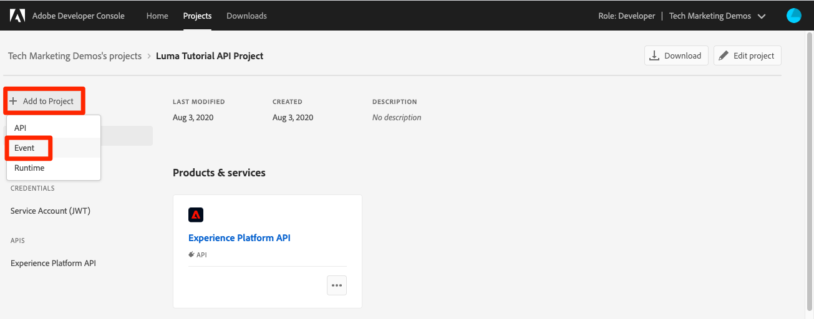

# 데이터 수집 이벤트 구독

<!--25min-->

이 단원에서는 Adobe Developer Console 및 온라인 Webhook 개발 도구를 사용하여 Webhook을 설정하여 데이터 수집 이벤트에 가입합니다. 이러한 이벤트를 사용하여 후속 단원에서 데이터 수집 작업의 상태를 모니터링합니다.

**데이터 엔지니어**는 이 자습서 외부에서 데이터 수집 이벤트를 구독하려고 합니다.
**데이터 설계자** _이 단원을 건너뛰고_&#x200B;다음 [일괄 처리 수집 단원](ingest-batch-data.md)(으)로 이동할 수 있습니다.

## 권한 필요

[권한 구성](configure-permissions.md) 단원에서 이 단원을 완료하는 데 필요한 모든 액세스 제어, 특히 다음을 설정합니다.

<!--* Developer-role access to the `Luma Tutorial Platform` product profile (for API)
-->

>[!IMPORTANT]
>
> 데이터 수집 이벤트에 의해 트리거되는 이러한 알림은 `Luma Tutorial`뿐만 아니라 _모든 샌드박스_&#x200B;에 적용됩니다. 계정의 다른 데이터 수집 이벤트에서 시작된 알림도 표시될 수 있습니다.

## 웹후크 설정

이 연습에서는 webhook.site라는 온라인 도구를 사용하여 웹후크를 만듭니다(사용하려는 다른 웹후크 개발 도구를 언제든지 대체할 수 있음).

1. 다른 브라우저 탭에서 [https://webhook.site/](https://webhook.site/) 웹 사이트를 엽니다.
1. 나중에 데이터 수집 단원에서 반환할 때 책갈피에 추가해야 하는 고유한 URL이 할당됩니다.

   
1. 위쪽 탐색에서 **편집** 단추 선택
1. 응답 본문으로 `$request.query.challenge$`을(를) 입력하십시오. 이 단원의 뒷부분에서 설정한 Adobe I/O 이벤트 알림은 웹후크에 문제를 보내며, 이를 응답 본문에 포함해야 합니다.
1. **저장** 단추 선택

   

## 설정

1. 다른 브라우저 탭에서 [Adobe Developer Console](https://console.adobe.io/)을 엽니다.
1. `Luma Tutorial API Project` 열기
1. **[!UICONTROL 프로젝트에 추가]** 단추를 선택한 다음 **[!UICONTROL 이벤트]**&#x200B;를 선택하십시오.

   
1. **[!UICONTROL Experience Platform]**&#x200B;을(를) 선택하여 목록 필터링
1. **[!UICONTROL 플랫폼 알림]** 선택
1. **[!UICONTROL 다음]** 단추 선택
   
1. 모든 이벤트 선택
1. **[!UICONTROL 다음]** 단추 선택
   
1. 자격 증명을 구성하는 다음 화면에서 **[!UICONTROL 다음]** 단추를 다시 선택하십시오.
   
1. **[!UICONTROL 이벤트 등록 이름]**(으)로 `Platform notifications`을(를) 입력하십시오
1. 아래로 스크롤한 다음 선택하여 **[!UICONTROL Webhook]** 섹션을 엽니다.
1. **[!UICONTROL Webhook URL]**(으)로 webhook.site의 **고유 URL** 필드에 있는 값을 붙여 넣습니다.
1. **[!UICONTROL 구성된 이벤트 저장]** 단추 선택
   
1. 구성이 저장될 때까지 기다리면 `Platform notifications` 이벤트가 Webhook 세부 정보와 함께 활성 상태이고 오류 메시지가 표시되지 않습니다
   
1. webhook.site 탭으로 다시 전환하면 Developer Console 구성의 유효성 검사로 인한 webhook에 대한 첫 번째 요청이 표시됩니다.
   

지금은 데이터를 수집할 때 다음 단원에서 이러한 알림에 대해 자세히 알아봅니다.

## 추가 리소스

* [Webhook.site](https://webhook.site/)
* [데이터 수집 알림 설명서](https://experienceleague.adobe.com/docs/experience-platform/ingestion/quality/subscribe-events.html)
* [Adobe I/O 이벤트 시작 설명서](https://www.adobe.io/apis/experienceplatform/events/docs.html)

이제 [데이터 수집](ingest-batch-data.md)을 시작합니다.
