# 스트리밍 데이터 수집

<!--1hr-->

이 단원에서는 Adobe Experience Platform Web SDK을 사용하여 데이터를 스트리밍합니다.

>[!WARNING]
>
> 이 자습서에 사용된 Luma 웹 사이트는 2026년 2월 16일이 있는 주에 교체될 예정입니다. 이 자습서의 일부로 수행된 작업은 새 웹 사이트에 적용되지 않을 수 있습니다.

데이터 수집 작업에는 두 가지 기본 작업이 있습니다.

* Luma 웹 사이트에서 웹 SDK을 구현하여 고객 이벤트를 Experience Platform Edge Network에 스트리밍합니다.

* Edge Network에서 데이터를 Experience Platform의 `Luma Web Events Dataset`(으)로 전달하도록 데이터 스트림을 구성하십시오.

**데이터 엔지니어**&#x200B;는 이 자습서 외부에서 스트리밍 데이터를 수집해야 합니다. 웹 개발자는 일반적으로 웹 사이트에 웹 SDK을 구현하지만 프로세스가 어떻게 작동하는지 아는 것이 중요합니다. 웹 개발자가 아니더라도 이 기본 구현을 완료할 수 있어야 합니다.

연습을 시작하기 전에 다음 두 개의 짧은 비디오를 통해 스트리밍 데이터 수집 및 웹 SDK에 대해 자세히 알아보십시오.

>[!VIDEO](https://video.tv.adobe.com/v/28425?learn=on&enablevpops)

>[!VIDEO](https://video.tv.adobe.com/v/34141?learn=on&enablevpops)

>[!NOTE]
>
>이 자습서에서는 웹 SDK을 사용하여 웹 사이트에서 스트리밍하는 데 중점을 두고 있지만 [Mobile SDK](https://experienceleague.adobe.com/en/docs/platform-learn/implement-mobile-sdk/overview), [Edge Network Server API](https://experienceleague.adobe.com/en/docs/platform-learn/data-collection/server-api/overview) 및 [HTTP API](https://experienceleague.adobe.com/en/docs/experience-platform/sources/connectors/streaming/http)를 사용하여 데이터를 스트리밍할 수도 있습니다.

## 권한 필요

[권한 구성](configure-permissions.md) 단원에서 이 단원을 완료하는 데 필요한 모든 액세스 제어를 설정합니다.

## 데이터 스트림 구성

먼저 데이터 스트림을 구성하겠습니다. 데이터 스트림은 Experience Platform Edge Network 호출에서 데이터를 받은 후 데이터를 보낼 위치를 SDK에 알려줍니다. 예를 들어 Experience Platform, Adobe Analytics 또는 Adobe Target으로 데이터를 전송하시겠습니까?

[!UICONTROL 데이터스트림]을 만들려면:

1. 아직 ` Luma Tutorial` 샌드박스에 있는지 확인하십시오
1. 왼쪽 탐색에서 **[!UICONTROL 데이터스트림]** 선택
1. 오른쪽 상단에서 **[!UICONTROL 새 데이터 스트림]** 단추를 선택합니다.

   

1. **[!UICONTROL 이름]**&#x200B;에 `Luma Platform Tutorial`을(를) 입력하십시오(회사의 여러 사람이 이 자습서를 수강하는 경우).
1. **[!UICONTROL 저장]** 단추 선택

   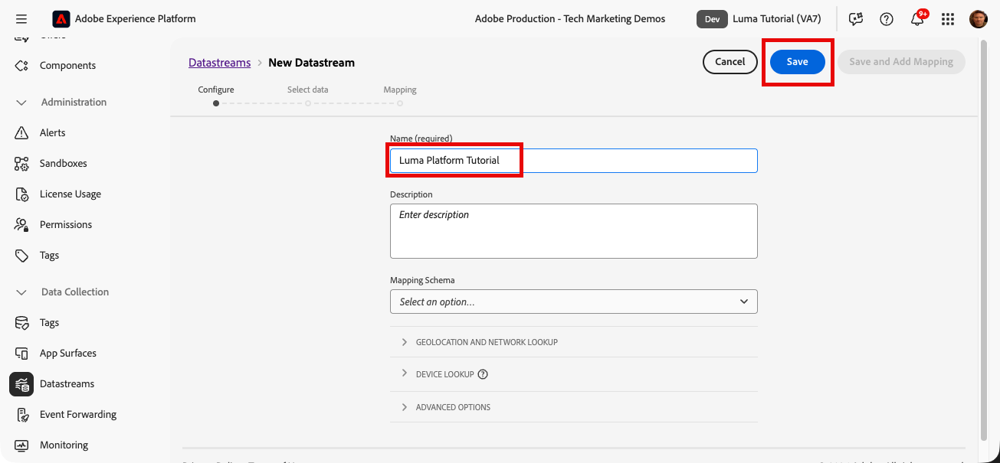

데이터가 Edge에 도착하면 [!UICONTROL 데이터스트림]이 데이터를 구성된 [!UICONTROL 서비스]에 전달합니다. Experience Platform에 데이터를 보내려면 다음을 수행하십시오.

1. **[!UICONTROL 서비스 추가]** 선택
   

1. `Adobe Experience Platform` 선택
1. `Luma Web Events Dataset` 선택
1. **[!UICONTROL 저장]** 선택

   

데이터 스트림 구성에 프로필 데이터 세트 옵션이 있지만 일반 XDM 개별 프로필 데이터를 플랫폼으로 전송하는 데 사용해서는 안 됩니다. 이 설정은 동의, 푸시 토큰 및 사용자 활동 영역 세부 정보를 보내는 데만 사용해야 합니다.

[!UICONTROL Offer Decisioning], [!UICONTROL Edge 세분화], [!UICONTROL Personalization 대상] 및 [!UICONTROL Adobe Journey Optimizer]의 확인란을 사용하여 Edge에서 데이터를 활성화할 수 있지만 이 자습서에서는 사용되지 않습니다.

## 웹 SDK 구현

### 속성 추가

먼저 태그 속성(이전의 태그 속성)을 만들어야 합니다. 속성은 웹 페이지에서 세부 정보를 수집하여 여러 위치로 보내는 데 필요한 모든 JavaScript, 규칙 및 기타 기능을 위한 컨테이너입니다.

속성을 만들려면 다음 작업을 수행하십시오.

1. 왼쪽 탐색에서 **[!UICONTROL 태그]**(으)로 이동
1. **[!UICONTROL 새 속성]** 선택
   
1. **[!UICONTROL 이름]**(으)로 `Luma Platform Tutorial`을(를) 입력하십시오(회사에서 여러 사람이 이 자습서를 수강하는 경우 마지막에 이름을 추가하십시오.)
1. **[!UICONTROL 도메인]**(으)로 `enablementadobe.com` 입력(나중에 설명)
1. **[!UICONTROL 저장]** 선택
   

### 속성에 확장 추가

이제 속성이 있으므로 확장을 사용하여 웹 SDK을 추가할 수 있습니다. 확장은 태그 속성 및 구현에 기능을 추가하는 코드 패키지입니다. 확장을 추가하려면:

1. 태그 속성 열기
1. 왼쪽 탐색에서 **[!UICONTROL 확장]**(으)로 이동
1. **[!UICONTROL 카탈로그]** 탭으로 이동
1. 태그에 사용할 수 있는 확장 프로그램이 많이 있습니다. 용어 `Web SDK`(으)로 카탈로그 필터링
1. **[!UICONTROL Adobe Experience Platform Web SDK]** 확장을 선택하여 사이드 패널을 엽니다
1. **[!UICONTROL 설치]** 단추 선택
   
1. 웹 SDK 확장에는 몇 가지 구성이 사용할 수 있지만, 이 자습서에서는 두 가지 구성만 사용할 수 있습니다. **[!UICONTROL Edge 도메인]**&#x200B;을(를) `data.enablementadobe.com`(으)로 업데이트합니다. 이 설정을 사용하면 웹 SDK 구현을 사용하여 자사 쿠키를 설정할 수 있습니다. 이는 권장되는 현상입니다. 웹 사이트에서 웹 SDK을 구현하는 경우 `data.YOUR_DOMAIN.com`과 같은 고유한 데이터 수집 목적으로 CNAME을 만드는 것이 좋습니다.
1. 프로덕션 환경의 **[!UICONTROL 데이터스트림]** 섹션에서 `Luma Tutorial` 샌드박스 및 `Luma Platform Tutorial` 데이터스트림을 선택합니다.
1. 언제든지 다른 구성 옵션을 보고 **[!UICONTROL 저장]**&#x200B;을 선택하세요.
   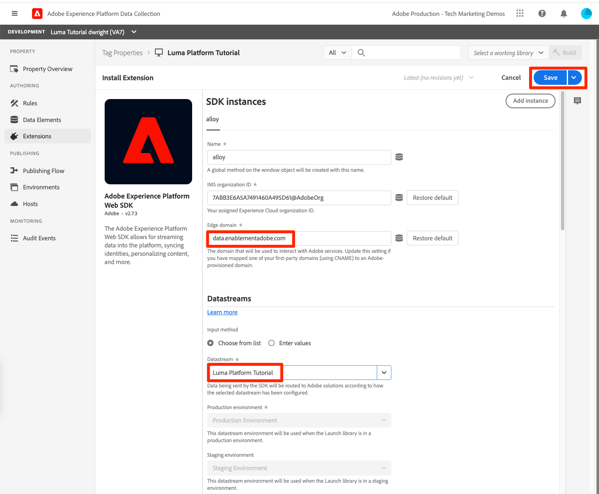

확장 카탈로그 화면에서 Adobe 클라이언트 데이터 레이어 확장을 설치합니다. 이 확장은 Luma 웹 사이트에서 데이터 레이어를 읽는 데 도움이 됩니다.

확장에는 구성이 필요하지 않으므로 라이브러리에 저장하면 됩니다.

## 데이터를 전송할 규칙 만들기

이제 Platform으로 데이터를 전송하는 규칙을 만듭니다. 규칙은 태그에게 작업을 수행하도록 지시하는 이벤트, 조건 및 작업의 조합입니다. 규칙을 만들려면 다음을 수행하십시오.

1. **[!UICONTROL 규칙]**(으)로 이동
1. **[!UICONTROL 새 규칙 만들기]** 단추 선택
   
1. 규칙 이름을 지정합니다 `adobeDataLayer event`
1. **[!UICONTROL 이벤트]**&#x200B;에서 **[!UICONTROL 추가]** 단추를 선택합니다.
   
1. **[!UICONTROL Adobe 클라이언트 데이터 레이어]** **[!UICONTROL 확장 기능]**&#x200B;을 사용하고 **[!UICONTROL 이벤트 유형]**(으)로 **[!UICONTROL 데이터 푸시됨]**&#x200B;을(를) 선택하십시오.
1. **[!UICONTROL 수신 대기]**&#x200B;를 선택합니다. **[!UICONTROL 모든 이벤트]**.
1. 기본 규칙 화면으로 돌아가려면 **[!UICONTROL 변경 내용 유지]**&#x200B;를 선택하십시오.
   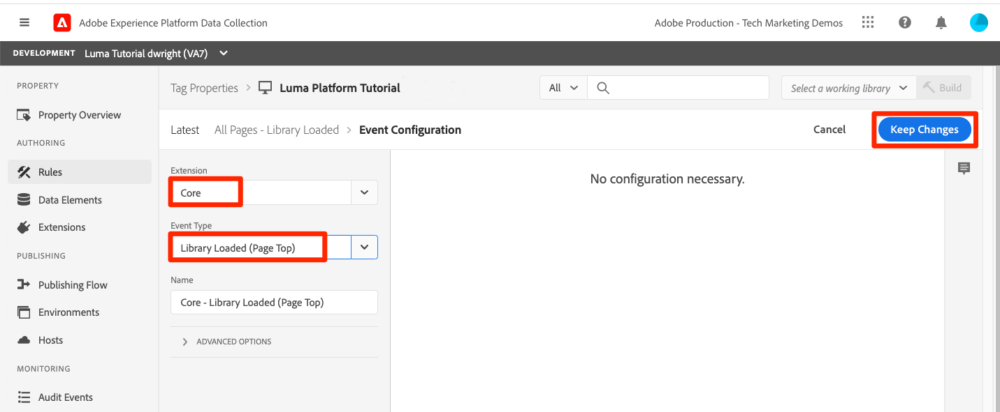
1. **[!UICONTROL 작업]**&#x200B;에서 **[!UICONTROL 추가]** 단추를 선택합니다.
1. **[!UICONTROL Adobe Experience Platform Web SDK]** **[!UICONTROL 확장]**&#x200B;을 사용하고 **[!UICONTROL 작업 유형]**&#x200B;으로 **[!UICONTROL 이벤트 보내기]**&#x200B;를 선택합니다.
1. 오른쪽의 **[!UICONTROL Type]** 드롭다운에서 **[!UICONTROL 웹 Webpagedetails 페이지 보기]**&#x200B;를 선택합니다. `Luma Web Events Schema`의 eventType 필드를 채웁니다.
1. 기본 규칙 화면으로 돌아가려면 **[!UICONTROL 변경 내용 유지]**&#x200B;를 선택하십시오.
   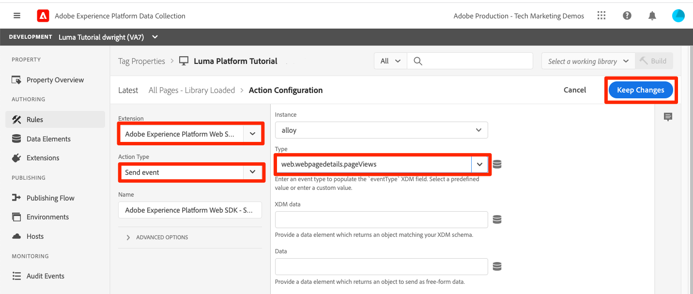
1. 규칙을 저장하려면 **[!UICONTROL 저장]**&#x200B;을 선택하십시오.\
   

## 라이브러리에 규칙 게시

그런 다음 규칙이 작동하는지 확인할 수 있도록 개발 환경에 규칙을 게시합니다.

라이브러리를 만들려면 다음 작업을 수행하십시오.

1. 왼쪽 탐색에서 **[!UICONTROL 게시 흐름]**(으)로 이동
1. **[!UICONTROL 라이브러리 추가]** 선택
   
1. **[!UICONTROL Name]**&#x200B;에 대해 `Luma Platform Tutorial`을(를) 입력하십시오.
1. **[!UICONTROL 환경]**&#x200B;에 대해 `Development`을(를) 선택합니다.
1. **[!UICONTROL 변경된 모든 리소스 추가]** 단추를 선택합니다. [!UICONTROL Adobe Experience Platform Web SDK] 확장 및 `adobeDataLayer event` 규칙 외에 모든 태그 웹 속성에 필요한 기본 JavaScript이 포함된 [!UICONTROL Core] 확장 프로그램도 추가됩니다.
1. **[!UICONTROL 개발을 위한 저장 및 빌드]** 단추 선택
   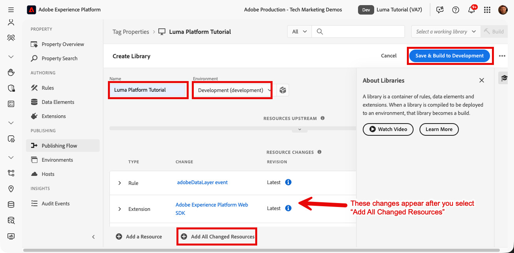

라이브러리를 빌드하는 데 몇 분 정도 소요될 수 있으며 완료되면 라이브러리 이름 왼쪽에 녹색 점이 표시됩니다.

[!UICONTROL 게시 플로우] 화면에서 볼 수 있듯이 게시 프로세스에는 이 자습서의 범위를 벗어나는 많은 내용이 있습니다. 개발 환경에서 단일 라이브러리를 사용할 예정입니다.

## 요청의 데이터 유효성 검사

### Adobe Experience Platform Debugger 추가

Experience Platform Debugger는 웹 페이지에 구현된 Adobe 기술을 확인하는 데 도움이 되는 Chrome에서 사용할 수 있는 확장 프로그램입니다. 원하는 브라우저용 버전을 다운로드합니다.

* [Chrome 확장](https://chrome.google.com/webstore/detail/adobe-experience-platform/bfnnokhpnncpkdmbokanobigaccjkpob)

이전에 디버거를 사용한 적이 없는 경우 5분 분량의 개요 비디오를 시청해 보십시오.

>[!VIDEO](https://video.tv.adobe.com/v/32156?learn=on&enablevpops)

### Luma 웹 사이트를 엽니다.

이 자습서에서는 공개적으로 호스팅된 Luma 데모 웹 사이트 버전을 사용합니다. 열어 책갈피에 추가:

1. 새 브라우저 탭에서 [Luma 웹 사이트](https://newluma.enablementadobe.com)를 엽니다.
1. 자습서의 나머지 부분에서 사용할 페이지에 책갈피를 지정합니다

이 호스팅된 웹 사이트는 초기 태그 속성 구성의 `enablementadobe.com`도메인[!UICONTROL &#x200B; 필드에서 &#x200B;]을(를) 사용한 이유와 `data.enablementadobe.com`Adobe Experience Platform Web SDK[!UICONTROL &#x200B; 확장에서 &#x200B;]을(를) 자사 도메인으로 사용한 이유입니다. 난 계획이 있었어!

### Experience Platform Debugger를 사용하여 태그 속성에 매핑

Experience Platform Debugger에는 기존 태그 속성을 다른 속성으로 바꿀 수 있는 멋진 기능이 있습니다. 이 기능은 유효성 검사에 유용하며, 이 자습서에서는 많은 구현 단계를 건너뛸 수 있습니다.

1. Luma 사이트가 열려 있는지 확인하고 Experience Platform Debugger 확장 프로그램 아이콘을 선택합니다
1. 디버거가 열리고 이 자습서와 관련이 없는 하드코딩된 구현에 대한 일부 세부 정보가 표시됩니다(디버거를 연 후 Luma 사이트를 다시 로드해야 할 수 있음).
1. 디버거가 아래 그림과 같이 &quot;**[!UICONTROL Luma]**&quot;에 연결되어 있는지 확인한 다음 &quot;**[!UICONTROL 잠금]**&quot; 아이콘을 선택하여 디버거를 Luma 사이트에 잠급니다.
1. 인증하려면 오른쪽 상단의 **[!UICONTROL 로그인]** 단추를 선택하십시오.
1. 이제 왼쪽 탐색에서 **[!UICONTROL Experience Platform 태그]**(으)로 이동
1. 구성 탭을 선택합니다.
1. **[!UICONTROL 페이지 포함 코드]**&#x200B;를 표시하는 오른쪽의 **[!UICONTROL 작업]** 드롭다운을 열고 **[!UICONTROL 바꾸기]**&#x200B;를 선택합니다
    선택
1. 사용자가 인증되었으므로 디버거는 사용 가능한 태그 속성 및 환경을 가져옵니다. `Luma Platform Tutorial` 속성 선택
1. `Development` 환경 선택
1. **[!UICONTROL 적용]** 단추 선택
   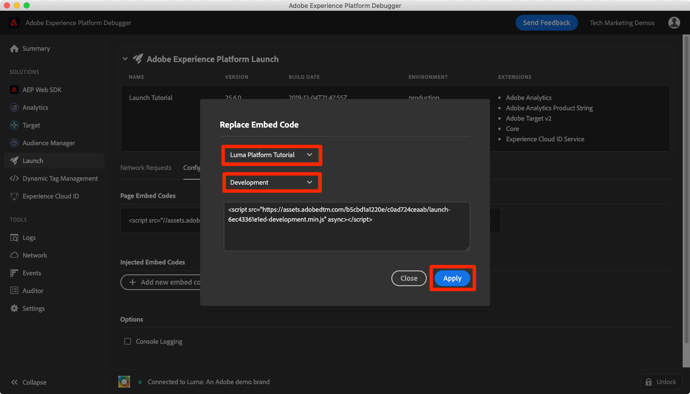
1. 이제 Luma 웹 사이트가 _을(를) 태그 속성으로 다시 로드합니다_.
   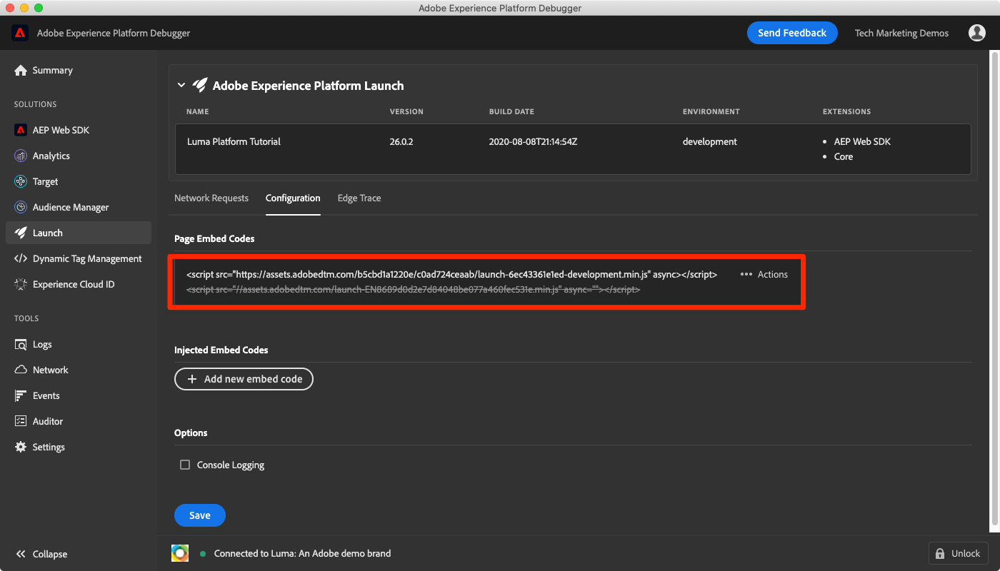
1. **[!UICONTROL 태그]** 속성의 세부 정보를 보려면 왼쪽 탐색 메뉴의 [!UICONTROL 요약]&#x200B;(으)로 이동하십시오.
   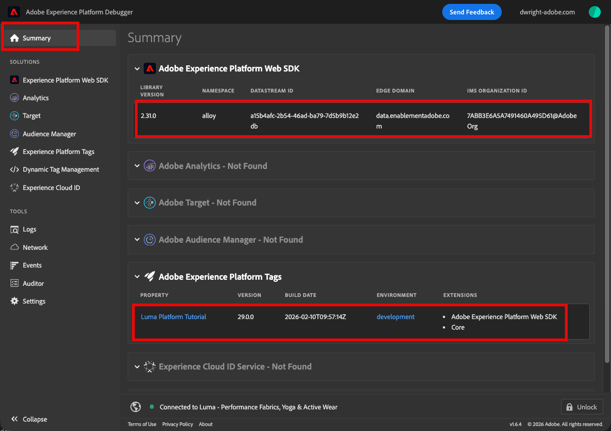
1. 이제 왼쪽 탐색 영역에서 **[!UICONTROL Experience Platform Web SDK]**(으)로 이동하여 **[!UICONTROL 네트워크 요청]**&#x200B;을 확인합니다.
1. **[!UICONTROL 이벤트]** 행 선택

   

1. `web.webpagedetails.pageView`이벤트 보내기[!UICONTROL &#x200B; 작업에 지정한 &#x200B;] 이벤트 형식을 확인하는 방법에 대해 참고하십시오.
   

1. 요청 세부 정보는 브라우저의 웹 개발자 도구 **네트워크** 탭에도 표시됩니다. 페이지를 열고 다시 로드합니다. `interact`(으)로 호출을 필터링하여 호출을 찾아 선택한 다음 **헤더** 탭, **페이로드 요청** 영역에서 찾습니다.
   
1. **응답** 탭으로 이동하여 ECID 값이 응답에 어떻게 포함되는지 확인합니다. 다음 연습에서 프로필 정보의 유효성을 검사하는 데 사용할 값으로 이 값을 복사하십시오.
   

## Experience Platform에서 데이터 유효성 검사

`Luma Web Events Dataset`에 도착하는 데이터 배치를 확인하여 데이터가 플랫폼에 도달하는지 확인할 수 있습니다. (예: 스트리밍 데이터 수집이라고 하지만 이제 여러 개가 일괄적으로 도착한다고 말하고 있습니다.) 프로필로 실시간 스트리밍되므로 실시간 세그멘테이션 및 활성화에 사용할 수 있지만, 15분마다 데이터 레이크로 일괄적으로 전송됩니다.)

데이터의 유효성을 검사하려면

1. Platform 사용자 인터페이스에서 왼쪽 탐색 메뉴의 **[!UICONTROL 데이터 세트]**(으)로 이동합니다.
1. `Luma Web Events Dataset`을(를) 열고 일괄 처리가 도착했는지 확인합니다. 15분마다 전송되므로 일괄 처리가 표시될 때까지 기다려야 한다는 것을 기억하십시오.
1. **[!UICONTROL 데이터 집합 미리 보기]** 단추 선택
   
1. 미리 보기 모달에서 왼쪽의 스키마의 여러 필드를 선택하여 특정 데이터 포인트를 미리 보는 방법을 확인합니다.
   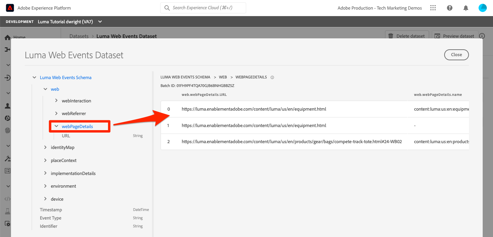

새 프로필이 표시되는지 확인할 수도 있습니다.

1. Platform 사용자 인터페이스에서 왼쪽 탐색 메뉴의 **[!UICONTROL 프로필]**(으)로 이동합니다.
1. **[!UICONTROL ECID]** 네임스페이스를 선택하고 ECID 값을 검색합니다(응답에서 복사). 프로필에는 ECID와 별도의 자체 ID가 있습니다.
1. **[!UICONTROL 프로필 ID]**&#x200B;을(를) 선택하여 프로필 열기
   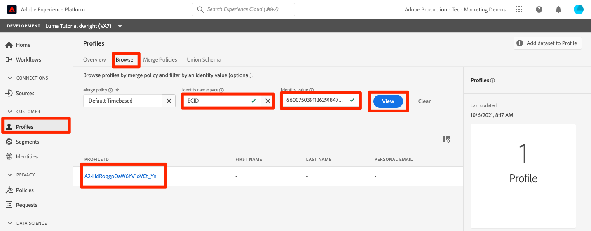
1. 본 페이지를 보려면 **[!UICONTROL 이벤트]** 탭을 선택하십시오.
   \
   <!--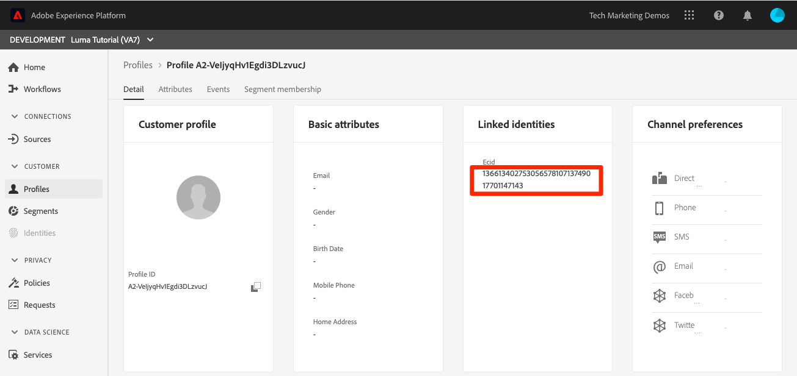-->

## 이벤트에 사용자 정의 데이터 추가

웹 SDK은 많은 XDM 필드를 자동으로 채우지만 웹 사이트에서 추가 필드를 수집하려면 구현을 사용자 정의해야 합니다. 이것은 매우 관련되어 있지만 여기 몇 가지 간단한 예가 있습니다.

### XDM 데이터를 저장할 데이터 요소 만들기

1. `Luma Platform Tutorial` 태그 속성으로 다시 이동
1. **[!UICONTROL 작업 라이브러리 선택]** 드롭다운을 열고 `Luma Platform Tutorial` 라이브러리를 선택합니다. 이 설정을 사용하면 라이브러리에 추가 업데이트를 더 쉽게 게시할 수 있습니다.
1. 이제 왼쪽 탐색에서 **[!UICONTROL 데이터 요소]**(으)로 이동합니다.
1. **[!UICONTROL 새 데이터 요소 만들기]** 단추 선택

   

**[!UICONTROL 데이터 요소]** 페이지에서:

1. **[!UICONTROL 이름]**(으)로 `XDM data`을(를) 입력하십시오.
1. **[!UICONTROL 확장]**(으)로 `Adobe Experience Platform Web SDK`을(를) 선택합니다.
1. **[!UICONTROL 데이터 요소 형식]**(으)로 `Variable`을(를) 선택합니다.
1. **[!UICONTROL 샌드박스]**(으)로 `Luma Tutorial` 샌드박스를 선택합니다.
1. **[!UICONTROL 스키마]**(으)로 `Luma Web Events Schema`을(를) 선택합니다.
1. `Luma Platform Tutorial`이(가) 작업 라이브러리로 선택되었는지 확인하십시오.
1. **[!UICONTROL 라이브러리에 저장]** 선택
   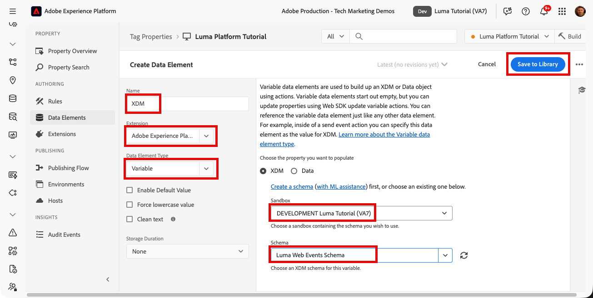

### 페이지 이름에 대한 데이터 요소 만들기

1. 새 데이터 요소 만들기
1. **[!UICONTROL 이름]**(으)로 `Page Name`을(를) 입력하십시오.
1. **[!UICONTROL 데이터 요소 형식]**(으)로 `JavaScript Variable`을(를) 선택합니다.
1. **[!UICONTROL JavaScript 변수 이름]**(으)로 `adobeDataLayer.0.page.name`을(를) 입력하십시오
1. 값의 형식을 표준화하려면 **[!UICONTROL 소문자 값 강제 적용]** 및 **[!UICONTROL 텍스트 정리]** 상자를 선택하세요.
1. **[!UICONTROL 라이브러리에 저장]** 선택
   

### 이벤트 보내기 작업에 XDM 데이터 추가

이제 데이터가 XDM 필드에 매핑되었으므로 이벤트 보내기 작업에 포함할 수 있습니다.

1. **[!UICONTROL 규칙]** 화면으로 이동
1. `adobeDataLayer event` 규칙 열기
1. `Adobe Experience Platform Web SDK - Send Event` 작업 열기
1. **[!UICONTROL XDM]**(으)로 아이콘을 선택하여 데이터 요소 선택 모달을 열고 `XDM data` 데이터 요소를 선택합니다
1. **[!UICONTROL 변경 내용 유지]** 선택
   

1. 규칙에 새 작업 추가
1. `Adobe Experience Platform Web SDK` **[!UICONTROL 확장]** 선택
1. `Update Variable` **[!UICONTROL 작업 유형]** 선택
1. `Page Name` 데이터 요소를 `web.webPageDetails.name`(으)로 채우기
1. **[!UICONTROL 변경 내용 유지]** 선택
   

1. [!UICONTROL 이벤트 보내기] 전에 [!UICONTROL 변수 업데이트]이 실행되도록 [!UICONTROL 작업]을 다시 정렬합니다.
1. 이제 지난 몇 번의 연습에서 `Luma Platform Tutorial`을(를) 작업 라이브러리로 선택했기 때문에 최근 변경 내용이 라이브러리에 직접 저장되었습니다. 게시 플로우 화면을 통해 변경 사항을 게시하지 않고 드롭다운을 열고 **[!UICONTROL 라이브러리 및 빌드에 저장]**&#x200B;을 선택하면 됩니다.
   

이렇게 하면 방금 변경한 세 가지 사항으로 새 태그 라이브러리를 빌드하기 시작합니다.

### XDM 데이터의 유효성 검사

이제 이전에 학습한 대로 디버거를 사용하여 태그 속성에 매핑되면서 Luma 홈 페이지를 다시 로드하고 페이지 이름 필드가 요청에 채워지는지 확인할 수 있습니다.

데이터 세트와 프로필을 미리 보고 Platform에서 페이지 이름 데이터가 수신되었는지 확인할 수도 있습니다.

## 추가 ID 보내기

웹 SDK 구현에서 이제 ECID(Experience Cloud ID)를 기본 식별자로 사용하는 이벤트를 보냅니다. ECID는 웹 SDK에 의해 자동으로 생성되며 장치 및 브라우저별로 고유합니다. 단일 고객은 사용 중인 디바이스 및 브라우저에 따라 여러 ECID를 가질 수 있습니다. 그렇다면 어떻게 이 고객에 대한 통합된 뷰를 얻고 고객의 온라인 활동을 CRM, 충성도 및 오프라인 구매 데이터에 연결할 수 있습니까? 세션 중에 추가 ID를 수집하고 ID 서비스가 이를 결정적으로 연결할 수 있도록 하여 그렇게 합니다.

기억나는 경우 [ID 매핑](map-identities.md) 단원에서 ECID 및 CRM ID를 웹 데이터의 ID로 사용한다고 언급했습니다. 웹 SDK을 사용하여 CRM ID를 수집해 보겠습니다!

### CRM ID에 대한 데이터 요소 추가

먼저 데이터 요소에 CRM ID를 저장합니다.

1. 태그 인터페이스에 이름이 `CRM Id`인 데이터 요소를 추가합니다.
1. **[!UICONTROL 데이터 요소 형식]**(으)로 **[!UICONTROL JavaScript 변수]**&#x200B;를 선택합니다.
1. **[!UICONTROL JavaScript 변수 이름]**(으)로 `adobeDataLayer.0.user.id`을(를) 입력하십시오
1. **[!UICONTROL 라이브러리에 저장]** 단추를 선택합니다(`Luma Platform Tutorial`은(는) 작업 라이브러리여야 함).
   

### ID 맵 데이터 요소에 CRM ID 추가

이제 CRM ID 값을 캡처했으므로 [!UICONTROL ID 맵] 데이터 요소라는 특수 데이터 요소 유형과 연결해야 합니다.

1. 이름이 `Identity Map`인 데이터 요소 추가
1. **[!UICONTROL 확장]**(으)로 **[!UICONTROL Adobe Experience Platform Web SDK]**&#x200B;을(를) 선택합니다.
1. **[!UICONTROL 데이터 요소 형식]**(으)로 **[!UICONTROL ID 맵]**&#x200B;을(를) 선택하십시오.
1. **[!UICONTROL 네임스페이스]**(으)로 이전 단원에서 만든 `Luma CRM Id`네임스페이스[!UICONTROL 인 &#x200B;]을(를) 선택하거나 입력하십시오.

1. **[!UICONTROL ID]**&#x200B;로서 아이콘을 선택하여 데이터 요소 선택 모달을 열고 `CRM Id` 데이터 요소를 선택합니다
1. **[!UICONTROL 인증됨 상태]**(으)로 **[!UICONTROL 인증됨]**&#x200B;을(를) 선택합니다
1. **[!UICONTROL 기본]** 확인

   >[!TIP]
   >
   > Adobe에서는 `Luma CRM Id`과(와) 같은 사용자를 나타내는 ID를 [!UICONTROL 기본] ID로 보낼 것을 권장합니다.
   >
   > ID 맵에 사용자 식별자가 포함된 경우(예: `Luma CRM Id`) 사용자 식별자는 [!UICONTROL 기본] ID가 됩니다. 그렇지 않으면 `ECID`이(가) [!UICONTROL primary] ID가 됩니다.

1. **[!UICONTROL 라이브러리에 저장]** 단추를 선택합니다(`Luma Platform Tutorial`은(는) 작업 라이브러리여야 함).
   

>[!NOTE]
>
>[!UICONTROL ID 맵] 데이터 형식을 사용하여 여러 식별자를 전달할 수 있습니다.

### XDM 변수에 ID 맵 데이터 요소 추가

이제 ID 맵을 포함하도록 규칙에서 XDM 변수 작업을 업데이트해야 합니다. 걱정 마, 이 수업은 거의 끝났어!

1. `adobeDataLayer event` 규칙 열기
1. `Update variable` 작업 열기
1. `Identity Map` XDM 필드에 대한 `identityMap` 데이터 요소를 선택합니다.
1. **[!UICONTROL 변경 내용 유지]** 선택
   
1. 지난 몇 번의 연습에서 `Luma Platform Tutorial`을(를) 작업 라이브러리로 선택했으므로 **[!UICONTROL 라이브러리 및 빌드에 저장]**&#x200B;을(를) 선택하십시오.

   

<!--U1770721295408-->

### ID 유효성 검사

이제 웹 SDK에서 CRM ID를 보내고 있는지 확인하려면:

1. [Luma 웹 사이트](https://luma.enablementadobe.com/content/luma/us/en.html) 열기
1. 이전 지침에 따라 디버거를 사용하여 태그 속성에 매핑합니다
1. Luma 웹 사이트의 오른쪽 상단에서 **로그인** 링크를 선택합니다.
1. 자격 증명 `test@test.com`/`test`을(를) 사용하여 로그인
1. 인증되면 디버거(**[!UICONTROL Adobe Experience Platform Web SDK]** > **[!UICONTROL 네트워크 요청]** > **[!UICONTROL 이벤트]**)에서 Experience Platform Web SDK 호출을 검사하면 `lumaCrmId`이(가) 표시됩니다.
   
1. ECID 네임스페이스 및 값을 사용하여 사용자 프로필을 다시 조회합니다. 프로필에는 CRM ID와 고객 충성도 ID 및 프로필 세부 사항(예: 이름 및 전화번호)이 표시됩니다. 모든 ID 및 데이터가 하나의 실시간 고객 프로필에 결합되었습니다!
   

## 추가 리소스

* [Web SDK를 사용하여 Adobe Experience Cloud 구현](/help/tutorial-web-sdk/overview.md)
* [스트리밍 수집 설명서](https://experienceleague.adobe.com/docs/experience-platform/ingestion/streaming/overview.html?lang=ko)
* [스트리밍 수집 API 참조](https://developer.adobe.com/experience-platform-apis/references/streaming-ingestion/)

좋습니다! 그것은 웹 SDK과 태그에 대한 많은 정보였습니다. 본격적인 구현에 더 많은 참여가 있지만, 이러한 참여는 플랫폼에서 시작하고 결과를 확인하는 데 도움이 되는 기본 사항입니다.

>[!NOTE]
>
>스트리밍 수집 단원을 완료했으므로 이제 [!UICONTROL &#x200B; 제품 프로필에서 &#x200B;]Prod`Luma Tutorial Platform` 샌드박스를 제거할 수 있습니다

데이터 엔지니어의 경우 [쿼리 실행 단원](run-queries.md)으로 건너뛸 수 있습니다.

데이터 설계자는 [병합 정책](create-merge-policies.md)(으)로 이동할 수 있습니다.
