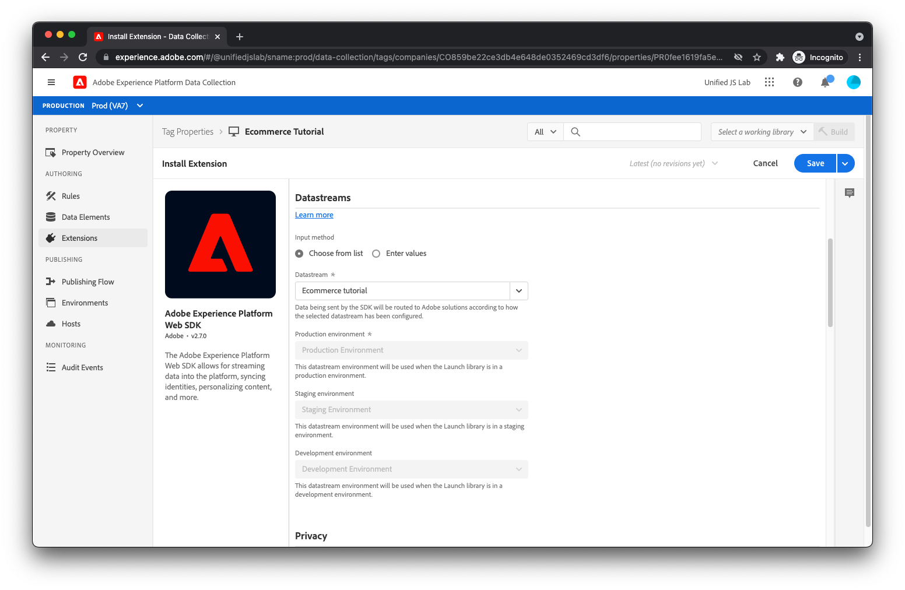

# Adobe Experience Platform 만들기 [!DNL Tags] 속성 및 설치 확장

이제 페이지 내 코드가 데이터 및 이벤트를 데이터 계층에 투입하므로 마케터가 데이터 계층에서 데이터를 읽고 이 데이터를 Adobe Experience Platform에 보낼 차례입니다. 이렇게 하려면 일반적으로 두 개의 JavaScript 라이브러리가 필요합니다.

* Adobe 클라이언트 데이터 레이어: 이전 단계에서는 데이터 레이어 배열을 만들고 객체를 해당 배열에 푸시했습니다. 이 데이터에 액세스하려면 Adobe 클라이언트 데이터 레이어 JavaScript 라이브러리를 로드해야 합니다. 이 라이브러리는 이벤트 및 데이터 레이어 변경 사항에 대한 알림을 제공하고 데이터에 대한 간단한 액세스를 제공합니다.
* Adobe Experience Platform 웹 SDK: 이 JavaScript 라이브러리는 [Adobe Experience Platform Edge Network](https://business.adobe.com/products/experience-platform/experience-platform-edge-network.html). SDK는 ID, 동의, 데이터 수집, 개인화, 대상 등을 처리합니다.

이러한 개별 라이브러리를 웹 사이트에 로드하여 직접 사용할 수 있지만, [Adobe Experience Platform 태그](https://experienceleague.adobe.com/docs/experience-platform/tags/home.html). 태그를 사용하여 HTML에 단일 스크립트를 포함하고 태그 사용자 인터페이스를 사용하여 Adobe 클라이언트 데이터 레이어와 Adobe Experience Platform 웹 SDK를 모두 배포할 수 있습니다. 또한 태그를 사용하여 데이터 전송 규칙을 만들 수 있습니다. 이 자습서에서는 이 용도로 태그를 사용할 수 있으며 태그 작동 방식에 대한 기본적인 이해가 있다고 가정합니다.

## 태그 내에 속성 만들기

1. [태그에서 속성 만들기](https://experienceleague.adobe.com/docs/experience-platform/tags/admin/companies-and-properties.html#create-or-configure-a-property).

## Adobe 클라이언트 데이터 레이어 확장 설치

Adobe 클라이언트 데이터 계층 확장을 설치합니다.

1. 선택 **[!UICONTROL 확장]** 태그 속성에서 왼쪽 탐색에서 이 자습서에 사용하는 을 참조하십시오.
1. 을(를) 선택합니다 **[!UICONTROL 카탈로그]** 맨 위에 있는 링크를 클릭한 다음 &#39;데이터 레이어&#39;를 검색합니다.
1. Adobe 클라이언트 데이터 레이어가 결과에 표시되면 **[!UICONTROL 설치]** 버튼을 클릭합니다. 구성 화면이 표시됩니다. 이 자습서에서는 기본값을 변경할 필요가 없습니다.
1. **[!UICONTROL 저장]**을 클릭합니다.
   

## Adobe Experience Platform 웹 SDK 확장 설치

다음으로 Adobe Experience Platform 웹 SDK 확장을 설치합니다.

1. 확장 카탈로그에서 확장을 검색하고 각 을(를) 클릭합니다 **[!UICONTROL 설치]** 버튼을 클릭합니다. 구성 화면이 표시됩니다.
   
1. 에서 [!UICONTROL 데이터 스트림] 필드에서 이전에 만든 데이터 스트림을 선택합니다. 에서 본 것과 동일한 데이터 스트림 환경이 표시됩니다 [데이터 스트림 만들기](../configure-the-server/create-a-datastream.md).
   
1. 구성 화면에서 추가 정보를 찾아 선택 취소합니다 **[!UICONTROL 클릭 데이터 수집 활성화]**. 기본적으로 SDK는 자동으로 링크를 추적합니다. 그러나 이 자습서에서는 사용자 지정 링크 정보를 사용하여 고유한 링크 클릭 수를 추적하는 방법을 보여줍니다.
1. 을(를) 클릭합니다. **[!UICONTROL 저장]** 단추를 클릭하여 Adobe Experience Platform 웹 SDK 확장 설치를 완료합니다.

>[!TIP]
>
>데이터 세트 환경은 태그 환경과 관련이 있습니다. 잠시 동안 Adobe Experience Platform 웹 SDK 확장 설치를 완료하고 확장을 포함하는 태그 라이브러리를 만든 다음 라이브러리를 태그 개발 환경에 게시한다고 가정합니다. 태그 라이브러리가 웹 페이지에 로드되고 Adobe Experience Platform Web SDK 확장이 Edge 네트워크에 요청을 수행하면 확장 프로그램에는 다음이 포함됩니다 [!UICONTROL 개발 환경] 데이터 스트림 환경 ID. Edge Network는 그 ID를 사용하여 [!UICONTROL 개발 환경] 데이터 스트림 환경을 만들고 데이터를 적절한 Adobe 제품으로 전달합니다.
>
>현재는 개발 데이터 스트림 환경, 하나의 스테이징 데이터 스트림 환경 및 하나의 프로덕션 데이터 스트림 환경만 있습니다. 데이터 스트림 사용자 인터페이스를 사용하여 여러 데이터 스트림 개발 환경(사용자용과 동료용 환경, 아마도 공동 작업자용 환경)을 만들 수 있습니다. 개발 데이터 스트림 환경이 여러 개 있는 경우 이 태그 속성에 사용할 개발 데이터 스트림 환경을 선택할 수 있습니다.

적절한 확장이 설치되었습니다. 이제 규칙과 데이터 요소를 만들 차례입니다.

[다음: ](create-rules-for-tracking-page-view-and-commerce-events.md)

>[!NOTE]
>
>데이터 수집에 시간을 내어 주셔서 감사합니다. 질문이 있거나 일반 피드백을 공유하거나 향후 컨텐츠에 대한 제안 사항이 있는 경우 해당 정보를 공유하십시오 [Experience League 커뮤니티 토론 게시물](https://experienceleaguecommunities.adobe.com/t5/adobe-experience-platform-launch/tutorial-discussion-use-adobe-experience-platform-data/m-p/543877)
