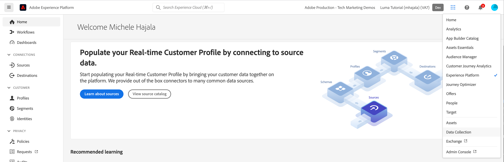

# 데이터 스트림 만들기

Platform Web SDK를 사용하여 웹 사이트에서 전송하는 데이터는 [Adobe Experience Platform Edge Network](https://business.adobe.com/products/experience-platform/experience-platform-edge-network.html). 이 네트워크는 데이터를 [이전에 만든 Adobe Experience Platform 데이터 세트](create-a-schema.md) 및 Adobe Experience Cloud 내의 기타 제품을 사용할 수 있습니다. 이러한 Adobe 제품은 웹 페이지에 대한 데이터로도 응답할 수 있습니다. 예를 들어 Edge Network는 Adobe Target의 개인화 콘텐츠를 반환할 수 있습니다.

Edge Network에서 데이터를 주고받는 Adobe 제품을 구성하려면 데이터 스트림을 만들어야 합니다. Edge Network가 웹 페이지에서 데이터를 받으면 생성한 데이터 스트림을 컨설팅하고 해당 구성을 읽은 다음 데이터를 적절한 Adobe 제품으로 전달합니다.

1. 데이터 스트림을 만들려면 먼저 데이터 수집 사용자 인터페이스로 이동해야 합니다. Platform의 오른쪽 위 모서리에서 **[!UICONTROL 애플리케이션 선택기]** 을(를) 선택합니다. **[!UICONTROL 데이터 수집]** 를 클릭합니다.
   
1. 데이터 수집 인터페이스가 표시되면 을 선택합니다 **[!UICONTROL 데이터 스트림]** 왼쪽 탐색 영역에서 **[!UICONTROL 새 데이터 스트림]** 오른쪽 상단 모서리의 단추.
1. 데이터 스트림의 이름을 입력하고 [이전에 만든 스키마](create-a-schema.md) 로서의 **[!UICONTROL 이벤트 데이터 세트]**, 을(를) 선택하고 을(를) 선택합니다. **[!UICONTROL 저장]** (매핑은 나중에 다룹니다.)
   

## 데이터 스트림에 서비스 추가

다음 화면에서는 웹 사이트에서 전송한 데이터를 받아야 하는 Adobe 제품 및 서비스를 추가할 수 있습니다.

1. 을(를) 선택합니다 **[!UICONTROL 서비스 추가]** 명령. 이 자습서를 사용하려면 Adobe Experience Platform만 활성화하고 다음을 선택합니다. [이전에 만든 데이터 세트](create-a-dataset.md) 을(를) 선택합니다. **[!UICONTROL 저장]** 오른쪽 상단 모서리에서 데이터 스트림이 생성되었습니다.
   

## 데이터 스트림 환경

회사에는 일반적으로 모든 웹 사이트 업데이트에 대한 프로모션 경로가 있습니다. 회사의 누군가(변경에 따라 마케터 또는 엔지니어)는 일반적으로 해당 사용자만 사용하는 개발 환경에서 변경 사항을 테스트합니다. 변경 사항이 마음에 들면 변경 사항이 추가 테스트를 받는 스테이징 환경으로 승격됩니다. 마지막으로, 변경 사항이 사용자가 보는 프로덕션 웹 사이트에 게시됩니다. 데이터 저장소는 이 프로모션 패턴을 지원합니다.

Real-Time CDP, Journey Optimizer 또는 Customer Journey Analytics과 같은 플랫폼 기반 애플리케이션을 지원하는 경우 이러한 환경에 해당하는 별도의 Platform 샌드박스에 추가 데이터 세트를 만들어야 합니다.

Platform 고객이 아닌 경우 단일 샌드박스에 여러 데이터 세트를 만들 수 있으며 데이터 스트림 복사 기능을 사용하여 설정을 복제할 수 있습니다.

이제 서버가 웹 페이지에서 데이터를 수신하도록 완전히 구성되었습니다.

[다음: ](../configure-the-client/whats-a-data-layer.md)

>[!NOTE]
>
>데이터 수집에 시간을 내어 주셔서 감사합니다. 질문이 있거나 일반 피드백을 공유하거나 향후 컨텐츠에 대한 제안 사항이 있는 경우 해당 정보를 공유하십시오 [Experience League 커뮤니티 토론 게시물](https://experienceleaguecommunities.adobe.com/t5/adobe-experience-platform-launch/tutorial-discussion-use-adobe-experience-platform-data/m-p/543877)
