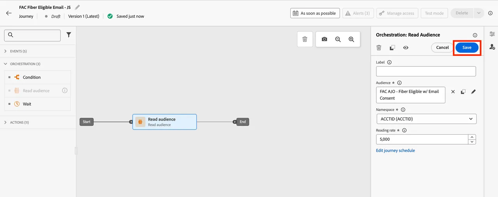
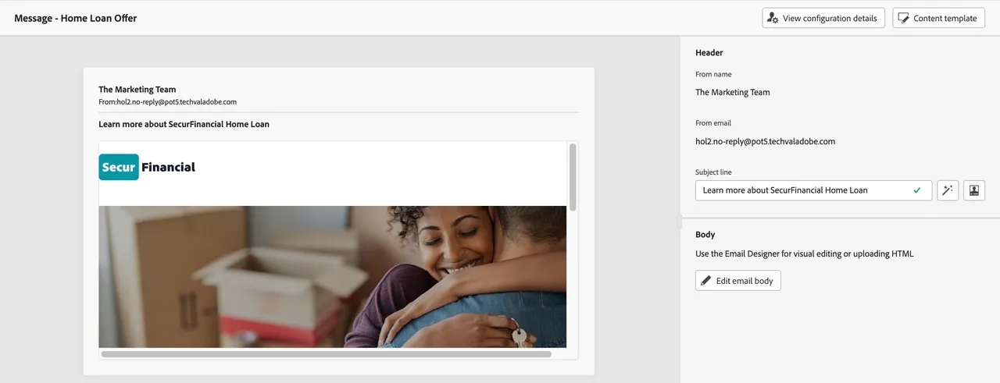

# 연합 대상자를 사용하여 여정 구축

Federated 대상은 Adobe Journey Optimizer(AJO) 내의 여정에서 사용할 수 있습니다. 여기에는 Federated Audience Composition에서 쿼리된 속성을 사용하여 메시지를 개인화하는 작업이 포함됩니다.

SecurFinancial 스토리, 특히 고객 재타겟팅 및 개인화 사용 사례를 계속하려면 자격이 있는 고객을 위한 여정을 오케스트레이션합니다. 목표는 SecurFinancial의 데이터 웨어하우스에서 페더레이션된 속성을 기반으로 개인화된 이메일을 보내는 것입니다.

## 단계

### 대상자 읽기를 사용하여 여정 작성

1. **여정** 포털로 이동하여 **여정 만들기** 단추를 클릭합니다.

   

2. 여정 속성을 새 이름으로 업데이트합니다. 예제는 **`SecurFinancial - Home Loan Offer`**&#x200B;입니다.

3. **오케스트레이션**&#x200B;을 클릭한 다음 **대상자 읽기** 타일을 캔버스로 끌어서 놓습니다.

4. 화면 오른쪽의 대상 상자 옆에 있는 **연필 아이콘**&#x200B;을 클릭합니다.

5. 검색 창에서 대상자를 검색합니다. 이 예제에서는 **`SecureFinancial Customers - No Loans, Good Credit`**&#x200B;을(를) 사용합니다. **저장**&#x200B;을 클릭합니다.

   

6. 오른쪽 메뉴에 모든 설정을 기본값으로 두고 **저장**&#x200B;을 클릭합니다.

   

### 이메일 개인화

1. **작업**&#x200B;을 클릭한 다음 **전자 메일** 타일을 클릭하여 캔버스로 드래그합니다.

2. 오른쪽 메뉴에서 **이메일 구성**&#x200B;을 클릭하고 **이메일 마케팅**&#x200B;을 선택합니다. 그런 다음 **콘텐츠 편집**&#x200B;을 클릭합니다.

3. 제목 줄을 추가합니다. 이 예제에서는 **`Learn more about SecurFinancial Home Loan`**&#x200B;을(를) 사용합니다. **전자 메일 본문 편집**&#x200B;을 클릭합니다.

4. 오른쪽 상단의 **콘텐츠 템플릿** 단추를 클릭합니다. 적절한 템플릿을 찾아 선택합니다. 이 예제에서는 `SecureFinancial Template`을(를) 사용합니다. **확인**&#x200B;을 클릭합니다.

   

   

5. 템플릿을 검토하고 **템플릿 사용**&#x200B;을 클릭합니다.

6. 이제 이메일 Designer에 있게 됩니다. `{profile.person.name.firstName}` 매크로를 마우스로 가리키고 **개인화 아바타**&#x200B;를 클릭합니다.

7. 개인화 창에서 업로드된 연합 대상이 있는 폴더 경로로 드릴다운합니다. 이 예제에서는 **`[sandbox] > audienceEnrichment > CustomerAudienceUpload`**&#x200B;입니다.

8. **대상자 읽기** 폴더를 클릭합니다. 페더레이션 대상의 데이터 보강 속성은 여기에서 찾을 수 있습니다.

9. 식 작성기에 대한 **이름** 특성을 선택하십시오. 이메일은 이메일을 개인화하기 위해 고객의 이름 값을 동적으로 표현합니다.

10. **저장**&#x200B;을 클릭합니다.

11. 이름 개인화가 추가되었으므로 개인화 변수 앞에 `Hi, `을(를) 추가하십시오. 그런 다음 **저장**&#x200B;을 클릭합니다.

    

12. 여정 캔버스로 돌아가려면 **뒤로** 단추를 두 번 클릭하십시오. 그런 다음 오른쪽의 **작업: 전자 메일** 메뉴에서 **저장**&#x200B;을 클릭합니다.

   

페더레이션 대상 및 페더레이션 데이터 보강 속성을 사용하여 AJO에서 여정을 만들었습니다.

이제 데이터 웨어하우스의 데이터를 사용하여 Experience Platform에서 대상을 [강화](federated-audience-composition.md)하는 방법을 살펴보겠습니다.
