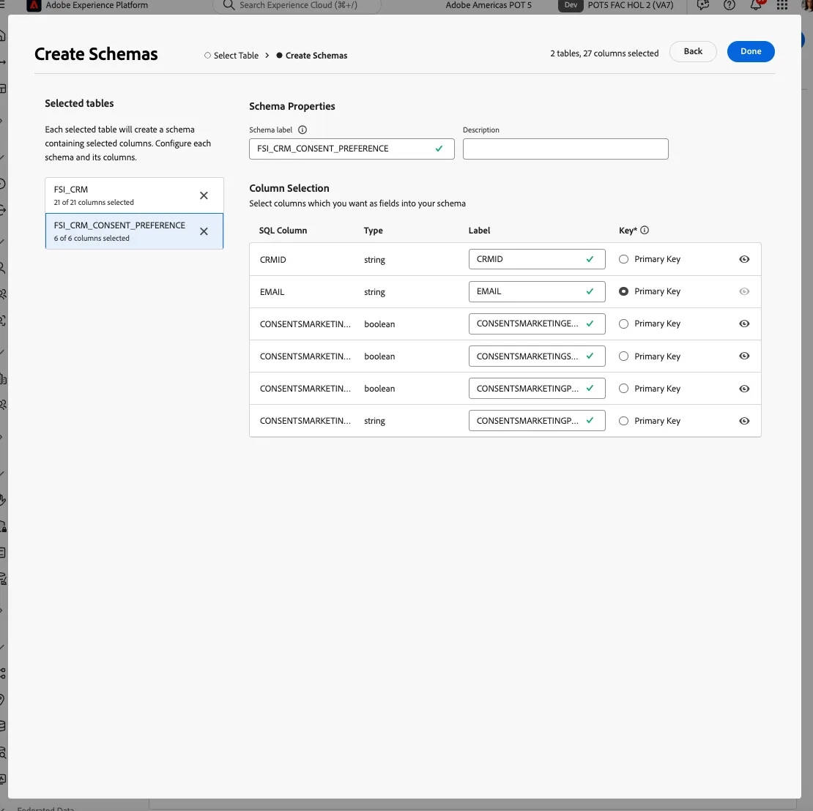

# Data Warehouse 연결

먼저 Adobe Experience Platform과 엔터프라이즈 Data Warehouse 간에 연결을 구성하겠습니다. 쿼리 빌드를 지원하기 위해 Data Warehouse에 데이터가 있는 방법을 기반으로 스키마와 데이터 모델을 사용합니다.

보여주기 위해 Snowflake 계정에 연결합니다. Federated Audience Composition은 데이터 웨어하우스 연결의 증가하는 목록을 지원합니다. [업데이트된 통합 목록](https://experienceleague.adobe.com/ko/docs/federated-audience-composition/using/start/access-prerequisites){target="_blank"}을 참조하세요.

## 단계

1. 왼쪽 레일에서 **FEDERATED DATA** 섹션으로 이동합니다.
2. **페더레이션 데이터베이스** 링크에서 **페더레이션 데이터베이스 추가** 단추를 클릭합니다.
3. 이름을 추가하고 **Snowflake**&#x200B;을(를) 선택합니다.
4. 세부 정보를 입력하고 **연결 테스트** 단추를 클릭한 다음 **함수 배포** 단추를 클릭합니다.

   

   

   

## 스키마 만들기

Federated Audience Composition에서 스키마를 생성하려면 다음 단계를 수행합니다.

### 단계

1. **페더레이션 데이터** 섹션에서 **모델**&#x200B;을 클릭하세요.
2. **스키마** 탭을 탐색하고 **스키마 만들기** 단추를 클릭합니다.
3. 목록에서 원본 데이터베이스를 선택하고 **테이블 추가** 탭을 클릭합니다.
4. 통합 소스에서 테이블을 선택합니다. 이 예제에서는
   - FSI_CRM
   - FSI_CRM_CONSENT_PREFERENCE

   

   

테이블을 선택한 후 각 테이블의 열을 검토하고 기본 키를 선택합니다. 비즈니스 사례를 지원하기 위해 **EMAIL**&#x200B;을(를) 두 테이블의 기본 키로 선택합니다.

## 데이터 모델 만들기

데이터 모델을 사용하면 테이블 간에 링크를 만들 수 있습니다. 이 링크는 동일한 데이터베이스의 테이블(예: Snowflake의 테이블) 간에 또는 다른 데이터베이스의 테이블(예: Snowflake의 테이블과 Amazon Redshift의 테이블 간 링크) 간에 만들 수 있습니다.

### 단계

1. **페더레이션 데이터** 섹션에서 **모델**&#x200B;을 클릭한 다음 **데이터 모델**&#x200B;을 클릭합니다.
2. **데이터 모델 만들기** 단추를 클릭합니다.
3. 데이터 모델의 이름을 입력합니다.
4. **스키마 추가**&#x200B;를 클릭하고 새 페더레이션 데이터 스키마를 선택하십시오. 이 예제에서는 **FSI_CRM** 및 **FSI_CRM_CONSENT_PREFERENCE** 스키마를 선택합니다.
5. **링크 만들기**&#x200B;를 클릭하여 이러한 테이블 간에 링크를 만듭니다.

링크를 생성할 때 적용 가능한 카디널리티를 선택합니다.

- **1-N**: 원본 테이블의 발생 항목 하나는 대상 테이블의 여러 발생 항목을 가질 수 있지만, 대상 테이블의 발생 항목 하나는 원본 테이블의 해당 발생 항목을 최대 한 개까지 가질 수 있습니다.
- **N-1**: 대상 테이블의 발생 항목 하나는 원본 테이블의 여러 발생 항목을 가질 수 있지만, 원본 테이블의 발생 항목 하나는 대상 테이블의 해당 발생 항목을 최대 한 개까지 가질 수 있습니다.
- **1-1**: 원본 테이블의 발생 항목 하나는 대상 테이블의 해당 발생 항목을 최대 한 개까지 가질 수 있습니다.

다음은 위의 단계에서 생성된 링크의 미리보기입니다. 이 링크를 통해 **EMAIL**&#x200B;의 기본 키를 사용하여 CRM과 동의 테이블 간의 조인을 수행할 수 있습니다.

이제 [만들기 및 대상](create-a-federated-audience.md)이 준비되었습니다.
