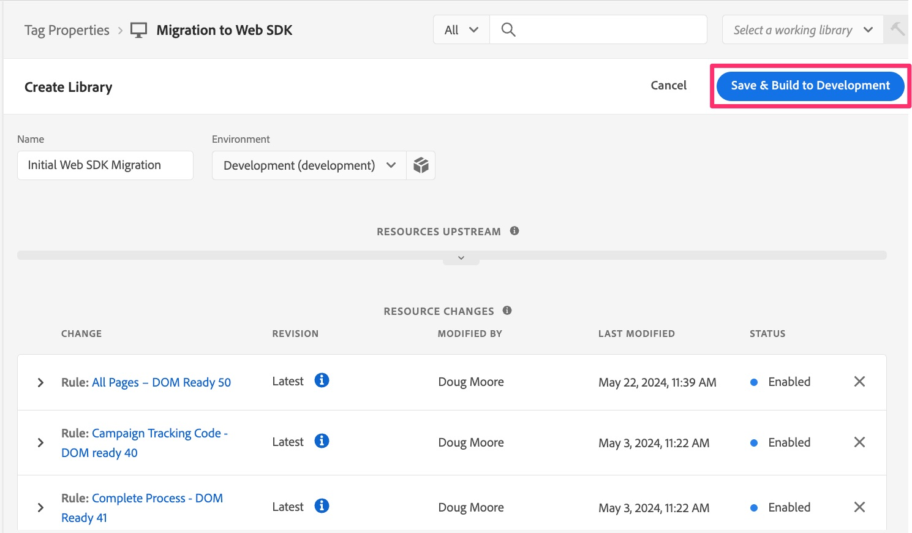
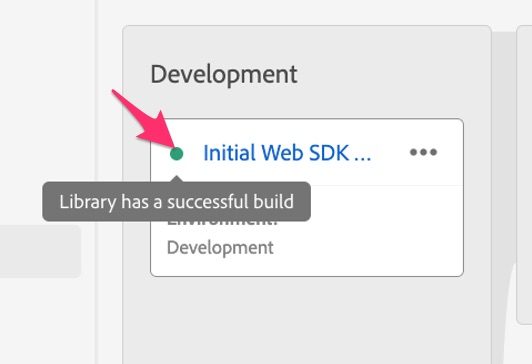

# 개발 라이브러리에 대한 구현 변경 사항 빌드

개발 웹 사이트에서 결과를 테스트할 수 있도록 태그 속성의 개발 라이브러리에 수행한 변경 사항을 작성하는 방법을 알아봅니다.

이 자습서에서 또는 실제로 구현을 변경하는 경우 언제든지 개발, 스테이징 또는 프로덕션 사이트에서 해당 변경 사항을 보려면 해당 변경 사항을 빌드/게시해야 합니다. 이 문서는 마이그레이션 문서이며 첫 번째 구현 문서가 아니므로 이전에 이 작업을 수행했을 것입니다. 실제로 각 기능을 수행하고 이를 테스트하여 제대로 작동하는지 확인하고 올바른 데이터를 Analytics로 보내면서 이 작업을 자주 수행해야 합니다.

따라서 이 자습서에서는 변경 사항을 빌드하거나 게시하기 위한 몇 가지 미리 알림이 있습니다. 필요한 경우 이 페이지에 책갈피를 표시하여 개발 라이브러리를 쉽게 구축할 수 있습니다. 언제든지 할 수 있습니다.

지금까지 해온 것을 만들어 봅시다. 이 자습서에서는 경우에 따라 &quot;빌드&quot;와 &quot;게시&quot;를 교환할 수 있습니다. 가장 중요한 것은 사용하는 단어에 관계없이 개발 또는 스테이징 라이브러리를 &quot;빌드&quot;하는지 또는 프로덕션 라이브러리 및 환경에 &quot;게시&quot;하는지를 아는 것입니다.

## Experience Platform 태그의 개발에 대한 마이그레이션 변경 사항 구축

1. Experience Platform 태그의 속성에 있는 동안 왼쪽 탐색에서 **플로우 게시**&#x200B;를 선택한 다음 새 라이브러리를 추가합니다.

   

1. 원하는 대로 라이브러리에 이름을 지정하십시오. (예: **초기 웹 SDK 마이그레이션**)
1. **개발** 환경을 선택하십시오.
1. 작업 중인 모든 항목을 추가하려면 **변경된 모든 리소스 추가**&#x200B;를 선택하십시오.

   

1. 개발에 저장 및 구축

   

1. 빌드가 완료되면 빌드가 성공했는지 확인할 수 있습니다. 게시 플로우에서 새 라이브러리의 왼쪽에 있는 녹색 점 위로 마우스를 가져가면 실제로 녹색이면 성공적으로 완료되어 알려 줍니다.

   

### 작업 라이브러리 선택

다음은 태그의 편집 작업을 수행할 때 유용한 단축키입니다. 변경할 때마다 전체 게시 플로우를 거치지 않고 작업 라이브러리를 선택하고 버튼 클릭으로 저장 및 빌드할 수 있습니다. 해 봐 나중에 고마워할 거야

1. 태그 UI의 거의 모든 위치에서 UI의 오른쪽 상단에서 작업 라이브러리 선택 을 클릭하고 원하는 라이브러리를 선택합니다. 이 자습서에서는 초기 웹 SDK 마이그레이션을 선택합니다.

   

