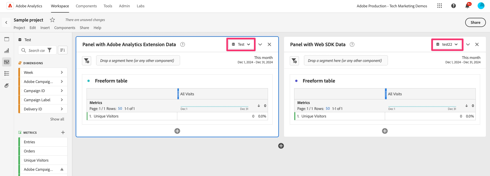

# 웹 SDK 마이그레이션 디버그 및 유효성 검사

이 연습에서는 웹 SDK으로 마이그레이션할 때 데이터를 디버깅하고 확인하는 방법을 알아봅니다. 모든 것이 올바르게 진행되도록 하는 데 도움이 되는 두 가지 다른 유효성 검사 활동을 권장하려고 합니다.

1. **유효성 검사 활동 #1**&#x200B;에서 브라우저 확장인 Adobe Experience Platform Debugger을 실행하고 있으므로 데이터가 Analytics로 올바르게 전송되는 방식을 확인할 수 있습니다. 태그 속성을 변경하고 변경 사항을 개발 라이브러리에 게시하므로 이 활동을 자주 수행하는 것이 좋습니다.
1. **유효성 검사 활동 #2**&#x200B;이(가) Adobe Analytics으로 이동하고, 새로 만든 마이그레이션 보고서 세트를 통해 Web SDK에서 데이터를 받을 프로젝트를 하나 이상 설정하고, 사이트 주변을 클릭할 때 데이터가 실제로 보고서에 올바르게 표시되는지 확인하는 등의 작업을 수행합니다.

## Adobe Experience Platform Debugger

이 디버거는 브라우저 확장 프로그램이며 Chrome 스토어에서 사용할 수 있습니다. 디버거를 다운로드하고 사용하는 방법에 대해 설명하는 [비디오 튜토리얼](https://experienceleague.adobe.com/en/docs/platform-learn/data-collection/debugger/overview)이 있습니다. 기본 사용을 알아보려면 먼저 이러한 과정을 거치는 것이 좋습니다.

디버거를 실행 중인 경우 이 디버거를 사용하여 데이터가 사이트에서 Edge Network을 통해 올바르게 이동되는지 확인할 수 있습니다. 이 자습서는 매우 기본적으로 사용되지만, 디버거를 전체 용량으로 사용하여 데이터를 확인하십시오.

**가정(항상 위험하지만 이 경우에는 괜찮음):** 이 예제에서는 태그 속성을 Web SDK으로 마이그레이션하므로 사이트에 새 포함 코드를 추가할 필요가 없습니다. 그것은 이미 그곳에 있었을 것입니다. 그러나 완전히 새로운 태그 속성에 대해 &quot;상승도 및 이동&quot; 접근 방식을 더 많이 수행하려는 경우 개발, 스테이징 및 프로덕션 환경에 사용할 새 포함 코드가 있게 됩니다. 따라서 이 자습서의 경우, 데이터를 보내는 규칙으로 웹 SDK 확장을 설치하고 구성하는 한 디버거에 데이터가 표시됩니다.

### 디버거에서 웹 SDK 데이터 보기

기본 페이지 규칙을 마이그레이션한 경우(또는 규칙을 마이그레이션한 경우) 개발 환경의 라이브러리에 게시했으므로 사이트를 실행하고 디버거에 흐르는 데이터를 볼 수 있어야 합니다.

데이터 보기 단계:

1. 브라우저에서 사이트의 개발 환경을 엽니다
1. 브라우저 창 상단의 확장 트레이에서 브라우저 확장 을 클릭하여 디버거를 엽니다

   

   >[!TIP]
   >
   >디버거의 오른쪽 아래 모서리에는 &quot;잠금&quot; 아이콘과 레이블이 있고, 그 왼쪽에는 디버깅 중인 페이지를 볼 수 있습니다. 사이트에서 잠금 아이콘을 클릭하면 사이트의 창에 디버거가 잠깁니다. 그렇지 않으면 다른 브라우저 탭/창을 클릭해야 하는 경우 디버거가 해당 사이트에 응답합니다. 사이트를 디버깅하는 동안 디버거가 항상 사이트에 대한 정보를 제공하는지 확인하는 것이 더 쉽습니다.

1. 디버거의 **요약** 페이지(왼쪽 상단의 &quot;홈&quot; 아이콘)에 있는지 확인하십시오. 브라우저 창에서 **사이트를 새로 고치세요**. 디버거가 사이트에서 포함 코드를 선택하고 Analytics 코드를 삭제하지 않은 경우(이 자습서에 따라) Adobe Experience Platform Web SDK 및 Adobe Analytics과 Adobe Experience Platform Tags 모두에 대한 코드가 있다는 표시가 표시됩니다. 다른 항목은 회색으로 표시됩니다.

   

1. 웹 SDK을 통해 추가된 데이터를 보려면 왼쪽 레일에서 **웹 SDK Experience Platform** 링크를 클릭하십시오
1. 발생한 히트를 제거하려면 **이벤트 지우기**&#x200B;를 클릭하십시오.
1. 사이트를 다시 새로 고치고 디버거로 돌아갑니다.
1. 그런 다음 표에서 **이벤트** 옆에 있는 데이터 필드를 클릭합니다

   디버거의 

1. 값 필드에서 0, data, __adobe 및 analytics를 통해 확장합니다.
1. 기본 페이지 로드 규칙과 특수 규칙을 포함하여 해당 페이지에서 실행되는 규칙에 설정한 변수가 표시됩니다.

   디버거의 

1. 변경 사항이 Analytics 구현에 미치는 영향을 볼 수 있도록 태그 속성의 변경 사항을 변경하고 변경 사항을 개발에 게시한 경우 언제든지 이러한 단계를 수행하십시오.

## Analysis Workspace에서 데이터 유효성 검사

이 권장 사항의 주요 골자는 Adobe Analytics 확장을 사용하여 Tags 구현에서 들어오는 현재 분석 데이터를 가져와 이제 웹 SDK에서 채우는 것과 동일한 보고서와 비교하는 것입니다.
이러한 비교를 설정하는 방법은 여러 가지가 있을 수 있지만, 이를 수행하는 방법에 대한 두 가지 예를 알려드리겠습니다.

### 옵션 1: 단일 프로젝트에서 두 개의 패널을 사용하여 데이터 비교

1. Analysis Workspace에서 새 프로젝트를 만들고 두 개의 패널 추가
1. 패널 1의 보고서 세트를 현재 Adobe Analytics 프로덕션 보고서 세트로 설정합니다
1. 패널 2의 보고서 세트를 새 웹 SDK 개발 보고서 세트로 설정합니다
1. 데이터가 두 보고서 세트로 전송된 전체 일만을 포함하는 기간을 사용하여 동일한 보고서를 두 패널에 넣습니다.
1. 데이터 비교

이는 다음과 같습니다(이러한 빈 데모 보고서 세트에 데이터가 없다는 것을 이해).

보시다시피 보고서는 두 패널 모두에서 동일하며 달력도 동일합니다. 차이점은 위의 단계에 명시된 대로 보고서 세트입니다.
**이 옵션의 장점:** 보고서/차원을 하나씩 사용하여 구현을 변경할 때 테스트할 내용을 정확하게 테스트할 수 있습니다.

### 옵션 2: 두 프로젝트를 사용하여 데이터 비교

1. 현재 Adobe Analytics 확장 데이터를 사용하는 기존 프로젝트를 엽니다
1. &quot;다른 이름으로 저장&quot;을 수행하여 해당 프로젝트의 복사본을 만들고 이름을 &quot;웹 SDK 마이그레이션 유효성 검사 프로젝트&quot;와 같이 지정합니다.
1. 복사된 프로젝트가 웹 SDK 개발 보고서 세트를 가리키도록 해당 프로젝트의 보고서 세트를 변경합니다
1. 다른 창에서 각 프로젝트를 열고 모니터에서 서로 나란히 볼 수 있도록 크기를 조정합니다
1. 데이터 비교

각 패널이 자체 프로젝트에 있고 다른 창에 있다는 점을 제외하면 이 기능은 위의 이미지와 매우 유사합니다.
**이 옵션의 장점:** 이 경우 모든 보고서를 다시 추가하고 구성할 필요는 없지만 최소 설정으로 새 웹 SDK 확장을 사용하여 현재 보고서가 어떻게 표시되는지 확인할 수 있습니다.

두 가지 모두를 원하는 것도 가능합니다. 또 다른 좋은 옵션입니다.

>[!IMPORTANT]
>
>이제 기본 페이지 로드 규칙 유효성 검사를 완료했으므로 자습서에서 계속 진행할 수 있습니다. 그러나 규칙을 변경하거나 다른 중요한 변경을 수행할 때마다 종종 테스트/유효성 검사를 실시해 주십시오. 이동할 때 문제를 발견하면 마지막 유효성 검사 이후 수행한 몇 가지 변경 사항을 테스트하는 대신 한 가지 사항만 검사하면 더 행복해집니다.

유효성이 확인되었습니다!
