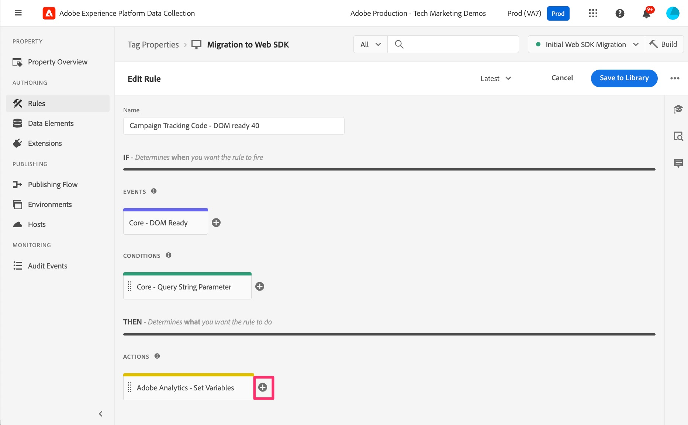

# 추가 페이지 규칙 마이그레이션

이 연습에서는 추가 페이지 기반 규칙을 웹 SDK 확장으로 마이그레이션하는 방법을 알아봅니다. 이 규칙은 기본 페이지 로드 규칙을 Web SDK으로 마이그레이션할 때 수행한 연습과 유사합니다. 메서드가 여전히 적용됩니다. 가장 큰 차이점은 이러한 규칙을 사용하면 대부분의 경우 규칙에 Analytics 확장의 비콘 보내기 작업이 포함되어 있지 않으므로 이벤트 보내기 작업을 추가할 수 없다는 것입니다.

## 개요

잠시 백업에서 Adobe Analytics 태그 확장(&quot;AppMeasurement&quot; 구현이라고도 하며, JavaScript 파일의 이름이므로)을 사용하여 Analytics 구현에 대해 알아보겠습니다.

구현 방법을 정확히 알고 있지는 않지만, Experience Platform 태그(이전의 &quot;Launch&quot;)를 사용하는 많은 구현에서 페이지 또는 URL의 항목을 기반으로 조건부으로만 실행되는 규칙이 여러 개 있습니다. 예를 들면 다음과 같습니다.

* 검색 결과 규칙, 내부 검색이 수행되고 검색 결과 페이지가 표시되는 경우에만 실행됨
* 캠페인 랜딩 페이지 규칙, URL에 추적 코드가 있을 때만 실행됩니다.
* 특정 유형의 페이지(예: 제품 세부 사항 페이지, 장바구니 페이지 등)에 대해서만 실행되는 페이지 유형 규칙
* 조건부로 실행되는 다른 모든 페이지

여기서 핵심은 이러한 모든 사용 사례는 페이지에서 **가끔**&#x200B;만 실행하며 **또한**&#x200B;에서 기본 페이지 규칙이 실행될 것으로 예상한다는 것입니다. 따라서 이러한 규칙과 함께 비콘 보내기(AA 확장) 또는 이벤트 보내기(웹 SDK 확장)를 포함하지 않으려고 합니다. 그렇지 않으면 동일한 페이지 로드에서 두 개의 히트가 발생합니다.

따라서 이러한 규칙은 개체를 빌드하지만 데이터를 전송하지 않습니다. 이러한 규칙이 기본 페이지 로드 규칙을 **before**&#x200B;실행하는지 확인하기만 하면 해당 규칙이 개체를 빌드한 후 기본 페이지 로드 규칙에서 비콘 보내기/이벤트 보내기 작업이 모든 항목을 보냅니다. 이제 이 모든 것을 알고 있을 가능성이 높으며 이것이 사이트가 설정되는 방식입니다. 그러나 구현을 처음 사용하거나 이 방법과 유사하게 구현을 &quot;수정&quot;해야 하는 경우 이 연습이 특히 유용합니다.

## 조건부 규칙의 마이그레이션 예

다음은 조건부로 실행되는 규칙을 마이그레이션하는 예제입니다. 위의 캠페인 랜딩 페이지 예를 사용합니다. 위에서 언급했듯이 이것은 변수를 설정하고 히트를 실행하지 않기 때문에 더 쉽다는 점을 제외하면 기본 페이지 규칙에서 이미 작업한 것과 동일한 패턴을 따릅니다.

1. 조건부 규칙을 찾습니다. 이 예제에서는 캠페인 추적 코드 규칙을 찾아 선택합니다.

   

1. 규칙이 열리면 쿼리 문자열 매개 변수를 기반으로 실행되는 조건이 이 규칙에 있는지 확인할 수 있습니다. 이벤트나 조건이 아닌 작업만 업데이트/마이그레이션하고자 하므로 조건에 대한 변경 사항은 필요하지 않습니다.
1. **Adobe Analytics - 변수 설정** 작업을 클릭합니다.
1. 작업에서 설정되는 모든 항목을 기록합니다. 이 예제에서는 **event101**&#x200B;과(와) **Campaign** 변수가 설정되어 있습니다.

   
   

1. 메모를 남기기 위해 여기를 클릭했을 뿐이며 변경할 필요가 없으므로 이제 **취소**&#x200B;를 클릭하면 됩니다.
1. 작업 섹션에서 **더하기 아이콘**&#x200B;을 클릭하여 새 작업을 만듭니다.

   

1. 새 규칙 구성
   1. 확장 드롭다운에서 **Adobe Experience Platform Web SDK**&#x200B;을(를) 선택합니다.
   1. 작업 유형 드롭다운에서 **변수 업데이트**&#x200B;를 선택합니다.
   1. 오른쪽 패널에서 데이터 개체 내의 **Analytics** 개체를 선택합니다

      

1. 이제 event101 및 캠페인 변수를 기존 작업에 설정된 동일한 값으로 설정합니다.

   
   

1. 이제 **변경 내용 유지** 및 **라이브러리에 저장**&#x200B;할 수 있으며, 규칙이 Web SDK으로 마이그레이션되었습니다.

>[!IMPORTANT]
>
>기본 페이지 로드 규칙과 마찬가지로 마이그레이션의 유효성을 검사할 때 데이터를 비교할 수 있도록 Analytics 확장의 **변수 설정** 작업을 규칙에 남겼습니다. 나중에 다시 와서 최종 정리를 수행할 때 Analytics 확장의 작업을 제거하는 것을 잊지 마십시오.

