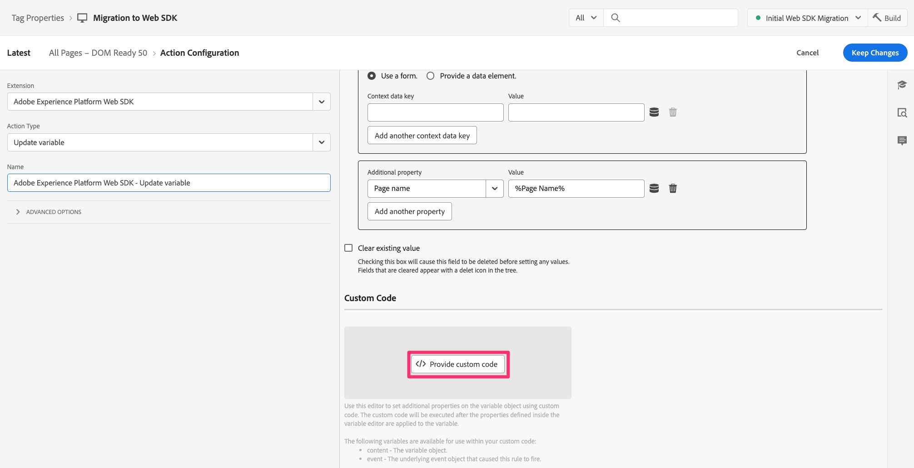
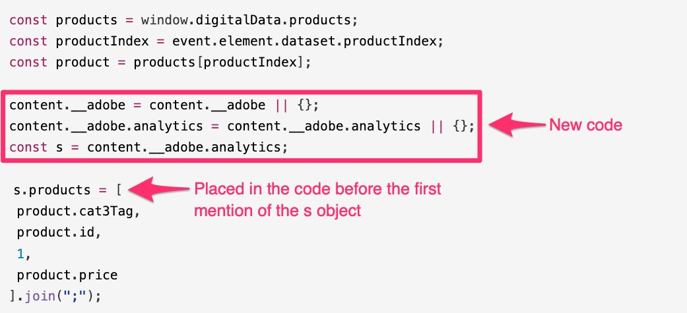

# 사용자 지정 코드를 웹 SDK으로 마이그레이션

이 연습에서는 Experience Platform 태그의 Adobe Analytics 확장에서 Adobe Experience Platform Web SDK 확장으로 사용자 지정 코드를 마이그레이션하는 방법에 대해 알아봅니다.

## 큰 면책조항

이러한 내용을 문서에 추가하여 코드 작업을 수행하는 데 가장 적합한/가장 쉬운/가장 효과적인 방법을 알려준다고 해도 놀라지 않을 것입니다. 코드를 작성하고 편집하고 처리할 수 있는 방법은 분명히 여러 가지가 있습니다. 이 연습에서는 기존 규칙에 있는 코드를 쉽게 가져와서 복사하고, 변경 사항을 추가하고, 마이그레이션된 규칙에 맞게 작동하도록 하는 방법을 제공합니다. 더 나은 방법을 생각하는 경우 매우 좋습니다. 이 방법을 사용하는 것뿐만 아니라 Experience League 커뮤니티(특히 이 튜토리얼에 대한 커뮤니티 게시물)에서 당사 및 동료와 공유하는 것을 환영합니다. 구현 플러그인을 사용하여 작업하는 페이지 하단의 경우도 마찬가지입니다. 여기서 방법을 제안하고 나서 기분이 좋을 대로 하세요. 네, 자세한 내용을 살펴보겠습니다.

>[!IMPORTANT]
>
>마지막 단락의 성격상, 코드를 잘 살펴보고 업데이트해야 하는지 또는 삭제해야 하는지 확인하려면 웹 SDK으로 마이그레이션하는 동안 이 기회를 포착하는 것이 좋습니다. 아래 단락과 단계에서 코드를 마이그레이션하는 방법을 볼 수 있으며, 한 번에 모든 코드를 쉽게 이동할 수 있더라도 봄 청소를 권장하지 않는 것이 좋습니다.

## 어떤 코드의 마이그레이션?

이 섹션에서 처음 다룰 코드는 **변수 설정** 작업을 포함한 모든 Adobe Analytics 작업의 &quot;사용자 지정 코드&quot; 창에 있을 수 있는 코드입니다. 즉, 규칙 중 하나를 열고 작업 섹션에서 아래를 봅니다. Adobe Analytics - 변수 설정 작업이 있는 경우 을 클릭하여 엽니다.


그런 다음 오른쪽에서 아래쪽으로 스크롤하면 사용자 지정 코드 창에 대한 &quot;편집기 열기&quot; 버튼이 표시됩니다. 클릭하여 엽니다.


코드가 있는 경우 웹 SDK을 사용하여 실행하고 Adobe Analytics으로 보낼 수 있도록 마이그레이션해야 합니다.
여기서의 주요 아이디어는 &quot;s&quot; 개체를 &quot;content&quot;로 변환하는 것입니다.__adobe.analytics&quot;.

웹 SDK에서 이해하고 처리할 수 있도록 s 개체에 대한 첫 번째 호출 전에 몇 가지 코드를 추가해야 합니다. 새로 변경된 코드를 추가하는 위치는 &quot;Adobe Experience Platform Web SDK - 변수 업데이트&quot; 작업의 사용자 지정 코드 창에 있습니다.

예를 들어 사용자 지정 코드 창에 다음 코드 블록이 있다고 가정해 보겠습니다.

```javascript
const products = window.digitalData.products;
const productIndex = event.element.dataset.productIndex;
const product = products[productIndex];
s.products = [
product.cat3Tag,
product.id,
1,
product.price
].join(";");
```

포함해야 하는 코드는 다음과 같습니다.

```javascript
content.__adobe = content.__adobe || {};
content.__adobe.analytics = content.__adobe.analytics || {};
const s = content.__adobe.analytics;
```

따라서 다음 단계에 따라 사용자 지정 코드를 마이그레이션합니다.

1. Adobe Analytics 변수 설정 작업의 창에서 사용자 지정 코드 복사
1. 해당 코드 창을 닫고 작업을 닫습니다(취소).
1. 웹 SDK - 변수 업데이트 작업을 클릭하여 엽니다(또는 아직 작업이 없는 경우 추가).

   

1. 오른쪽 창 상단에서 Analytics 개체를 선택합니다

   

1. 아래로 스크롤하여 Custom Code 창을 엽니다.

   

1. Analytics 사용자 지정 코드 창에서 가져온 코드에 붙여넣습니다.
1. 이제 다음 예제와 같이 s 개체의 첫 번째 언급 위에 오도록 새 코드 행을 기존 코드의 가운데에 배치합니다.



이제 사용자 지정 코드 창에 코드를 저장하고 변수 업데이트 작업의 변경 사항을 유지할 수 있습니다. 또한 규칙을 저장하고 작업 라이브러리에 새 변경 사항을 게시합니다.

## 플러그인은 어떻게 됩니까?

Adobe Analytics이 &quot;appMeasurement&quot;로 구현되어 있는 경우 Experience Platform 태그에서 Analytics 확장 기능 (이전의 &quot;Launch&quot;)을 사용하면 하나 이상의 JavaScript &quot;플러그인&quot;을 사용하여 변수를 설정하거나 다른 작업을 수행할 수 있습니다. 이러한 JavaScript 함수 및 호출이 규칙 내의 코드 창에 있는 경우 이 페이지의 위의 정보는 코드를 Web SDK으로 마이그레이션하는 데 도움이 됩니다.
그러나 플러그인 코드가 Adobe Analytics 확장 자체의 구성에서 코드 창에 있을 수도 있습니다. 마이그레이션할 플러그인과 다른 코드가 있는지 확인하려면 데이터 수집 및 태그로 이동하여 Analytics 확장을 열고 속성을 연 다음 왼쪽 탐색에서 **확장**&#x200B;을 클릭합니다.

1. 페이지 상단의 **설치됨** 탭을 선택한 다음 Adobe Analytics 확장을 선택합니다.
1. 그런 다음 페이지 오른쪽에서 **구성**&#x200B;을 클릭합니다

   

1. **사용자 지정 코드를 사용하여 추적기 구성** 섹션을 확장합니다.
1. **편집기 열기**&#x200B;를 클릭하여

   

이 시점에서 해당 위치에 있는 코드를 볼 수 있으며, 원하는 데이터를 가져오고 사용자 지정 차원에 할당하는 데 도움이 되는 JavaScript &quot;플러그인&quot;(예: 코드 조각)이 있을 수 있습니다.

이 코드 창의 모든 항목이 플러그인으로 간주될 수 있는 것은 아닙니다. 이는 Adobe Analytics 센스에서 가장 적합합니다. 코드를 마이그레이션하는 방법을 결정할 때 이 내용을 이해하는 것이 중요합니다.

### 확장의 기본 코드 창에서 코드를 마이그레이션하기 위한 권장 사항

다시 말하지만, 코드 창의 모든 항목이 Adobe Consulting에서 만든 공식 플러그인이 될 수는 없습니다. 일부는 플러그인이든 아니든 사용자가 작성한 코드일 수 있습니다. 두 가지 변경 사항을 권장합니다. 새 확장을 사용하고 나머지 코드를 복사하여 새 위치에 붙여넣습니다.

**첫째**, **일반적인 웹 SDK 플러그인**&#x200B;이라는 태그에서 사용할 수 있는 확장이 있습니다. 이 확장은 Adobe Analytics 설명서에 나열된 총 구현 플러그인 목록의 하위 집합입니다. 이 확장을 태그 속성에 설치하면 포함된 플러그인에 대한 코드가 설치됩니다. 그런 다음 이러한 플러그인을 사용하려면 새 **데이터 요소**&#x200B;를 만들 때 해당 플러그인을 찾습니다. 잠시 후 더 자세히 알아보겠습니다.

**두 번째**, Web SDK 확장 구성에 이벤트가 Adobe Analytics으로 전송되기 바로 전에 해당 코드를 실행하려는 경우 코드의 전체(또는 일부)를 입력할 수 있는 코드 창이 있습니다. 해당 코드 창을 찾는 단계는 다음과 같습니다.

1. Web SDK 확장을 속성에 이미 추가했다고 가정할 경우 **확장**&#x200B;으로 이동하여 **설치됨** 탭을 선택합니다
1. **Adobe Experience Platform Web SDK 확장**&#x200B;을 선택하고 오른쪽 레일에서 **구성**&#x200B;을 클릭하여 엽니다.

   

1. **데이터 수집** 섹션까지 아래로 스크롤한 다음 클릭하여 **onBeforeEventSend**&#x200B;에 대한 코드 창을 엽니다.

   

이 단계에서 이벤트가 웹 SDK에서 Analytics로 전송되기 전에 실행할 코드를 붙여넣습니다. 이는 기본적으로 이전 Analytics 구현에서 doPlugins 함수가 수행하던 작업입니다.

**좋은 소식**&#x200B;은(는) 전송 이벤트를 수행하는 **항상**&#x200B;이 실행되어야 하므로 페이지 로드 시 또는 사용자 지정 링크 시 이 코드를 실행하고 변수를 설정하는 등의 작업이 수행되어야 합니다.

#### 코드를 변경해야 합니까?

뭐, 그렇기도 하고 아니기도 하잖아요 예, 몇 가지 작은 항목을 변경해야 하지만, 이러한 작은 항목을 변경하는 한 코드의 대부분을 변경할 필요는 없습니다.

_&#x200B;**코드 변경 1:**&#x200B;_
선택한 후(또는 전에) &quot;플러그인&quot; 코드를 웹 SDK 확장의 코드 창에 붙여 넣으면 코드에서 &quot;doPlugin&quot; 줄을 **제거**&#x200B;합니다. 이러한 파일은 필요하지 않으며, 웹 SDK 코드가 아닌 appMeasurement.js에 속하기 때문에 오류가 발생합니다.


_&#x200B;**코드 변경 2:**&#x200B;_
필요한 다른 변경 사항은 &quot;s&quot; 개체가 정의되도록 일부 코드를 추가하는 것입니다. 이는 규칙 작업의 코드에 대해 위에서 설명한 것과 매우 유사합니다. 이 경우 코드를 약간 다르게 정의해야 하며 규칙 작업에 이미 정의되어 있지만 여기서는 정의되어 있지 않은 &quot;data&quot; 노드를 추가해야 합니다.
이 정의는 코드 창의 맨 위에 배치해야 합니다. 코드를 웹 SDK 확장에 배치할 때 복사해야 하는 코드는 다음과 같습니다.

```javascript
content.data.__adobe = content.data.__adobe || {};
content.data.__adobe.analytics = content.data.__adobe.analytics || {};
const s = content.data.__adobe.analytics;
```

_&#x200B;**두 코드 변경 포함:**&#x200B;_
다음은 위에 나열된 코드이지만 두 가지 변경 사항을 사용하여 방금 설명한 것입니다.


### 기본 확장 코드를 웹 SDK으로 마이그레이션하는 단계

위에 설명된 대로, 새로운 일반 웹 SDK 플러그인 확장 프로그램을 사용하고 Analytics 확장 프로그램 구성의 코드를 복사하여 웹 SDK 확장 프로그램 구성에 붙여넣는 것이 좋습니다. 이를 염두에 두고, 코드를 정리하기 위해 페이지 상단에 있는 중요한 메모와 함께, 높은 수준에서 권장되는 단계는 다음과 같습니다.

1. Analytics 확장의 구성 코드 창에서 모든 코드를 복사하여 웹 SDK 확장의 구성에 있는 onBeforeEventSend 창에 붙여넣습니다. 제거하거나 업데이트해야 하는 코드를 복사할 수도 있지만, 새 창의 코드에서 몇 가지 작업을 수행합니다.
1. 지금 웹 SDK 확장에서 코드를 살펴보고 **일반적인 웹 SDK 플러그인** 확장에 정의된 플러그인에 대한 호출이나 함수 정의를 찾으십시오. 플러그인 확장을 설치한 후 웹 SDK 데이터 요소 정의 창에서 플러그인 목록을 찾을 수 있습니다. 해당 확장에 대한 [설명서](https://exchange.adobe.com/apps/ec/108520)에서도 찾을 수 있습니다.
1. 새 웹 SDK 플러그인 확장 프로그램에서 찾은 각 플러그인에 대해 코드에서 확장 및 그에 대한 호출을 제거하고, 데이터 요소를 만든 다음 해당 데이터 요소를 적절한 규칙으로 호출하여 변수 등을 설정하여 해당 제거를 보상하도록 합니다.
1. 그런 다음 코드를 전달하여 appMeasurement.js 파일에 정의된 함수에 대한 호출이 있는지 확인합니다. 위의 **코드 변경 1**&#x200B;은(는) 이러한 예입니다. 아직 수행하지 않았다면 지금 doPlugins 코드를 제거할 수 있습니다. 다른 예제의 경우, 이는 코드의 어느 위치에서도 정의되지 않은 함수에 대한 호출이 있을 때 가장 잘 드러납니다. 또한 Adobe 고객 지원 센터 또는 Experience League 커뮤니티의 동료와 함께 이러한 코드가 있는지 확인할 수도 있습니다.
1. 그런 다음 코드를 전달하여 이 페이지 상단에 권장되는 대로 분석 요구 사항에 더 이상 적용되지 않는 이전 코드를 업데이트하거나 삭제합니다.
1. 이제 위에 나열된 **코드 변경 2**&#x200B;을 수행하고, s 개체에 대한 모든 참조가 코드에서 오류를 일으키지 않도록 추가 줄을 추가합니다.
1. 마지막으로, 하지만 확실히 중요한 것은, 테스트, 테스트, 그리고 더 많은 테스트를 하는 것입니다. 그런 다음 다시 테스트하십시오. 코드가 Experience Platform 디버거와 Adobe Analytics의 보고서 모두에서 예상하는 결과를 제공하는지 확인하십시오.

>[!NOTE]
>
>위의 단계에 대한 두 가지 마지막 생각.
>먼저, 모든 플러그인 코드를 제거하고 새 일반 웹 SDK 플러그인 확장 기능을 사용하는 대신 그대로 두는 것이 더 쉽다고 생각할 수 있습니다. 이는 사실적이며 괜찮지만, 확장을 사용하면 UI를 사용하고, 재사용 가능한 데이터 요소를 정의하고, 향후 모든 코드 업데이트를 자동으로 수신할 수 있는 이점을 얻을 수 있습니다. 아마 전환 할 가치가 있을 거예요.
>
>둘째, &quot;스위치 만들기&quot;에 대해 말하자면, 이제 사용자 지정 코드가 이전 &quot;s&quot; 개체를 전혀 참조하지 않도록 모든 사용자 지정 코드를 업데이트하기로 결정할 수도 있습니다. 이는 위의 5단계 확장의 일종입니다. 이것은, 물론, 전적으로 받아들일 수 있고, 좋은 생각이다. 이 마이그레이션 튜토리얼은 사용자 지정 코드를 좀 더 쉽게 마이그레이션할 수 있도록 하기 위한 것입니다. 코드가 너무 많고 현재 모든 코드를 업데이트할 수 있는 리소스가 없습니다. 결정하십시오.

코드를 작성하는 방법에는 여러 가지가 있다는 점을 인정하고 이 단원을 시작한 방식으로 이 과정을 마치겠습니다. 이 문서는 이러한 방식으로 작성하고자 하는 경우 따라야 할 몇 가지 단계를 제공합니다. 가장 중요한 것은 코드가 작동하여 예상한 결과를 얻는다는 것입니다. 그러니 자유롭게 원하는 방식으로 진행하십시오. 그리고 테스트해야 한다고 언급했습니까?
