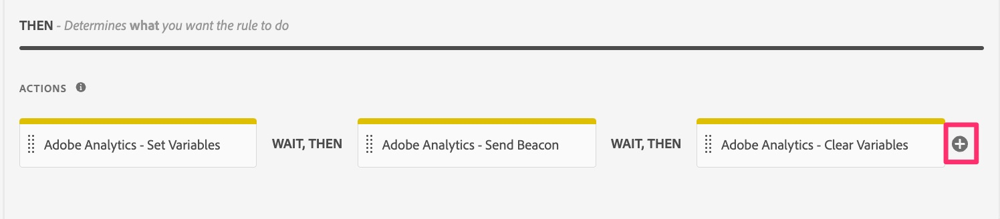
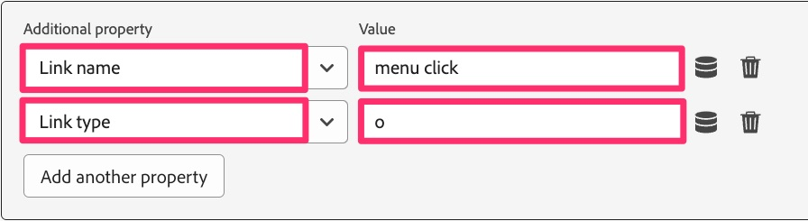

# 사용자 지정 링크 규칙 마이그레이션

이 연습에서는 사용자 지정 링크 히트를 전송하는 규칙을 마이그레이션하는 방법을 배웁니다(페이지 조회수와 반대).

## 개요

Analytics 확장 또는 AppMeasurement 코드를 사용하여 사용자 지정 링크 히트를 보낼 때 **비콘 보내기** 작업을 구성할 때 페이지 보기 히트 또는 사용자 지정 링크 히트를 보낼 것인지 선택할 수도 있으며, 사용자 지정 링크 히트를 선택할 경우 해당 히트에 대한 **링크 이름** 및 **링크 유형**&#x200B;을(를) 요청합니다. 링크 이름 및 유형 외에 다른 변수 데이터를 보내지 않는 경우 변수(prop, eVar 및 이벤트)를 설정하는 추가 작업이 필요하지 않습니다.
따라서 사용자 지정 링크 규칙인 규칙을 마이그레이션할 때 규칙에 **다음 두** 시나리오 중 하나가 생깁니다.

1. 기존 규칙에는 prop, eVar, 이벤트 등을 설정하는 **Adobe Analytics - 변수 설정** 작업이 포함된 다음 히트를 사용자 지정 링크 히트(A.K.A. an s.tl() 히트)로 설정하고, 링크 이름과 유형을 설정하고, 데이터에 전송하는 **Adobe Analytics - 비콘 보내기** 작업이 포함됩니다.
   1. 이 경우 데이터가 Adobe 서버로 전송된 후 변수의 값을 &quot;제로 아웃&quot;하기 위해 **Adobe Analytics - 변수 지우기**&#x200B;라는 최종 작업도 포함될 수 있습니다.
1. 기존 규칙에는 히트를 사용자 지정 링크 히트로 설정하고, 링크 이름 및 유형을 설정하고, 데이터를 전송하는 **Adobe Analytics - 비콘 보내기** 작업만 포함됩니다.

### 중요한 변화

Adobe Analytics 구현을 웹 SDK으로 마이그레이션할 때 이것이 중요한 이유는 다음과 같습니다.
히트가 사용자 지정 링크 히트가 되는 데 필요한 링크 이름 및 유형 설정은 &quot;비콘 보내기&quot; 작업(이벤트 보내기)에 없습니다. 대신, 링크 이름 및 유형의 해당 설정은 &quot;동등한 변수 설정&quot; 작업(변수 업데이트)에 있습니다.
그 결과, 위의 시나리오 1과 시나리오 2 중 어느 것이 있든지 간에 변수 업데이트 작업과 이벤트 보내기 작업을 모두 수행해야 합니다.

다음은 이러한 구현의 차이점을 시각적으로 표현한 것입니다.

## 마이그레이션 단계

규칙 사용자 지정 링크 규칙을 열고 위의 시나리오 1과 유사한지 시나리오 2와 유사한지 식별합니다.
**규칙이 시나리오 1과 유사한 경우:**

1. 변수 설정 작업을 열고 해당 작업에 설정되는 모든 변수(prop, eVar, event 등)를 기록합니다(예: 위의 이미지에서 event10이 설정됨).
1. 비콘 보내기 작업을 열고 s.tl() 히트를 보내도록 설정되어 있는지 확인합니다. Link Type 및 Link Name 값을 기록합니다.
1. 사용자 지정 링크 규칙의 작업 섹션에서 더하기 아이콘을 클릭하여 다른 규칙을 추가합니다.

   

1. 작업 구성
   1. **확장**&#x200B;을(를) Adobe Experience Platform Web SDK으로 설정
   1. 변수를 업데이트하려면 **작업 유형**&#x200B;을(를) 설정하십시오.
   1. **Analytics** 개체 선택
   1. Analytics 변수 설정 작업(이 예에서는 event10)에서 prop, eVar 및 이벤트를 설정합니다.

      

   1. 같은 규칙에서 **추가 속성** 드롭다운 필드로 스크롤한 다음 **링크 이름** 필드를 추가하여 비콘 보내기 규칙에서 가져온 값으로 설정합니다. 아래 이미지에서는 이름을 문자열 값 &quot;menu click&quot;으로 설정하는 예를 보여 줍니다.
   1. 또한 동일한 드롭다운에서 **링크 유형** 필드를 추가하고 &quot;o&quot;를 값으로 추가합니다(비콘 보내기 작업의 링크 유형이 &quot;사용자 지정 링크&quot;라고 가정). 이렇게 하면 사용자 지정 링크에 해당하는 링크 유형 &quot;기타&quot;가 전송됩니다. 링크 유형이 다운로드 링크인 경우 이 새 링크 유형 필드의 값에 &quot;d&quot;를 선택하고 링크 유형이 종료 링크인 경우 이 새 링크 유형 필드의 값에 &quot;e&quot;를 선택합니다.

      

1. 추가 속성 아래에 **기존 값 지우기** 확인란이 표시됩니다. 기존 규칙에 **Adobe Analytics - 변수 지우기 작업**&#x200B;이 있는 경우(3단계에서 설명한 대로) 이 확인란을 선택하면 웹 SDK에 대해 변수 지우기 작업을 추가할 필요가 없습니다.

   

1. 더하기 아이콘을 클릭하여 다른 작업을 추가합니다.
1. 이벤트 보내기 작업 구성
   1. **확장**&#x200B;을(를) Adobe Experience Platform Web SDK으로 설정
   1. **작업 유형**&#x200B;을(를) 보낸 이벤트로 설정
   1. 데이터 요소 아이콘을 클릭하고 **페이지 보기 데이터 변수** 데이터 요소를 선택합니다.

   

1. 작업 라이브러리를 이미 설정했으므로 **변경 내용 유지**, **라이브러리에 저장**&#x200B;하면 같은 페이지에서 라이브러리를 **빌드**&#x200B;할 수 있습니다.

## 중요한 마이그레이션 결론 도출

* 이 단원에서는 사용자 지정 링크 규칙을 마이그레이션하는 방법에 대해 배웠습니다.
* [기본 페이지 로드 규칙 마이그레이션](migrate-your-default-page-load-rule.md) 연습에서 변수를 설정하고 Analytics 비콘으로 전송하는 규칙을 마이그레이션하는 방법에 대해 배웠습니다.
* [추가 페이지 규칙 마이그레이션](migrate-additional-page-rules.md) 단원에서 변수를 설정하지만 비콘을 Adobe Analytics으로 보내지 않는 규칙을 마이그레이션하는 방법에 대해 배웠습니다.

예상대로 여러 규칙에서 동일한 방법을 사용하여 Analytics 확장을 웹 SDK으로 마이그레이션할 수 있습니다.
대부분의 경우 규칙에서 **작업을 업데이트**&#x200B;하는 것입니다. 이벤트나 이벤트 실행 조건을 변경할 수 없습니다. 규칙이 실행될 때 작업 섹션에서 발생하는 사항만 변경합니다.
모두는 아니더라도 대부분의 규칙은 이러한 범주에 속합니다. 그렇지 않은 규칙이 있는 경우 규칙을 트리거한 것이 아니라 작업을 마이그레이션하는 것과 동일한 패러다임을 고려하십시오.
