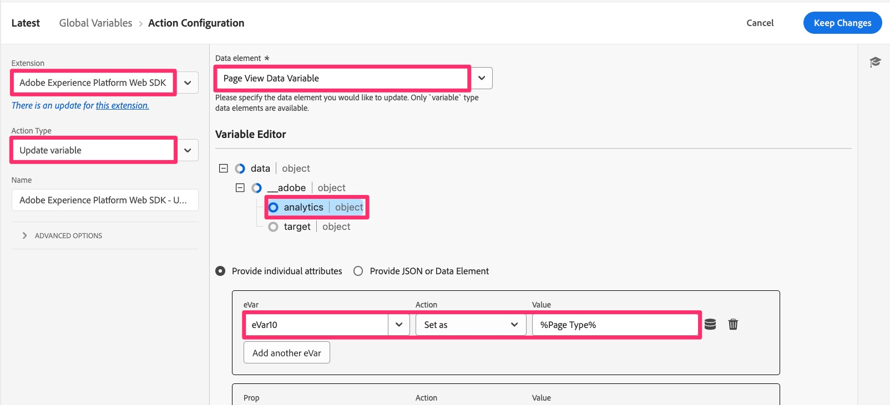

# 전역 변수 마이그레이션

이 연습에서는 Analytics 확장 구성에서 웹 SDK으로 전역 변수를 마이그레이션하는 방법을 알아봅니다.

## 개요

Adobe Analytics 확장에는 &quot;전역 변수&quot;라는 구성 섹션이 있습니다.

글로벌 변수는 페이지에서 Analytics 추적 개체가 초기화될 때 해당 개체에 설정되는 변수입니다. 여기서 설정한 모든 변수는 추적 개체가 각 페이지에서 만들어질 때 설정됩니다.

여기에서 변수를 설정하는 경우 이러한 변수를 웹 SDK으로도 마이그레이션해야 합니다.

## 웹 SDK에서 전역 변수를 추가하는 위치

여기서 **밑줄**은(는) 웹 SDK 확장의 구성에 동일한 영역이 없으므로 기본 페이지 로드 규칙 연습에서 수행한 것처럼 변수를 복사하는 것만큼 쉽지는 않습니다.
대신, 간단한 대답은 **모든 페이지에서 다른 규칙보다 먼저 실행되는 새 규칙을 만들고 변수를 설정하는 것입니다.**

단계를 정의하지 않아도 되는 경우 그렇게 하면 이 단원이 완료됩니다. 도움이 필요한 경우 계속...

### 전역 변수를 웹 SDK으로 마이그레이션하는 단계

1. Adobe Analytics 확장 구성을 엽니다.

   

1. Global Variables 섹션(위의 이미지)까지 아래로 스크롤하여 열고 설정되는 모든 변수를 기록합니다. 이러한 변수와 값은 이후 단계에서 알아야 합니다.
1. Analytics 확장에서 다시 로그아웃합니다.
1. 왼쪽 탐색에서 **규칙**&#x200B;을 선택하고 **규칙 추가**&#x200B;를 클릭합니다.
1. 새 규칙의 이름을 &quot;전역 변수&quot;로 지정합니다.
1. 이벤트 아래의 추가 버튼을 클릭합니다.

   

1. 다른 규칙보다 먼저 트리거되도록 이벤트를 구성합니다. 다른 규칙에서 사용한 이벤트 유형과 순서를 알아야 합니다. 값 예:
   1. **Extension**&#x200B;을(를) Core로 설정
   1. 구현에 따라 **이벤트 유형**&#x200B;이(가) DOM 지원일 수 있습니다.
   1. **고급 옵션** 확장
   1. **Order**을(를) 다른 규칙보다 낮은 숫자로 설정하면 먼저 실행됩니다.
      
      >[!NOTE]
      >
      >여기에서 중요한 것은 이 규칙이 기본 페이지 로드 규칙 전에 실행되어 이 규칙에 설정된 모든 변수가 sendEvent 규칙을 통해 Analytics로 전송될 수 있다는 것입니다. 그러나 Analytics 확장의 전역 변수 섹션에 설정된 변수가 다른 규칙에서 변경될 수 있으므로 이 규칙은 전체적으로 **first**&#x200B;에서 실행되도록 하는 것이 좋습니다. 우리는 그 기능을 모방하고 있다. 위의 샘플에서는 &quot;10&quot;이 다른 규칙보다 낮은 주문 번호라고 가정합니다. 잘못된 경우 다른 규칙보다 낮은 숫자로 번호를 변경해 주십시오.
1. **변경 내용 유지**&#x200B;를 선택하여 작업을 저장합니다.
1. 이 규칙에 조건을 추가할 필요가 없으므로 규칙 작성의 해당 섹션만 남겨둘 수 있습니다.
1. **작업** 섹션 아래에 있는 더하기 아이콘을 클릭합니다.
1. 새 작업 구성
   1. Adobe Experience Platform Web SDK **확장** 선택
   1. **작업 유형**&#x200B;에 대해 변수 업데이트를 선택하십시오.
   1. 오른쪽에서 변수 **Data Element**&#x200B;을(를) 선택합니다. 이 자습서에서는 &quot;페이지 보기 데이터 요소&quot;라고 하지만 사용자의 데이터 요소는 다를 수 있습니다.
   1. 데이터 개체에서 **Analytics** 선택
   1. Analytics 확장 구성의 전역 변수 섹션에서 저장한 변수를 채웁니다(이 자습서의 예에서는 eVar10을 페이지 유형 데이터 요소로 설정)

   

1. 변경 내용 유지
1. 규칙을 작업 라이브러리에 저장하고 빌드합니다.

전역 변수가 이제 Web SDK으로 마이그레이션되어 페이지 로드 시 실행됩니다.
