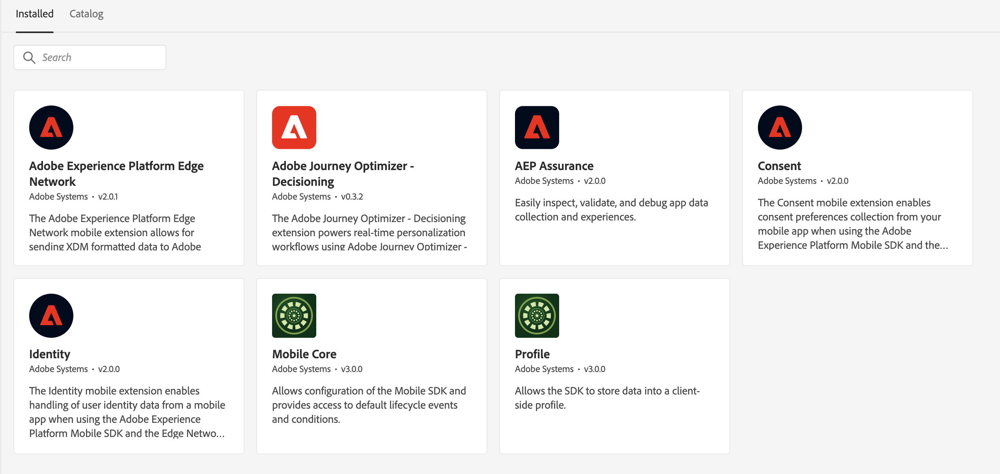

# 초기 데이터 수집 설정 수행

Target SDK에서 SDK 최적화로 마이그레이션하려면 Optimize SDK의 적절한 데이터 캡처, 기능 및 기능을 활성화하는 초기 설정이 필요합니다. 웹 사이트 구현 변경이 수행되기 전에 다음 단계를 완료해야 합니다.

- 데이터 수집을 위해 Adobe Admin Console에서 [적절한 사용 권한을 구성](https://experienceleague.adobe.com/ko/docs/platform-learn/implement-web-sdk/overview#permissions){target="_blank"}
- 구조화된 데이터를 Edge Network에 전달하기 위해 [XDM 스키마 구성](https://experienceleague.adobe.com/ko/docs/platform-learn/implement-mobile-sdk/initial-configuration/create-schema){target="_blank"}
- Adobe Target 데이터를 받도록 [스키마를 구성](https://experienceleague.adobe.com/ko/docs/platform-learn/implement-mobile-sdk/experience-cloud/target#update-your-schema){target="_blank"}
- 장치 간 개인 설정 및 mbox3rdPartyId 기능을 위해 [ID 네임스페이스를 구성](https://experienceleague.adobe.com/ko/docs/platform-learn/implement-mobile-sdk/app-implementation/identity#set-up-a-custom-identity-namespace){target="_blank"}
- Edge Network에서 데이터 전달을 사용하려면 [데이터 스트림을 만듭니다](https://experienceleague.adobe.com/ko/docs/platform-learn/implement-mobile-sdk/initial-configuration/create-datastream){target="_blank"}
- Adobe Target에 데이터를 전달할 수 있도록 [데이터 스트림을 구성](https://experienceleague.adobe.com/ko/docs/platform-learn/implement-mobile-sdk/experience-cloud/target#update-datastream-configuration){target="_blank"}
- Decisioning 확장에 대한 [태그 속성 구성](https://experienceleague.adobe.com/ko/docs/platform-learn/implement-mobile-sdk/experience-cloud/target#install-adobe-journey-optimizer---decisioning-tags-extension){target="_blank"}

## 확장 구성

>[!BEGINTABS]

>[!TAB Decisioning 확장]

Decisioning 확장을 사용할 때 설치된 태그 확장:

1. Adobe Journey Optimizer - Decisioning
1. Adobe Experience Platform Edge Network
1. Mobile Core
1. 프로필
1. 동의
1. ID
1. AEP Assurance(선택 사항, 디버깅에 필요)

>[!TAB 대상 확장]

Target 확장을 사용할 때 설치된 태그 확장:

1. Adobe Target
1. Mobile Core
1. 프로필
1. Adobe Analytics (선택 사항, Adobe Target 활동을 위한 보고 소스로 Adobe Analytics을 사용하는 경우 필요)

>[!ENDTABS]

## 데이터 스트림 구성

Target 확장에 [구성 가능한 설정](https://developer.adobe.com/client-sdks/solution/adobe-target/#configure-the-target-extension-in-the-data-collection-ui)이 있습니다. 결정 확장에는 [데이터 스트림에 구성된](https://developer.adobe.com/client-sdks/edge/adobe-journey-optimizer-decisioning/#adobe-experience-platform-data-collection-setup)이(가) 있습니다.

| Target 확장 | Decisioning 확장 | 참고 |
| --- | --- | --- | 
| 클라이언트 코드 | 해당 사항 없음 | IMS 조직 세부 사항을 사용하여 에지에서 자동으로 설정 |
| 환경 ID | 대상 환경 ID | 데이터스트림에 구성됨 |
| Target Workspace 속성 | 속성 토큰 | 데이터스트림에 구성됨 |
| 시간 초과 | 시간 초과 | Decisioning 확장 및 SDK 최적화에서 구성할 수 있습니다. 기본 시간 제한은 10초입니다. |
| 서버 도메인 | Edge Network 도메인 | Adobe Experience Platform Edge Network 확장 기능 설정 |

다음으로 [Target SDK을 바꾸기](replace-sdk.md)하는 방법을 알아봅니다.

>[!NOTE]
>
>Target 확장에서 Decisioning 확장으로 모바일 Target을 성공적으로 마이그레이션할 수 있도록 지원하기 위해 최선을 다하고 있습니다. 마이그레이션에 문제가 발생하거나 이 안내서에 중요한 정보가 누락된 것 같은 느낌이 드는 경우 [이 커뮤니티 토론](https://experienceleaguecommunities.adobe.com/t5/adobe-experience-platform-data/tutorial-discussion-migrate-adobe-target-to-mobile-sdk-on-edge/m-p/747484?profile.language=ko#M625)에 게시하여 알려 주십시오.
