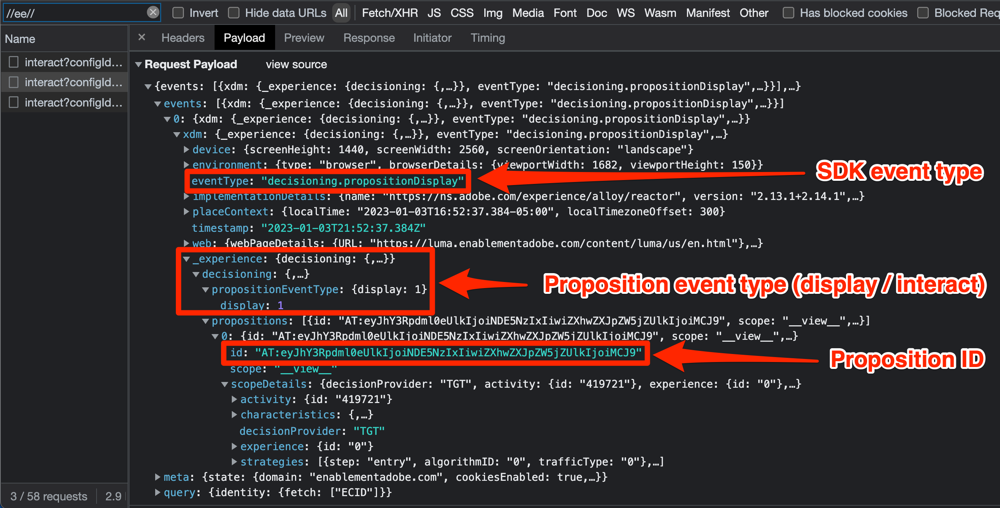

# Platform Web SDK를 사용하여 Target 디버그

Target 활동을 확인하고 Web SDK를 디버깅하여 구현, 콘텐츠 전달 또는 대상 자격 문제를 해결합니다. 마이그레이션 안내서의 이 페이지에서는 at.js를 사용한 디버깅과 Platform Web SDK의 차이점에 대해 설명합니다.

아래 표에는 테스트 및 디버깅 접근 방식에 대한 기능과 지원이 요약되어 있습니다.

| 피쳐 또는 도구 | at.js 지원 | Platform Web SDK 지원 |
| --- | --- | --- |
| 활동 QA URL | 예 | 예 |
| `mboxDisable` URL 매개 변수 | 예 | [Target 기능을 사용하지 않도록 설정](#disable-target-functionality)하려면 아래 정보를 참조하세요. |
| `mboxDebug` URL 매개 변수 | 예 | 유사한 디버그 정보에 `alloy_debug` 매개 변수 사용 |
| `mboxTrace` URL 매개 변수 | 예 | Experience Platform 디버거 브라우저 확장 사용 |
| Adobe Experience Platform Debugger 확장 | 예 | 예 |
| `alloy_debug` URL 매개 변수 | 적용할 수 없음 | 예 |
| Adobe Experience Platform Assurance | 적용할 수 없음 | 예 |

## Adobe Experience Platform Debugger 브라우저 확장

Chrome 및 Firefox용 Adobe Experience Platform Debugger 확장 기능은 웹 페이지를 살펴보고 Adobe Experience Cloud 구현의 유효성을 검사하는 데 도움이 됩니다.

모든 웹 페이지에서 Platform Debugger를 실행할 수 있으며 확장 프로그램은 공개 데이터에 액세스할 수 있습니다. Target 추적 정보와 같은 확장을 사용하여 비공개 데이터에 액세스하려면 **[!UICONTROL 로그인]** 링크를 통해 Experience Cloud을 인증해야 합니다.

### Adobe Experience Platform Debugger 가져오기 및 설치

이 Adobe Experience Platform Debugger은 Google Chrome 또는 Mozilla Firefox 브라우저에 설치할 수 있습니다. 아래의 해당 링크를 따라 원하는 브라우저에 확장을 설치합니다.

- [Chrome](https://chrome.google.com/webstore/detail/adobe-experience-platform/bfnnokhpnncpkdmbokanobigaccjkpob)
- [Firefox](https://addons.mozilla.org/ko-KR/firefox/addon/adobe-experience-platform-dbg/)

Chrome 확장 또는 Firefox 추가 기능을 설치하면 확장 모음에 아이콘()이 추가됩니다. 이 아이콘을 선택하여 확장을 엽니다.

[Adobe Experience Platform Debugger 확장](https://experienceleague.adobe.com/docs/experience-platform/debugger/home.html?lang=ko)과 모든 Adobe 웹 응용 프로그램을 디버깅하는 방법에 대한 자세한 내용은 전용 안내서를 참조하세요.

## QA URL을 사용하여 Target 활동 미리 보기

at.js와 Platform Web SDK를 사용하면 모두 Target QA URL을 사용하여 Target 활동을 미리 볼 수 있으며, 두 구현 방법 모두 동일한 QA 기능을 지원합니다.

at.js 또는 Platform Web SDK에서 `at_qa_mode` 브라우저에 특정 쿠키를 작성하도록 지시하여 작동하는 Target QA URL입니다. 이 쿠키는 특정 활동 및 경험에 대한 자격을 부여하는 데 사용됩니다.

>[!CAUTION]
>
>Target QA 모드 기능은 Platform Web SDK 버전 2.13.0 이상에서 지원됩니다. 대상 QA 모드는 `sendEvent` 호출에서 전달된 `xdm.web.webPageDetails.URL` 값을 기반으로 활성화됩니다. 모든 문자의 소문자로 시작하는 등 이 값을 수정하면 Target QA 모드가 제대로 작동하지 않을 수 있습니다.

[Target 활동 QA](https://experienceleague.adobe.com/docs/target/using/activities/activity-qa/activity-qa.html?lang=ko)에 대한 자세한 내용은 전용 안내서를 참조하세요.

## Target 구현 디버그

아래 표는 at.js와 Platform Web SDK 디버깅 전술 간의 차이점을 간략하게 설명합니다.

| at.js 기능 | Platform Web SDK에 해당하는 함수 |
| --- | --- |
| **Mbox 비활성화** - Target 상호 작용 없이 페이지가 손상되었는지 확인하기 위해 Target 가져오기 및 렌더링을 비활성화합니다.  URL 매개 변수로 페이지를 로드합니다. `mboxDisable=true` | 직접 동등 항목 없음. 브라우저의 개발자 도구를 사용하여 모든 Platform Web SDK 요청을 차단할 수 있습니다. |
| **Mbox 디버그** - 브라우저의 콘솔에서 모든 at.js 작업을 로그하여 렌더링 문제를 해결합니다.  URL 매개 변수가 있는 페이지를 로드합니다. `mboxDebug=true` | **Alloy Debug** - Target 개인화 작업을 포함하되 이에 국한되지 않는 SDK의 자세한 작업을 기록합니다.  URL 매개 변수가 있는 페이지를 로드합니다. `alloy_debug=true`   또는 개발자 콘솔에서 `alloy("setDebug", { "enabled": true });`을(를) 실행하십시오. |
| **대상 추적** - Target UI에서 생성된 mbox 추적 토큰을 사용하면 의사 결정 프로세스에 참여한 세부 정보가 있는 추적 개체를 `window.___target_trace` 개체에서 사용할 수 있습니다.  URL 매개 변수가 있는 페이지 로드: `mboxTrace=window&authorization={TOKEN}` | Adobe Experience Platform Debugger 확장 프로그램 또는 Platform Assurance를 사용합니다. |

>[!NOTE]
>
>위에 나열된 모든 at.js 디버깅 기능은 Adobe Experience Platform Debugger의 향상된 기능과 함께 사용할 수 있습니다.

### Target 기능 비활성화

Platform Web SDK에는 현재 Target 응답을 선택적으로 표시하지 않는 기능이 없습니다. 하지만 브라우저의 개발자 도구, 다양한 브라우저 확장 또는 타사 응용 프로그램을 사용하여 Platform Web SDK 요청을 무시할 수 있습니다. 예를 들어 Google Chrome을 사용하여 Platform Web SDK를 차단하려면 다음을 수행하십시오.

1. 페이지의 아무 곳이나 마우스 오른쪽 단추로 클릭하고 **Inspect** 선택
1. **네트워크** 탭 선택
1. `//ee//` 문자열로 필터링하여 Platform Web SDK 호출만 봅니다.
1. 페이지 다시 로드
1. 필터링된 네트워크 요청 중 하나를 마우스 오른쪽 단추로 클릭하고 **요청 도메인 차단**&#x200B;을 선택합니다.
1. 페이지를 다시 로드하고 네트워크 요청이 차단되었음을 확인합니다.
1. 디버깅이 끝나면 차단된 네트워크 요청을 마우스 오른쪽 단추로 클릭하고 **차단 해제**&#x200B;를 선택하거나 개발자 도구 패널을 닫습니다

### 디버그 로깅 보기

`mboxDebug=true` URL 매개 변수를 사용하여 at.js에 대한 디버그 로깅에는 각 Target 요청, 응답 및 페이지에 콘텐츠를 렌더링하려는 시도에 대한 자세한 정보가 표시됩니다. Platform Web SDK에 `alloy_debug=true` URL 매개 변수를 사용한 유사한 디버그 로깅이 있습니다.

| 기록된 정보 | at.js(`mboxDebug=true`) | Platform Web SDK(`alloy_debug=true`) |
| --- | --- | --- |
| 필터링용 로깅 접두사 | `AT:` | `[alloy]` |
| 페이지 로드 요청 세부 정보 | 예 | 예 |
| Mbox 또는 범위 요청 세부 정보 | 예 | 예 |
| 요청 상태 | 예 | 예 |
| 응답 세부 정보 | 예 | 예 |
| 렌더링 상태 | 성공 및 오류 | 오류만 |
| 렌더링 세부 정보 | 예 | 예 |

>[!NOTE]
>
>at.js 및 Platform Web SDK에 대한 디버그 로그는 웹 SDK에서 잘못된 선택기로 인한 렌더링 오류만 알리는 주목할 만한 예외를 제외하고 비슷한 수준의 세부 정보를 제공합니다. 디버그 로깅은 현재 렌더링이 성공했는지 확인하지 않습니다.

### Target 추적 보기

Target 추적은 활동 자격 및 방문자의 Target 프로필에 대한 자세한 정보를 제공합니다. Target 추적에는 공개적으로 사용할 수 없는 정보가 포함되어 있으므로 해당 추적을 보려면 Adobe Experience Platform Debugger 브라우저 확장 창 내에서 인증 토큰 또는 인증이 필요합니다.

| Target 추적 메서드 | at.js | Platform Web SDK |
| --- | --- | --- |
| `mboxTrace` URL 매개 변수 | 예 | 아니요 |
| Adobe Experience Platform Debugger 브라우저 확장 | 예 | 예 |
| Adobe Experience Platform Assurance | 아니요 | 예 |

Adobe Experience Platform Debugger을 사용하여 Platform Web SDK Target 추적을 보려면 다음을 수행하십시오.

1. Platform Web SDK를 사용하여 Target을 구현한 사이트의 페이지로 이동합니다
1. 브라우저 탐색 모음에서 아이콘()을 선택하여 Adobe Experience Platform Debugger 확장을 엽니다.
1. **[!UICONTROL 로그인]** 링크 선택
1. Adobe Experience Cloud 로그인을 사용하여 인증
1. 왼쪽의 **[!UICONTROL 로그]** 탭을 선택하십시오.
1. 맨 위의 **[!UICONTROL Edge]** 탭을 선택합니다.
1. 필요한 경우 디버깅 세션에 이름을 지정하고 **[!UICONTROL 연결]** 단추를 클릭합니다.
1. 페이지를 다시 로드하면 로그가 에지 네트워크 상호 작용에 대한 자세한 정보로 채워집니다
1. 설명의 &quot;대상 추적&quot;으로 시작하는 로그 항목에 초점을 맞추고 **[!UICONTROL 보기]**&#x200B;를 선택하여 대상 추적 세부 정보를 봅니다.

{zoomable="yes"}

**[!UICONTROL 보기]**&#x200B;를 선택하면 요청과 관련된 다음 정보를 볼 수 있는 오버레이가 나타납니다.

- 일치하는 활동
- 일치하지 않는 활동
- 요청 세부 정보
- 프로필 스냅샷

Target 추적에 대한 자세한 내용은 [Target 콘텐츠 게재 디버깅](https://experienceleague.adobe.com/docs/target/using/activities/troubleshoot-activities/content-trouble.html?lang=ko)에 대한 전용 안내서를 참조하십시오.

### Assurance 문제 해결

대상 추적 정보는 Adobe Experience Platform Debugger 브라우저 확장 기능 및 Assurance 애플리케이션(이전에는 프로젝트 그리폰)에서 모두 볼 수 있습니다. Assurance 내에서 Target 추적을 보려면 다음 작업을 수행하십시오.

1. 위에 설명된 대로 Adobe Experience Platform Debugger 브라우저 확장을 열고 원격 디버깅 세션을 연결합니다
1. 디버깅 로그 위에서 세션 이름이 있는 링크를 선택합니다.
1. Platform Assurance는 구현을 위해 데이터 스트림에 구성된 모든 Adobe 애플리케이션에 대한 자세한 로깅을 로드하고 표시합니다
1. `adobe.target`(으)로 로그 필터링
1. 유형이 `com.adobe.target.trace`인 로그 항목 선택
1. 페이로드의 세부 정보를 확장하고 `context > targetTrace`에서 정보를 봅니다.

{zoomable="yes"}

## 네트워크 요청 및 응답 검사

Platform Web SDK `sendEvent` 호출의 요청 페이로드와 응답이 at.js와 다릅니다. 아래 개요는 브라우저의 개발자 도구를 사용하여 네트워크 호출을 검사하는 동안 요청 및 응답의 구조를 이해하는 데 도움이 됩니다.

### 컨텐츠 요청 페이로드

{zoomable="yes"}

- 프로필, 엔터티 및 기타 mbox가 아닌 매개 변수가 `data.__adobe.target` 아래의 이벤트 배열에 전달됩니다.
- 결정 범위가 `query.personalization.decisionScopes` 아래의 이벤트 배열에 있습니다.
- mbox 매개 변수 다운스트림에 매핑되는 XDM 데이터는 `xdm` 아래의 이벤트 배열에 있습니다.

### 콘텐츠 응답 본문

{zoomable="yes"}

- Platform Web SDK가 `handle` 개체 아래의 모든 Adobe 응용 프로그램에 대한 작업을 반환합니다
- `personalization:decisions` 작업은 Target 또는 offer decisioning의 응답을 나타냅니다
- 대상 제안이 배열로 표시되며, 각 제안 ID에는 `AT:` 접두사가 붙습니다.
- 의사 결정 범위 및 활동 세부 사항은 제안 배열 내에 있습니다.
- 오퍼 세부 정보가 `data` 아래 `items` 배열에 있습니다.
- 응답 토큰이 `meta` 아래 `items` 배열에 있습니다.

### 제안 이벤트 페이로드

{zoomable="yes"}

- Target 특정 SDK 이벤트는 노출의 경우 `decisioning.propositionDisplay`이고, 클릭과 같은 상호 작용의 경우 `decisioning.propositionInteract`입니다.
- 제안 이벤트의 세부 정보는 `xdm._experience.decisioning` 아래 이벤트 배열에 있습니다.
- 디스플레이 또는 상호 작용 이벤트의 제안 ID는 Target에서 반환된 콘텐츠의 제안 ID와 일치해야 합니다

축하합니다. 자습서가 종료되었습니다! Adobe Target 구현을 웹 SDK로 마이그레이션해 주셔서 감사합니다.

>[!NOTE]
>
>at.js에서 Web SDK로 Target을 성공적으로 마이그레이션할 수 있도록 지원하기 위해 최선을 다하고 있습니다. 마이그레이션에 문제가 발생하거나 이 안내서에 중요한 정보가 누락된 것 같은 느낌이 드는 경우 [이 커뮤니티 토론](https://experienceleaguecommunities.adobe.com/t5/adobe-experience-platform-data/tutorial-discussion-migrate-target-from-at-js-to-web-sdk/m-p/575587?profile.language=ko#M463)에 게시하여 알려 주십시오.
