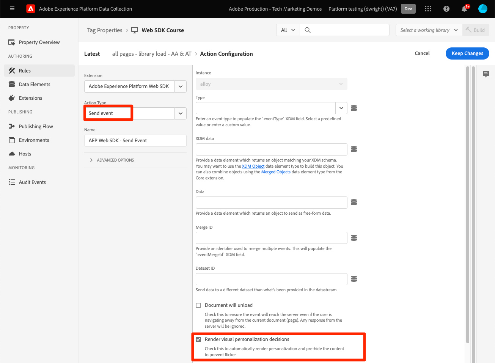

# Adobe Target VEC(시각적 경험 작성기) 활동 렌더링

Target 활동은 VEC(시각적 경험 작성기) 또는 양식 기반 작성기를 사용하여 설정됩니다. Platform Web SDK는 at.js와 마찬가지로 VEC 기반 활동을 검색하고 페이지에 적용할 수 있습니다. 마이그레이션의 이 부분에 대해 다음을 수행합니다.

* Visual Editing Helper 브라우저 확장 기능 설치
* Platform Web SDK로 `sendEvent` 호출을 실행하여 활동을 요청합니다.
* `getOffers()`을(를) 사용하여 Target `pageLoad` 요청을 실행하는 at.js 구현의 모든 참조를 업데이트합니다.

## Visual Editing Helper 브라우저 확장 기능

Google Chrome용 Adobe Experience Cloud Visual Editing Helper 브라우저 확장 기능을 사용하면 웹 사이트를 Adobe Target VEC(시각적 경험 작성기)에 안정적으로 로드하여 웹 경험을 빠르게 작성 및 QA할 수 있습니다.

Visual Editing Helper 브라우저 확장 기능은 at.js 또는 Platform Web SDK를 사용하는 웹 사이트에서 작동합니다.

### Visual Editing Helper 가져오기 및 설치

1. Chrome 웹 스토어의 [Adobe Experience Cloud Visual Editing Helper 브라우저 확장 기능](https://chrome.google.com/webstore/detail/adobe-experience-cloud-vi/kgmjjkfjacffaebgpkpcllakjifppnca)(으)로 이동합니다.
1. **Chrome**&#x200B;에 추가 > **확장 추가**&#x200B;를 클릭합니다.
1. Target에서 VEC를 엽니다.
1. 확장 기능을 사용하려면 VEC 또는 QA 모드에서 Chrome 브라우저의 도구 모음에 있는 Visual Editing Helper 브라우저 확장 기능 아이콘 {zoomable="yes"}을 클릭합니다.

작성 기능을 향상시키기 위해 Target VEC에서 웹 사이트를 열면 Visual Editing Helper 가 자동으로 활성화됩니다. 확장에는 조건부 설정이 없습니다. 확장은 SameSite 쿠키 설정을 포함한 모든 설정을 자동으로 처리합니다.

[Visual Editing Helper 확장 기능](https://experienceleague.adobe.com/docs/target/using/experiences/vec/troubleshoot-composer/visual-editing-helper-extension.html?lang=ko) 및 [시각적 경험 작성기 문제 해결](https://experienceleague.adobe.com/docs/target/using/experiences/vec/troubleshoot-composer/troubleshoot-composer.html?lang=ko)에 대한 자세한 내용은 전용 설명서를 참조하십시오.

>[!IMPORTANT]
>
>새 [Visual Editing Helper 확장 기능](https://chrome.google.com/webstore/detail/adobe-experience-cloud-vi/kgmjjkfjacffaebgpkpcllakjifppnca)은(는) 이전 [Target VEC Helper 브라우저 확장 기능](https://experienceleague.adobe.com/docs/target/using/experiences/vec/troubleshoot-composer/vec-helper-browser-extension.html?lang=ko)을 대체합니다. 이전 VEC Helper 확장이 설치되어 있는 경우 Visual Editing Helper 확장을 사용하기 전에 제거하거나 비활성화해야 합니다.

## 자동으로 콘텐츠 요청 및 적용

페이지에 Platform Web SDK가 구성되면 Target에서 콘텐츠를 요청할 수 있습니다. 라이브러리가 로드될 때 컨텐츠를 자동으로 요청하도록 구성할 수 있는 at.js와 달리, Platform Web SDK에서는 명시적으로 명령을 실행해야 합니다.

at.js 구현에 VEC 기반 활동을 자동으로 렌더링할 수 있는 `pageLoadEnabled` 설정이 `true`(으)로 설정되어 있는 경우 Platform Web SDK로 다음 `sendEvent` 명령을 실행합니다.

>[!BEGINTABS]

>[!TAB JavaScript]

```Javascript
alloy("sendEvent", {
  "renderDecisions": true
});
```

>[!TAB 태그]

태그에서 [!UICONTROL 시각적 개인화 결정 렌더링] 옵션이 선택된 상태로 [!UICONTROL 이벤트 보내기] 작업 유형을 사용하십시오.

{zoomable="yes"}

>[!ENDTABS]

<!--
When the Platform Web SDK renders an activity to the page with `renderDecisions` set to `true`, an additional notification call fires automatically to increment an impression and attribute the visitor to the activity. This call uses an event type with the value `decisioning.propositionDisplay`.

{zoomable="yes"}
-->

## 요청 시 콘텐츠 요청 및 적용

일부 Target 구현에서는 페이지에 적용하기 전에 VEC 오퍼에 대한 몇 가지 사용자 지정 처리가 필요합니다. 또는 한 번의 호출로 여러 위치를 요청합니다. at.js 구현에서는 `pageLoadEnabled`을(를) `false`(으)로 설정하고 `getOffers()` 함수를 사용하여 `pageLoad` 요청을 실행하여 이 작업을 수행할 수 있습니다.

+++ `getOffers()` 및 `applyOffers()`을(를) 사용하여 VEC 기반 활동을 수동으로 렌더링하는 at.js 예제

```JavaScript
adobe.target.getOffers({
  request: {
    execute: {
      pageLoad: {}
    }
  }
}).
then(response => adobe.target.applyOffers({ response: response }));
```

+++

Platform Web SDK에 특정 `pageLoad` 이벤트가 없습니다. Target 콘텐츠에 대한 모든 요청은 `sendEvent` 명령을 사용하여 `decisionScopes` 옵션으로 제어됩니다. `__view__` 범위는 `pageLoad` 요청의 목적을 수행합니다.

+++ 동일한 Platform 웹 SDK `sendEvent` 접근 방식:

1. `__view__` 결정 범위를 포함하는 `sendEvent` 명령 실행
1. `applyPropositions` 명령을 사용하여 반환된 콘텐츠를 페이지에 적용합니다.
1. `decisioning.propositionDisplay` 이벤트 유형 및 제안 세부 정보로 `sendEvent` 명령을 실행하여 노출을 증가시킵니다.

```Javascript
alloy("sendEvent", {
  // Request the special "__view__" scope for target-global-mbox / pageLoad
  decisionScopes: ["__view__"]
}).then(function(result) {
  // Check if content (propositions) were returned
  if (result.propositions) {
    var retrievedPropositions = result.propositions;
    // Apply propositions to the page
    return alloy("applyPropositions", {
      propositions: retrievedPropositions
    }).then(function(applyPropositionsResult) {
      var renderedPropositions = applyPropositionsResult.propositions;
      // Send a display notification with the sendEvent command
      alloy("sendEvent", {
        "xdm": {
          "eventType": "decisioning.propositionDisplay",
          "_experience": {
            "decisioning": {
              "propositions": renderedPropositions
            }
          }
        }
      });
    });
  }
});
```

+++

>[!NOTE]
>
>Visual Experience Composer에서 수정한 내용을 [수동으로 렌더링](https://experienceleague.adobe.com/docs/experience-platform/edge/personalization/rendering-personalization-content.html?lang=ko#manually-rendering-content)할 수 있습니다. VEC 기반 수정 사항을 수동으로 렌더링하는 것은 일반적이지 않습니다. at.js 구현이 `applyOffers()`을(를) 사용하여 페이지에 콘텐츠를 적용하지 않고 `getOffers()` 함수를 사용하여 Target `pageLoad` 요청을 수동으로 실행하는지 확인하십시오.

Platform Web SDK는 개발자에게 콘텐츠 요청 및 렌더링과 관련된 다양한 유연성을 제공합니다. 추가 옵션 및 자세한 내용은 [개인화된 콘텐츠 렌더링에 대한 전용 설명서](https://experienceleague.adobe.com/docs/experience-platform/edge/personalization/rendering-personalization-content.html?lang=ko)를 참조하세요.

## 구현 예

기본 Platform Web SDK 구현이 완료되었습니다.

>[!BEGINTABS]

>[!TAB JavaScript]

자동 Target 컨텐츠 렌더링이 포함된 JavaScript의 예:

```HTML
<!doctype html>
<html>
<head>
  <title>Example page</title>
  <!--Data Layer to enable rich data collection and targeting-->
  <script>
    var digitalData = { 
      // Data layer information goes here
    };
  </script>

  <!--Third party libraries that may be used by Target offers and modifications-->
  <script src="https://ajax.googleapis.com/ajax/libs/jquery/3.6.1/jquery.min.js"></script>

  <!--Prehiding snippet for Target with asynchronous Web SDK deployment-->
  <script>
    !function(e,a,n,t){var i=e.head;if(i){
    if (a) return;
    var o=e.createElement("style");
    o.id="alloy-prehiding",o.innerText=n,i.appendChild(o),setTimeout(function(){o.parentNode&&o.parentNode.removeChild(o)},t)}}
    (document, document.location.href.indexOf("mboxEdit") !== -1, ".body { opacity: 0 !important }", 3000);
  </script>

  <!--Platform Web SDK base code-->
  <script>
    !function(n,o){o.forEach(function(o){n[o]||((n.__alloyNS=n.__alloyNS||
    []).push(o),n[o]=function(){var u=arguments;return new Promise(
    function(i,l){n[o].q.push([i,l,u])})},n[o].q=[])})}
    (window,["alloy"]);
  </script>

  <!--Platform Web SDK loaded asynchonously. Change the src to use the latest supported version.-->
  <script src="https://cdn1.adoberesources.net/alloy/2.6.4/alloy.min.js" async></script>
  
  <!--Configure Platform Web SDK then send event-->
  <script>
    alloy("configure", {
      "edgeConfigId": "ebebf826-a01f-4458-8cec-ef61de241c93",
      "orgId":"ADB3LETTERSANDNUMBERS@AdobeOrg"
    });
    
    // Send an event to the Adobe edge network and render Target content automatically 
    alloy("sendEvent", {
      "renderDecisions": true
    });
  </script>
</head>
<body>
  <h1 id="title">Home Page</h1><br><br>
  <p id="bodyText">Navigation</p><br><br>
  <a id="home" class="navigationLink" href="#">Home</a><br>
  <a id="pageA" class="navigationLink" href="#">Page A</a><br>
  <a id="pageB" class="navigationLink" href="#">Page B</a><br>
  <a id="pageC" class="navigationLink" href="#">Page C</a><br>
  <div id="homepage-hero">Homepage Hero Banner Content</div>
</body>
</html>
```


>[!TAB 태그]

자동 Target 컨텐츠 렌더링이 포함된 태그 예제 페이지:


```HTML
<!doctype html>
<html>
<head>
  <title>Example page</title>
  <!--Data Layer to enable rich data collection and targeting-->
  <script>
    var digitalData = { 
      // Data layer information goes here
    };
  </script>

  <!--Third party libraries that may be used by Target offers and modifications-->
  <script src="https://ajax.googleapis.com/ajax/libs/jquery/3.6.1/jquery.min.js"></script>

  <!--Prehiding snippet for Target with asynchronous Web SDK deployment-->
  <script>
    !function(e,a,n,t){var i=e.head;if(i){
    if (a) return;
    var o=e.createElement("style");
    o.id="alloy-prehiding",o.innerText=n,i.appendChild(o),setTimeout(function(){o.parentNode&&o.parentNode.removeChild(o)},t)}}
    (document, document.location.href.indexOf("mboxEdit") !== -1, ".body { opacity: 0 !important }", 3000);
  </script>

    <!--Tags Header Embed Code: REPLACE WITH THE INSTALL CODE FROM YOUR OWN ENVIRONMENT-->
    <script src="//assets.adobedtm.com/launch-EN93497c30fdf0424eb678d5f4ffac66dc.min.js" async></script>
</head>
<body>
  <h1 id="title">Home Page</h1><br><br>
  <p id="bodyText">Navigation</p><br><br>
  <a id="home" class="navigationLink" href="#">Home</a><br>
  <a id="pageA" class="navigationLink" href="#">Page A</a><br>
  <a id="pageB" class="navigationLink" href="#">Page B</a><br>
  <a id="pageC" class="navigationLink" href="#">Page C</a><br>
  <div id="homepage-hero">Homepage Hero Banner Content</div>
</body>
</html>
```

태그에서 Adobe Experience Platform 웹 SDK 확장을 추가합니다.

{zoomable="yes"}

원하는 구성을 추가합니다.
{zoomable="yes"}

[!UICONTROL 이벤트 보내기] 작업과 [!UICONTROL 시각적 개인화 결정 렌더링]을 선택한 상태로 규칙을 만듭니다.
{zoomable="yes"}

>[!ENDTABS]

그런 다음 요청 및 [양식 기반 Target 활동 렌더링](render-form-based-activities.md)을 수행하는 방법에 대해 알아봅니다.

>[!NOTE]
>
>at.js에서 Web SDK로 Target을 성공적으로 마이그레이션할 수 있도록 지원하기 위해 최선을 다하고 있습니다. 마이그레이션에 문제가 발생하거나 이 안내서에 중요한 정보가 누락된 것 같은 느낌이 드는 경우 [이 커뮤니티 토론](https://experienceleaguecommunities.adobe.com/t5/adobe-experience-platform-data/tutorial-discussion-migrate-target-from-at-js-to-web-sdk/m-p/575587?profile.language=ko#M463)에 게시하여 알려 주십시오.
