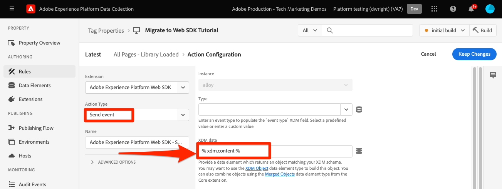

# Platform Web SDK를 사용하여 Target에 매개 변수 보내기

사이트 아키텍처, 비즈니스 요구 사항 및 사용된 기능으로 인해 웹 사이트마다 타겟 구현이 다릅니다. 대부분의 Target 구현에는 컨텍스트 정보, 대상 및 콘텐츠 권장 사항에 대한 다양한 매개 변수 전달이 포함됩니다.

간단한 제품 세부 사항 페이지와 주문 확인 페이지를 사용하여 매개 변수를 Target에 전달할 때 라이브러리 간의 차이점을 보여 주겠습니다.

at.js를 사용하는 다음 두 가지 예제 페이지를 가정해 보십시오.

제품 세부 사항 페이지의 +++at.js:

```HTML
<!doctype html>
<html>
<head>
  <title>Product Details - Men's Shirt</title>
  <!--Target parameters -->
  <script>
    targetPageParams = function() {
      return {
        // Property token
        "at_property": "5a0fd9bb-67de-4b5a-0fd7-9cc09f50a58d",
        // Mbox parameters
        "pageName": "product detail",
        // Profile parameters
        "profile.gender": "male",
        "user.categoryId": "clothing",
        // Entity parameters for Target Recomendations
        "entity.id": "SKU-00001-LARGE",
        "entity.categoryId": "clothing,shirts",
        "entity.customEntity": "some value",
        "cartIds": "SKU-00002,SKU-00003",
        "excludedIds": "SKU-00001-SMALL",
        // Customer ID for cross-device profile synching and Customer Attributes
        "mbox3rdPartyId": "TT8675309",
      };
    };
  </script>
  <!--Target at.js library loaded asynchonously-->
  <script src="/libraries/at.js" async></script>
</head>
<body>
  <h1 id="title">Men's Large Shirt</h1>
  <p>SKU: SKU-00001-LARGE</p>
</body>
</html>
```

+++


+++주문 확인 페이지의 at.js:

```HTML
<!doctype html>
<html>
<head>
  <title>Order Confirmation</title>-->
  <!--Target parameters -->
  <script>
    targetPageParams = function() {
      return {
        // Property token
        "at_property": "5a0fd9bb-67de-4b5a-0fd7-9cc09f50a58d",
        // Order confirmation parameters
        "orderId": "ABC123",
        "productPurchasedId": "SKU-00002,SKU-00003",
        "orderTotal": 1337.89,
        // Customer ID for cross-device profile synching and Customer Attributes
        "mbox3rdPartyId": "TT8675309",
      };
    };
  </script>
  <!--Target at.js library loaded asynchonously-->
  <script src="/libraries/at.js" async></script>
</head>
<body>
  <h1 id="title">Order Confirmation</h1>
  <p>Thank you for your order</p>
</body>
</html>
```

+++


## 매개 변수 매핑 요약

이러한 페이지에 대한 Target 매개 변수는 Platform Web SDK를 사용하여 다르게 전송됩니다. at.js를 사용하여 Target에 매개 변수를 전달하는 방법에는 여러 가지가 있습니다.

- 페이지 로드 이벤트에 대해 `targetPageParams()` 함수로 설정(이 페이지의 예제에 사용됨)
- 페이지의 모든 Target 요청에 대해 `targetPageParamsAll()` 함수로 설정
- 단일 위치에 대해 `getOffer()` 함수를 사용하여 직접 매개 변수 보내기
- 하나 이상의 위치에 대해 `getOffers()` 함수를 사용하여 직접 매개 변수 보내기


Platform Web SDK는 추가 기능 없이 데이터를 일관성 있게 전송할 수 있는 단일 방법을 제공합니다. 모든 매개 변수는 `sendEvent` 명령을 사용하여 페이로드에서 전달되어야 하며 다음 두 가지 범주에 속합니다.

- `xdm` 개체에서 자동으로 매핑됨
- `data.__adobe.target` 개체를 사용하여 수동으로 전달됨

아래 표는 Platform Web SDK를 사용하여 예제 매개 변수가 다시 매핑되는 방법을 간략하게 설명합니다.

| at.js 매개 변수 예 | Platform Web SDK 옵션 | 참고 |
| --- | --- | --- |
| `at_property` | N/A | 속성 토큰이 [데이터스트림](https://experienceleague.adobe.com/docs/experience-platform/edge/datastreams/configure.html#target)에 구성되어 `sendEvent` 호출에서 설정할 수 없습니다. |
| `pageName` | `xdm.web.webPageDetails.name` | 모든 Target mbox 매개 변수는 `xdm` 개체의 일부로 전달해야 하며 XDM ExperienceEvent 클래스를 사용하는 스키마를 따라야 합니다. Mbox 매개 변수는 `data` 개체의 일부로 전달할 수 없습니다. |
| `profile.gender` | `data.__adobe.target.profile.gender` | 모든 Target 프로필 매개 변수를 `data` 개체의 일부로 전달하고 `profile.` 접두사가 추가되어 적절하게 매핑해야 합니다. |
| `user.categoryId` | `data.__adobe.target.user.categoryId` | `data` 개체의 일부로 전달해야 하는 Target의 카테고리 선호도 기능에 사용되는 예약된 매개 변수입니다. |
| `entity.id` | `data.__adobe.target.entity.id` <br>또는<br> `xdm.productListItems[0].SKU` | 엔티티 ID는 Target Recommendations 동작 카운터에 사용됩니다. 구현이 해당 필드 그룹을 사용하는 경우 이러한 엔터티 ID는 `data` 개체의 일부로 전달되거나 `xdm.productListItems` 배열의 첫 번째 항목에서 자동으로 매핑될 수 있습니다. |
| `entity.categoryId` | `data.__adobe.target.entity.categoryId` | 엔터티 범주 ID는 `data` 개체의 일부로 전달될 수 있습니다. |
| `entity.customEntity` | `data.__adobe.target.entity.customEntity` | 사용자 지정 엔티티 매개 변수는 Recommendations 제품 카탈로그를 업데이트하는 데 사용됩니다. 이러한 사용자 지정 매개 변수는 `data` 개체의 일부로 전달해야 합니다. |
| `cartIds` | `data.__adobe.target.cartIds` | Target의 장바구니 기반 권장 사항 알고리즘에 사용됩니다. |
| `excludedIds` | `data.__adobe.target.excludedIds` | 권장 사항 디자인에서 특정 엔티티 ID가 반환되지 않도록 하는 데 사용됩니다. |
| `mbox3rdPartyId` | `xdm.identityMap` 개체에 설정 | 여러 장치 및 고객 속성에서 Target 프로필을 동기화하는 데 사용됩니다. 고객 ID에 사용할 네임스페이스는 데이터 스트림의 [Target 구성](https://experienceleague.adobe.com/docs/experience-platform/edge/personalization/adobe-target/using-mbox-3rdpartyid.html)에서 지정해야 합니다. |
| `orderId` | `xdm.commerce.order.purchaseID` | 타겟 전환 추적을 위한 고유한 주문을 식별하는 데 사용됩니다. |
| `orderTotal` | `xdm.commerce.order.priceTotal` | Target 전환 및 최적화 목표를 위한 주문 합계를 추적하는 데 사용됩니다. |
| `productPurchasedId` | `data.__adobe.target.productPurchasedId` <br>또는<br> `xdm.productListItems[0-n].SKU` | Target 전환 추적 및 권장 사항 알고리즘에 사용됩니다. 자세한 내용은 아래의 [엔티티 매개 변수](#entity-parameters) 섹션을 참조하십시오. |
| `mboxPageValue` | `data.__adobe.target.mboxPageValue` | [사용자 지정 점수](https://experienceleague.adobe.com/docs/target/using/activities/success-metrics/capture-score.html) 활동 목표에 사용됩니다. |

{style="table-layout:auto"}

## 사용자 지정 매개 변수

사용자 지정 mbox 매개 변수는 `sendEvent` 명령을 사용하여 XDM 데이터로 전달해야 합니다. XDM 스키마에 Target 구현에 필요한 모든 필드가 포함되어 있는지 확인하는 것이 중요합니다.

`targetPageParams()`을(를) 사용하는 at.js 예:

```JavaScript
targetPageParams = function() {
  return {
    "pageName": "product detail"
  };
};
```

`sendEvent` 명령을 사용하는 Platform Web SDK JavaScript 예:

>[!BEGINTABS]

>[!TAB JavaScript]

```JavaScript
alloy("sendEvent", {
  "xdm": {
    "web": {
      "webPageDetails": {
        // Other attributes included according to xdm schema
        "name": "product detail"
      }
    }
  }
});
```

>[!TAB 태그]

태그에서 먼저 [!UICONTROL XDM 개체] 데이터 요소를 사용하여 XDM 필드에 매핑합니다.

{zoomable="yes"}

그런 다음 [!UICONTROL 이벤트 보내기] [!UICONTROL 작업]에 [!UICONTROL XDM 개체]를 포함하십시오(여러 [!UICONTROL XDM 개체]은(는) [병합](https://experienceleague.adobe.com/docs/experience-platform/tags/extensions/client/core/overview.html?lang=en#merged-objects)될 수 있음).

{zoomable="yes"}

>[!ENDTABS]


>[!NOTE]
>
>사용자 지정 mbox 매개 변수는 `xdm` 개체의 일부이므로 새 이름을 사용하여 이러한 mbox 매개 변수를 참조하는 대상, 활동 또는 프로필 스크립트를 업데이트해야 합니다. 자세한 내용은 이 자습서의 [Platform Web SDK 호환성을 위한 Target 대상자 및 프로필 스크립트 업데이트](update-audiences.md) 페이지를 참조하십시오.


## 프로필 매개 변수

Platform Web SDK `sendEvent` 명령 페이로드의 `data.__adobe.target` 개체 아래에 Target 프로필 매개 변수를 전달해야 합니다.

at.js와 마찬가지로, 값을 영구 Target 프로필 특성으로 제대로 저장하려면 모든 프로필 매개 변수 앞에 `profile.`도 붙여야 합니다. Target의 범주 선호도 기능에 대해 예약된 `user.categoryId` 매개 변수 앞에 `user.`이(가) 붙습니다.

`targetPageParams()`을(를) 사용하는 at.js 예:

```JavaScript
targetPageParams = function() {
  return {
    "profile.gender": "male",
    "user.categoryId": "clothing"
  };
};
```

`sendEvent` 명령을 사용하는 Platform Web SDK 예:

>[!BEGINTABS]

>[!TAB JavaScript]

```JavaScript
alloy("sendEvent", {
  "data": {
    "__adobe": {
      "target": {
        "profile.gender": "male",
        "user.categoryId": "clothing"
      }
    }
  }
});
```

>[!TAB 태그]

태그에서 먼저 데이터 요소를 만들어 `data.__adobe.target` 개체를 정의합니다.

{zoomable="yes"}

그런 다음 [!UICONTROL 이벤트 보내기] [!UICONTROL 작업]에 데이터 개체를 포함합니다(여러 [!UICONTROL 개체]는 [병합](https://experienceleague.adobe.com/docs/experience-platform/tags/extensions/client/core/overview.html?lang=en#merged-objects)될 수 있음).

{zoomable="yes"}

>[!ENDTABS]

## 엔티티 매개 변수

엔티티 매개 변수는 Target Recommendations에 대한 동작 데이터 및 보조 카탈로그 정보를 전달하는 데 사용됩니다. at.js에서 지원하는 모든 [엔티티 매개 변수](https://experienceleague.adobe.com/docs/target/using/recommendations/entities/entity-attributes.html)도 Platform Web SDK에서 지원됩니다. 프로필 매개 변수와 유사한 모든 엔터티 매개 변수는 Platform Web SDK `sendEvent` 명령 페이로드의 `data.__adobe.target` 개체 아래에 전달되어야 합니다.

적절한 데이터 캡처를 위해서는 특정 항목의 엔터티 매개 변수 앞에 `entity.`이(가) 있어야 합니다. 권장 사항 알고리즘에 대해 예약된 `cartIds` 및 `excludedIds` 매개 변수는 접두사가 없어야 하며 각 값은 쉼표로 구분된 엔티티 ID 목록을 포함해야 합니다.

`targetPageParams()`을(를) 사용하는 at.js 예:

```JavaScript
targetPageParams = function() {
  return {
    "entity.id": "SKU-00001-LARGE",
    "entity.categoryId": "clothing,shirts",
    "entity.customEntity": "some value",
    "cartIds": "SKU-00002,SKU-00003",
    "excludedIds": "SKU-00001-SMALL"
  };
};
```

`sendEvent` 명령을 사용하는 Platform Web SDK 예:

>[!BEGINTABS]

>[!TAB JavaScript]

```JavaScript
alloy("sendEvent", {
  "data": {
    "__adobe": {
      "target": {
        "entity.id": "SKU-00001-LARGE",
        "entity.categoryId": "clothing,shirts",
        "entity.customEntity": "some value",
        "cartIds": "SKU-00002,SKU-00003",
        "excludedIds": "SKU-00001-SMALL"
      }
    }
  }
});
```

>[!TAB 태그]

태그에서 먼저 데이터 요소를 만들어 `data.__adobe.target` 개체를 정의합니다.

{zoomable="yes"}

그런 다음 [!UICONTROL 이벤트 보내기] [!UICONTROL 작업]에 데이터 개체를 포함합니다(여러 [!UICONTROL 개체]는 [병합](https://experienceleague.adobe.com/docs/experience-platform/tags/extensions/client/core/overview.html?lang=en#merged-objects)될 수 있음).

{zoomable="yes"}

>[!ENDTABS]

>[!NOTE]
>
>`commerce` 필드 그룹을 사용하고 `productListItems` 배열이 XDM 페이로드에 포함된 경우 이 배열의 첫 번째 `SKU` 값이 제품 보기를 늘릴 목적으로 `entity.id`에 매핑됩니다.


## 구매 매개 변수

구매 매개 변수는 성공적인 주문 후에 주문 확인 페이지에서 전달되며 Target 전환 및 최적화 목표에 사용됩니다. Platform Web SDK 구현을 사용하면 이러한 매개 변수와 는 `commerce` 필드 그룹의 일부로 전달된 XDM 데이터에서 자동으로 매핑됩니다.

`targetPageParams()`을(를) 사용하는 at.js 예:

```JavaScript
targetPageParams = function() {
  return {
    "orderId": "ABC123",
    "productPurchasedId": "SKU-00002,SKU-00003"
    "orderTotal": 1337.89
  };
};
```

`commerce` 필드 그룹에 `purchases.value`이(가) `1`(으)로 설정되어 있으면 구매 정보가 Target에 전달됩니다. 주문 ID와 주문 합계는 `order` 개체에서 자동으로 매핑됩니다. `productListItems` 배열이 있으면 `SKU` 값이 `productPurchasedId`에 사용됩니다.

`sendEvent` 명령을 사용하는 Platform Web SDK 예:

>[!BEGINTABS]

>[!TAB JavaScript]

```JavaScript
alloy("sendEvent", {
  "xdm": {
    "commerce": {
      "order": {
        "purchaseID": "ABC123",
        "priceTotal": 1337.89
      },
      "purchases": {
        "value": 1
      }
    },
    "productListItems": [{
      "SKU": "SKU-00002"
    }, {
      "SKU": "SKU-00003"
    }]
  }
});
```

>[!TAB 태그]

태그에서 먼저 [!UICONTROL XDM 개체] 데이터 요소를 사용하여 XDM 필드에 매핑합니다.

{zoomable="yes"}

그런 다음 [!UICONTROL 이벤트 보내기] [!UICONTROL 작업]에 [!UICONTROL XDM 개체]를 포함하십시오(여러 [!UICONTROL XDM 개체]은(는) [병합](https://experienceleague.adobe.com/docs/experience-platform/tags/extensions/client/core/overview.html?lang=en#merged-objects)될 수 있음).

{zoomable="yes"}

>[!ENDTABS]


>[!NOTE]
>
>`productPurchasedId` 값은 `data` 개체 아래에 쉼표로 구분된 엔터티 ID 목록으로 전달할 수도 있습니다.


## 고객 ID (mbox3rdPartyId)

Target을 사용하면 단일 고객 ID를 사용하여 장치 및 시스템 간에 프로필을 동기화할 수 있습니다. at.js를 사용하면 Target 요청에서 `mbox3rdPartyId`(으)로 설정하거나 Experience Cloud ID 서비스로 전송된 첫 번째 고객 ID로 설정할 수 있습니다. at.js와 달리 Platform Web SDK 구현을 사용하면 여러 개가 있는 경우 `mbox3rdPartyId`(으)로 사용할 고객 ID를 지정할 수 있습니다. 예를 들어, 비즈니스에 글로벌 고객 ID가 있고 여러 비즈니스 라인에 대해 별도의 고객 ID가 있는 경우 Target에서 사용해야 하는 ID를 구성할 수 있습니다.

Target 교차 장치 및 고객 속성 사용 사례에 대한 ID 동기화를 설정하는 몇 가지 단계가 있습니다.

1. 데이터 수집 또는 플랫폼의 **[!UICONTROL ID]** 화면에서 고객 ID에 대한 **[!UICONTROL ID 네임스페이스]**&#x200B;를 만듭니다.
1. 고객 특성의 **[!UICONTROL alias]**&#x200B;이(가) 네임스페이스의 **[!UICONTROL ID 기호]**&#x200B;와(과) 일치하는지 확인하십시오
1. 데이터 스트림의 Target 구성에서 **[!UICONTROL ID 기호]**&#x200B;을(를) **[!UICONTROL Target 타사 ID 네임스페이스]**(으)로 지정하십시오.
1. `identityMap` 필드 그룹을 사용하여 `sendEvent` 명령 실행

`targetPageParams()`을(를) 사용하는 at.js 예:

```JavaScript
targetPageParams = function() {
  return {
    "mbox3rdPartyId": "TT8675309"
  };
};
```

`sendEvent` 명령을 사용하는 Platform Web SDK 예:

>[!BEGINTABS]

>[!TAB JavaScript]

```JavaScript
alloy("sendEvent", {
  "xdm": {
    "identityMap": {
      "GLOBAL_CUSTOMER_ID": [{
        "id": "TT8675309",
        "authenticatedState": "authenticated"
      }]
    }
  }
});
```

>[!TAB 태그]

[!UICONTROL ID] 값, [!UICONTROL 인증된 상태] 및 [!UICONTROL 네임스페이스]가 [!UICONTROL ID 맵] 데이터 요소에서 캡처됩니다.
{zoomable="yes"}

그런 다음 [!UICONTROL ID 맵] 데이터 요소를 사용하여 [!UICONTROL XDM 개체] 데이터 요소에서 [!UICONTROL identityMap] 필드를 설정합니다.
{zoomable="yes"}

그러면 [!UICONTROL XDM 개체]가 규칙의 [!UICONTROL 이벤트 보내기] 작업에 포함됩니다.

{zoomable="yes"}

데이터스트림의 Adobe Target 서비스에서 [!UICONTROL Target 타사 ID 네임스페이스]를 [!UICONTROL ID 맵] 데이터 요소에 사용된 것과 동일한 네임스페이스로 설정해야 합니다.
{zoomable="yes"}

>[!ENDTABS]

## Platform Web SDK 예

Platform Web SDK를 사용하여 다양한 Target 매개 변수가 매핑되는 방법에 대해 알아보았으므로, 두 예제 페이지를 아래와 같이 at.js에서 Platform Web SDK로 마이그레이션할 수 있습니다. 예제 페이지는 다음과 같습니다.

- 비동기 라이브러리 구현을 위한 Target 코드 조각 사전 숨김
- Platform 웹 SDK 기본 코드
- Platform 웹 SDK JavaScript 라이브러리
- 라이브러리를 초기화하는 `configure` 명령
- 데이터를 전송하고 렌더링할 대상 콘텐츠를 요청하는 `sendEvent` 명령

+++제품 세부 사항 페이지의 웹 SDK:

```HTML
<!doctype html>
<html>
<head>
  <title>Product Details - Men's Shirt</title>

  <!--Prehiding snippet for Target with asynchronous Web SDK deployment-->
  <script>
    !function(e,a,n,t){var i=e.head;if(i){
    if (a) return;
    var o=e.createElement("style");
    o.id="alloy-prehiding",o.innerText=n,i.appendChild(o),setTimeout(function(){o.parentNode&&o.parentNode.removeChild(o)},t)}}
    (document, document.location.href.indexOf("mboxEdit") !== -1, ".body { opacity: 0 !important }", 3000);
  </script>

  <!--Platform Web SDK base code-->
  <script>
    !function(n,o){o.forEach(function(o){n[o]||((n.__alloyNS=n.__alloyNS||
    []).push(o),n[o]=function(){var u=arguments;return new Promise(
    function(i,l){n[o].q.push([i,l,u])})},n[o].q=[])})}
    (window,["alloy"]);
  </script>

  <!--Platform Web SDK loaded asynchonously. Change the src to use the latest supported version.-->
  <script src="https://cdn1.adoberesources.net/alloy/2.6.4/alloy.min.js" async></script>

  <!--Configure Platform Web SDK and send event-->
  <script>
    alloy("configure", {
      "edgeConfigId": "ebebf826-a01f-4458-8cec-ef61de241c93",
      "orgId":"ADB3LETTERSANDNUMBERS@AdobeOrg"
    });
    alloy("sendEvent", {
      "renderDecisions": true,
      "xdm": {
        "identityMap": {
          "GLOBAL_CUSTOMER_ID": [{
            "id": "TT8675309",
            "authenticatedState": "authenticated"
          }]
        },
        "web": {
          "webPageDetails": {
            // Other attributes included according to XDM schema
            "pageName": "product detail"
          }
        }
      },
      "data": {
        "__adobe": {
          "target": {
            "profile.gender": "male",
            "user.categoryId": "clothing",
            "entity.id": "SKU-00001-LARGE",
            "entity.categoryId": "clothing,shirts",
            "entity.customEntity": "some value",
            "cartIds": "SKU-00002,SKU-00003",
            "excludedIds": "SKU-00001-SMALL"
          }
        }
      }
    });
  </script>
</head>
<body>
  <h1 id="title">Men's Large Shirt</h1>
  <p>SKU: SKU-00001-LARGE</p>
</body>
</html>
```

+++

+++주문 확인 페이지의 웹 SDK:

```HTML
<!doctype html>
<html>
<head>
  <title>Order Confirmation</title>


  <!--Prehiding snippet for Target with asynchronous Web SDK deployment-->

  <script>
    !function(e,a,n,t){var i=e.head;if(i){
    if (a) return;
    var o=e.createElement("style");
    o.id="alloy-prehiding",o.innerText=n,i.appendChild(o),setTimeout(function(){o.parentNode&&o.parentNode.removeChild(o)},t)}}
    (document, document.location.href.indexOf("mboxEdit") !== -1, ".body { opacity: 0 !important }", 3000);
  </script>

  <!--Platform Web SDK base code-->

  <script>
    !function(n,o){o.forEach(function(o){n[o]||((n.__alloyNS=n.__alloyNS||
    []).push(o),n[o]=function(){var u=arguments;return new Promise(
    function(i,l){n[o].q.push([i,l,u])})},n[o].q=[])})}
    (window,["alloy"]);
  </script>
  <!--Platform Web SDK loaded asynchonously. Change the src to use the latest supported version.-->
  <script src="https://cdn1.adoberesources.net/alloy/2.6.4/alloy.min.js" async></script>

  <!--Configure Platform Web SDK and send event-->
  <script>
    alloy("configure", {
      "edgeConfigId": "ebebf826-a01f-4458-8cec-ef61de241c93",
      "orgId":"ADB3LETTERSANDNUMBERS@AdobeOrg"
    });
    alloy("sendEvent", {
      "xdm": {
        "identityMap": {
          "GLOBAL_CUSTOMER_ID": [{
            "id": "TT8675309",
            "authenticatedState": "authenticated"
          }]
        },
        "commerce": {
          "order": {
            "purchaseID": "ABC123",
            "priceTotal": 1337.89
          },
          "purchases": {
            "value": 1
          }
        },
        "productListItems": [{
          "SKU": "SKU-00002"
        }, {
          "SKU": "SKU-00003"
        }]
      }
    });
  </script>
</head>
<body>
  <h1 id="title">Order Confirmation</h1>
  <p>Thank you for your order</p>
</body>
</html>
```

+++

다음으로 Platform Web SDK를 사용하여 [Target 전환 이벤트를 추적](track-events.md)하는 방법에 대해 알아봅니다.

>[!NOTE]
>
>at.js에서 Web SDK로 Target을 성공적으로 마이그레이션할 수 있도록 지원하기 위해 최선을 다하고 있습니다. 마이그레이션에 문제가 발생하거나 이 안내서에 중요한 정보가 누락된 것 같은 느낌이 드는 경우 [이 커뮤니티 토론](https://experienceleaguecommunities.adobe.com/t5/adobe-experience-platform-data/tutorial-discussion-migrate-target-from-at-js-to-web-sdk/m-p/575587#M463)에 게시하여 알려 주십시오.
