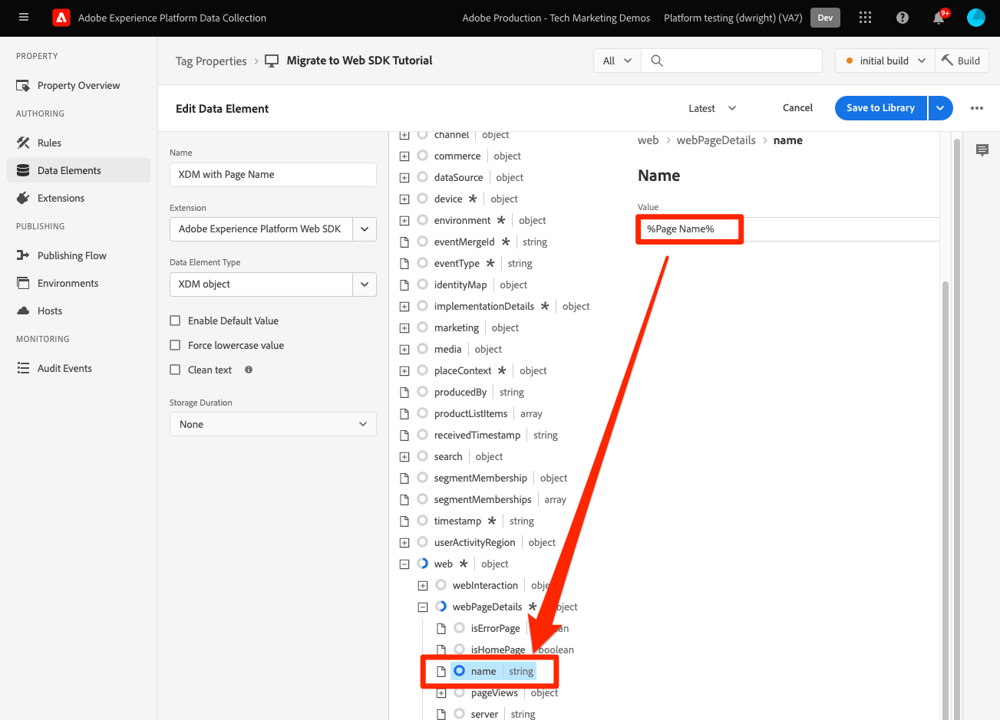
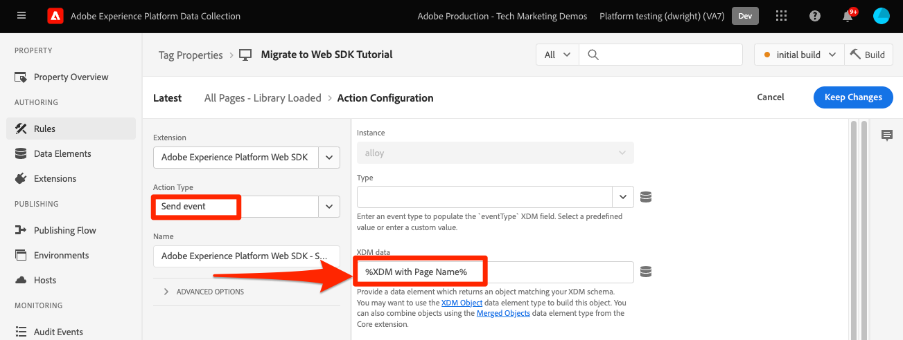
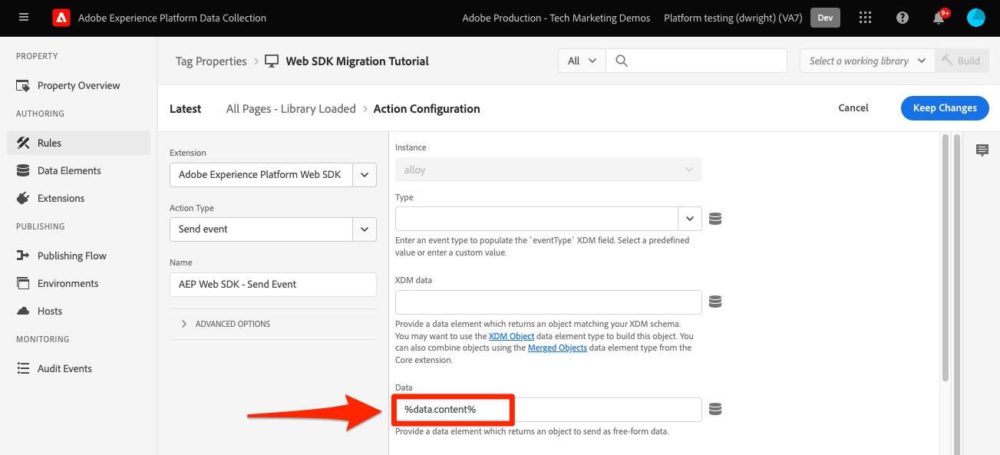

# Platform Web SDK를 사용하여 Target에 매개 변수 보내기

Target 구현은 사이트 아키텍처, 비즈니스 요구 사항 및 사용되는 기능으로 인해 웹 사이트 간에 다릅니다. 대부분의 Target 구현에는 컨텍스트 정보, 대상 및 콘텐츠 권장 사항에 대한 다양한 매개 변수 전달이 포함됩니다.

간단한 제품 세부 사항 페이지와 주문 확인 페이지를 사용하여 매개 변수를 Target에 전달할 때 라이브러리 간의 차이점을 보여 줍니다.

at.js를 사용하여 다음 두 예제 페이지를 가정하십시오.

제품 세부 사항 페이지의 +++at.js:

```HTML
<!doctype html>
<html>
<head>
  <title>Product Details - Men's Shirt</title>
  <!--Target parameters -->
  <script>
    targetPageParams = function() {
      return {
        // Property token
        "at_property": "5a0fd9bb-67de-4b5a-0fd7-9cc09f50a58d",
        // Mbox parameters
        "siteSection": "product details",
        // Profile parameters
        "profile.gender": "male",
        "user.categoryId": "clothing",
        // Entity parameters for Target Recomendations
        "entity.id": "SKU-00001-LARGE",
        "entity.categoryId": "clothing,shirts",
        "entity.customEntity": "some value",
        "cartIds": "SKU-00002,SKU-00003",
        "excludedIds": "SKU-00001-SMALL",
        // Customer ID for cross-device profile synching and Customer Attributes
        "mbox3rdPartyId": "TT8675309",
      };
    };
  </script>
  <!--Target at.js library loaded asynchonously-->
  <script src="/libraries/at.js" async></script>
</head>
<body>
  <h1 id="title">Men's Large Shirt</h1>
  <p>SKU: SKU-00001-LARGE</p>
</body>
</html>
```

+++


+++at.js를 주문 확인 페이지에서 참조하십시오.

```HTML
<!doctype html>
<html>
<head>
  <title>Order Confirmation</title>-->
  <!--Target parameters -->
  <script>
    targetPageParams = function() {
      return {
        // Property token
        "at_property": "5a0fd9bb-67de-4b5a-0fd7-9cc09f50a58d",
        // Order confirmation parameters
        "orderId": "ABC123",
        "productPurchasedId": "SKU-00002,SKU-00003",
        "orderTotal": 1337.89,
        // Customer ID for cross-device profile synching and Customer Attributes
        "mbox3rdPartyId": "TT8675309",
      };
    };
  </script>
  <!--Target at.js library loaded asynchonously-->
  <script src="/libraries/at.js" async></script>
</head>
<body>
  <h1 id="title">Order Confirmation</h1>
  <p>Thank you for your order</p>
</body>
</html>
```

+++


## 매개 변수 매핑 요약

이러한 두 예제 페이지에서 사용되는 Target 매개 변수는 Platform Web SDK를 사용하여 약간 다르게 전송해야 합니다. at.js를 사용하여 Target에 매개 변수를 전달하는 방법에는 여러 가지가 있습니다.

- 설정 `targetPageParams()` 페이지 로드 이벤트에 대한 함수
- 설정 `targetPageParamsAll()` 페이지의 모든 Target 요청에 대해 작동합니다.
- 를 사용하여 직접 매개 변수 전송 `getOffer()` 단일 위치에 대한 함수
- 를 사용하여 직접 매개 변수 전송 `getOffers()` 하나 이상의 위치에 대한 함수

이 예제를 위해 `targetPageParams()` 접근 방식이 사용됩니다.

Platform Web SDK는 추가 기능 없이 데이터를 전송하는 일관된 방법을 제공하여 이를 단순화합니다. 모든 매개 변수를 와 함께 페이로드에서 전달해야 합니다. `sendEvent` 명령.

Platform Web SDK를 사용하여 전달된 매개 변수 `sendEvent` 페이로드는 두 가지 카테고리에 속합니다.

1. 에서 자동으로 매핑됨 `xdm` 개체
1. 를 사용하여 수동으로 전달 `data.__adobe.target` 개체

아래 표에서는 Platform Web SDK를 사용하여 예제 매개 변수를 다시 매핑하는 방법을 설명합니다.

| at.js 매개 변수 예 | Platform Web SDK 옵션 | 참고 |
| --- | --- | --- |
| `at_property` | 해당 없음 | 속성 토큰은 [데이터 스트림](https://experienceleague.adobe.com/docs/experience-platform/edge/datastreams/configure.html#target) 및 는 `sendEvent` 호출. |
| `siteSection` | `xdm.web.webPageDetails.siteSection` | 모든 Target mbox 매개 변수는 의 일부로 전달해야 합니다 `xdm` XDM ExperienceEvent 클래스를 사용하여 스키마를 따르며, mbox 매개 변수는 의 일부로 전달할 수 없습니다 `data` 개체. |
| `profile.gender` | `data.__adobe.target.profile.gender` | 모든 Target 프로필 매개 변수는 `data` 개체 앞에 `profile.` 매핑됩니다. |
| `user.categoryId` | `data.__adobe.target.user.categoryId` | Target의 카테고리 친화성 기능에 사용되는 예약된 매개 변수로서 `data` 개체. |
| `entity.id` | `data.__adobe.target.entity.id` <br>또는<br> `xdm.productListItems[0].SKU` | 엔티티 ID는 Recommendations 동작 카운터에 사용됩니다. 이러한 엔티티 ID는 `data` 개체 또는 의 첫 번째 항목에서 자동으로 매핑됩니다 `xdm.productListItems` 구현에서 해당 필드 그룹을 사용하는 경우 배열합니다. |
| `entity.categoryId` | `data.__adobe.target.entity.categoryId` | 엔티티 카테고리 ID를 `data` 개체. |
| `entity.customEntity` | `data.__adobe.target.entity.customEntity` | 사용자 지정 엔티티 매개 변수는 Recommendations 제품 카탈로그를 업데이트하는 데 사용됩니다. 이러한 사용자 지정 매개 변수는 `data` 개체. |
| `cartIds` | `data.__adobe.target.cartIds` | Target의 장바구니 기반 권장 사항 알고리즘에 사용됩니다. |
| `excludedIds` | `data.__adobe.target.excludedIds` | 특정 엔티티 ID가 권장 사항 디자인에서 반환되지 않도록 하는 데 사용됩니다. |
| `mbox3rdPartyId` | idMap에서 설정합니다. 자세한 내용은 [고객 ID와 프로필 동기화](#synching-profiles-with-a-customer-id) | 장치 및 고객 속성에서 Target 프로필을 동기화하는 데 사용됩니다. 고객 ID에 사용할 네임스페이스는 [데이터 스트림의 Target 구성](https://experienceleague.adobe.com/docs/experience-platform/edge/personalization/adobe-target/using-mbox-3rdpartyid.html). |
| `orderId` | `xdm.commerce.order.purchaseID` | Target 전환 추적에 대한 고유한 순서를 식별하는 데 사용됩니다. |
| `orderTotal` | `xdm.commerce.order.priceTotal` | Target 전환 및 최적화 목표를 위한 주문 합계를 추적하는 데 사용됩니다. |
| `productPurchasedId` | `data.__adobe.target.productPurchasedId` <br>또는<br> `xdm.productListItems[0-n].SKU` | Target 전환 추적 및 권장 사항 알고리즘에 사용됩니다. 자세한 내용은 [엔티티 매개 변수](#entity-parameters) 자세한 내용은 아래 섹션을 참조하십시오. |
| `mboxPageValue` | `data.__adobe.target.mboxPageValue` | 에 사용됩니다. [사용자 지정 점수](https://experienceleague.adobe.com/docs/target/using/activities/success-metrics/capture-score.html) 활동 목표. |

{style=&quot;table-layout:auto&quot;}

## 사용자 지정 매개 변수

모든 사용자 지정 mbox 매개 변수는 `sendEvent` 명령. XDM 스키마에 Target 구현에 필요한 모든 데이터 포인트가 포함되어 있는지 확인하는 것이 중요합니다.

at.js 예 사용 `targetPageParams()`:

```JavaScript
targetPageParams = function() {
  return {
    "pageName": "product detail"
  };
};
```

다음을 사용하는 Platform Web SDK JavaScript 예 `sendEvent` 명령:

>[!BEGINTABS]

>[!TAB JavaScript]

```JavaScript
alloy("sendEvent", {
  "xdm": {
    "web": {
      "webPageDetails": {
        // Other attributes included according to xdm schema
        "name": "product detail"
      }
    }
  }
});
```

>[!TAB 태그]

태그에서 먼저 [!UICONTROL XDM 개체] xdm 필드에 매핑할 데이터 요소:



그런 다음 [!UICONTROL XDM 개체] 다음 위치에서 [!UICONTROL 이벤트 보내기] [!UICONTROL 작업] (여러 개) [!UICONTROL XDM 개체] 다음을 수행할 수 있습니다. [병합됨](https://experienceleague.adobe.com/docs/experience-platform/tags/extensions/client/core/overview.html?lang=en#merged-objects)):



>[!ENDTABS]


>[!NOTE]
>
>사용자 지정 mbox 매개 변수는 의 일부로 전송해야 하므로 `xdm` 의 개체 `sendEvent` 명령을 사용하면 at.js Target 구현에 사용된 모든 mbox 매개 변수를 그에 해당하는 XDM에 재할당해야 합니다. 즉, 이러한 mbox 매개 변수를 참조하는 대상, 활동 또는 프로필 스크립트를 업데이트해야 합니다.


## 프로필 매개 변수

Target 프로필 매개 변수는 `data.__adobe.target` 플랫폼 웹 SDK의 개체 `sendEvent` 명령 페이로드입니다.

at.js와 유사하게, 모든 프로필 매개 변수 앞에도 `profile.` 값을 영구 Target 프로필 속성으로 적절하게 저장할 수 있습니다. 예약됨 `user.categoryId` Target의 카테고리 친화성 기능에 대한 매개 변수 앞에는 이 붙습니다 `user.`.

at.js 예 사용 `targetPageParams()`:

```JavaScript
targetPageParams = function() {
  return {
    "profile.gender": "male",
    "user.categoryId": "clothing"
  };
};
```

다음을 사용하는 Platform Web SDK 예 `sendEvent` 명령:

>[!BEGINTABS]

>[!TAB JavaScript]

```JavaScript
alloy("sendEvent", {
  "data": {
    "__adobe": {
      "target": {
        "profile.gender": "male",
        "user.categoryId": "clothing"
      }
    }
  }
});
```

>[!TAB 태그]

태그에서 먼저 데이터 요소를 만들어 `data.__adobe.target` 개체:


그런 다음 데이터 개체를 [!UICONTROL 이벤트 보내기] [!UICONTROL 작업] (여러 개) [!UICONTROL 개체] 다음을 수행할 수 있습니다. [병합됨](https://experienceleague.adobe.com/docs/experience-platform/tags/extensions/client/core/overview.html?lang=en#merged-objects)):



>[!ENDTABS]

## 엔티티 매개 변수

엔티티 매개 변수는 Target Recommendations에 대한 동작 데이터 및 추가 카탈로그 정보를 전달하는 데 사용됩니다. 프로필 매개 변수와 마찬가지로 모든 엔티티 매개 변수를 `data.__adobe.target` 플랫폼 웹 SDK의 개체 `sendEvent` 명령 페이로드입니다.

특정 항목의 엔티티 매개 변수 접두사는 `entity.` 를 반환합니다. 예약됨 `cartIds` 및 `excludedIds` 권장 사항 알고리즘에 대한 매개 변수 접두사를 사용하지 않아야 하며 각 값에 쉼표로 구분된 엔티티 ID 목록이 포함되어야 합니다.

at.js 예 사용 `targetPageParams()`:

```JavaScript
targetPageParams = function() {
  return {
    "entity.id": "SKU-00001-LARGE",
    "entity.categoryId": "clothing,shirts",
    "entity.customEntity": "some value",
    "cartIds": "SKU-00002,SKU-00003",
    "excludedIds": "SKU-00001-SMALL"
  };
};
```

다음을 사용하는 Platform Web SDK 예 `sendEvent` 명령:

>[!BEGINTABS]

>[!TAB JavaScript]

```JavaScript
alloy("sendEvent", {
  "data": {
    "__adobe": {
      "target": {
        "entity.id": "SKU-00001-LARGE",
        "entity.categoryId": "clothing,shirts",
        "entity.customEntity": "some value",
        "cartIds": "SKU-00002,SKU-00003",
        "excludedIds": "SKU-00001-SMALL"
      }
    }
  }
});
```

>[!TAB 태그]

태그에서 먼저 데이터 요소를 만들어 `data.__adobe.target` 개체:


그런 다음 데이터 개체를 [!UICONTROL 이벤트 보내기] [!UICONTROL 작업] (여러 개) [!UICONTROL 개체] 다음을 수행할 수 있습니다. [병합됨](https://experienceleague.adobe.com/docs/experience-platform/tags/extensions/client/core/overview.html?lang=en#merged-objects)):


>[!ENDTABS]


모두 [엔티티 매개 변수](https://experienceleague.adobe.com/docs/target/using/recommendations/entities/entity-attributes.html) at.js에서 지원하는 Platform Web SDK도 사용할 수 있습니다.

>[!NOTE]
>
>만약 `commerce` 필드 그룹이 사용되고 `productListItems` 배열은 XDM 페이로드에 포함되며 첫 번째 페이로드에 포함됩니다 `SKU` 이 배열의 값이 `entity.id` 제품 보기를 증가시키기 위한 것입니다.


## 구매 매개 변수

구매 매개 변수는 성공적인 주문 후 주문 확인 페이지에서 전달되며 Target 전환 및 최적화 목표에 사용됩니다. Platform Web SDK 구현을 통해 이러한 매개 변수 및 는 의 일부로 전달된 XDM 데이터에서 자동으로 매핑됩니다 `commerce` 필드 그룹.

at.js 예 사용 `targetPageParams()`:

```JavaScript
targetPageParams = function() {
  return {
    "orderId": "ABC123",
    "productPurchasedId": "SKU-00002,SKU-00003"
    "orderTotal": 1337.89
  };
};
```

구매 정보는 `commerce` 필드 그룹에 있음 `purchases.value` 설정 `1`. 주문 ID 및 주문 합계는 `order` 개체. 만약 `productListItems` 배열이 있으면 `SKU` 값은 `productPurchasedId`.

다음을 사용하는 Platform Web SDK 예 `sendEvent` 명령:

>[!BEGINTABS]

>[!TAB JavaScript]

```JavaScript
alloy("sendEvent", {
  "xdm": {
    "commerce": {
      "order": {
        "purchaseID": "ABC123",
        "priceTotal": 1337.89
      },
      "purchases": {
        "value": 1
      }
    },
    "productListItems": [{
      "SKU": "SKU-00002"
    }, {
      "SKU": "SKU-00003"
    }]
  }
});
```

>[!TAB 태그]

태그에서 먼저 [!UICONTROL XDM 개체] xdm 필드에 매핑할 데이터 요소:


그런 다음 [!UICONTROL XDM 개체] 다음 위치에서 [!UICONTROL 이벤트 보내기] [!UICONTROL 작업] (여러 개) [!UICONTROL XDM 개체] 다음을 수행할 수 있습니다. [병합됨](https://experienceleague.adobe.com/docs/experience-platform/tags/extensions/client/core/overview.html?lang=en#merged-objects)):


>[!ENDTABS]


>[!NOTE]
>
>다음 `productPurchasedId` 값은에서 쉼표로 구분된 엔티티 ID 목록으로 전달될 수도 있습니다 `data` 개체.


## 고객 ID와 프로필 동기화

Target을 사용하면 단일 고객 ID를 사용하여 장치 및 시스템 간에 프로필을 동기화할 수 있습니다. at.js를 사용할 때 `mbox3rdPartyId` Target 요청에서 또는 Experience Cloud Identity 서비스로 전송된 첫 번째 고객 id로. at.js와 달리, Platform Web SDK 구현을 통해 로 사용할 고객 ID를 지정할 수 있습니다 `mbox3rdPartyId` 여러 개가 있는 경우 예를 들어, 비즈니스에 글로벌 고객 ID와 다른 업무 라인에 대한 별도의 고객 ID가 있는 경우, 사용해야 하는 ID Target을 구성할 수 있습니다.

장치 간 Target 및 고객 속성 사용 사례에 대해 ID 동기화를 설정하는 몇 가지 단계가 있습니다.

1. 만들기 **[!UICONTROL id 네임스페이스]** 의 고객 ID에 대해 **[!UICONTROL ID]** 데이터 수집 또는 플랫폼 화면
1. 다음을 확인합니다. **[!UICONTROL 별칭]** 에서 고객 속성은 **[!UICONTROL ID 기호]** 네임스페이스
1. 을(를) 지정합니다. **[!UICONTROL 부호]** 로서의 **[!UICONTROL Target 타사 ID 네임스페이스]** 데이터 스트림의 Target 구성에서
1. 실행 `sendEvent` 명령을 사용하여 명령 `identityMap` 필드 그룹

at.js 예 사용 `targetPageParams()`:

```JavaScript
targetPageParams = function() {
  return {
    "mbox3rdPartyId": "TT8675309"
  };
};
```

다음을 사용하는 Platform Web SDK 예 `sendEvent` 명령:

>[!BEGINTABS]

>[!TAB JavaScript]

```JavaScript
alloy("sendEvent", {
  "xdm": {
    "identityMap": {
      "GLOBAL_CUSTOMER_ID": [{
        "id": "TT8675309",
        "authenticatedState": "authenticated"
      }]
    }
  }
});
```

>[!TAB 태그]

다음 [!UICONTROL ID] 값, [!UICONTROL 인증됨 상태] 및 [!UICONTROL 네임스페이스] 이 [!UICONTROL ID 맵] 데이터 요소:


다음 [!UICONTROL ID 맵] 그런 다음 데이터 요소를 사용하여 [!UICONTROL identityMap] 의 필드 [!UICONTROL XDM 개체] 데이터 요소:


다음 [!UICONTROL XDM 개체] 그러면 이 [!UICONTROL 이벤트 보내기] 규칙 작업:


데이터 스트림의 Adobe Target 서비스에서 [!UICONTROL Target 타사 ID 네임스페이스] 에 사용된 동일한 네임스페이스로 [!UICONTROL ID 맵] 데이터 요소


>[!ENDTABS]

## Platform 웹 SDK 예

이제 Platform Web SDK를 사용하여 다양한 Target 매개 변수를 매핑하는 방법을 이해하므로 두 가지 예제 페이지를 아래 표시된 대로 at.js에서 Platform Web SDK로 마이그레이션할 수 있습니다. 예제 페이지에는 다음 항목이 포함되어 있습니다.

- 비동기 라이브러리 구현을 위한 코드 조각 사전 숨김
- Platform 웹 SDK 기본 코드
- Platform 웹 SDK JavaScript 라이브러리
- A `configure` 라이브러리를 초기화하는 명령
- A `sendEvent` 데이터를 보내고 Target 콘텐츠를 렌더링하도록 요청하는 명령

+++제품 세부 사항 페이지의 웹 SDK:

```HTML
<!doctype html>
<html>
<head>
  <title>Product Details - Men's Shirt</title>

  <!--Prehiding snippet for Target with asynchronous Web SDK deployment-->
  <script>
    !function(e,a,n,t){var i=e.head;if(i){
    if (a) return;
    var o=e.createElement("style");
    o.id="alloy-prehiding",o.innerText=n,i.appendChild(o),setTimeout(function(){o.parentNode&&o.parentNode.removeChild(o)},t)}}
    (document, document.location.href.indexOf("mboxEdit") !== -1, ".body { opacity: 0 !important }", 3000);
  </script>

  <!--Platform Web SDK base code-->
  <script>
    !function(n,o){o.forEach(function(o){n[o]||((n.__alloyNS=n.__alloyNS||
    []).push(o),n[o]=function(){var u=arguments;return new Promise(
    function(i,l){n[o].q.push([i,l,u])})},n[o].q=[])})}
    (window,["alloy"]);
  </script>

  <!--Platform Web SDK loaded asynchonously. Change the src to use the latest supported version.-->
  <script src="https://cdn1.adoberesources.net/alloy/2.6.4/alloy.min.js" async></script>

  <!--Configure Platform Web SDK and send event-->
  <script>
    alloy("configure", {
      "edgeConfigId": "ebebf826-a01f-4458-8cec-ef61de241c93",
      "orgId":"ADB3LETTERSANDNUMBERS@AdobeOrg"
    });
    alloy("sendEvent", {
      "renderDecisions": true,
      "xdm": {
        "identityMap": {
          "GLOBAL_CUSTOMER_ID": [{
            "id": "TT8675309",
            "authenticatedState": "authenticated"
          }]
        },
        "web": {
          "webPageDetails": {
            // Other attributes included according to XDM schema
            "siteSection": "product detail"
          }
        }
      },
      "data": {
        "__adobe": {
          "target": {
            "profile.gender": "male",
            "user.categoryId": "clothing",
            "entity.id": "SKU-00001-LARGE",
            "entity.categoryId": "clothing,shirts",
            "entity.customEntity": "some value",
            "cartIds": "SKU-00002,SKU-00003",
            "excludedIds": "SKU-00001-SMALL"
          }
        }
      }
    });
  </script>
</head>
<body>
  <h1 id="title">Men's Large Shirt</h1>
  <p>SKU: SKU-00001-LARGE</p>
</body>
</html>
```

+++

+++주문 확인 페이지의 웹 SDK:

```HTML
<!doctype html>
<html>
<head>
  <title>Order Confirmation</title>


  <!--Prehiding snippet for Target with asynchronous Web SDK deployment-->

  <script>
    !function(e,a,n,t){var i=e.head;if(i){
    if (a) return;
    var o=e.createElement("style");
    o.id="alloy-prehiding",o.innerText=n,i.appendChild(o),setTimeout(function(){o.parentNode&&o.parentNode.removeChild(o)},t)}}
    (document, document.location.href.indexOf("mboxEdit") !== -1, ".body { opacity: 0 !important }", 3000);
  </script>

  <!--Platform Web SDK base code-->

  <script>
    !function(n,o){o.forEach(function(o){n[o]||((n.__alloyNS=n.__alloyNS||
    []).push(o),n[o]=function(){var u=arguments;return new Promise(
    function(i,l){n[o].q.push([i,l,u])})},n[o].q=[])})}
    (window,["alloy"]);
  </script>
  <!--Platform Web SDK loaded asynchonously. Change the src to use the latest supported version.-->
  <script src="https://cdn1.adoberesources.net/alloy/2.6.4/alloy.min.js" async></script>

  <!--Configure Platform Web SDK and send event-->
  <script>
    alloy("configure", {
      "edgeConfigId": "ebebf826-a01f-4458-8cec-ef61de241c93",
      "orgId":"ADB3LETTERSANDNUMBERS@AdobeOrg"
    });
    alloy("sendEvent", {
      "xdm": {
        "identityMap": {
          "GLOBAL_CUSTOMER_ID": [{
            "id": "TT8675309",
            "authenticatedState": "authenticated"
          }]
        },
        "commerce": {
          "order": {
            "purchaseID": "ABC123",
            "priceTotal": 1337.89
          },
          "purchases": {
            "value": 1
          }
        },
        "productListItems": [{
          "SKU": "SKU-00002"
        }, {
          "SKU": "SKU-00003"
        }]
      }
    });
  </script>
</head>
<body>
  <h1 id="title">Order Confirmation</h1>
  <p>Thank you for your order</p>
</body>
</html>
```

+++

다음으로, 다음 방법을 배웁니다. [Target 전환 이벤트 추적](track-events.md) 사용.

>[!NOTE]
>
>Adobe는 at.js에서 웹 SDK로 Target 마이그레이션을 성공적으로 수행할 수 있도록 최선을 다하고 있습니다. 마이그레이션에 문제가 발생했거나 이 안내서에 중요한 정보가 누락된 것 같은 경우에는 로그인한 후 알려 주십시오 [이 커뮤니티 토론](https://experienceleaguecommunities.adobe.com/t5/adobe-experience-platform-launch/tutorial-discussion-implement-adobe-experience-cloud-with-web/td-p/444996).
