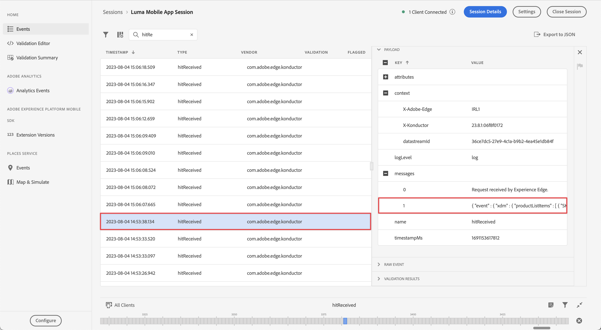

# Analytics 데이터 수집 및 매핑

모바일 데이터를 Adobe Analytics에 매핑하는 방법을 알아봅니다.

다음 [이벤트](events.md) 이전 단원에서 수집하여 Platform Edge Network로 전송한 데이터는 Adobe Analytics을 포함하여 데이터스트림에 구성된 서비스로 전달됩니다. 데이터를 보고서 세트의 올바른 변수에 매핑합니다.


## 전제 조건

* ExperienceEvent 추적에 대한 이해.
* 샘플 앱에서 XDM 데이터를 성공적으로 보냈습니다.
* 이 단원에 사용할 수 있는 Adobe Analytics 보고서 세트입니다.

## 학습 목표

이 단원에서는 다음 작업을 수행합니다.

* Adobe Analytics 서비스로 데이터 스트림을 구성합니다.
* Analytics 변수의 자동 매핑을 이해합니다.
* XDM 데이터를 Analytics 변수에 매핑하는 처리 규칙을 설정합니다.

## Adobe Analytics 데이터스트림 서비스 추가

Edge Network에서 Adobe Analytics으로 XDM 데이터를 전송하려면 의 일부로 설정한 데이터스트림에 Adobe Analytics 서비스를 구성해야 합니다 [데이터 스트림 만들기](create-datastream.md).

1. 데이터 수집 UI에서 **[!UICONTROL 데이터스트림]** 및 데이터 스트림입니다.

1. 그런 다음 을 선택합니다  **[!UICONTROL 서비스 추가]**.

1. 추가 **[!UICONTROL Adobe Analytics]** 다음에서 [!UICONTROL 서비스] 목록,

1. 에서 사용할 Adobe Analytics의 보고서 세트 이름을 입력합니다 **[!UICONTROL 보고서 세트 ID]**.

1. 전환하여 서비스 활성화 **[!UICONTROL 활성화됨]** 켜짐.

1. **[!UICONTROL 저장]**&#x200B;을 선택합니다.

   


## 자동 매핑

대부분의 표준 XDM 필드는 Analytics 변수에 자동으로 매핑됩니다. 전체 목록은 [여기](https://experienceleague.adobe.com/docs/analytics/implementation/aep-edge/variable-mapping.html?lang=en)에서 확인하십시오.

### 예 #1 - s.products

좋은 예는 다음과 같습니다. [products 변수](https://experienceleague.adobe.com/docs/analytics/implementation/vars/page-vars/products.html?lang=ko-KR) 처리 규칙을 사용하여 채울 수 없습니다. XDM 구현을 사용하면에서 필요한 모든 데이터를 전달합니다 `productListItems` 및 `s.products` Analytics 매핑을 통해 자동으로 채워집니다.

이 개체:

```swift
"productListItems": [
    [
      "name":  "Yoga Mat",
      "SKU": "5829",
      "priceTotal": "49.99",
      "quantity": 1
    ],
    [
      "name":  "Water Bottle",
      "SKU": "9841",
      "priceTotal": "30.00",
      "quantity": 3
    ]
]
```

결과 위치:

```
s.products = ";Yoga Mat;1;49.99,;Water Bottle,3,30.00"
```

>[!NOTE]
>
>현재 `productListItems[N].SKU` 자동 매핑에서 무시됩니다.


### 예 #2 - scAdd

자세히 살펴보면 모든 이벤트에는 두 개의 필드가 있습니다 `value` (필수) 및 `id` (선택 사항). 다음 `value` 필드는 이벤트 수를 늘리는 데 사용됩니다. 다음 `id` 필드는 serialization에 사용됩니다.

이 개체:

```swift
"commerce" : {
  "productListAdds" : {
    "value" : 1
  }
}
```

결과 위치:

```
s.events = "scAdd"
```

이 개체:

```swift
"commerce" : {
  "productListAdds" : {
    "value" : 1,
    "id": "321435"
  }
}
```

결과 위치:

```
s.events = "scAdd:321435"
```

## Assurance를 통해 유효성 검사

사용 [보증](assurance.md) 경험 이벤트를 보내고 있으며 XDM 데이터가 올바르고 Analytics 매핑이 예상대로 발생하고 있는지 확인할 수 있습니다.

1. 리뷰 [설치 지침](assurance.md#connecting-to-a-session) 시뮬레이터 또는 장치를 Assurance에 연결하는 섹션입니다.

1. 보내기 **[!UICONTROL 제품 목록 추가]** 이벤트(장바구니에 제품 추가).

1. ExperienceEvent 히트를 봅니다.

   

1. JSON의 XDM 부분을 검토합니다.

   ```json
   "xdm" : {
     "productListItems" : [ {
       "SKU" : "LLWS05.1-XS",
       "name" : "Desiree Fitness Tee",
       "priceTotal" : 24
     } ],
   "timestamp" : "2023-08-04T12:53:37.662Z",
   "eventType" : "commerce.productListAdds",
   "commerce" : {
     "productListAdds" : {
       "value" : 1
     }
   }
   // ...
   ```

1. 리뷰 **[!UICONTROL analytics.mapping]** 이벤트.

   

Analytics 매핑에서 다음을 참고하십시오.

* **[!UICONTROL events]** 은 로 채워집니다. `scAdd` 기준 `commerce.productListAdds`.
* **[!UICONTROL pl]** (products 변수)는 다음을 기반으로 연결된 값으로 채워집니다 `productListItems`.
* 모든 컨텍스트 데이터를 포함하여 이 이벤트에는 다른 흥미로운 정보가 있습니다.


## 컨텍스트 데이터로 매핑

Analytics에 전달된 XDM 데이터는 로 변환됩니다. [컨텍스트 데이터](https://experienceleague.adobe.com/docs/mobile-services/ios/getting-started-ios/proc-rules.html?lang=en) 표준 및 사용자 정의 필드를 모두 포함합니다.

컨텍스트 데이터 키는 다음 구문에 따라 구성됩니다.

```
a.x.[xdm path]
```

예:

```
// Standard Field
a.x.commerce.saveforlaters.value

// Custom Field
a.x._techmarketingdemos.appinformation.appstatedetails.screenname
```

>[!NOTE]
>
>사용자 정의 필드는 Experience Cloud 조직 식별자 아래에 위치합니다.
>
>`_techmarketingdemos` 은 조직의 고유 값으로 대체됩니다.


이 XDM 컨텍스트 데이터를 보고서 세트의 Analytics 데이터에 매핑하려면 다음을 수행할 수 있습니다.

### 필드 그룹 사용

* 추가 **[!UICONTROL Adobe Analytics ExperienceEvent 전체 확장]** 스키마에 대한 필드 그룹입니다.

  

* 앱에서 수행한 작업과 유사한 Adobe Analytics ExperienceEvent 전체 확장 필드 그룹을 따라 XDM 페이로드를 빌드합니다. [이벤트 데이터 추적](events.md) 단원 또는
* 규칙 작업을 사용하여 Adobe Analytics ExperienceEvent 전체 확장 필드 그룹에 데이터를 첨부하거나 수정하는 규칙을 Tags 속성에 작성합니다. 자세한 내용은 을 참조하십시오 [SDK 이벤트에 데이터 첨부](https://developer.adobe.com/client-sdks/documentation/user-guides/attach-data/) 또는 [SDK 이벤트의 데이터 수정](https://developer.adobe.com/client-sdks/documentation/user-guides/attach-data/).


### 처리 규칙 사용

다음은 이 데이터를 사용하는 처리 규칙의 모습입니다.

* 본인 **[!UICONTROL 값 덮어쓰기]** (1) **[!UICONTROL 앱 화면 이름(eVar2)]** (2) ( 값 포함) **[!UICONTROL a.x._techmarketingdemo.appinformation.appstatedetails.screenname]** (3) 다음과 같은 경우 **[!UICONTROL a.x._techmarketingdemo.appinformation.appstatedetails.screenname]** (4) **[!UICONTROL 은(는) 설정되어 있습니다.]** (5)

* 본인 **[!UICONTROL 이벤트 설정]** (6) **[!UICONTROL 위시리스트에 추가(이벤트 3)]** (7)~에서 **[!UICONTROL a.x.commerce.saveForLaters.value(컨텍스트)]** (8) 다음과 같은 경우 **[!UICONTROL a.x.commerce.saveForLaters.value(컨텍스트)]** (9) **[!UICONTROL 은(는) 설정되어 있습니다.]** (10).


>[!IMPORTANT]
>
>
>자동으로 매핑된 변수 중 일부는 처리 규칙에서 사용하지 못할 수 있습니다.
>
>
>처리 규칙에 처음 매핑하면 XDM 객체의 컨텍스트 데이터 변수가 인터페이스에 표시되지 않습니다. 이 문제를 해결하려면 를 저장하고 다시 편집하십시오. 이제 모든 XDM 변수가 표시됩니다.


처리 규칙 및 컨텍스트 데이터에 대한 추가 정보를 찾을 수 있습니다 [여기](https://experienceleague.adobe.com/docs/analytics-learn/tutorials/implementation/implementation-basics/map-contextdata-variables-into-props-and-evars-with-processing-rules.html?lang=en).

>[!TIP]
>
>이전 모바일 앱 구현과 달리 페이지/화면 보기와 다른 이벤트 사이에는 차이가 없습니다. 대신 를 증가시킬 수 있습니다. **[!UICONTROL 페이지 보기]** 지표 설정: **[!UICONTROL 페이지 이름]** 처리 규칙의 차원입니다. 사용자 정의 파일을 수집하고 있으므로 `screenName` 자습서의 필드에는 화면 이름을 매핑하는 것이 좋습니다. **[!UICONTROL 페이지 이름]** 처리 규칙.


>[!SUCCESS]
>
>앱을 설정하여 Experience Edge XDM 개체를 Adobe Analytics 변수에 매핑합니다. 이 변수는 데이터스트림에서 Adobe Analytics 서비스를 활성화하고 가능한 경우 처리 규칙을 사용합니다.<br/> Adobe Experience Platform Mobile SDK에 대해 학습하는 데 시간을 투자해 주셔서 감사합니다. 질문이 있거나 일반적인 피드백을 공유하려는 경우 또는 향후 콘텐츠에 대한 제안이 있는 경우 이에 대해 공유하십시오 [Experience League 커뮤니티 토론 게시물](https://experienceleaguecommunities.adobe.com:443/t5/adobe-experience-platform-data/tutorial-discussion-implement-adobe-experience-cloud-in-mobile/td-p/443796).

다음: **[Experience Platform으로 데이터 보내기](platform.md)**
