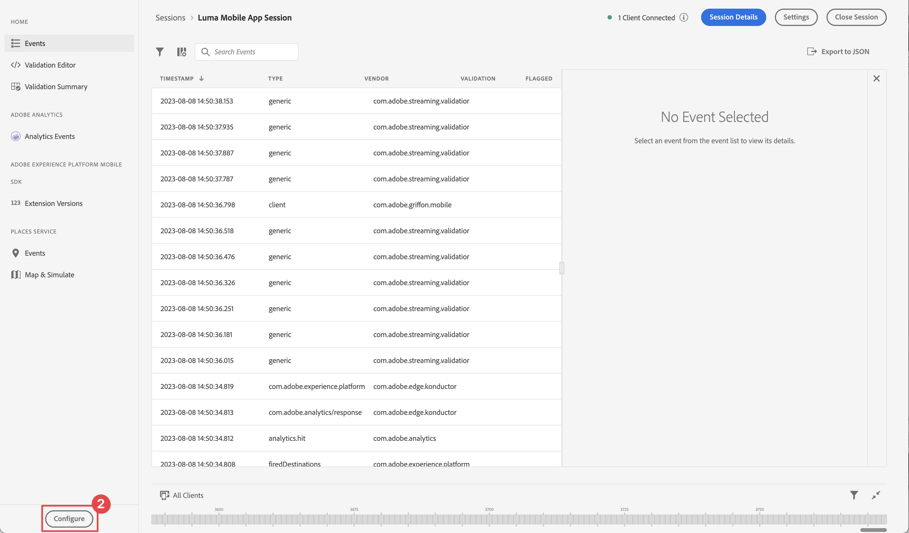

# Adobe Journey Optimizer 인앱 메시지

Platform Mobile SDK 및 Adobe Journey Optimizer을 사용하여 모바일 앱용 인앱 메시지를 만드는 방법을 알아봅니다.

Journey Optimizer을 사용하면 여정을 만들고 인앱 메시지를 타겟팅된 대상자에게 보낼 수 있습니다. Journey Optimizer을 사용하여 인앱 메시지를 보내기 전에 적절한 구성 및 통합이 제대로 되어 있는지 확인해야 합니다. Adobe Journey Optimizer의 인앱 메시지 데이터 흐름을 이해하려면 다음을 참조하십시오. [설명서](https://experienceleague.adobe.com/docs/journey-optimizer/using/in-app/inapp-configuration.html?lang=en).

>[!NOTE]
>
>이 단원은 선택 사항이며 인앱 메시지를 전송하려는 Adobe Journey Optimizer 사용자에게만 적용됩니다.


## 전제 조건

* SDK가 설치 및 구성된 앱을 빌드하고 실행했습니다.
* Adobe Journey Optimizer에 대한 액세스 및 설명된 대로 충분한 권한 [여기](https://experienceleague.adobe.com/docs/journey-optimizer/using/configuration/configuration-message/push-config/push-configuration.html?lang=en). 또한 다음 Adobe Journey Optimizer 기능에 대한 충분한 권한이 필요합니다.
   * 캠페인 만들기.
* 인증서, 식별자 및 키를 만들 수 있는 충분한 액세스 권한이 있는 유료 Apple 개발자 계정입니다.
* 테스트를 위한 물리적 iOS 장치 또는 시뮬레이터.
* [APN에 앱 ID를 등록했습니다](journey-optimizer-push.md#register-app-id-with-apn)
* [데이터 수집에 앱 푸시 자격 증명 추가됨](journey-optimizer-push.md#add-your-app-push-credentials-in-data-collection)
* [설치된 Adobe Journey Optimizer 태그 확장](journey-optimizer-push.md#install-adobe-journey-optimizer-tags-extension)
* [앱에서 Adobe Journey Optimizer 구현](journey-optimizer-push.md#implement-adobe-journey-optimizer-in-the-app)


## Assurance를 통해 유효성 검사

1. 리뷰 [설치 지침](assurance.md) 섹션.
1. 물리적 장치 또는 시뮬레이터에 앱을 설치합니다.
1. 보증 생성 URL을 사용하여 앱을 실행합니다.
1. Assurance UI에서 **[!UICONTROL 구성]**.
   
1. 다음 항목 선택  단추 옆에 있음 **[!UICONTROL 인앱 메시징]**.
1. **[!UICONTROL 저장]**을 선택합니다.
   
1. 선택 **[!UICONTROL 인앱 메시징]** 왼쪽 탐색에서.
1. 다음 항목 선택 **[!UICONTROL 유효성 검사]** 탭.
1. 오류가 발생하지 않는지 확인합니다.
   


## 고유한 인앱 메시지 만들기

고유한 인앱 메시지를 만들려면 발생하는 이벤트를 기반으로 인앱 메시지를 트리거하는 캠페인을 Journey Optimizer에서 정의해야 합니다. 이러한 이벤트는 다음과 같을 수 있습니다.

* Adobe Experience Platform으로 전송된 데이터,
* 모바일 코어 일반 API를 통해 작업, 상태 또는 PII 데이터 수집과 같은 코어 추적 이벤트
* 시작, 설치, 업그레이드, 닫기 또는 충돌과 같은 애플리케이션 라이프사이클 이벤트
* 관심 영역 입력 또는 종료와 같은 지리적 위치 이벤트.

이 자습서에서는 모바일 코어 범용 및 확장 독립적인 API를 사용하여 사용자 화면, 작업 및 PII 데이터의 이벤트 추적을 용이하게 합니다. 이러한 API에 의해 생성된 이벤트는 SDK 이벤트 허브에 게시되고 확장에서 사용할 수 있습니다. 예를 들어 Analytics 확장이 설치되면 모든 사용자 작업 및 앱 화면 이벤트 데이터가 적절한 Analytics 보고 끝점으로 전송됩니다.

1. Journey Optimizer UI에서 **[!UICONTROL 캠페인]** 왼쪽 레일에서.
1. 선택 **[!UICONTROL 캠페인 만들기]**.
1. 다음에서 **[!UICONTROL 캠페인 만들기]** 화면:
   1. 선택 **[!UICONTROL 인앱 메시지]** 및 선택 **[!UICONTROL Luma 모바일 앱]** 다음에서 **[!UICONTROL 앱 표면]** 목록을 표시합니다.
   1. **[!UICONTROL 만들기]**를 선택합니다
      
1. 캠페인 정의 화면의 **[!UICONTROL 속성]**, 를 입력합니다. **[!UICONTROL 이름]** 예를 들어 캠페인용 `Luma - In-App Messaging Campaign`, 및 **[!UICONTROL 설명]**, 예 `In-app messaging campaign for Luma app`.
   
1. 아래로 스크롤하여 **[!UICONTROL 작업]**, 및 선택 **[!UICONTROL 콘텐츠 편집]**.
1. 다음에서 **[!UICONTROL 인앱 메시지]** 화면:
   1. 선택 **[!UICONTROL 모달]** (으)로 **[!UICONTROL 메시지 레이아웃]**.
   1. 입력 `https://luma.enablementadobe.com/content/dam/luma/en/logos/Luma_Logo.png` 대상 **[!UICONTROL 미디어 URL]**.
   1. 입력 **[!UICONTROL 머리글]**, 예 `Welcome to this Luma In-App Message` 을(를) 입력합니다. **[!UICONTROL 본문]**, 예 `Triggered by pushing that button in the app...`.
   1. 입력 **[!UICONTROL 닫기]** (으)로 **[!UICONTROL 단추 #1 텍스트(기본)]**.
   1. 미리보기가 어떻게 업데이트되는지 확인합니다.
   1. 선택 **[!UICONTROL 활성화하려면 검토]**.
      
1. 다음에서 **[!UICONTROL 활성화 검토(Luma - 인앱 메시지 캠페인)]** 화면, 선택  다음에서 **[!UICONTROL 예약]** 타일.
   
1. 뒤로 이동 **[!UICONTROL Luma - 인앱 메시지 캠페인]** 화면, 선택  **[!UICONTROL 트리거 편집]**.
1. 다음에서 **[!UICONTROL 인앱 메시지 트리거]** 대화 상자에서 인앱 메시지를 트리거하는 추적 작업의 세부 사항을 구성합니다.
   1. 제거하려면 **[!UICONTROL 애플리케이션 실행 이벤트]**, 선택  .
   1. 사용  **[!UICONTROL 조건 추가]** 에 대해 다음 논리를 구축하기 위해 반복적으로 **[!UICONTROL 다음과 같은 경우 메시지 표시]**.
   1. **[!UICONTROL 완료]**를 클릭합니다.
      

   다음과 같은 추적 작업을 정의했습니다. **[!UICONTROL 작업]** 다음과 같음 `in-app` 및 **[!UICONTROL 컨텍스트 데이터]** 작업이 다음의 키 값 쌍인 경우 `showMessage = true`.

1. 뒤로 이동 **[!UICONTROL Luma - 인앱 메시지 캠페인]** 화면, 선택 **[!UICONTROL 활성화하려면 검토]**.
1. 다음에서 **[!UICONTROL 활성화 검토(Luma - 인앱 메시지 캠페인)]** 화면, 선택 **[!UICONTROL 활성화]**.
1. 다음을 확인함: **[!UICONTROL Luma - 인앱 메시지 캠페인]** (상태) **[!UICONTROL 라이브]** 다음에서 **[!UICONTROL 캠페인]** 목록을 표시합니다.
   


## 인앱 메시지 트리거

인앱 메시지를 보낼 수 있는 모든 구성 요소가 준비되었습니다. 남아 있는 것은 코드에서 이 인앱 메시지를 트리거하는 방법입니다.

1. Xcode Project navigator에서 Luma > Luma > Utils > MobileSDK 로 이동하여 `func sendTrackAction(action: String, data: [String: Any]?)` 함수를 호출하고 다음 코드를 추가합니다 `MobileCore.track` 함수, 매개 변수 기반 `action` 및 `data`.


   ```
   // send trackAction event
   MobileCore.track(action: action, data: data)
   ```

1. Xcode Project Navigator에서 Luma > Luma > 보기 > 일반 > ConfigView 로 이동합니다. 인앱 메시지 단추에 대한 코드를 찾아 다음 코드를 추가합니다.

   ```
   Task {
       AEPService.shared.sendTrackAction(action: "in-app", data: ["showMessage": "true"])
   }
   ```

## 앱을 사용하여 유효성 검사

1. 장치 또는 시뮬레이터에서 앱을 엽니다.

1. 로 이동 **[!UICONTROL 설정]** 탭.

1. 누르기 **[!UICONTROL 인앱 메시지]**. 인앱 메시지가 앱에 표시되는 것을 볼 수 있습니다.
   


## Assurance에서 유효성 검사

Assurance UI에서 인앱 메시지의 유효성을 검사할 수 있습니다.

1. 선택 **[!UICONTROL 인앱 메시징]**.
1. 선택 **[!UICONTROL 이벤트 목록]**.
1. 선택 **[!UICONTROL 메시지 표시]** 입력.
1. Inspect 원시 이벤트, 특히 `html`: 인앱 메시지의 전체 레이아웃 및 콘텐츠를 포함합니다.
   


## 앱에서 구현

이제 Luma 앱에 관련 있고 적용 가능한 경우 푸시 알림을 추가하기 시작하는 모든 도구가 있어야 합니다. 예를 들어, 앱에 로그인하거나 특정 지리적 위치에 접근할 때 사용자를 반기는 경우가 있습니다.

>[!SUCCESS]
>
>이제 인앱 메시징을 위해 앱을 활성화하고 Adobe Journey Optimizer 및 Adobe Experience Platform Mobile SDK용 Adobe Journey Optimizer 확장을 사용하여 인앱 메시지 캠페인을 추가했습니다.<br/>Adobe Experience Platform Mobile SDK에 대해 학습하는 데 시간을 투자해 주셔서 감사합니다. 질문이 있거나 일반적인 피드백을 공유하려는 경우 또는 향후 콘텐츠에 대한 제안이 있는 경우 이에 대해 공유하십시오 [Experience League 커뮤니티 토론 게시물](https://experienceleaguecommunities.adobe.com/t5/adobe-experience-platform-launch/tutorial-discussion-implement-adobe-experience-cloud-in-mobile/td-p/443796).

다음: **[결론 및 다음 단계](conclusion.md)**
