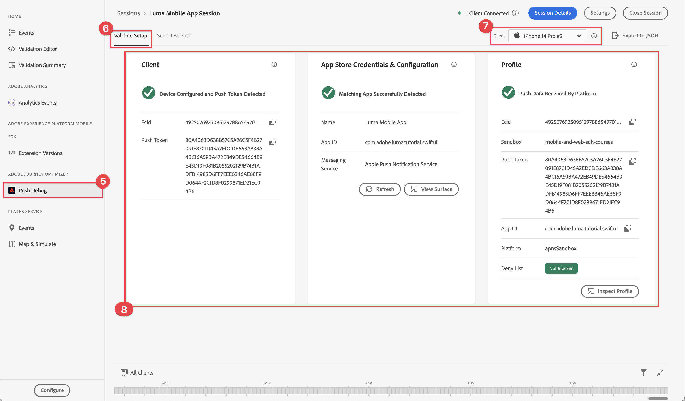

# 푸시 알림 만들기 및 전송

Experience Platform Mobile SDK 및 Journey Optimizer을 사용하여 모바일 앱용 푸시 알림을 만드는 방법을 알아봅니다.

Journey Optimizer을 사용하면 여정을 만들고 타겟팅된 대상자에게 메시지를 보낼 수 있습니다. Journey Optimizer을 사용하여 푸시 알림을 전송하기 전에 적절한 구성 및 통합이 있는지 확인해야 합니다. Journey Optimizer의 푸시 알림 데이터 흐름을 이해하려면 다음을 참조하십시오 [설명서](https://experienceleague.adobe.com/docs/journey-optimizer/using/push/push-config/push-gs.html).


>[!NOTE]
>
>이 단원은 선택 사항이며 푸시 알림을 전송하려는 Journey Optimizer 사용자에게만 적용됩니다.


## 전제 조건

* SDK가 설치 및 구성된 앱을 빌드하고 실행했습니다.
* Adobe Experience Platform용 앱을 설정합니다.
* Journey Optimizer에 대한 액세스 및 설명된 대로 충분한 권한 [여기](https://experienceleague.adobe.com/docs/journey-optimizer/using/push/push-config/push-configuration.html?lang=en). 또한 다음 Journey Optimizer 기능에 대한 충분한 권한이 필요합니다.
   * 앱 표면을 만듭니다.
   * 여정 만들기.
   * 메시지 만들기.
   * 메시지 사전 설정 만들기.
* **유료 Apple 개발자 계정** 인증서, 식별자 및 키를 만들 수 있는 충분한 액세스 권한.
* 테스트를 위한 물리적 iOS 장치 또는 시뮬레이터.

## 학습 목표

이 단원에서는 다음과 같은 작업을 수행합니다

* APNs(Apple 푸시 알림 서비스)에 앱 ID를 등록합니다.
* Journey Optimizer에서 앱 표면 을 만듭니다.
* 푸시 메시지 필드를 포함하도록 스키마를 업데이트합니다.
* Journey Optimizer 태그 확장 설치 및 구성
* 앱을 업데이트하여 Journey Optimizer 태그 확장을 등록합니다.
* Assurance에서 설정의 유효성을 검사합니다.
* Assurance에서 테스트 메시지 보내기
* Journey Optimizer에서 고유한 푸시 알림 이벤트, 여정 및 경험을 정의합니다.
* 앱 내에서 나만의 푸시 알림을 보냅니다.


## 설정

>[!TIP]
>
>의 일부로 환경을 이미 설정한 경우 [Journey Optimizer 인앱 메시지](journey-optimizer-inapp.md) 단원, 이 설정 섹션의 일부 단계를 이미 수행했을 수 있습니다.

### APNs에 앱 ID 등록

다음 단계는 Adobe Experience Cloud 전용이 아니며 APNs 구성을 안내하도록 설계되었습니다.

#### 개인 키 만들기

1. Apple 개발자 포털에서 **[!UICONTROL 키]**.
1. 키를 만들려면 다음을 선택합니다. **[!UICONTROL +]**.
   

1. 다음을 제공합니다. **[!UICONTROL 키 이름]**.
1. 다음 항목 선택 **[!UICONTROL Apple 푸시 알림 서비스] (APNs)** 확인란.
1. 선택 **[!UICONTROL 계속]**.
   
1. 구성을 검토하고 다음을 선택합니다. **[!UICONTROL 등록]**.
1. 다운로드 `.p8` 개인 키. 이 메서드는 이 단원의 뒷부분에서 앱 표면 구성에 사용됩니다.
1. 다음을 기록해 둡니다. **[!UICONTROL 키 ID]**. 앱 표면 구성에서 사용됩니다.
1. 다음을 기록해 둡니다. **[!UICONTROL 팀 ID]**. 앱 표면 구성에서 사용됩니다.
   

추가 설명서는 다음과 같습니다. [여기에서 찾음](https://help.apple.com/developer-account/#/devcdfbb56a3).

#### 데이터 수집에서 앱 표면 추가

1. 다음에서 [데이터 수집 인터페이스](https://experience.adobe.com/data-collection/), 선택 **[!UICONTROL 앱 표면]** 왼쪽 패널에서
1. 구성을 만들려면 다음을 선택합니다 **[!UICONTROL 앱 표면 만들기]**.
   
1. 입력 **[!UICONTROL 이름]** 예를 들어 구성의 경우 `Luma App Tutorial`  .
1. 출처: **[!UICONTROL 모바일 애플리케이션 구성]**, 선택 **[!UICONTROL Apple iOS]**.
1. 에 모바일 앱 번들 ID 입력 **[!UICONTROL 앱 ID (iOS 번들 ID)]** 필드. 예,  `com.adobe.luma.tutorial.swiftui`.
1. 전환 **[!UICONTROL 푸시 자격 증명]** 자격 증명을 추가하려면 전환합니다.
1. 을(를) 끌어다 놓기 `.p8` **Apple 푸시 알림 인증 키** 파일.
1. 다음을 제공합니다 **[!UICONTROL 키 ID]**&#x200B;를 만드는 동안 할당된 10자 문자열 `p8` 인증 키. 다음 아래에서 찾을 수 있습니다 **[!UICONTROL 키]** 의 탭 **인증서, 식별자 및 프로필** Apple 개발자 포털 페이지의 페이지입니다. 참조: [개인 키 만들기](#create-a-private-key).
1. 다음을 제공합니다 **[!UICONTROL 팀 ID]**. 팀 ID는 **멤버십** Apple 개발자 포털 페이지 상단에 있는 탭이나 를 참조하십시오. 참조: [개인 키 만들기](#create-a-private-key).
1. **[!UICONTROL 저장]**&#x200B;을 선택합니다.

   

### 데이터 스트림 구성 업데이트

모바일 앱에서 Edge Network로 전송된 데이터가 Journey Optimizer으로 전달되도록 하려면 Experience Edge 구성 을 업데이트합니다.

1. 데이터 수집 UI에서 **[!UICONTROL 데이터스트림]**&#x200B;을 누르고 데이터 스트림을 선택합니다(예: ). **[!DNL Luma Mobile App]**.
1. 선택  대상 **[!UICONTROL Experience Platform]** 및 선택  **[!UICONTROL 편집]** 컨텍스트 메뉴 아래의 제품에서 사용할 수 있습니다.
1. 다음에서 **[!UICONTROL 데이터스트림]** >  >  **[!UICONTROL Adobe Experience Platform]** 화면:

   1. 아직 선택하지 않은 경우 다음을 선택합니다. **[!UICONTROL AJO 푸시 프로필 데이터 세트]** 출처: **[!UICONTROL 프로필 데이터 세트]**. 을(를) 사용할 때 이 프로필 데이터 세트가 필요합니다. `MobileCore.setPushIdentifier` API 호출(참조) [푸시 알림용 장치 토큰 등록](#register-device-token-for-push-notifications)): 푸시 알림에 대한 고유 식별자(푸시 식별자)가 사용자 프로필의 일부로 저장됩니다.

   1. **[!UICONTROL Adobe Journey Optimizer]** 이(가) 선택되어 있습니다. 다음을 참조하십시오 [Adobe Experience Platform 설정](https://experienceleague.adobe.com/docs/experience-platform/datastreams/configure.html?lang=en#aep) 추가 정보.

   1. 데이터 스트림 구성을 저장하려면 을 선택합니다. **[!UICONTROL 저장]**.

   


### Journey Optimizer 태그 확장 설치

앱이 Journey Optimizer에서 작동하려면 태그 속성을 업데이트해야 합니다.

1. 다음으로 이동 **[!UICONTROL 태그]** > **[!UICONTROL 확장]** > **[!UICONTROL 카탈로그]**,
1. 속성을 엽니다. 예 **[!DNL Luma Mobile App Tutorial]**.
1. 선택 **[!UICONTROL 카탈로그]**.
1. 검색 **[!UICONTROL Adobe Journey Optimizer]** 확장명.
1. 확장을 설치합니다.
1. 다음에서 **[!UICONTROL 확장 설치]** 대화 상자
   1. 환경 선택(예: ) **[!UICONTROL 개발]**.
   1. 다음 항목 선택 **[!UICONTROL AJO 푸시 추적 경험 이벤트 데이터 세트]** 데이터 세트 **[!UICONTROL 이벤트 데이터 세트]** 목록을 표시합니다.
   1. 선택 **[!UICONTROL 라이브러리 및 빌드에 저장]**.
      

>[!NOTE]
>
>표시되지 않으면 **[!UICONTROL AJO 푸시 추적 경험 이벤트 데이터 세트]** 선택 사항으로 고객 지원 센터에 문의하십시오.
>

## Assurance를 사용하여 설정 유효성 검사

1. 리뷰 [설치 지침](assurance.md#connecting-to-a-session) 시뮬레이터 또는 장치를 Assurance에 연결하는 섹션입니다.
1. Assurance UI에서 **[!UICONTROL 구성]**.
   
1. 선택  다음에 **[!UICONTROL 푸시 디버그]**.
1. **[!UICONTROL 저장]**을 선택합니다.
   
1. 선택 **[!UICONTROL 푸시 디버그]** 왼쪽 탐색에서.
1. 다음 항목 선택 **[!UICONTROL 설정 유효성 검사]** 탭.
1. 에서 장치 선택 **[!UICONTROL 클라이언트]** 목록을 표시합니다.
1. 오류가 발생하지 않는지 확인합니다.
   
1. 다음 항목 선택 **[!UICONTROL 테스트 푸시 보내기]** 탭.
1. (선택 사항) 의 기본 세부 정보 변경 **[!UICONTROL 제목]** 및 **[!UICONTROL 본문]**
1. 선택  **[!UICONTROL 테스트 푸시 알림 보내기]**.
1. 다음 확인: **[!UICONTROL 테스트 결과]**.
1. 앱에 테스트 푸시 알림이 표시되는 것을 확인해야 합니다.

   


## 서명

푸시 알림 및 를 전송하는 데 Luma 앱 서명이 필요합니다. **유료 Apple 개발자 계정 필요**.

앱에 대한 서명을 업데이트하려면:

1. Xcode에서 앱으로 이동합니다.
1. 선택 **[!DNL Luma]** 프로젝트 탐색기를 참조하십시오.
1. 다음 항목 선택 **[!DNL Luma]** 타겟.
1. 다음 항목 선택 **서명 및 기능** 탭.
1. 구성 **[!UICONTROL 서명 자동 관리]**, **[!UICONTROL 팀]**, 및 **[!UICONTROL 번들 식별자]**&#x200B;또는 특정 Apple 개발 프로비저닝 세부 정보를 사용하십시오.

   >[!IMPORTANT]
   >
   >다음을 사용하는지 확인합니다. _고유_ 번들 식별자 및 바꾸기 `com.adobe.luma.tutorial.swiftui` 번들 식별자. 각 번들 식별자는 고유해야 합니다. 일반적으로 와 같은 번들 ID 문자열에 역방향 DNS 형식을 사용합니다 `com.organization.brand.uniqueidentifier`. 이 자습서의 완료된 버전은 예를 들어 `com.adobe.luma.tutorial.swiftui`.


   {zoomable=&quot;yes&quot;}


## 앱에 푸시 알림 기능 추가

>[!IMPORTANT]
>
>iOS 앱에서 푸시 알림을 구현하고 테스트하려면 **유료** Apple 개발자 계정입니다. 유료 Apple 개발자 계정이 없는 경우 이 단원의 나머지 부분을 건너뛸 수 있습니다.

1. Xcode에서 **[!DNL Luma]** 다음에서 **[!UICONTROL 타겟]** 목록에서 **[!UICONTROL 서명 및 기능]** 탭에서 **[!UICONTROL + 기능]** 버튼을 누른 다음 선택 **[!UICONTROL 푸시 알림]**. 이렇게 하면 앱에서 푸시 알림을 받을 수 있습니다.

1. 그런 다음 앱에 알림 확장 기능을 추가해야 합니다. 로 돌아가기 **[!DNL General]** 탭을 클릭하고 다음을 선택합니다. **[!UICONTROL +]** 아이콘(맨 아래) **[!UICONTROL 타겟]** 섹션.

1. 새 타겟에 대한 템플릿을 선택하라는 메시지가 표시됩니다. 선택 **[!UICONTROL 알림 서비스 확장]** 그런 다음 선택 **[!UICONTROL 다음]**.

1. 다음 창에서 `NotificationExtension` 를 확장 이름으로 사용하고 **[!UICONTROL 완료]** 단추를 클릭합니다.

이제 아래 화면과 유사하게 앱에 푸시 알림 확장 기능이 추가되어야 합니다.


## 앱에서 Journey Optimizer 구현

이전 단원에서 설명한 대로 모바일 태그 확장을 설치하면 구성만 제공됩니다. 그런 다음 메시징 SDK를 설치하고 등록해야 합니다. 이러한 단계가 명확하지 않으면 다음을 검토하십시오. [SDK 설치](install-sdks.md) 섹션.

>[!NOTE]
>
>을(를) 완료한 경우 [SDK 설치](install-sdks.md) 섹션에서 SDK가 이미 설치되어 있으므로 이 단계를 건너뛸 수 있습니다.
>

1. Xcode에서 다음을 확인합니다 [AEP 메시징](https://github.com/adobe/aepsdk-messaging-ios) 패키지 종속 항목의 패키지 목록에 추가됩니다. 다음을 참조하십시오 [Swift 패키지 관리자](install-sdks.md#swift-package-manager).
1. 다음으로 이동 **[!DNL Luma]** > **[!DNL Luma]** > **[!UICONTROL AppDelegate]** 를 입력합니다.
1. 확인 `AEPMessaging` 는 가져오기 목록의 일부입니다.

   `import AEPMessaging`

1. 확인 `Messaging.self` 는 등록 중인 확장 배열의 일부입니다.

   ```swift
   let extensions = [
       AEPIdentity.Identity.self,
       Lifecycle.self,
       Signal.self,
       Edge.self,
       AEPEdgeIdentity.Identity.self,
       Consent.self,
       UserProfile.self,
       Places.self,
       Messaging.self,
       Optimize.self,
       Assurance.self
   ]
   ```

## 푸시 알림용 장치 토큰 등록

1. 추가 [`MobileCore.setPushIdentifier`](https://developer.adobe.com/client-sdks/documentation/mobile-core/api-reference/#setpushidentifier) 에 대한 API `func application(_ application: UIApplication, didRegisterForRemoteNotificationsWithDeviceToken deviceToken: Data)` 함수.

   ```swift
   // Send push token to Mobile SDK
   MobileCore.setPushIdentifier(deviceToken)
   ```

   이 함수는 앱이 설치된 장치에 고유한 장치 토큰을 검색합니다. 그런 다음 설정한 구성을 사용하여 푸시 알림 전달을 위한 토큰을 설정하고 Apple의 APNs(푸시 알림 서비스)를 사용합니다.

>[!IMPORTANT]
>
>다음 `MobileCore.updateConfigurationWith(configDict: ["messaging.useSandbox": true])` 푸시 알림이 푸시 알림을 전송하기 위해 APNs 샌드박스 또는 프로덕션 서버를 사용하는지 여부를 결정합니다. 시뮬레이터 또는 장치에서 앱을 테스트할 때 `messaging.useSandbox` 이(가) (으)로 설정됨 `true` 푸시 알림을 받을 수 있습니다. Apple의 Testflight를 사용하여 테스트할 프로덕션 앱을 배포할 때 다음을 설정하십시오. `messaging.useSandbox` 끝 `false` 그렇지 않으면 프로덕션 앱에서 푸시 알림을 받을 수 없습니다.


## 나만의 푸시 알림 만들기

고유한 푸시 알림을 만들려면 푸시 알림 전송을 처리하는 여정을 트리거하는 이벤트를 Journey Optimizer에서 정의해야 합니다.

### 스키마 업데이트

스키마에 정의된 이벤트 목록의 일부로 아직 사용할 수 없는 새 이벤트 유형을 정의하려고 합니다. 나중에 푸시 알림을 트리거할 때 이 이벤트 유형을 사용합니다.

1. Journey Optimizer UI에서 **[!UICONTROL 스키마]** 왼쪽 레일에서.
1. 선택 **[!UICONTROL 찾아보기]** 을 클릭합니다.
1. 스키마 선택(예: ) **[!DNL Luma Mobile App Event Schema]** 열려고.
1. 스키마 편집기에서:
   1. 다음 항목 선택 **[!UICONTROL eventType]** 필드.
   1. 다음에서 **[!UICONTROL 필드 속성]** 창에서 아래로 스크롤하여 이벤트 유형에 사용할 수 있는 값 목록을 확인합니다. 선택 **[!UICONTROL 행 추가]**, 및 추가 `application.test` (으)로 **[!UICONTROL 값]** 및 `[!UICONTROL Test event for push notification]` (으)로 `DISPLAY NAME`.
   1. **[!UICONTROL 적용]**&#x200B;을 선택합니다.
   1. **[!UICONTROL 저장]**을 선택합니다.
      

### 이벤트 정의

Journey Optimizer의 이벤트를 사용하면 푸시 알림과 같은 메시지를 보내기 위해 여정을 통합적으로 트리거할 수 있습니다. 다음을 참조하십시오 [이벤트 정보](https://experienceleague.adobe.com/docs/journey-optimizer/using/configuration/configure-journeys/events-journeys/about-events.html?lang=en) 추가 정보.

1. Journey Optimizer UI에서 **[!UICONTROL 구성]** 왼쪽 레일에서.

1. 다음에서 **[!UICONTROL 대시보드]** 화면에서 **[!UICONTROL 관리]** 의 단추 **[!UICONTROL 이벤트]** 타일.

1. 다음에서 **[!UICONTROL 이벤트]** 화면, 선택 **[!UICONTROL 이벤트 만들기]**.

1. 다음에서 **[!UICONTROL 이벤트 이벤트1 편집]** 창:

   1. 입력 `LumaTestEvent` (으)로 **[!UICONTROL 이름]** 이벤트.
   1. 다음을 제공합니다. **[!UICONTROL 설명]**, 예 `Test event to trigger push notifications in Luma app`.

   1. 앞에서 만든 모바일 앱 경험 이벤트 스키마를 선택합니다. [XDM 스키마 만들기](create-schema.md) 다음에서 **[!UICONTROL 스키마]** 목록, 예 **[!DNL Luma Mobile App Event Schema v.1]**.
   1. 선택  다음 옆에 **[!UICONTROL 필드]** 목록을 표시합니다.

      

      다음에서 **[!UICONTROL 필드]** 대화 상자에서 항상 선택된 기본 필드 위에 다음 필드가 선택되어 있는지 확인합니다(**[!UICONTROL _id]**, **[!UICONTROL id]**, 및 **[!UICONTROL timestamp]**). 드롭다운 목록을 사용하여 다음 사이에서 전환할 수 있습니다. **[!UICONTROL 선택됨]**, **[!UICONTROL 모두]** 및 **[!UICONTROL 기본]** 또는  필드.

      * **[!UICONTROL 애플리케이션 식별됨 (ID)]**,
      * **[!UICONTROL 이벤트 유형(eventType)]**,
      * **[!UICONTROL 기본(기본)]**.

      

      그런 다음 을 선택합니다 **[!UICONTROL 확인]**.

   1. 선택  다음 옆에 **[!UICONTROL 이벤트 ID 조건]** 필드.

      1. 다음에서 **[!UICONTROL 이벤트 ID 조건 추가]** 대화 상자, 끌어서 놓기 **[!UICONTROL 이벤트 유형(eventType)]** 에 **[!UICONTROL 여기에 요소 드래그 앤 드롭]**.
      1. 팝오버에서 아래로 스크롤하여 을 선택합니다. **[!UICONTROL application.test]** (이벤트 유형 목록에 이전에 의 일부로 추가한 이벤트 유형입니다. [스키마 업데이트](#update-your-schema)). 그런 다음 위로 스크롤하여 을 선택합니다. **[!UICONTROL 확인]**.
      1. 선택 **[!UICONTROL 확인]** 을 눌러 조건을 저장합니다.
         

   1. 선택 **[!UICONTROL ECID (ECID)]** 다음에서 **[!UICONTROL 네임스페이스]** 목록을 표시합니다. 자동으로 **[!UICONTROL 프로필 식별자]** 필드는 로 채워집니다. **[!UICONTROL 맵 identityMap 키 ECID의 첫 번째 요소 ID]**.
   1. **[!UICONTROL 저장]**을 선택합니다.
      

이 자습서의 일부로 이전에 만든 모바일 앱 경험 이벤트 스키마를 기반으로 하는 이벤트 구성을 방금 만들었습니다. 이 이벤트 구성은 특정 이벤트 유형을 사용하여 들어오는 경험 이벤트를 필터링합니다. (`application.test`)를 클릭하여 모바일 앱에서 시작된 특정 유형의 이벤트만 다음 단계에서 빌드하는 여정을 트리거합니다. 실제 시나리오에서는 외부 서비스에서 푸시 알림을 전송할 수 있지만 동일한 개념이 적용됩니다. 외부 애플리케이션에서 여정이 트리거되기 전에 이러한 이벤트에 조건을 적용하는 데 사용할 수 있는 특정 필드가 있는 Experience Platform으로 경험 이벤트를 보냅니다.

### 여정 만들기

다음 단계는 적절한 이벤트를 받을 때 푸시 알림 전송을 트리거하는 여정을 만드는 것입니다.

1. Journey Optimizer UI에서 **[!UICONTROL 여정]** 왼쪽 레일에서.
1. 선택 **[!UICONTROL 여정 만들기]**.
1. 다음에서 **[!UICONTROL 여정 속성]** 패널:

   1. 입력 **[!UICONTROL 이름]** 여정: 예 `Luma - Test Push Notification Journey`.
   1. 입력 **[!UICONTROL 설명]** 여정: 예 `Journey for test push notifications in Luma mobile app`.
   1. 확인 **[!UICONTROL 재등록 허용]** 이(가) 선택되고 설정됨 **[!UICONTROL 재등록 대기 기간]** 끝 **[!UICONTROL 30]** **[!UICONTROL 초]**.
   1. 선택 **[!UICONTROL 확인]**.
      

1. 여정 캔버스에서 **[!UICONTROL 이벤트]**&#x200B;을(를) 끌어다 놓습니다.  **[!DNL LumaTestEvent]** 표시되는 캔버스 **[!UICONTROL 시작 이벤트 또는 대상자 읽기 활동 선택]**.

   * 다음에서 **[!UICONTROL 이벤트: LumaTestEvent]** 패널, 입력 **[!UICONTROL 레이블]**, 예 `Luma Test Event`.

1. 다음에서 **[!UICONTROL 작업]** 드롭다운, 드래그 앤 드롭  **[!UICONTROL 푸시]** 다음에 있음  의 오른쪽에 표시 **[!DNL LumaTestEvent]** 활동. 다음에서 **[!UICONTROL 작업: 푸시]** 창:

   1. 다음을 제공합니다. **[!UICONTROL 레이블]**, 예 `Luma Test Push Notification`, 다음을 제공합니다. **[!UICONTROL 설명]**, 예 `Test push notification for Luma mobile app`, 선택 **[!UICONTROL 트랜잭션]** 다음에서 **[!UICONTROL 범주]** 나열 및 선택 **[!DNL Luma]** 다음에서 **[!UICONTROL 푸시 표면]**.
   1. 선택  **[!UICONTROL 콘텐츠 편집]** 실제 푸시 알림 편집을 시작합니다.
      

      다음에서 **[!UICONTROL 푸시 알림]** 편집기:

      1. 입력 **[!UICONTROL 제목]**, 예 `Luma Test Push Notification` 을(를) 입력합니다. **[!UICONTROL 본문]**, 예 `Test push notification for Luma mobile app`.
      1. 를 저장하고 편집기에서 나가려면 을 선택합니다. .
         

   1. 푸시 알림 정의를 저장하고 완료하려면 다음을 선택합니다 **[!UICONTROL 확인]**.

1. 여정은 다음과 같아야 합니다. 선택 **[!UICONTROL 게시]** 여정 게시 및 활성화
   


## 푸시 알림 트리거

푸시 알림을 보낼 수 있는 모든 구성 요소가 준비되었습니다. 남은 것은 이 푸시 알림을 트리거하는 방법입니다. 본질적으로 앞에서 보았듯이 다음과 같습니다. 적절한 페이로드가 있는 경험 이벤트를 보내면 됩니다(에서와 같이) [이벤트](events.md)).

이번에는 보내려는 경험 이벤트가 간단한 XDM 사전을 빌드하여 생성되지 않습니다. 다음을 사용합니다. `struct` 푸시 알림 페이로드를 나타냅니다. 전용 데이터 유형 정의는 애플리케이션에서 경험 이벤트 페이로드 구성을 구현하는 방법에 대한 대체 방법입니다.

1. 다음으로 이동 **[!DNL Luma]** > **[!DNL Luma]** > **[!UICONTROL 모델]** > **[!UICONTROL XDM]** > **[!UICONTROL 테스트 푸시 페이로드]** 를 클릭하고 코드를 검사합니다.

   ```swift
   import Foundation
   
   // MARK: - TestPush
   struct TestPushPayload: Codable {
      let application: Application
      let eventType: String
   }
   
   // MARK: - Application
   struct Application: Codable {
      let id: String
   }
   ```

   이 코드는 테스트 푸시 알림 여정을 트리거하기 위해 전송할 다음의 간단한 페이로드를 나타냅니다

   ```json
   {
      "eventType": string,
      "application" : [
          "id": string
      ]
   }
   ```

1. 다음으로 이동 **[!DNL Luma]** > **[!DNL Luma]** > **[!DNL Utils]** > **[!UICONTROL MobileSDK]** xcode 프로젝트 탐색기에서 다음 코드를 `func sendTestPushEvent(applicationId: String, eventType: String)`:

   ```swift
   // Create payload and send experience event
   Task {
       let testPushPayload = TestPushPayload(
           application: Application(
               id: applicationId
           ),
           eventType: eventType
       )
       // send the final experience event
       await sendExperienceEvent(
           xdm: testPushPayload.asDictionary() ?? [:]
       )
   }
   ```

   이 코드는 `testPushPayload` 함수에 제공된 매개 변수를 사용하는 인스턴스(`applicationId` 및 `eventType`) 및 호출 `sendExperienceEvent` 페이로드를 사전으로 변환하는 동안 오류가 발생했습니다. 이 코드는 또한 다음에 기반한 Swift의 동시성 모델을 사용하여 Adobe Experience Platform SDK를 호출하는 비동기 측면을 고려합니다. `await` 및 `async`.

1. 다음으로 이동 **[!DNL Luma]** > **[!DNL Luma]** > **[!DNL Views]** > **[!DNL General]** > **[!UICONTROL ConfigView]** 를 입력합니다. 푸시 알림 단추 정의에서 다음 코드를 추가하여 테스트 푸시 알림 경험 이벤트 페이로드를 전송하여 해당 단추를 누를 때마다 여정을 트리거합니다.

   ```swift
   // Setting parameters and calling function to send push notification
   Task {
       let eventType = testPushEventType
       let applicationId = Bundle.main.bundleIdentifier ?? "No bundle id found"
       await MobileSDK.shared.sendTestPushEvent(applicationId: applicationId, eventType: eventType)
   }
   ```


## 앱을 사용하여 유효성 검사

1. 를 사용하여 시뮬레이터나 Xcode의 물리적 장치에서 앱을 다시 빌드하고 실행합니다. .

1. 로 이동 **[!UICONTROL 설정]** 탭.

1. 누르기 **[!UICONTROL 푸시 알림]**. 앱에 푸시 알림이 표시되는 것을 볼 수 있습니다.

   


## 다음 단계

이제 앱에서 푸시 알림을 처리할 수 있는 모든 도구가 있어야 합니다. 예를 들어 앱 사용자가 로그인할 때 환영 푸시 알림을 전송하는 여정을 Journey Optimizer에 빌드할 수 있습니다. 또는 사용자가 앱에서 제품을 구매할 때 확인 푸시 알림이 표시됩니다. 또는 의 위치에 geofence를 입력합니다(에서 볼 수 있듯이). [위치](places.md) 단원).

>[!SUCCESS]
>
>이제 Experience Platform Mobile SDK용 Journey Optimizer 및 Journey Optimizer 확장을 사용하여 푸시 알림용 앱을 활성화했습니다.
>
>Adobe Experience Platform Mobile SDK에 대해 학습하는 데 시간을 투자해 주셔서 감사합니다. 질문이 있거나 일반적인 피드백을 공유하려는 경우 또는 향후 콘텐츠에 대한 제안이 있는 경우 이에 대해 공유하십시오 [Experience League 커뮤니티 토론 게시물](https://experienceleaguecommunities.adobe.com/t5/adobe-experience-platform-data/tutorial-discussion-implement-adobe-experience-cloud-in-mobile/td-p/443796).

다음: **[인앱 메시지 만들기 및 보내기](journey-optimizer-inapp.md)**
