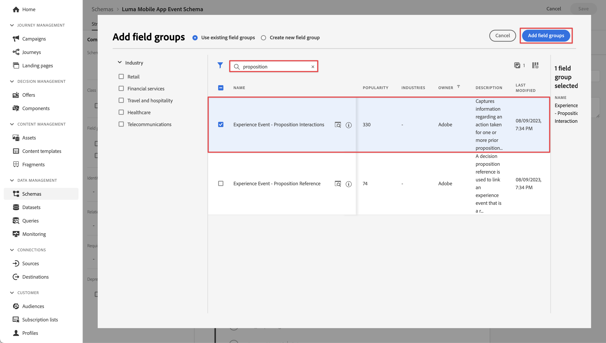
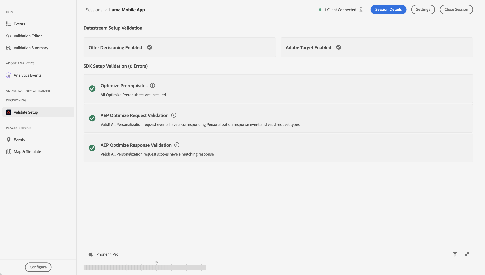

# Target을 사용하여 A/B 테스트 수행

Platform Mobile SDK 및 Adobe Target을 사용하여 모바일 앱에서 A/B 테스트를 수행하는 방법을 알아봅니다.

Target은 고객의 경험을 조정하고 개인화해야 하는 모든 기능을 제공합니다. Target을 사용하면 웹 및 모바일 사이트, 앱, 소셜 미디어 및 기타 디지털 채널에서 매출을 극대화할 수 있습니다. 이 자습서에서는 Target의 A/B 테스트 기능에 초점을 맞춥니다. 다음을 참조하십시오. [A/B 테스트 개요](https://experienceleague.adobe.com/docs/target/using/activities/abtest/test-ab.html?lang=en) 추가 정보.

Target Premium으로 A/B 테스트를 수행하려면 먼저 적절한 구성 및 통합이 있는지 확인해야 합니다.

>[!NOTE]
>
>이 단원은 선택 사항이며 A/B 테스트를 수행하려는 Adobe Target Premium 사용자에게만 적용됩니다.


## 전제 조건

* SDK가 설치 및 구성된 앱을 빌드하고 실행했습니다.
* 설명된 대로 권한, 올바르게 구성된 역할, 작업 공간 및 속성을 사용하여 Adobe Target Premium에 액세스합니다 [여기](https://experienceleague.adobe.com/docs/target/using/administer/manage-users/enterprise/property-channel.html?lang=ko).
Target Standard도 사용할 수 있어야 하지만 자습서에서는 Target Premium에 고유한 몇 가지 고급 개념(예: Target 속성)을 사용합니다.


## 학습 목표

이 단원에서는 다음과 같은 작업을 수행합니다

* Target 통합을 위해 Edge 구성을 업데이트합니다.
* Journey Optimizer - Decisioning 확장을 사용하여 태그 속성을 업데이트합니다.
* 스키마를 업데이트하여 제안 이벤트를 캡처합니다.
* Assurance에서 설정의 유효성을 검사합니다.
* Target에서 간단한 A/B 테스트를 만듭니다.
* Optimizer 확장을 포함하도록 앱을 업데이트합니다.
* 앱에서 A/B 테스트를 구현합니다.
* Assurance에서 구현의 유효성을 검사합니다.


## Edge 구성 업데이트

모바일 앱에서 Edge Network로 전송된 데이터가 Adobe Target으로 전달되도록 하려면 Experience Edge 구성을 업데이트해야 합니다.

1. 데이터 수집 UI에서 **[!UICONTROL 데이터스트림]**&#x200B;을 누르고 데이터 스트림을 선택합니다(예: ). **[!UICONTROL Luma 모바일 앱]**.
1. 선택 **[!UICONTROL 서비스 추가]** 및 선택 **[!UICONTROL Adobe Target]** 다음에서 **[!UICONTROL 서비스]** 목록을 표시합니다.
1. 대상 입력 **[!UICONTROL 속성 토큰]** 이 통합에 사용할 값입니다.

   의 Target UI에서 속성을 찾을 수 있습니다. **[!UICONTROL 관리]** > **[!UICONTROL 속성]**. 선택  를 클릭하여 사용하려는 속성의 속성 토큰을 표시합니다. 속성 토큰은 다음과 같은 형식을 갖습니다 `"at_property": "xxxxxxxx-xxxx-xxxxx-xxxx-xxxxxxxxxxxx"`; 값만 입력해야 합니다. `xxxxxxxx-xxxx-xxxxx-xxxx-xxxxxxxxxxxx`.

1. **[!UICONTROL 저장]**&#x200B;을 선택합니다.

   


## Adobe Journey Optimizer - Decisioning 태그 확장 설치

1. 다음으로 이동 **[!UICONTROL 태그]** 모바일 태그 속성을 찾아 속성을 엽니다.
1. 선택 **[!UICONTROL 확장]**.
1. 선택 **[!UICONTROL 카탈로그]**.
1. 검색 **[!UICONTROL Adobe Journey Optimizer - Decisioning]** 확장명.
1. 확장을 설치합니다. 확장은 추가 구성이 필요하지 않습니다.

   


## 스키마 업데이트

1. 데이터 수집 UI로 이동하고 왼쪽 레일에서 스키마 를 선택합니다.
1. 선택 **[!UICONTROL 찾아보기]** 을 클릭합니다.
1. 스키마를 선택하여 엽니다.
1. 스키마 편집기에서  **[!UICONTROL 추가]** 다음에 **[!UICONTROL 필드 그룹]**.
1. 필드 그룹 추가 대화 상자에서 `proposition`, 선택 **[!UICONTROL 경험 이벤트 - 제안 상호 작용]** 및 선택 **[!UICONTROL 필드 그룹 추가]**.
   
1. 스키마에 변경 사항을 저장하려면 을 선택합니다. **[!UICONTROL 저장]** .


## Assurance에서 설정 확인

Assurance에서 설정을 확인하려면:

1. Assurance UI로 이동합니다.
1. 선택 **[!UICONTROL 구성]** 왼쪽 레일에서 다음을 선택  다음에 **[!UICONTROL 설정 유효성 검사]** 아래 **[!UICONTROL ADOBE JOURNEY OPTIMIZER DECISIONING]**.
1. **[!UICONTROL 저장]**&#x200B;을 선택합니다.
1. 선택 **[!UICONTROL 설정 유효성 검사]** 왼쪽 레일에서. 데이터 스트림 설정과 SDK 설정이 모두 애플리케이션에서 검증되었습니다.
   

## A/B 테스트 만들기

1. Target UI에서 다음을 선택합니다. **[!UICONTROL 활동]** 을 클릭합니다.
1. 선택 **[!UICONTROL 활동 만들기]** 및 **[!UICONTROL A/B 테스트]** 컨텍스트 메뉴 아래의 제품에서 사용할 수 있습니다.
1. 다음에서 **[!UICONTROL A/B 테스트 활동 만들기]** 모달, 선택 **[!UICONTROL 모바일]** (으)로 **[!UICONTROL 유형]**&#x200B;에서 작업 공간을 선택합니다. **[!UICONTROL 작업 영역 선택]** 목록을 만든 다음 목록에서 속성을 선택합니다. **[!UICONTROL 속성 선택]** 목록을 표시합니다.
1. **[!UICONTROL 만들기]**를 선택합니다.
   

1. 다음에서 **[!UICONTROL 제목 없는 활동]** 화면, **[!UICONTROL 경험]** 단계:

   1. 입력 `luma-mobileapp-abtest` 위치: **[!UICONTROL 위치 선택]** L** 아래[!UICONTROL 위치 1]**.
   1. 선택  다음에 **[!UICONTROL 기본 컨텐츠]** 및 선택 **[!UICONTROL JSON 오퍼 만들기]** 컨텍스트 메뉴 아래의 제품에서 사용할 수 있습니다.
   1. 다음 JSON을에 복사 **[!UICONTROL 올바른 JSON 개체 입력]**.

      ```json
      { 
          "title": "Luma Anaolog Watch",
          "text": "Designed to stand up to your active lifestyle, this women's Luma Analog Watch features a tasteful brushed chrome finish and a stainless steel, water-resistant construction for lasting durability.", 
          "image": "https://luma.enablementadobe.com/content/dam/luma/en/products/gear/watches/Luma_Analog_Watch.jpg" 
      }
      ```

   1. 선택 **[!UICONTROL + 경험 추가]**.

      

   1. 경험 B에 대해 b단계와 c단계를 반복하되 대신 다음 JSON을 사용하십시오.

      ```json
      { 
          "title": "Aim Analog Watch",
          "text": "The flexible, rubberized strap is contoured to conform to the shape of your wrist for a comfortable all-day fit. The face features three illuminated hands, a digital read-out of the current time, and stopwatch functions.", 
          "image": "https://luma.enablementadobe.com/content/dam/luma/en/products/gear/watches/Aim_Watch.jpg" 
      }
      ```

   1. **[!UICONTROL 다음]**&#x200B;을 선택합니다.

      

1. 다음에서 **[!UICONTROL 타겟팅]** 단계: A/B 테스트 설정을 검토합니다. 기본적으로 두 오퍼는 모두 모든 방문자에게 동일하게 할당됩니다. 계속하려면 **[!UICONTROL 다음]**&#x200B;을 선택합니다.

    타겟팅 

1. 다음에서 **[!UICONTROL 목표 및 설정]** 단계:

   1. 제목 없는 활동의 이름을 (예: )으로 변경합니다. `Luma Mobile SDK Tutorial - A/B Test Example`.
   1. 다음을 입력하십시오. **[!UICONTROL 목표]** A/B 테스트의 경우 예 `A/B Test for Luma mobile app tutorial`.
   1. 선택 **[!UICONTROL 전환]**, **[!UICONTROL mbox를 클릭함]** 다음에서 **[!UICONTROL 목표 지표]** > **[!UICONTROL 내 기본 목표]** 타일을 지정하고 위치(mbox) 이름을 입력합니다(예: ) `luma-mobileapp-abtest`.
   1. 선택 **[!UICONTROL 저장 및 닫기]**.

      

1. 뒤로 이동 **[!UICONTROL 모든 활동]** 화면:

   1. 선택  을 클릭합니다.
   1. 선택  **[!UICONTROL 활성화]** 를 클릭하여 A/B 테스트를 활성화합니다.

   


## 앱에서 Target 구현

이전 단원에서 설명한 대로 모바일 태그 확장을 설치하면 구성만 제공됩니다. 그런 다음 Optimize SDK를 설치하고 등록해야 합니다. 이러한 단계가 명확하지 않으면 다음을 검토하십시오. [SDK 설치](install-sdks.md) 섹션.

>[!NOTE]
>
>을(를) 완료한 경우 [SDK 설치](install-sdks.md) 섹션에서 SDK가 이미 설치되어 있는 경우 #7단계로 건너뛸 수 있습니다.
>

1. Xcode에서 다음을 확인합니다 [AEP 최적화](https://github.com/adobe/aepsdk-messaging-ios.git) 패키지 종속 항목의 패키지 목록에 추가됩니다. 다음을 참조하십시오 [Swift 패키지 관리자](install-sdks.md#swift-package-manager).
1. 다음으로 이동 **[!UICONTROL Luma]** > **[!UICONTROL Luma]** > **[!UICONTROL AppDelegate]**.
1. 확인 `AEPMessaging` 는 가져오기 목록의 일부입니다.

   `import AEPOptimize`

1. 확인 `Optimize.self` 는 등록 중인 확장 배열의 일부입니다.

   ```swift
   let extensions = [
       AEPIdentity.Identity.self,
       Lifecycle.self,
       Signal.self,
       Edge.self,
       AEPEdgeIdentity.Identity.self,
       Consent.self,
       UserProfile.self,
       Places.self,
       Messaging.self,
       Optimize.self,
       Assurance.self
   ]
   ```

1. 다음으로 이동 **[!UICONTROL Luma]** > **[!UICONTROL Luma]** > **[!UICONTROL 유틸리티]** > **[!UICONTROL MobileSDK]** 를 입력합니다. 다음 찾기 ` func updatePropositionAT(ecid: String, location: String) async` 함수. Inspect 를 설정하는 코드
   * XDM 사전 `xdmData`A/B 테스트를 제시해야 하는 프로필을 식별하기 위한 ECID가 포함된 와
   * 다음 `decisionScope`: A/B 테스트를 표시할 위치의 배열입니다.

   그런 다음 함수는 다음 두 개의 API를 호출합니다. [`Optimize.clearCachePropositions`](https://support.apple.com/en-ie/guide/mac-help/mchlp1015/mac)  및 [`Optimize.updatePropositions`](https://developer.adobe.com/client-sdks/documentation/adobe-journey-optimizer-decisioning/api-reference/#updatepropositions). 이러한 함수는 캐시된 모든 제안을 지우고 이 프로필에 대한 제안을 업데이트합니다.

1. 다음으로 이동 **[!UICONTROL Luma]** > **[!UICONTROL Luma]** > **[!UICONTROL 보기]** > **[!UICONTROL 개인화]** > **[!UICONTROL TargetOffersView]** 를 입력합니다. 다음 찾기 `func getPropositionAT(location: String) async` 함수 및 이 함수의 코드를 검사합니다. 이 함수에서 가장 중요한 부분은  [`Optimize.getPropositions`](https://developer.adobe.com/client-sdks/documentation/adobe-journey-optimizer-decisioning/api-reference/#getpropositions) API 호출,
   * 의사 결정 범위(A/B 테스트에서 정의한 위치)를 기반으로 현재 프로필에 대한 제안을 검색합니다.
   * 앱에서 제대로 표시할 수 있는 콘텐츠의 결과를 래핑 해제합니다.

1. 아직 **[!UICONTROL TargetOffersView]**, f 찾기`unc updatePropositions(location: String) async` 함수를 실행하고 다음 코드를 추가합니다.

   ```swift
       Task {
           await self.updatePropositionAT(
               ecid: currentEcid,
               location: location
           )
       }
       try? await Task.sleep(seconds: 2.0)
       Task {
           await self.getPropositionAT(
               location: location
           )
       }
   ```

   이 코드는 5단계와 6단계에서 설명한 함수를 사용하여 제안을 업데이트한 다음 결과를 검색합니다.


## 앱을 사용하여 유효성 검사

1. 장치 또는 시뮬레이터에서 앱을 엽니다.

1. 로 이동 **[!UICONTROL 개인화]** 탭.

1. 선택 **[!UICONTROL Edge Personalization]**.

1. 아래로 스크롤하면 A/B 테스트에서 정의한 두 오퍼 중 하나가 **[!UICONTROL TARGET]** 타일.

   


## Assurance에서 구현 유효성 검사

Assurance에서 A/B 테스트를 확인하려면 다음을 수행하십시오.

1. Assurance UI로 이동합니다.
1. 선택 **[!UICONTROL 구성]** 왼쪽 레일에서 다음을 선택  다음에 **[!UICONTROL 검토 및 시뮬레이션]** 아래 **[!UICONTROL ADOBE JOURNEY OPTIMIZER DECISIONING]**.
1. **[!UICONTROL 저장]**&#x200B;을 선택합니다.
1. 선택 **[!UICONTROL 검토 및 시뮬레이션]** 왼쪽 레일에서. 데이터 스트림 설정과 SDK 설정이 모두 애플리케이션에서 검증되었습니다.
1. 선택 **[!UICONTROL 요청]** 맨 위 막대에서. Target 요청이 표시됩니다.
   

1. Target 오퍼에 대한 설정을 확인하는 추가 기능을 위해 시뮬레이트 및 이벤트 목록 탭을 탐색할 수 있습니다.

## 앱에서 구현

관련성이 있고 적용 가능한 경우 더 많은 A/B 테스트 또는 기타 Target 활동을 Luma 앱에 추가하기 시작할 수 있는 모든 도구가 있어야 합니다.

>[!SUCCESS]
>
>이제 A/B 테스트용 앱을 활성화하고 Adobe Target 및 Adobe Experience Platform Mobile SDK용 Adobe Journey Optimizer - Decisioning 확장을 사용한 A/B 테스트의 결과를 표시했습니다.<br/>Adobe Experience Platform Mobile SDK에 대해 학습하는 데 시간을 투자해 주셔서 감사합니다. 질문이 있거나 일반적인 피드백을 공유하려는 경우 또는 향후 콘텐츠에 대한 제안이 있는 경우 이에 대해 공유하십시오 [Experience League 커뮤니티 토론 게시물](https://experienceleaguecommunities.adobe.com/t5/adobe-experience-platform-launch/tutorial-discussion-implement-adobe-experience-cloud-in-mobile/td-p/443796).

다음: **[결론 및 다음 단계](conclusion.md)**
