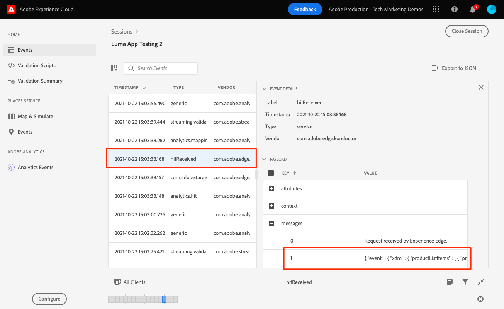

# Analytics 매핑

모바일 데이터를 Adobe Analytics에 매핑하는 방법을 알아봅니다.

다음 [이벤트](events.md) 이전 단원에서 Platform Edge Network로 전송한 데이터는 Adobe Analytics을 포함하여 데이터 스트림에 구성된 서비스로 전달됩니다. 데이터를 보고서 세트의 올바른 변수에 매핑하기만 하면 됩니다.

## 전제 조건

* ExperienceEvent 추적 이해.
* 샘플 앱에서 XDM 데이터를 성공적으로 전송합니다.
* Adobe Analytics에 구성된 데이터 스트림

## 학습 목표

이 단원에서는 다음 작업을 수행합니다.

* Analytics 변수의 자동 매핑을 이해합니다.
* XDM 데이터를 Analytics 변수에 매핑하도록 처리 규칙을 설정합니다.

## 자동 매핑

대부분의 표준 XDM 필드는 Analytics 변수에 자동으로 매핑됩니다. 전체 목록은 [여기](https://experienceleague.adobe.com/docs/experience-platform/edge/data-collection/adobe-analytics/automatically-mapped-vars.html?lang=en)에서 확인하십시오.

### 예 #1 - s.products

좋은 예는 다음과 같습니다 [products 변수](https://experienceleague.adobe.com/docs/analytics/implementation/vars/page-vars/products.html?lang=ko-KR) 는 처리 규칙을 사용하여 채울 수 없습니다. XDM 구현을 통해 productListItems 및 s.products에 필요한 모든 데이터를 전달하면 Analytics 매핑을 통해 자동으로 채워집니다.

이 개체:

```swift
"productListItems": [
    [
      "name":  "Yoga Mat",
      "SKU": "5829",
      "priceTotal": "49.99",
      "quantity": 1
    ],
    [
      "name":  "Water Bottle",
      "SKU": "9841",
      "priceTotal": "30.00",
      "quantity": 3
    ]
]
```

그러면 다음과 같은 결과가 발생합니다.

```
s.products = ";Yoga Mat;1;49.99,;Water Bottle,3,30.00"
```

>[!NOTE]
>
>현재 `productListItems[N].SKU` 은 자동 매핑에서 무시됩니다.

### 예 #2 - scAdd

자세히 살펴보면 모든 이벤트에 두 개의 필드가 있습니다 `value` (필수) 및 `id` (선택 사항). 다음 `value` 필드를 사용하여 이벤트 수를 증가시킵니다. 다음 `id` 필드는 직렬화에 사용됩니다.

이 개체:

```swift
"commerce" : {
  "productListAdds" : {
    "value" : 1
  }
}
```

그러면 다음과 같은 결과가 발생합니다.

```
s.events = "scAdd"
```

이 개체:

```swift
"commerce" : {
  "productListAdds" : {
    "value" : 1,
    "id": "321435"
  }
}
```

그러면 다음과 같은 결과가 발생합니다.

```
s.events = "scAdd:321435"
```

## 보증으로 유효성 검사

사용 [보증 QA 도구](assurance.md) experienceEvent를 전송하고, XDM 데이터가 올바르고, Analytics 매핑이 예상대로 수행되는지 확인할 수 있습니다. 예:

1. productListAdds 이벤트를 보냅니다.

   ```swift
   var xdmData: [String: Any] = [
     "eventType": "commerce.productListAdds",
     "commerce": [
       "productListAdds": [
         "value": 1
       ]
     ],
     "productListItems": [
       [
         "name": "neve studio dance jacket - (blue)",
         "SKU": "test-sku",
         "priceTotal": 69
       ]
     ]
   ]
   let addToCartEvent = ExperienceEvent(xdm: xdmData)
   Edge.sendEvent(experienceEvent: addToCartEvent)
   ```

1. ExperienceEvent 히트를 봅니다.

   

1. JSON의 XDM 부분을 검토합니다.

   ```json
     "xdm" : {
       "productListItems" : [ {
         "priceTotal" : 69,
         "SKU" : "test-sku",
         "name" : "neve studio dance jacket - (blue)"
       } ],
       "timestamp" : "2021-10-22T22:03:37Z",
       "commerce" : {
         "productListAdds" : {
           "value" : 1
         }
       },
       "eventType" : "commerce.productListAdds",
       //...
     }
   ```

1. 를 검토합니다. `analytics.mapping` 이벤트.

   

Analytics 매핑에서 다음을 확인합니다.

* &#39;events&#39;는 `commerce.productListAdds`.
* &#39;pl&#39;(제품 변수)이 `productListItems`.
* 이 이벤트에는 모든 컨텍스트 데이터를 포함한 다른 흥미로운 정보가 있습니다.


## 컨텍스트 데이터를 사용한 매핑

Analytics에 전달된 XDM 데이터는 로 변환됩니다 [컨텍스트 데이터](https://experienceleague.adobe.com/docs/mobile-services/ios/getting-started-ios/proc-rules.html?lang=en) 표준 및 사용자 지정 필드를 모두 포함합니다.

컨텍스트 데이터 키는 다음 구문에 따라 작성됩니다.

```
a.x.[xdm path]
```

예:

```
//Standard Field
a.x.commerce.saveforlaters.value

//Custom Field
a.x._techmarketingdemos.appinformationa.appstatedetails.screenname
```

>[!NOTE]
>
>사용자 지정 필드는 Experience Cloud 조직 식별자 아래에 배치됩니다.
>
>&quot;_techmarketingdemos&quot;가 조직의 고유 값으로 대체됩니다.

다음은 이 데이터를 사용하는 처리 규칙의 모습입니다.


>[!IMPORTANT]
>
>
>자동 매핑된 변수 중 일부를 처리 규칙에서 사용할 수 없을 수 있습니다.
>
>
>처리 규칙에 처음 매핑하면 UI가 XDM 개체의 컨텍스트 데이터 변수를 표시하지 않습니다. 값을 선택하는 문제를 수정하려면 저장 후 다시 편집하십시오. 이제 모든 XDM 변수가 표시됩니다.


처리 규칙 및 컨텍스트 데이터에 대한 추가 정보를 찾을 수 있습니다 [여기](https://experienceleague.adobe.com/docs/analytics-learn/tutorials/implementation/implementation-basics/map-contextdata-variables-into-props-and-evars-with-processing-rules.html?lang=en).

>[!TIP]
>
>이전 모바일 앱 구현과 달리 페이지/화면 보기와 다른 이벤트 간에 차이가 없습니다. 대신 **[!UICONTROL 페이지 보기]** 지표를 설정하여 **[!UICONTROL 페이지 이름]** 차원을 고려합니다. 사용자 지정 항목을 수집 중이므로 `screenName` 자습서의 필드에서는 이 필드를 **[!UICONTROL 페이지 이름]** 를 반환합니다.


다음: **[Experience Platform](platform.md)**

>[!NOTE]
>
>Adobe Experience Platform Mobile SDK에 대한 학습에 시간을 내주셔서 감사합니다. 질문이 있거나 일반 피드백을 공유하거나 향후 컨텐츠에 대한 제안 사항이 있는 경우 해당 정보를 공유하십시오 [Experience League 커뮤니티 토론 게시물](https://experienceleaguecommunities.adobe.com/t5/adobe-experience-platform-launch/tutorial-discussion-implement-adobe-experience-cloud-in-mobile/td-p/443796)