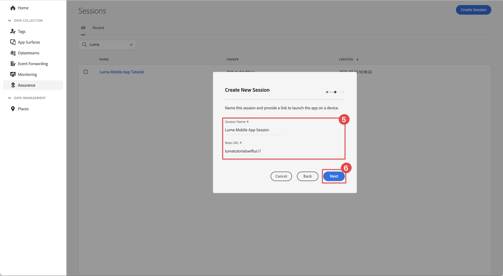
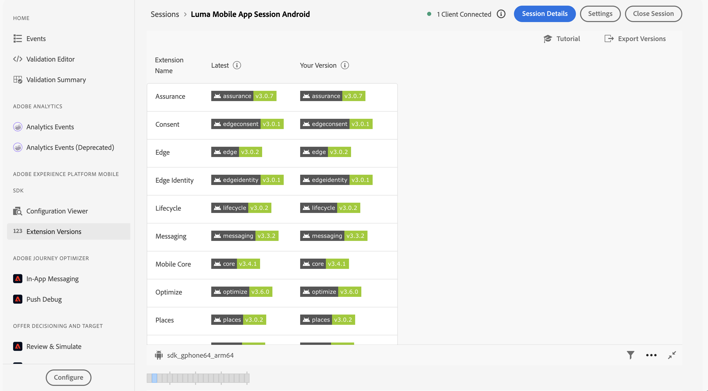

# Assurance 설정

모바일 앱에서 Adobe Experience Platform Assurance을 설정하는 방법을 알아봅니다.

공식적으로 프로젝트 그리폰이라고 하는 Assurance은 모바일 앱에서 데이터를 수집하거나 경험을 제공하는 방법을 검사, 증명, 시뮬레이션 및 확인하는 데 도움이 되도록 설계되었습니다.

Assurance를 통해 Adobe Experience Platform Mobile SDK에서 생성된 원시 SDK 이벤트를 검사할 수 있습니다. SDK에서 수집한 모든 이벤트를 검사할 수 있습니다. SDK 이벤트는 시간별로 정렬된 목록 보기에 로드됩니다. 각 이벤트에는 추가 정보를 제공하는 상세 보기가 있습니다. SDK 구성, 데이터 요소, 공유 상태 및 SDK 확장 버전을 찾아볼 수 있는 추가 보기도 제공됩니다. 제품 설명서에서 [Assurance](https://experienceleague.adobe.com/ko/docs/experience-platform/assurance/home)에 대해 자세히 알아보세요.


## 전제 조건

* SDK를 설치 및 구성한 앱을 설정했습니다.

## 학습 목표

이 단원에서는 다음 작업을 수행합니다.

* 조직에 액세스 권한이 있는지 확인합니다(없는 경우 요청).
* 기본 URL을 설정합니다.
* 필요한 iOS 관련 코드를 추가합니다.
* 세션에 연결합니다.

## 액세스 확인

조직에서 Assurance에 액세스할 수 있는지 확인합니다. 사용자는 Adobe Experience Platform의 프로필에 추가되어 있어야 합니다. 자세한 내용은 Assurance 안내서의 [사용자 액세스](https://experienceleague.adobe.com/en/docs/experience-platform/assurance/user-access)를 참조하십시오.

## 구현

앱에서 Assurance을 구현하려면 다음 작업을 수행하십시오.

>[!BEGINTABS]

>[!TAB iOS]

일반적인 [SDK 설치](install-sdks.md) 외에 iOS에서 앱에 대한 Assurance 세션을 시작하려면 다음 추가 코드가 필요합니다.

1. Xcode의 프로젝트 탐색기에서 **[!DNL Luma]** > **[!DNL Luma]** > **[!UICONTROL SceneDelegate]**(으)로 이동합니다.

1. `func scene(_ scene: UIScene, openURLContexts URLContexts: Set<UIOpenURLContext>`에 다음 코드를 추가합니다.

   ```swift
   // Called when the app in background is opened with a deep link.
   if let deepLinkURL = URLContexts.first?.url {
       // Start the Assurance session
       Assurance.startSession(url: deepLinkURL)
   }
   ```

   이 코드는 앱이 백그라운드에 있고 딥링크를 사용하여 열리면 보증 세션을 시작합니다.

>[!TAB Android]

일반적인 [SDK 설치](install-sdks.md) 외에 Android에서 앱에 대한 Assurance 세션을 시작하려면 다음 추가 코드가 필요합니다.

1. Android Studio의 **[!UICONTROL Android]** 보기에서 **[!UICONTROL 앱]** > **[!UICONTROL kotlin+java]** > **[!UICONTROL com.adobe.luma.tutorial.android]** > **[!UICONTROL LumaApplication]**&#x200B;으로 이동합니다.

1. `fun handleDeeplink(deeplink: String?)`에 다음 코드를 추가합니다.

   ```kotlin
   // Called when the app in background is opened with a deep link.
   if (deeplink.isNullOrEmpty()) {
      Log.w("Luma", "Deeplink is null or empty")
      return
   }
   
   Log.i("Luma", "Handling deeplink: $deeplink")
   Assurance.startSession(deeplink)
   ```

   이 코드는 앱이 백그라운드에 있고 딥링크를 사용하여 열리면 보증 세션을 시작합니다.

>[!ENDTABS]


자세한 내용은 [Assurance API 참조](https://developer.adobe.com/client-sdks/documentation/platform-assurance-sdk/api-reference/){target="_blank"}를 참조하십시오.


## 번들 식별자 정의

앱에 고유한 번들 식별자를 제공해야 합니다.

>[!BEGINTABS]

>[!TAB iOS]

1. Xcode에서 프로젝트를 엽니다.
1. Project 탐색기에서 **[!DNL Luma]**&#x200B;을(를) 선택합니다.
1. **[!DNL Luma]** 대상을 선택하십시오.
1. **서명 및 기능** 탭을 선택합니다.
1. **[!UICONTROL 번들 식별자]**&#x200B;를 정의합니다.

각 번들 식별자가 고유해야 하므로 _unique_ 번들 식별자를 사용하고 `com.adobe.luma.tutorial.swiftui` 번들 식별자를 바꾸십시오. 일반적으로 `com.organization.brand.uniqueidentifier`과(와) 같은 번들 ID 문자열에 역방향 DNS 형식을 사용합니다. 이 자습서의 완성된 버전은 `com.adobe.luma.tutorial.swiftui`을(를) 사용합니다.

{zoomable="yes"}

>[!TAB Android]

1. Android Studio에서 프로젝트를 엽니다.
1. 탐색기에서 **[!UICONTROL build.gradle.kts(모듈 :app)]**&#x200B;을(를) 선택합니다.
1. _unique_ 번들 식별자를 사용하고 `com.adobe.luma.tutorial.android`의 `namespace`에 대한 `android` 값을 바꾸십시오.
1. 동일한 _unique_ 번들 식별자를 사용하고 `com.adobe.luma.tutorial.android`의 `applicationId`에서 `defaultConfig`에 대한 `android`을(를) 바꾸십시오.

일반적으로 `com.organization.brand.uniqueidentifier`과(와) 같은 번들 ID 문자열에 역방향 DNS 형식을 사용합니다. 이 자습서의 완성된 버전은 `com.adobe.luma.tutorial.android`을(를) 사용합니다.

{zoomable="yes"}{zoomable="yes"}

>[!ENDTABS]


## 기본 URL 설정

딥링크가 작동하도록 기본 URL을 설정해야 합니다.

>[!BEGINTABS]

>[!TAB iOS]

1. Xcode에서 프로젝트로 이동합니다.
1. Project 탐색기에서 **[!DNL Luma]**&#x200B;을(를) 선택합니다.
1. **[!DNL Luma]** 대상을 선택하십시오.
1. **정보** 탭을 선택합니다.
1. 기본 URL을 추가하려면 **URL 형식**(으)로 아래로 스크롤하고 **+** 단추를 선택하세요.
1. **Identifier**&#x200B;을(를) 선택한 번들 식별자로 설정하고 **URL 체계**&#x200B;를(를) 선택하십시오.

   {zoomable="yes"}

각 번들 식별자가 고유해야 하므로 _unique_ 번들 식별자를 사용하고 `com.adobe.luma.tutorial.swiftui` 번들 식별자를 바꾸십시오. 일반적으로 `com.organization.brand.uniqueidentifier`과(와) 같은 번들 ID 문자열에 역방향 DNS 형식을 사용합니다. [번들 식별자 정의](#define-bundle-identifier)에서 사용한 것과 동일한 번들 식별자를 사용할 수 있습니다.<br/>마찬가지로 고유한 URL 체계를 사용하고 이미 제공된 `lumatutorialswiftui`을(를) 고유한 URL 체계로 바꾸십시오.

iOS의 URL 체계에 대해 자세히 알아보려면 [Apple의 설명서](https://developer.apple.com/documentation/xcode/defining-a-custom-url-scheme-for-your-app){target="_blank"}를 검토하십시오.

Assurance은 브라우저나 QR 코드를 통해 URL을 열어 작동합니다. 해당 URL은 앱을 열고 추가 매개 변수를 포함하는 기본 URL로 시작합니다. 이러한 고유한 매개 변수는 세션을 연결하는 데 사용됩니다. 예제 앱에서 딥링크는 `lumatutorialswiftui://`입니다.

>[!TAB Android]

1. Android Studio에서 프로젝트의 **[!UICONTROL Android]** 보기로 이동합니다.
1. 네비게이터에서 **[!UICONTROL 앱]** > **[!UICONTROL 매니페스트]** > **[!UICONTROL AndroidManifest.xml]**&#x200B;을(를) 선택합니다.
1. **[!UICONTROL manifest]** > **[!UICONTROL application]** > **[!UICONTROL activity]** XML 요소의 모양이 다음과 같은지 확인합니다.

   ```xml
   <activity
      android:name=".MainActivity"
      android:exported="true"
      android:theme="@style/Theme.LumaAndroid">
      <intent-filter>
            <action android:name="android.intent.action.MAIN" />
            <category android:name="android.intent.category.LAUNCHER" />
      </intent-filter>
      <intent-filter
            android:label="@string/app_name">
            <action android:name="android.intent.action.VIEW" />
            <category android:name="android.intent.category.DEFAULT" />
            <category android:name="android.intent.category.BROWSABLE" />
            <data android:scheme="lumatutorialandroid"
               android:host="default" />
      </intent-filter>
   </activity>
   ```

`android:scheme`을(를) 지정하십시오(예: ). `lumatutorialandroid`)과(와) `android:host`(예: `default`)(으)로 기본 URL을 정의합니다.

Android의 딥링크에 대한 자세한 내용은 [앱 콘텐츠에 대한 딥링크 만들기](https://developer.apple.com/documentation/xcode/defining-a-custom-url-scheme-for-your-app){target="_blank"}를 참조하십시오.

Assurance은 브라우저나 QR 코드를 통해 URL을 열어 작동합니다. 해당 URL은 기본 URL로 시작하며, 기본 URL은 앱을 열고 추가 매개 변수를 포함합니다. 이러한 고유한 매개 변수는 세션을 연결하는 데 사용됩니다.  예제 앱에서 딥링크는 `lumatutorialandroid://default`입니다.

>[!ENDTABS]


## 세션에 연결

이제 Assurance을 사용하여 세션에 연결할 수 있습니다.

>[!BEGINTABS]

>[!TAB iOS]

Xcode에서:

1. 을 사용하여 시뮬레이터 또는 Xcode의 실제 장치에서 앱을 빌드하거나 다시 빌드하고 실행합니다.

   선택적으로, 특히 예기치 않은 결과가 표시될 때 빌드를 *정리*&#x200B;할 수 있습니다. Xcode **[!UICONTROL Product]** 메뉴에서 **[!UICONTROL 빌드 폴더 정리...]**&#x200B;를 선택합니다.


1. **[!UICONTROL Luma 앱에서 사용자의 위치를 사용할 수 있도록 허용]** 대화 상자에서 **[!UICONTROL 앱을 사용하는 동안 허용]**&#x200B;을 선택합니다.

   

1. **[!UICONTROL &quot;Luma 앱&quot;에서 알림을 보내려고 합니다]** 대화 상자에서 **[!UICONTROL 허용]**&#x200B;을 선택합니다.

   

1. 앱에서 활동을 추적할 수 있도록 하려면 **[!UICONTROL 계속...]**&#x200B;을(를) 선택하십시오.

   

1. **[!UICONTROL 다른 회사의 앱과 웹 사이트에서 사용자의 활동을 추적할 수 있도록 &quot;Luma 앱&quot; 허용]** 대화 상자에서 **[!UICONTROL 허용]**&#x200B;을 선택합니다.

   

1. **[!UICONTROL 계속]**&#x200B;을 선택하세요.


브라우저에서:

1. 데이터 수집 UI로 이동합니다.
1. 왼쪽 레일에서 **[!UICONTROL Assurance]**&#x200B;을(를) 선택합니다.
1. **[!UICONTROL 새 세션 만들기]**&#x200B;와 옵션 **[!UICONTROL 딥링크 연결]**&#x200B;을 선택합니다.
1. **[!UICONTROL 시작]**&#x200B;을 선택하세요.
1. **[!UICONTROL 과(와) 같은]**&#x200B;세션 이름`Luma Mobile App Session`과(와) Xcode에 입력한 URL 체계인 **[!UICONTROL 기본 URL]**&#x200B;을(를) 제공한 다음 `://`을(를) 제공하십시오(예: `lumatutorialswiftui://`).
1. **[!UICONTROL 다음]**&#x200B;을 선택합니다.
   {zoomable="yes"}
1. **[!UICONTROL 새 세션 만들기]** 모달 대화 상자에서:

   실제 장치를 사용하는 경우:

   * **[!UICONTROL QR 코드 스캔]**&#x200B;을 선택합니다. 앱을 열려면 실제 장치의 카메라를 사용하여 QR 코드를 스캔하고 링크를 탭합니다.

     {zoomable="yes"}

   시뮬레이터를 사용하는 경우:

   1. **[!UICONTROL 링크 복사]**&#x200B;를 선택합니다.
   1. 를 사용하여 딥링크를 복사하고 딥링크를 사용하여 시뮬레이터에서 Safari가 있는 앱을 엽니다.
      {zoomable="yes"}

1. 앱이 로드되면 7단계에 표시된 PIN을 입력하라는 모달 대화 상자가 표시됩니다.

   

   PIN을 입력하고 **[!UICONTROL 연결]**&#x200B;을 선택하세요.


1. 연결에 성공하면 다음을 볼 수 있습니다.
   * 앱 위에 떠 있는 Assurance 아이콘.

     

   * Assurance UI에서 제공되는 Experience Cloud 업데이트는 다음을 표시합니다.

      1. 앱에서 들어오는 경험 이벤트.
      1. 선택한 이벤트에 대한 세부 정보.
      1. 장치 및 타임라인.

         {zoomable="yes"}

1. 홈 화면으로 이동하려면 **[!UICONTROL 계속]**&#x200B;을 선택합니다.

>[!TAB Android]

Android Studio에서:

1. 을 사용하여 시뮬레이터 또는 Android Studio의 실제 장치에서 앱을 빌드하거나 다시 빌드하고 실행합니다.

   선택적으로, 특히 예기치 않은 결과가 표시될 때 빌드를 *정리*&#x200B;할 수 있습니다. Android Studio **[!UICONTROL 빌드]** 메뉴에서 **[!UICONTROL 프로젝트 정리]**&#x200B;를 선택합니다.


1. **[!UICONTROL Luma Android에서 알림을 보내도록 허용]** 대화 상자에서 **[!UICONTROL 허용]**&#x200B;을 선택합니다.

   

1. **[!UICONTROL 권한 대화 상자 표시]**&#x200B;를 선택합니다.

   

1. **[!UICONTROL Luma Android에서 이 장치의 위치에 액세스할 수 있도록 허용하시겠습니까?]**...

   

   * **[!UICONTROL 정확한]**&#x200B;을(를) 선택하십시오.
   * **[!UICONTROL 앱을 사용하는 동안]**&#x200B;을(를) 선택합니다.

1. 소개 앱 화면으로 돌아가서 **[!UICONTROL 장치 설정 열기]**&#x200B;를 선택합니다.

1. **[!UICONTROL 위치 권한]** 화면에서 **[!UICONTROL 항상 허용]**&#x200B;을 선택합니다. **[!UICONTROL ←]**&#x200B;을(를) 선택하여 소개 앱 화면으로 돌아갑니다.

   

1. 홈 화면으로 이동하려면 **[!UICONTROL 계속]**&#x200B;을 선택합니다.


브라우저에서:

1. 데이터 수집 UI로 이동합니다.
1. 왼쪽 레일에서 **[!UICONTROL Assurance]**&#x200B;을(를) 선택합니다.
1. **[!UICONTROL 새 세션 만들기]**&#x200B;와 옵션 **[!UICONTROL 딥링크 연결]**&#x200B;을 선택합니다.
1. **[!UICONTROL 시작]**&#x200B;을 선택하세요.
1. **[!UICONTROL 과(와) 같은]**&#x200B;세션 이름`Luma Mobile App Session`과(와) Android Studio의 **[!UICONTROL AndroidManifest.xml]**&#x200B;에서 정의한 `android:scheme` 및 `android:host`인 **[!UICONTROL 기본 URL]**&#x200B;을(를) `://`(으)로 구분하여 제공하십시오. 예: `lumatutorialandroid://default`
1. **[!UICONTROL 다음]**&#x200B;을 선택합니다.
   {zoomable="yes"}

1. **[!UICONTROL 새 세션 만들기]** 모달 대화 상자에서:

   실제 장치를 사용하는 경우:

   * **[!UICONTROL QR 코드 스캔]**&#x200B;을 선택합니다. 앱을 열려면 실제 장치의 카메라를 사용하여 QR 코드를 스캔하고 링크를 탭합니다.

     {zoomable="yes"}

   시뮬레이터를 사용하는 경우:

   1. **[!UICONTROL 링크 복사]**&#x200B;를 선택합니다.
   1. 를 사용하여 딥링크를 복사하고 딥링크를 사용하여 시뮬레이터에서 Chrome이 있는 앱을 엽니다.

   {zoomable="yes"}

   Chrome에서 **Luma Android으로 계속**&#x200B;하라는 메시지가 표시되면 **계속**&#x200B;을 선택합니다.

1. 앱이 로드되면 7단계에 표시된 PIN을 입력하라는 모달 대화 상자가 표시됩니다.

   

   PIN을 입력하고 **[!UICONTROL 연결]**&#x200B;을 선택하세요.


1. 연결에 성공하면 다음을 볼 수 있습니다.
   * 앱 위에 떠 있는 Assurance 아이콘.

     

   * Assurance UI에서 제공되는 Experience Cloud 업데이트는 다음을 표시합니다.

      1. 앱에서 들어오는 경험 이벤트.
      1. 선택한 이벤트에 대한 세부 정보.
      1. 장치 및 타임라인.

         {zoomable="yes"}

>[!ENDTABS]

문제가 발생하면 [기술](https://developer.adobe.com/client-sdks/documentation/platform-assurance-sdk/){target="_blank"} 및 [일반 설명서](https://experienceleague.adobe.com/ko/docs/experience-platform/assurance/home){target="_blank"}를 검토하세요.


## 확장 확인

앱에서 최신 확장을 사용하는지 확인하려면:

1. **[!UICONTROL 구성]**&#x200B;을 선택합니다.

1.  에 대해 **[!UICONTROL 추가]**&#x200B;를 선택하십시오.

1. **[!UICONTROL 저장]**&#x200B;을 선택합니다.

   {zoomable="yes"}

1.  **[!UICONTROL 확장 버전]**&#x200B;을 선택하여 사용 가능한 최신 확장과 앱 버전에서 사용되는 확장에 대한 개요를 확인하세요.

>[!BEGINTABS]

>[!TAB iOS]

{zoomable="yes"}

확장 버전(예: **[!UICONTROL 메시징]** 및 **[!UICONTROL 최적화]**)을 업데이트하려면 **[!UICONTROL 패키지 종속성]**(예: **[!UICONTROL AEPMessaging]**)에서 패키지(확장)를 선택하고 컨텍스트 메뉴에서 **[!UICONTROL 패키지 업데이트]**&#x200B;를 선택합니다. Xcode는 패키지 종속성을 업데이트합니다.

>[!TAB Android]

{zoomable="yes"}

오래된 확장이 표시되면 프로젝트에 대한 종속성 모듈을 업데이트하는 방법에 대한 [Android Studio 설명서](https://developer.android.com/build/agp-upgrade-assistant)를 참조하세요.


>[!ENDTABS]

>[!NOTE]
>
>개발 환경에서 확장(패키지)을 업데이트했다면 현재 세션을 닫았다가 삭제하고 [세션에 연결](#connecting-to-a-session) 및 [확장 확인](#verify-extensions)의 모든 단계를 반복하여 Assurance이 새 Assurance 세션에서 올바른 확장을 제대로 보고하는지 확인하십시오.
>


>[!SUCCESS]
>
>이제 자습서의 나머지 부분에서 Assurance을 사용하도록 앱을 설정했습니다.
>
>Adobe Experience Platform Mobile SDK에 대해 학습하는 데 시간을 투자해 주셔서 감사합니다. 질문이 있거나 일반적인 피드백을 공유하고 싶거나 향후 콘텐츠에 대한 제안이 있는 경우 이 [Experience League 커뮤니티 토론 게시물](https://experienceleaguecommunities.adobe.com/t5/adobe-experience-platform-data/tutorial-discussion-implement-adobe-experience-cloud-in-mobile/td-p/443796)에서 공유하십시오.


다음: **[동의 구현](consent.md)**
