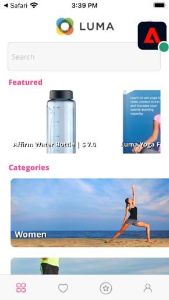

# 보증

모바일 앱에서 Adobe Experience Platform Assurance를 설정하는 방법을 알아봅니다.

공식적으로 Project Griffon이라고 하는 Assurance는 모바일 앱에서 데이터를 수집하거나 경험을 제공하는 방법을 검사, 증명, 시뮬레이션 및 확인하는 데 도움이 되도록 설계되었습니다.

보증은 Adobe Experience Platform Mobile SDK에서 생성한 원시 SDK 이벤트를 검사하는 데 도움이 됩니다. SDK에서 수집한 모든 이벤트를 검사할 수 있습니다. SDK 이벤트는 시간별로 정렬된 목록 보기에 로드됩니다. 각 이벤트에는 세부 사항을 제공하는 세부 보기가 있습니다. SDK 구성, 데이터 요소, 공유 상태 및 SDK 확장 버전을 검색할 수 있는 추가 보기가 제공됩니다. 추가 정보 [보증](https://aep-sdks.gitbook.io/docs/foundation-extensions/adobe-experience-platform-assurance) 를 참조하십시오.


## 전제 조건

* SDK가 설치 및 구성된 샘플 앱을 성공적으로 빌드하고 실행합니다.

## 학습 목표

이 단원에서는 다음 작업을 수행합니다.

* 조직에 액세스 권한이 있는지 확인합니다(그리고 액세스 권한이 없는 경우 요청).
* 기본 URL을 설정합니다.
* 필요한 iOS 특정 코드를 추가합니다.
* 세션에 연결합니다.

## 액세스 확인

다음 단계를 완료하여 조직에서 보증에 액세스할 수 있는지 확인합니다.

1. 방문 [https://experience.adobe.com/griffon](https://experience.adobe.com/griffon){target=&quot;_blank&quot;}
1. Experience Cloud에 대한 Adobe ID 자격 증명을 사용하여 로그인합니다.
1. 을(를) 통해 **[!UICONTROL 세션]** 화면, 액세스 권한. 베타 액세스 페이지로 이동한 경우 **[!UICONTROL 등록]**.

## 구현

일반 [SDK 설치](install-sdks.md) 이전 단원에서 완료했지만 iOS에는 다음과 같은 추가 기능이 필요합니다. 다음 코드를 `AppDelegate.swift` 파일에 추가합니다.

```swift
func application(_ app: UIApplication, open url: URL, options: [UIApplication.OpenURLOptionsKey: Any] = [:]) -> Bool {
    Assurance.startSession(url: url)
    return true
}
```

이 자습서에 제공된 샘플 Luma는 iOS 12.0을 사용합니다. iOS 13 이상을 사용하여 고유한 장면 기반 애플리케이션과 함께 따라가고 있는 경우, `UISceneDelegate's scene(_:openURLContexts:)` 방법은 다음과 같습니다.

```swift
func scene(_ scene: UIScene, openURLContexts URLContexts: Set<UIOpenURLContext>) {
    // Called when the app in background is opened with a deep link.
    if let deepLinkURL = URLContexts.first?.url {
        Assurance.startSession(url: deepLinkURL)
    }
}
```

자세한 내용 [여기](https://aep-sdks.gitbook.io/docs/foundation-extensions/adobe-experience-platform-assurance#implement-aep-assurance-session-start-apis-ios-only){target=&quot;_blank&quot;}.

## 기본 URL 설정

1. XCode를 열고 프로젝트 이름을 선택합니다.
1. 로 이동합니다 **정보** 탭.
1. 아래로 스크롤하여 **URL 유형** 을(를) 선택하고 을(를) 선택합니다. **+** 단추를 눌러 새 단추를 추가합니다.
1. 설정 **식별자** 및 **URL 체계** 를 &quot;lumadeplink&quot;로 가리키도록 업데이트하는 것이 좋습니다.
1. 앱을 빌드하고 실행합니다.


iOS의 URL 구성표에 대한 자세한 내용은 [Apple 설명서](https://developer.apple.com/documentation/xcode/defining-a-custom-url-scheme-for-your-app){target=&quot;_blank&quot;}.

보증은 브라우저나 QR 코드를 통해 URL을 열면 작동합니다. 해당 URL은 앱을 열고 추가 매개 변수를 포함하는 기본 URL로 시작됩니다. 이러한 고유한 매개 변수는 세션을 연결하는 데 사용됩니다.

## 세션에 연결

1. 로 이동합니다 [보증 UI](https://experience.adobe.com/griffon){target=&quot;_blank&quot;}.
1. 선택 **[!UICONTROL 세션 만들기]**.
1. 제공 **[!UICONTROL 세션 이름]** 예 `Luma App QA` 그리고 **[!UICONTROL 기본 URL]** `lumadeeplink://default`
1. **[!UICONTROL 다음]**을 선택합니다.
   
1. **[!UICONTROL QR 코드 검사]** 물리적 장치를 사용하는 경우 시뮬레이터를 사용하고 있다면 **[!UICONTROL 링크 복사]** 시뮬레이터에서 Safari를 사용하여 엽니다.
   
1. 앱이 로드되면 이전 단계에서 PIN을 입력하라는 모달이 표시됩니다.
   
1. 연결에 성공하면 Assurance 웹 UI에 이벤트가 표시되고 앱에 부동 Assurance 아이콘이 표시됩니다.
   * 보증 아이콘 플로팅.
      
   * 웹 UI에서 수신되는 Experience Cloud 이벤트.
      

문제가 발생하는 경우 [기술](https://aep-sdks.gitbook.io/docs/foundation-extensions/adobe-experience-platform-assurance){target=&quot;_blank&quot;} 및 [일반 설명서](https://aep-sdks.gitbook.io/docs/beta/project-griffon){target=&quot;_blank&quot;}.

다음: **[동의](consent.md)**

>[!NOTE]
>
>Adobe Experience Platform Mobile SDK에 대한 학습에 시간을 내주셔서 감사합니다. 질문이 있거나 일반 피드백을 공유하거나 향후 컨텐츠에 대한 제안 사항이 있는 경우 해당 정보를 공유하십시오 [Experience League 커뮤니티 토론 게시물](https://experienceleaguecommunities.adobe.com/t5/adobe-experience-platform-launch/tutorial-discussion-implement-adobe-experience-cloud-in-mobile/td-p/443796)