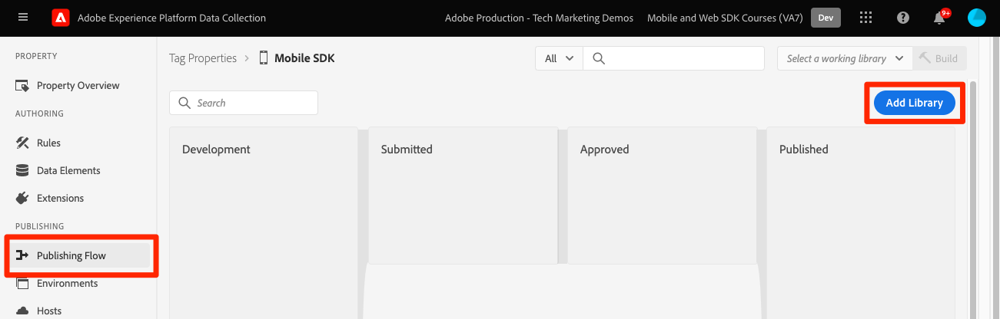

# 태그 속성 구성

에서 태그 속성을 구성하는 방법을 알아봅니다 [!UICONTROL 데이터 수집] 인터페이스.

Adobe Experience Platform의 태그는 Adobe의 차세대 태그 관리 기능입니다. 태그를 통해 관련 고객 경험을 강화하는 데 필요한 모든 분석, 마케팅 및 광고 태그를 고 관리하는 간단한 방법을 고객에게 제공합니다. 자세히 알아보기 [태그](https://experienceleague.adobe.com/docs/experience-platform/tags/home.html) 를 참조하십시오.

## 사전 요구 사항

단원을 완료하려면 태그 속성을 만들 수 있는 권한이 있어야 합니다. 또한 태그에 대한 기준선 이해를 하도록 하는 것이 도움이 됩니다.

>[!NOTE]
>
> 이제 platform launch(클라이언트측)이 [태그](https://experienceleague.adobe.com/docs/experience-platform/tags/home.html?lang=ko-KR)

## 학습 목표

이 단원에서는 다음 작업을 수행합니다.

* 모바일 태그 확장을 설치하고 구성합니다.
* SDK 설치 지침을 생성합니다.

## 초기 설정

1. 새 모바일 태그 속성을 만듭니다.
   1. 다음에서 [데이터 수집 인터페이스](https://experience.adobe.com/data-collection/){target="_blank"}, 선택 **[!UICONTROL 태그]** 왼쪽 탐색
   1. **[!UICONTROL 새 속성]**을 선택합니다
      .
   1. 의 경우 **[!UICONTROL 이름]**, 입력 `Mobile SDK Course`.
   1. 의 경우 **[!UICONTROL 플랫폼]**, 선택 **[!UICONTROL 모바일]**.
   1. **[!UICONTROL 저장]**&#x200B;을 선택합니다.

      

      >[!NOTE]
      >
      > 이 자습서에서 수행하는 것과 같은 Edge 기반 Mobile SDK 구현에 대한 기본 동의 설정은 [!UICONTROL 동의 확장] 및 이 아님 [!UICONTROL 개인 정보 보호] 를 태그 속성 구성에서 설정합니다. 이 단원의 뒷부분에서 동의 확장을 추가하고 구성합니다. 자세한 내용은 [설명서](https://developer.adobe.com/client-sdks/documentation/privacy-and-gdpr/).

1. 새 속성 열기
1. 라이브러리 만들기:

   1. 다음으로 이동 **[!UICONTROL 게시 플로우]** 왼쪽 탐색.
   1. 선택 **[!UICONTROL 라이브러리 추가]**.

      

   1. 의 경우 **[!UICONTROL 이름]**, 입력 `Initial Build`.
   1. 의 경우 **[!UICONTROL 환경]**, 선택 **[!UICONTROL 개발]**.
   1. 선택  **[!UICONTROL 변경된 모든 리소스 추가]**.
   1. 선택 **[!UICONTROL 개발에 저장 및 구축]**.

      

   1. 마지막으로, (으)로 설정합니다. **[!UICONTROL 작업 라이브러리]**.
      
1. 선택 **[!UICONTROL 확장]**.

   Mobile Core 및 Profile 확장을 미리 설치해야 합니다.

1. 선택 **[!UICONTROL 카탈로그]**.

   

1. 사용 [!UICONTROL 검색] 다음 확장을 찾아 설치하는 기능입니다. 이러한 확장 모두 구성이 필요하지 않습니다.
   * 신원
   * AEP 보증

## 확장 구성

1. 설치 **동의** 확장명.

   이 자습서에서는 다음을 선택하십시오. **[!UICONTROL 보류 중]**. 에서 동의 확장에 대해 자세히 알아보기 [설명서](https://developer.adobe.com/client-sdks/documentation/consent-for-edge-network/).

   

1. 설치 **Adobe Experience Platform 에지 네트워크** 확장명.

   다음에서 **[!UICONTROL Edge 구성]** 드롭다운에서 만든 데이터 스트림을 [이전 단계](create-datastream.md).

1. 선택 **[!UICONTROL 라이브러리 및 빌드에 저장]**.

   

## SDK 설치 지침 생성

1. 선택 **[!UICONTROL 환경]**.

1. 다음 항목 선택 **[!UICONTROL 개발]** install 아이콘.

   

1. 선택 **[!UICONTROL iOS]**.

1. 선택 **[!UICONTROL Swift]**.

   

1. 설치 지침은 구현을 위한 좋은 시작점을 제공합니다.

   추가 정보를 찾을 수 있습니다 [여기](https://developer.adobe.com/client-sdks/documentation/getting-started/get-the-sdk/).

   * **[!UICONTROL 환경 파일 ID]**: 이 고유 ID는 개발 환경을 가리킵니다. 이 값을 적어 두십시오. 프로덕션/스테이징/개발의 ID 값은 모두 다릅니다.
   * **[!UICONTROL Podfile]**: CocoaPod는 SDK 버전 및 다운로드를 관리하는 데 사용됩니다. 자세한 내용은 다음을 참조하십시오. [설명서](https://cocoapods.org/).
   * **[!UICONTROL 초기화 코드]**: 이 코드 블록은 시작 시 필요한 SDK를 가져오고 확장을 등록하는 방법을 보여 줍니다.

>[!NOTE]
>설치 지침은 시작점으로 간주되어야 하며 명확한 설명서는 아닙니다. 최신 SDK 버전 및 코드 샘플은 [설명서](https://developer.adobe.com/client-sdks/documentation/).

## 모바일 태그 아키텍처

웹 버전의 태그(이전의 Launch)에 익숙하다면 모바일에서의 차이점을 이해하는 것이 중요합니다.

웹에서 태그 속성은 JavaScript로 렌더링되고, 그러면 일반적으로 클라우드에서 호스팅됩니다. 해당 JS 파일은 웹 사이트에서 직접 참조됩니다.

모바일 태그 속성에서 규칙 및 구성은 클라우드에서 호스팅되는 JSON 파일로 렌더링됩니다. JSON 파일은 모바일 앱의 Mobile Core 확장에 의해 다운로드되고 읽혀집니다. 확장은 함께 작동하는 별도의 SDK입니다. 태그 속성에 확장을 추가하는 경우 앱도 업데이트해야 합니다. 확장 설정을 변경하거나 규칙을 만드는 경우 업데이트된 태그 라이브러리를 게시하면 해당 변경 사항이 앱에 반영됩니다.

다음: **[SDK 설치](install-sdks.md)**

>[!NOTE]
>
>Adobe Experience Platform Mobile SDK에 대해 학습하는 데 시간을 투자해 주셔서 감사합니다. 질문이 있거나, 일반적인 피드백을 공유하거나, 향후 콘텐츠에 대한 제안이 있는 경우 이에 대해 공유하십시오. [Experience League 커뮤니티 토론 게시물](https://experienceleaguecommunities.adobe.com/t5/adobe-experience-platform-launch/tutorial-discussion-implement-adobe-experience-cloud-in-mobile/td-p/443796)