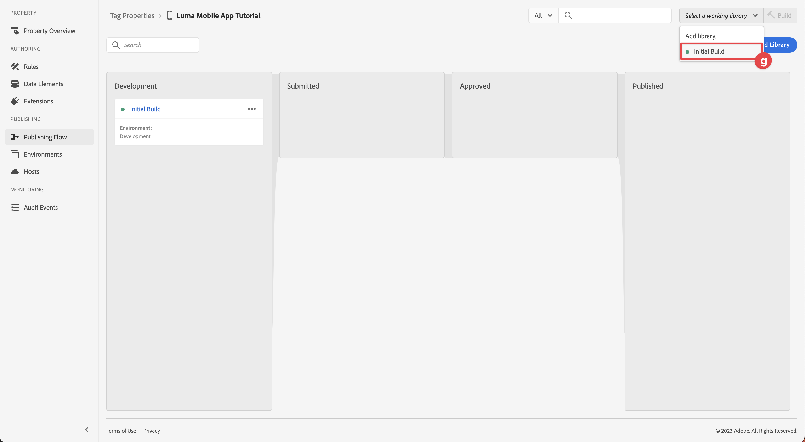

# 태그 속성 구성

[!UICONTROL 데이터 수집] 인터페이스에서 태그 속성을 구성하는 방법에 대해 알아봅니다.

Adobe Experience Platform의 태그는 Adobe의 차세대 태그 관리 기능입니다. 태그는 관련 고객 환경을 향상하는 데 필요한 분석, 마케팅 및 광고 태그를 배포하고 관리하는 간단한 방법을 고객에게 제공합니다. 제품 설명서에서 [태그](https://experienceleague.adobe.com/en/docs/experience-platform/tags/home)에 대해 자세히 알아보세요.

## 전제 조건

단원을 완료하려면 태그 속성을 만들 수 있는 권한이 있어야 합니다. 또한 태그에 대한 기준선 이해를 하도록 하는 것이 도움이 됩니다.

>[!NOTE]
>
> 이제 Platform Launch(Client Side)가 [태그](https://experienceleague.adobe.com/en/docs/experience-platform/tags/home)입니다.

## 학습 목표

이 단원에서는 다음 작업을 수행합니다.

* 모바일 태그 확장을 설치하고 구성합니다.
* SDK 설치 지침을 생성합니다.

## 초기 설정

1. 데이터 수집 인터페이스에서 새 모바일 태그 속성을 만듭니다.
   1. 왼쪽 탐색에서 **[!UICONTROL 태그]**&#x200B;를 선택합니다.
   1. **[!UICONTROL 새 속성]** 선택
      {zoomable="yes"}.
   1. **[!UICONTROL Name]**&#x200B;에 대해 `Luma Mobile App Tutorial`을(를) 입력하십시오.
   1. **[!UICONTROL 플랫폼]**&#x200B;에 대해 **[!UICONTROL 모바일]**&#x200B;을 선택하세요.
   1. **[!UICONTROL 저장]**&#x200B;을 선택합니다.

      {zoomable="yes"}

      >[!NOTE]
      >
      > 이 단원에서 수행하는 것과 같은 Edge 기반 Mobile SDK 구현에 대한 기본 동의 설정은 태그 속성 구성의 [!UICONTROL 개인 정보] 설정이 아니라 [!UICONTROL 동의 확장]에서 가져옵니다. 이 단원의 뒷부분에서 동의 확장을 추가하고 구성합니다. 자세한 내용은 [설명서](https://developer.adobe.com/client-sdks/edge/consent-for-edge-network/)를 참조하세요.

1. 새 속성을 엽니다.
1. 라이브러리 만들기:

   1. 왼쪽 탐색에서 **[!UICONTROL 게시 흐름]**(으)로 이동합니다.
   1. **[!UICONTROL 라이브러리 추가]**&#x200B;를 선택합니다.

      {zoomable="yes"}

   1. **[!UICONTROL Name]**&#x200B;에 대해 `Initial Build`을(를) 입력하십시오.
   1. **[!UICONTROL 환경]**&#x200B;에 대해 **[!UICONTROL 개발(개발)]**&#x200B;을 선택하세요.
   1.  **[!UICONTROL 변경된 모든 리소스 추가]**&#x200B;를 선택합니다.
   1. **[!UICONTROL 개발에 저장 및 빌드]**&#x200B;를 선택합니다.

      {zoomable="yes"}

   1. 마지막으로 **[!UICONTROL 작업 라이브러리 선택]** 메뉴에서 **[!UICONTROL 초기 빌드]**&#x200B;를 작업 라이브러리로 선택합니다.
      {zoomable="yes"}
1. 확장 확인:

   1. **[!UICONTROL 초기 빌드]**&#x200B;가 기본 라이브러리로 선택되었는지 확인하십시오.

   1. 왼쪽 레일에서 **[!UICONTROL 확장]**&#x200B;을 선택합니다.

   1. **[!UICONTROL 설치됨]** 탭을 선택합니다.

      [!UICONTROL Mobile Core] 및 [!UICONTROL Profile] 확장을 미리 설치해야 합니다.

      {zoomable="yes"}

## 확장 구성

1. 모바일 앱 속성 내에서 **[!UICONTROL 확장]**&#x200B;에 있는지 확인하십시오.

1. **[!UICONTROL 카탈로그]**&#x200B;를 선택하십시오.

   {zoomable="yes"}

1.  **[!UICONTROL 검색]** 필드를 사용하여 **ID** 확장을 찾습니다.

   1. `Identity` 검색

   2. **[!UICONTROL ID]** 확장을 선택하십시오.

   3. **[!UICONTROL 설치]**&#x200B;를 선택합니다.

      {zoomable="yes"}

   이 확장은 추가 구성이 필요하지 않습니다.

1.  **[!UICONTROL 검색]** 필드를 사용하여 **AEP Assurance** 확장을 찾아 설치합니다.

   이 확장은 추가 구성이 필요하지 않습니다.

1.  **[!UICONTROL 검색]** 필드를 사용하여 **동의** 확장을 찾아 설치합니다. 구성 화면에서 다음을 수행합니다.

   1. **[!UICONTROL 보류 중]**&#x200B;을 선택합니다. 이 자습서에서는 애플리케이션에서 추가로 동의를 관리합니다. [설명서](https://developer.adobe.com/client-sdks/documentation/consent-for-edge-network/)에서 동의 확장에 대해 자세히 알아보세요.
   1. **[!UICONTROL 라이브러리에 저장]**&#x200B;을 선택합니다.

      {zoomable="yes"}

1.  **[!UICONTROL 검색]** 필드를 사용하여 **Adobe Experience Platform Edge Network** 확장을 찾아 설치합니다.

   1. **[!UICONTROL 데이터스트림]**&#x200B;에서 각 환경(예: **[!UICONTROL )에 대해]**&#x200B;이전 단계[에서 만든 ](create-datastream.md)데이터스트림&#x200B;**[!DNL Luma Mobile App]**&#x200B;을(를) 선택합니다.

   1. 아직 채우지 않은 경우 **[!UICONTROL 도메인 구성]** 내에서 **[!UICONTROL Edge Network 도메인]**&#x200B;을 지정하십시오. Edge Network 도메인은 조직의 이름이며 `data.adobedc.net`(예: `techmarketingdemos.data.adobedc.net`)이 옵니다.

   1. **[!UICONTROL 라이브러리에 저장]** 메뉴에서 **[!UICONTROL 라이브러리 및 빌드에 저장]**&#x200B;을 선택합니다.

      {zoomable="yes"}

라이브러리는 새로운 확장 및 구성을 위해 빌드되었습니다. ●초기 빌드&#x200B;**[!UICONTROL 단추의]**&#x200B;이(가) 빌드에 성공했음을 나타냅니다.

## SDK 설치 지침 생성

태그는 앱에 Adobe Experience Platform Mobile SDK을 설치하는 지침 및 코드 조각을 제공합니다.

>[!BEGINTABS]

>[!TAB iOS]

1. 왼쪽 레일에서 **[!UICONTROL 환경]**&#x200B;을 선택합니다.

1. **[!UICONTROL 개발]** 설치 아이콘  을 선택합니다.

   {zoomable="yes"}

1. **[!UICONTROL 모바일 설치 지침]** 대화 상자에서 **[!UICONTROL iOS]** 탭을 선택합니다.

1. CocoaPod를 사용하여 프로젝트를 설정하는 지침을 할 수 있습니다. CocoaPod는 SDK 버전 및 다운로드를 관리하는 데 사용됩니다. 자세한 내용은 [CocoaPod 설명서](https://cocoapods.org/)를 참조하십시오.

   [설치 지침](https://developer.adobe.com/client-sdks/documentation/getting-started/get-the-sdk/)을 통해 구현을 시작할 수 있습니다.

   이 자습서의 나머지 부분에서 CocoaPods 지침을 사용하여 **not**&#x200B;합니다. 대신 기본 SPM(Swift Package Manager) 기반 설정을 사용합니다.

1. **[!UICONTROL 초기화 코드 추가]** 아래에서 **[!UICONTROL Swift]** 탭을 선택하십시오. 이 코드 블록은 launch에서 필요한 SDK를 가져오고 확장을 등록하는 방법을 보여 줍니다. 이 가져오기 및 등록에 대한 자세한 내용은 [SDK 설치](install-sdks.md)를 참조하십시오.

1. 를 **[!UICONTROL 복사]**&#x200B;하고 나중에 필요한 위치에 저장합니다. 이 고유 ID는 개발 환경을 가리킵니다. 각 환경(프로덕션, 스테이징, 개발)에는 고유한 ID 값이 있습니다.

   {zoomable="yes"}

>[!TAB Android]

1. 왼쪽 레일에서 **[!UICONTROL 환경]**&#x200B;을 선택합니다.
1. **[!UICONTROL 개발]** 설치 아이콘  을 선택합니다.

   {zoomable="yes"}

1. **[!UICONTROL 모바일 설치 지침]** 대화 상자에서 **[!UICONTROL Android]** 탭을 선택합니다.
1. Gradle을 사용하여 프로젝트를 설정하는 지침을 할 수 있습니다. Gradle은 SDK 버전 및 다운로드를 관리하는 데 사용됩니다. 자세한 내용은 [Gradle 설명서](https://gradle.org/)를 참조하십시오.

   [설치 지침](https://developer.adobe.com/client-sdks/documentation/getting-started/get-the-sdk/)을 통해 구현을 시작할 수 있습니다.

1. 이 코드 블록은 launch에서 필요한 SDK를 가져오고 확장을 등록하는 방법을 보여 줍니다. 이 가져오기 및 등록에 대한 자세한 내용은 [SDK 설치](install-sdks.md)를 참조하십시오.

1. 를 **[!UICONTROL 복사]**&#x200B;하고 나중에 필요한 위치에 저장합니다. 이 고유 ID는 개발 환경을 가리킵니다. 각 환경(프로덕션, 스테이징, 개발)에는 고유한 ID 값이 있습니다.

   {zoomable="yes"}

>[!ENDTABS]

>[!NOTE]
>
>설치 지침은 시작점으로 간주되어야 하며 명확한 설명서는 아닙니다. 최신 SDK 버전 및 코드 샘플은 공식 [설명서](https://developer.adobe.com/client-sdks/home/)에서 찾을 수 있습니다.

## 모바일 태그 아키텍처

웹 버전의 태그(이전의 Launch)에 익숙하다면 모바일에서의 차이점을 이해하는 것이 중요합니다.

* 웹에서 태그 속성은 JavaScript으로 렌더링되고, 그러면 (일반적으로) 클라우드에서 호스팅됩니다. 해당 JavaScript 파일은 웹 사이트에서 직접 참조됩니다.

* 모바일 태그 속성에서 규칙 및 구성은 클라우드에서 호스팅되는 JSON 파일로 렌더링됩니다. JSON 파일은 모바일 앱의 Mobile Core 확장에 의해 다운로드되고 읽혀집니다. 확장은 함께 작동하는 별도의 SDK입니다. 태그 속성에 확장을 추가하는 경우 앱도 업데이트해야 합니다. 확장 설정을 변경하거나 규칙을 만드는 경우 업데이트된 태그 라이브러리를 게시하면 해당 변경 사항이 앱에 반영됩니다. 이러한 유연성을 통해 설정(예: Adobe Analytics 보고서 세트 ID)을 수정할 수 있습니다. 또는 앱에서 코드를 변경하여 앱스토어에 다시 제출하지 않고도 앱의 동작(이후 단원에서 볼 수 있듯이 데이터 요소와 규칙을 사용하여)을 변경할 수도 있습니다.

>[!SUCCESS]
>
>이제 이 자습서의 나머지 부분에서 사용할 모바일 태그 속성이 있습니다.
>
>Adobe Experience Platform Mobile SDK에 대해 학습하는 데 시간을 투자해 주셔서 감사합니다. 질문이 있거나 일반적인 피드백을 공유하고 싶거나 향후 콘텐츠에 대한 제안이 있는 경우 이 [Experience League 커뮤니티 토론 게시물](https://experienceleaguecommunities.adobe.com/t5/adobe-experience-platform-data/tutorial-discussion-implement-adobe-experience-cloud-in-mobile/td-p/443796)에서 공유하십시오.

다음: **[SDK 설치](install-sdks.md)**
