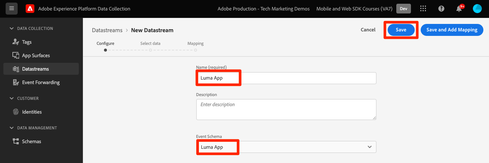

# 데이터 스트림 만들기

Experience Platform에서 데이터 스트림을 만드는 방법을 알아봅니다.

데이터 스트림은 Platform Edge 네트워크의 서버측 구성입니다.  데이터 스트림은 Platform Edge 네트워크로 들어오는 데이터가 Adobe Experience Cloud 애플리케이션 및 서비스로 적절하게 라우팅되도록 합니다. 자세한 내용은 [설명서](https://experienceleague.adobe.com/docs/experience-platform/edge/fundamentals/datastreams.html) 또는 [비디오](https://experienceleague.adobe.com/docs/platform-learn/data-collection/edge-network/configure-datastreams.html?lang=ko).

## 전제 조건

데이터 스트림을 만들려면 데이터 수집 인터페이스에서 조직에 이 기능(이전의 )에 대해 프로비저닝되어 있어야 합니다 [!UICONTROL Launch])에 대한 사용자 권한이 있어야 합니다. [!UICONTROL Experience Platform] > [!UICONTROL 데이터 수집] > **[!UICONTROL 데이터 스트림 관리]** 및 **[!UICONTROL 데이터 스트림 보기]**.

## 학습 목표

이 단원에서는 다음 작업을 수행합니다.

* 데이터 스트림을 사용할 시기를 알아봅니다.
* 데이터 스트림을 만듭니다.
* 데이터 스트림을 구성합니다.

## 데이터 스트림 만들기

데이터 저장소는 [!UICONTROL 데이터 수집] 인터페이스 사용 [!UICONTROL 데이터 스트림] 구성 도구. 데이터 스트림을 만들려면 다음을 수행하십시오.

1. 올바른 Platform 샌드박스를 사용하고 있는지 확인하십시오.
1. 선택 **[!UICONTROL 새 데이터 스트림]**.

   

1. 예를 들어 이름을 입력합니다 `Luma App`.
1. 이전 단원에서 만든 스키마를 선택합니다.
1. **[!UICONTROL 저장]**&#x200B;을 선택합니다.

   

## 서비스 추가

그런 다음 Experience Cloud 서비스를 데이터 스트림에 연결할 수 있습니다. Platform Mobile SDK가 Edge Network에 데이터를 전송하면 데이터 스트림이 데이터를 다음 서비스로 보냅니다.

1. 추가 **[!UICONTROL Adobe Analytics]** 보고서 세트를 제공합니다.

1. 활성화 **[!UICONTROL Adobe Audience Manager]** (선택 사항).

1. 활성화 **[!UICONTROL Adobe Experience Platform]** 및 **[!UICONTROL 데이터 세트]** (선택 사항).
   * 아직 데이터 세트를 만들지 않은 경우 지침을 따르십시오 [여기](platform.md).

1. 최종 구성은 다음과 같이 표시됩니다.
   

>[!NOTE]
>
>조직에서 사용하는 각 서비스를 활성화하면 모바일 앱에 수집된 데이터를 모든 위치에서 사용할 수 있습니다. 데이터 스트림 설정에 대한 자세한 내용은 설명서를 참조하십시오 [여기](https://experienceleague.adobe.com/docs/experience-platform/edge/fundamentals/datastreams.html#adobe-experience-platform-settings).

자체 웹 사이트에서 Platform Mobile SDK를 구현할 때는 세 개의 태그 환경(개발, 스테이지 및 프로덕션)에 매핑할 데이터 세트를 세 개 만들어야 합니다. Adobe Real-time Customer Data Platform 또는 Adobe Journey Optimizer과 같은 플랫폼 기반 애플리케이션과 함께 Platform Mobile SDK를 사용하는 경우, 해당 Platform 샌드박스에 해당 데이터 세트를 만들어야 합니다.

다음: **[태그 구성](configure-tags.md)**

>[!NOTE]
>
>Adobe Experience Platform Mobile SDK에 대한 학습에 시간을 내주셔서 감사합니다. 질문이 있거나 일반 피드백을 공유하거나 향후 컨텐츠에 대한 제안 사항이 있는 경우 해당 정보를 공유하십시오 [Experience League 커뮤니티 토론 게시물](https://experienceleaguecommunities.adobe.com/t5/adobe-experience-platform-launch/tutorial-discussion-implement-adobe-experience-cloud-in-mobile/td-p/443796)
