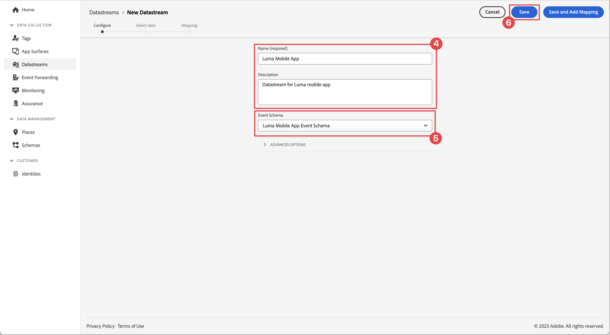

# 데이터 스트림 만들기

Experience Platform에서 datastream을 만드는 방법에 대해 알아봅니다.

데이터 스트림은 Platform Edge Network의 서버측 구성입니다. 데이터스트림을 사용하면 Platform Edge Network으로 들어오는 데이터가 Adobe Experience Cloud 애플리케이션 및 서비스로 적절하게 라우팅됩니다. 자세한 내용은 [설명서](https://experienceleague.adobe.com/en/docs/experience-platform/datastreams/overview) 또는 이 [비디오](https://experienceleague.adobe.com/en/docs/platform-learn/data-collection/edge-network/configure-datastreams)를 참조하세요.

{zoomable="yes"}

## 전제 조건

데이터 스트림을 만들려면 조직에서 데이터 수집 인터페이스(이전의 [!UICONTROL Launch])에서 이 기능을 프로비저닝해야 하며 데이터 스트림을 관리하고 볼 수 있는 사용자 권한이 있어야 합니다.

## 학습 목표

이 단원에서는 다음 작업을 수행합니다.

* 데이터 스트림을 사용할 시기를 알 수 있습니다.
* 데이터 스트림을 만듭니다.
* 데이터 스트림을 구성합니다.

## 데이터 스트림 만들기

[!UICONTROL 데이터 스트림] 구성 도구를 사용하여 [!UICONTROL 데이터 수집] 인터페이스에서 데이터 스트림을 만들 수 있습니다. 데이터 스트림을 생성하려면 다음을 수행합니다.

1. 데이터 스트림은 샌드박스 수준에서 정의되므로 올바른 Experience Platform 샌드박스에 있는지 확인합니다.
1. 왼쪽 레일에서 **[!UICONTROL 데이터스트림]**&#x200B;을 선택합니다.
1. **[!UICONTROL 새 데이터 스트림]**&#x200B;을 선택하십시오.

   {zoomable="yes"}

1. **[!UICONTROL 이름]**(예: `Luma Mobile App`)과 **[!UICONTROL 설명]**(예: `Datastream for Luma Mobile App`)을 지정하십시오.

   >[!NOTE]
   >
   >최종 미리 알림: 단일 샌드박스에 여러 사람과 함께 이 자습서를 진행하거나 공유 계정을 사용하는 경우 이름 지정 규칙의 일부로 ID를 추가하거나 앞에 추가하는 것이 좋습니다. 예를 들어 `Luma Mobile App Event Dataset` 대신 `Luma Mobile App Event Dataset - Joe Smith`을(를) 사용합니다. [개요](overview.md)의 참고도 참조하세요.

1. **이벤트 스키마** 목록에서 이전 단원에서 만든 스키마를 선택합니다.
1. **[!UICONTROL 저장]**&#x200B;을 선택합니다.

   {zoomable="yes"}

## 서비스 추가

이 자습서에서 (선택 사항) [Analytics](analytics.md) 및 [Experience Platform](platform.md) 단원을 진행할 때, Platform Edge Network으로 전송된 데이터가 이러한 응용 프로그램으로 전달되도록 데이터 스트림에 서비스를 추가합니다.

<!--

### Adobe Analytics

1. Select **[!UICONTROL Add Service]**.

1. Add **[!UICONTROL Adobe Analytics]** from the [!UICONTROL Service] list, 

1. Enter the name of the report site that you want to use in **[!UICONTROL Report Suite ID]**.

1. Enable the service by switching **[!UICONTROL Enabled]** on.

1. Select **[!UICONTROL Save]**.

   {zoomable="yes"}

### Adobe Experience Platform

You might also want to enable the Adobe Experience Platform service. 

>[!IMPORTANT]
>
>You can only enable the Adobe Experience Platform service when having created an event dataset. If you don't already have an event dataset created, follow the instructions [here](platform.md).

1. Click  **[!UICONTROL Add Service]** to add another service.

1. Select **[!UICONTROL Adobe Experience Platform]** from the [!UICONTROL Service] list.

1. Enable the service by switching **[!UICONTROL Enabled]** on.

1. Select the **[!UICONTROL Event Dataset]** that you created as part of the [Create a dataset](platform.md#create-a-dataset) instructions, for example **Luma Mobile App Event Dataset**

1. Select **[!UICONTROL Save]**.

   {zoomable="yes"}
1. The final configuration should look something like this.
   
   {zoomable="yes"}

-->

>[!NOTE]
>
>조직에서 사용하는 각 서비스를 활성화하면 모바일 앱에서 수집한 데이터를 어디에서나 사용할 수 있습니다. 자세한 내용은 [데이터스트림 설정](https://experienceleague.adobe.com/en/docs/experience-platform/datastreams/overview)을 참조하세요.

자체 앱에서 Platform Mobile SDK을 구현할 때 궁극적으로 세 개의 데이터 스트림을 만들어 세 개의 태그 환경(개발, 스테이지 및 프로덕션)에 매핑해야 합니다. Adobe Real-Time Customer Data Platform 또는 Adobe Journey Optimizer과 같은 플랫폼 기반 애플리케이션과 함께 Platform Mobile SDK을 사용하는 경우 적절한 샌드박스에서 이러한 데이터스트림을 만들어야 합니다.

>[!SUCCESS]
>
>이제 자습서의 나머지 부분에서 사용할 데이터 스트림이 있습니다.
>
>Adobe Experience Platform Mobile SDK에 대해 학습하는 데 시간을 투자해 주셔서 감사합니다. 질문이 있거나 일반적인 피드백을 공유하고 싶거나 향후 콘텐츠에 대한 제안이 있는 경우 이 [Experience League 커뮤니티 토론 게시물](https://experienceleaguecommunities.adobe.com/t5/adobe-experience-platform-data/tutorial-discussion-implement-adobe-experience-cloud-in-mobile/td-p/443796)에서 공유하십시오.

다음: **[태그 속성 구성](configure-tags.md)**
