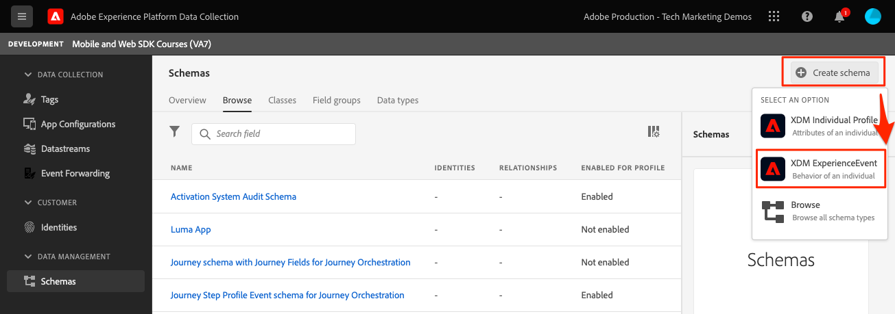
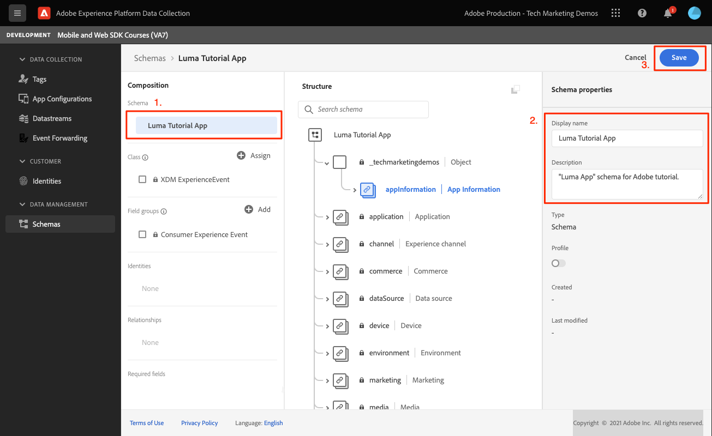

# XDM 스키마 만들기

모바일 앱 이벤트를 위한 XDM 스키마를 만드는 방법을 알아보십시오.

표준화와 상호 운용성은 Adobe Experience Platform의 주요 개념입니다. Adobe 기반의 XDM(경험 데이터 모델)은 고객 경험 데이터를 표준화하고 고객 경험 관리를 위한 스키마를 정의하려는 노력입니다.

## XDM 스키마란 무엇입니까?

XDM은 디지털 경험의 힘을 향상시키기 위해 설계된 문서화된 사양입니다. 모든 애플리케이션이 플랫폼 서비스와 통신할 수 있도록 하는 일반적인 구조 및 정의를 제공합니다. XDM 표준을 준수함으로써 모든 고객 경험 데이터를 보다 빠르고 통합된 방식으로 통찰력을 제공할 수 있는 공통 표현으로 통합할 수 있습니다. 고객 작업을 통해 유용한 통찰력을 얻을 수 있고, 세그먼트를 통해 고객 대상을 정의하고, 개인화를 위해 고객 속성을 표현할 수 있습니다.

Experience Platform은 스키마를 사용하여 데이터의 구조를 일관되고 재사용 가능한 방식으로 설명합니다. 여러 시스템에서 데이터를 일관되게 정의하면 의미를 쉽게 유지할 수 있으므로 데이터의 가치를 얻을 수 있습니다.

데이터를 Platform에 수집하려면 먼저 데이터 구조를 설명하고 각 필드 내에 포함할 수 있는 데이터 유형에 제한을 제공하도록 스키마를 구성해야 합니다. 스키마는 기본 클래스와 0개 이상의 스키마 필드 그룹으로 구성됩니다.

디자인 원칙 및 모범 사례를 포함한 스키마 구성 모델에 대한 자세한 내용은 다음을 참조하십시오. [스키마 구성 기본 사항](https://experienceleague.adobe.com/docs/experience-platform/xdm/schema/composition.html?lang=ko-KR) 또는 교육 과정 [XDM을 사용하여 고객 경험 데이터 모델링](https://experienceleague.adobe.com/?recommended=ExperiencePlatform-D-1-2021.1.xdm).

>[!TIP]
>
>Analytics 솔루션 디자인 참조(SDR)에 익숙한 경우 스키마를 더 강력한 SDR로 생각할 수 있습니다.

## 전제 조건

단원을 완료하려면 Experience Platform 스키마를 생성할 권한이 있어야 합니다.

## 학습 목표

이 단원에서는 다음 작업을 수행합니다.

* 데이터 수집 인터페이스에서 스키마 만들기
* 스키마에 표준 필드 그룹 추가
* 스키마에 사용자 지정 필드 그룹 만들기 및 추가

## 스키마로 이동

1. Adobe Experience Cloud에 로그인합니다.

1. 앱 전환기를 열고 을 선택합니다 **[!UICONTROL 데이터 수집]**

   

1. 이 자습서에서 사용하는 Experience Platform 샌드박스에 있는지 확인하십시오.

   >[!NOTE]
   >
   > 실시간 CDP와 같은 플랫폼 기반 애플리케이션 고객은 이 자습서에 개발 샌드박스를 사용해야 합니다. 다른 고객은 기본 프로덕션 샌드박스를 사용합니다.

1. 선택 **[!UICONTROL 스키마]** 아래에 **[!UICONTROL 데이터 관리]**.

   

이제 기본 스키마 페이지에 있으며 기존 스키마 목록이 표시됩니다. 스키마의 핵심 구성 요소에 해당하는 탭을 볼 수도 있습니다.

* **필드 그룹** 개인 세부 정보, 호텔 환경 설정 또는 주소와 같은 특정 데이터를 캡처할 필드를 하나 이상 정의하는 재사용 가능한 구성 요소입니다.
* **클래스** 스키마에 포함된 데이터의 동작 측면을 정의합니다. 예: `XDM ExperienceEvent` 시계열, 이벤트 데이터 및 `XDM Individual Profile` 개인에게 대한 속성 데이터를 캡처합니다.
* **데이터 유형** 는 기본 리터럴 필드와 같은 방식으로 클래스 또는 필드 그룹에서 참조 필드 유형으로 사용됩니다.

위의 설명은 높은 수준의 개요입니다. 자세한 내용은 [스키마 빌딩 블록](https://experienceleague.adobe.com/docs/platform-learn/tutorials/schemas/schema-building-blocks.html?lang=ko-KR) 비디오 또는 읽기 [스키마 작성 기본 사항](https://experienceleague.adobe.com/docs/experience-platform/xdm/schema/composition.html?lang=en) 를 참조하십시오.

이 자습서에서는 소비자 경험 이벤트 필드 그룹을 사용하고 사용자 지정 이벤트 필드를 만들어 프로세스를 보여줍니다.

>[!NOTE]
>
>Adobe은 계속 더 많은 표준 필드 그룹을 추가하며 이러한 필드는 Experience Platform 서비스에서 암묵적으로 이해하며 플랫폼 구성 요소 간에 사용할 때 더 높은 일관성을 제공하므로 가능한 한 사용해야 합니다. 표준 필드 그룹을 사용하면 Platform의 Analytics 및 AI 기능에서 자동 매핑과 같은 실질적인 이점이 있습니다.

## Luma 앱 스키마 아키텍처

실제 시나리오에서는 스키마 디자인 프로세스가 다음과 같을 수 있습니다.

* 비즈니스 요구 사항 수집
* 가능한 한 많은 요구 사항을 처리할 사전 빌드된 필드 그룹을 찾습니다.
* 틈새에 대해 사용자 정의 필드 그룹을 만듭니다.

학습 목적을 위해 사전 빌드된 필드 그룹과 사용자 지정 필드 그룹을 사용합니다.

* **소비자 경험 이벤트**: 공통 필드가 많은 사전 빌드된 필드 그룹입니다.
* **앱 정보**: TrackState/TrackAction Analytics 개념을 모방하도록 디자인된 사용자 지정 필드 그룹입니다.

<!--Later in the tutorial, you can [update the schema](lifecycle-data.md) to include the **[!UICONTROL AEP Mobile Lifecycle Details]** field group.-->

## 스키마 만들기

1. 선택 **[!UICONTROL 스키마 만들기]** 옵션 드롭다운 메뉴를 가져오려면 **[!UICONTROL XDM ExperienceEvent]**.

   

1. `Consumer Experience Event`을 검색합니다. 

1. 선택하기 전에 필드를 미리 보거나 설명을 읽을 수 있습니다.

1. 확인란을 선택한 다음 **[!UICONTROL 필드 그룹 추가]**.

   

   사용 가능한 모든 필드를 볼 수 있는 기본 스키마 구성 화면으로 돌아갑니다.

1. 을(를) 선택하여 스키마에 이름을 지정합니다 **[!UICONTROL 제목 없는 스키마]** 왼쪽 상단에서 **[!UICONTROL 표시 이름]** &amp; **[!UICONTROL 설명]**, 예 `Luma Tutorial Mobile` 및 `"Luma App" schema for Adobe Tutorial`

1. **[!UICONTROL 저장]**&#x200B;을 선택합니다.

   

>[!NOTE]
>
>그룹의 모든 필드를 사용할 필요는 없습니다. 도움이 되는 경우 스키마를 빈 데이터 레이어로 간주할 수 있습니다. 앱에서 적절한 시간에 관련 값을 채웁니다.
>
>다음 `Consumer Experience Event` 에는 `Web information`: 페이지 보기 및 링크 클릭과 같은 이벤트를 설명합니다. 작성 시, 이 기능에 대한 모바일 앱 패리티가 없으므로 직접 만들 것입니다.

## 사용자 지정 데이터 유형 만들기

먼저 두 이벤트를 설명하는 사용자 지정 데이터 유형을 만듭니다.

* 화면 보기
* 앱 상호 작용

1. 을(를) 선택합니다 **[!UICONTROL 데이터 유형]** 탭을 선택하고 **[!UICONTROL 데이터 유형 만들기]**.

   

1. ID를 **[!UICONTROL 표시 이름]** 및 **[!UICONTROL 설명]**, 예 `App Information` 및 `Custom data type describing "Screen Views" & "App Actions"`

   

   >[!TIP]
   >
   > 항상 읽기 쉽고 설명적인 사용 [!UICONTROL 이름 표시] 사용자 지정 필드의 경우, 세그먼트 빌더와 같은 다운스트림 서비스의 필드가 표시될 때 이러한 방법을 통해 마케터가 보다 쉽게 액세스할 수 있습니다.

1. 필드를 추가하려면 (+) 버튼을 선택합니다.

   이 필드는 앱 상호 작용을 위한 컨테이너 개체입니다. 낙타케이스로 주세요 **[!UICONTROL 필드 이름]** `appInteraction`, **[!UICONTROL 표시 이름]** `App Interaction`, 및 **[!UICONTROL 유형]** `Object`.

1. 선택 **[!UICONTROL 적용]**.

   

1. 작업 발생 빈도를 측정하려면 옆의 (+) 버튼을 선택하여 필드를 추가합니다 `appInteraction` 만든 개체입니다.

1. 낙타케이스로 주세요 **[!UICONTROL 필드 이름]** `appAction`, **[!UICONTROL 표시 이름]** 의 `App Action` 및 **[!UICONTROL 유형]** `Measure`.

   이 단계는 Adobe Analytics의 성공 이벤트와 같습니다.

1. 선택 **[!UICONTROL 적용]**.

   

1. 옆에 있는 (+) 버튼을 선택하여 상호 작용 유형을 설명하는 필드를 추가합니다 `appInteraction` 개체.

1. ID를 **[!UICONTROL 필드 이름]** `name`, **[!UICONTROL 표시 이름]** 의 `Name` 및 **[!UICONTROL 유형]** `String`.

   이 단계는 Adobe Analytics의 차원에 해당합니다.

   

1. 오른쪽 레일의 하단으로 스크롤하여 을 선택합니다 **[!UICONTROL 적용]**.

1. 같은 패턴을 따라 `appStateDetails` 측정값 필드를 포함하는 개체 `screenView` 및 `screenName` 및 `screenType`.

1. **[!UICONTROL 저장]**&#x200B;을 선택합니다.

   

## 사용자 지정 필드 그룹 추가

이제 사용자 지정 데이터 유형을 사용하여 사용자 지정 필드 그룹을 추가합니다.

1. 이 단원에서 이전에 만든 스키마를 엽니다.

1. 선택 **[!UICONTROL 추가]** 다음 **[!UICONTROL 필드 그룹]**.

   

1. 이번에는 을(를) 선택하여 사용자 지정 필드 그룹을 만듭니다 **[!UICONTROL 새 필드 그룹 만들기]** 상단 근처에 있는 라디오 단추에 이름과 설명을 입력합니다(예: ). `App Interactions` 및 `Fields for app interactions`.

   

1. 기본 구성 화면에서 스키마 루트에 필드를 추가합니다.

1. 스키마 이름 옆에 있는 (+)를 선택합니다.

1. 오른쪽 레일에서 를 제공합니다. **[!UICONTROL 필드 이름]** 의 `appInformation`, 의 표시 이름 `App Information`.

1. 선택 `App Information` 에서 **[!UICONTROL 유형]** 드롭다운을 사용하면 이전 연습에서 만든 데이터 유형을 만들 수 있습니다.

1. 선택 **[!UICONTROL 적용]**.

   

>[!NOTE]
>
>사용자 지정 필드 그룹은 항상 Experience Cloud 조직 식별자 아래에 배치됩니다.
>
>`_techmarketingdemos` 은 조직의 고유 값으로 대체됩니다.

이제 자습서의 나머지 부분에서 사용할 스키마가 있습니다.

다음: **[만들기 [!UICONTROL 데이터 스트림]](create-datastream.md)**

>[!NOTE]
>
>Adobe Experience Platform Mobile SDK에 대한 학습에 시간을 내주셔서 감사합니다. 질문이 있거나 일반 피드백을 공유하거나 향후 컨텐츠에 대한 제안 사항이 있는 경우 해당 정보를 공유하십시오 [Experience League 커뮤니티 토론 게시물](https://experienceleaguecommunities.adobe.com/t5/adobe-experience-platform-launch/tutorial-discussion-implement-adobe-experience-cloud-in-mobile/td-p/443796)