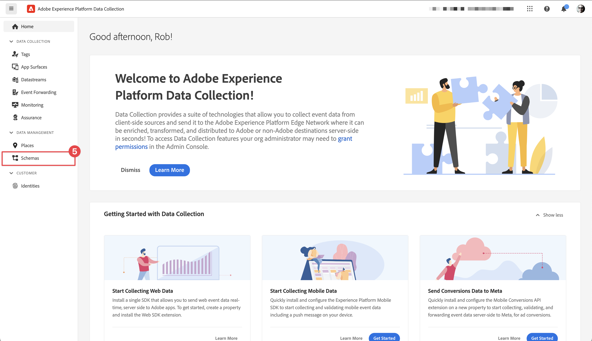
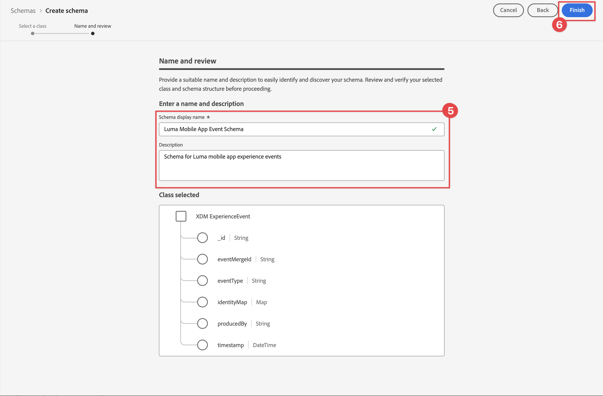
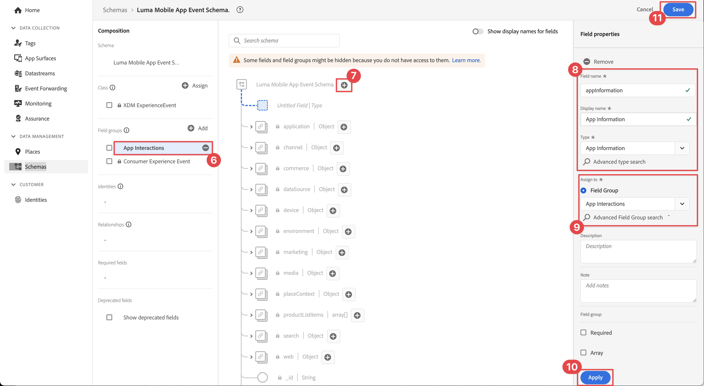

# XDM 스키마 만들기

모바일 앱 이벤트에 대한 XDM 스키마를 만드는 방법을 알아봅니다.

표준화와 상호 운용성은 Adobe Experience Platform의 핵심 개념입니다. Adobe을 기반으로 하는 XDM(Experience Data Model)은 고객 경험 데이터를 표준화하고 고객 경험 관리를 위한 스키마를 정의하는 작업입니다.

## XDM 스키마란?

XDM은 디지털 경험의 성능을 개선하기 위해 설계된 공개적으로 문서화된 사양입니다. 모든 애플리케이션이 플랫폼 서비스와 통신할 수 있도록 하는 일반적인 구조와 정의를 제공합니다. XDM 표준을 준수함으로써 모든 고객 경험 데이터를 일반적인 표현에 통합하여 보다 빠르고 통합적인 방식으로 통찰력을 제공할 수 있습니다. 고객 작업에서 중요한 통찰력을 얻고, 세그먼트를 통해 고객 대상을 정의하고, 개인화 목적으로 고객 속성을 사용합니다.

Experience Platform은 스키마를 사용하여 데이터의 구조를 일관되고 재사용 가능한 방식으로 설명합니다. 여러 시스템에서 데이터를 일관되게 정의하면 의미를 쉽게 유지할 수 있으므로 데이터의 가치를 얻을 수 있습니다.

데이터를 Platform에 수집하려면 먼저 데이터의 구조를 설명하고 각 필드 내에 포함할 수 있는 데이터 유형에 제약 조건을 제공하는 스키마를 구성해야 합니다. 스키마는 기본 클래스와 0개 이상의 스키마 필드 그룹으로 구성됩니다.

디자인 원칙 및 모범 사례를 포함한 스키마 구성 모델에 대한 자세한 내용은 [스키마 구성의 기본 사항](https://experienceleague.adobe.com/docs/experience-platform/xdm/schema/composition.html?lang=ko) 또는 재생 목록 [XDM으로 고객 경험 데이터 모델링](https://experienceleague.adobe.com/ko/playlists/experience-platform-model-your-customer-experience-data-with-xdm)을 참조하십시오.

>[!TIP]
>
>Analytics 솔루션 디자인 참조(SDR)에 익숙하다면 스키마를 더 강력한 SDR로 생각할 수 있습니다. 자세한 내용은 [솔루션 디자인 참조(SDR) 문서 만들기 및 유지 관리](https://experienceleague.adobe.com/docs/analytics-learn/tutorials/implementation/implementation-basics/creating-and-maintaining-an-sdr.html?lang=ko)를 참조하십시오.

## 전제 조건

단원을 완료하려면 Experience Platform 스키마를 만들 수 있는 권한이 있어야 합니다.

## 학습 목표

이 단원에서는 다음 작업을 수행합니다.

* 데이터 수집 인터페이스에서 스키마 만들기
* 스키마에 표준 필드 그룹 추가
* 사용자 정의 필드 그룹을 만들어 스키마에 추가

## 스키마로 이동

1. Adobe Experience Cloud에 로그인.

1. 이 자습서에서 사용하는 Experience Platform 샌드박스에 있는지 확인합니다.

1. 앱 전환기 를 엽니다(오른쪽 상단).

1. 메뉴에서 **[!UICONTROL 데이터 수집]**&#x200B;을(를) 선택합니다.

   

   >[!NOTE]
   >
   > Real-Time CDP과 같은 플랫폼 기반 애플리케이션의 고객은 이 자습서에 개발 샌드박스를 사용해야 합니다. 다른 고객은 기본 프로덕션 샌드박스를 사용합니다.

1. 왼쪽 레일의 **[!UICONTROL 데이터 관리]**&#x200B;에서 **[!UICONTROL 스키마]**&#x200B;을(를) 선택하십시오.

   

이제 기본 스키마 페이지에 있으며 기존 스키마 목록이 표시됩니다. 스키마의 핵심 구성 요소에 해당하는 탭도 볼 수 있습니다.

* **필드 그룹**&#x200B;은(는) 개인 세부 정보, 호텔 환경 설정 또는 주소와 같은 특정 데이터를 캡처할 하나 이상의 필드를 정의하는 재사용 가능한 구성 요소입니다.
* **클래스**&#x200B;은(는) 스키마에 포함된 데이터의 동작 측면을 정의합니다. 예를 들어 `XDM ExperienceEvent`은(는) 시계열, 이벤트 데이터를 캡처하고 `XDM Individual Profile`은(는) 개인에 대한 특성 데이터를 캡처합니다.
* **데이터 형식**&#x200B;은(는) 기본 리터럴 필드와 같은 방식으로 클래스 또는 필드 그룹의 참조 필드 형식으로 사용됩니다.

위의 설명은 높은 수준의 개요입니다. 자세한 내용은 [스키마 빌딩 블록](https://experienceleague.adobe.com/docs/platform-learn/tutorials/schemas/schema-building-blocks.html?lang=ko-KR) 비디오를 참조하거나 제품 설명서에서 [스키마 컴포지션의 기본 사항](https://experienceleague.adobe.com/docs/experience-platform/xdm/schema/composition.html?lang=ko)을 읽어 보십시오.

이 자습서에서는 소비자 경험 이벤트 필드 그룹을 사용하여 프로세스를 보여 주는 사용자 지정 이벤트 그룹을 만듭니다.

>[!NOTE]
>
>Adobe은 더 많은 표준 필드 그룹을 계속 추가하고 있으며 Experience Platform 서비스에 의해 암시적으로 인식되고 플랫폼 구성 요소에서 사용할 때 더 큰 일관성을 제공하므로 가능한 한 항상 사용해야 합니다. 표준 필드 그룹을 사용하면 Analytics의 자동 매핑 및 플랫폼의 AI 기능과 같은 가시적인 이점이 있습니다.

## Luma 앱 스키마 아키텍처

실제 시나리오에서는 스키마 디자인 프로세스가 다음과 같을 수 있습니다.

* 비즈니스 요구 사항 수집.
* 가능한 많은 요구 사항을 처리할 사전 작성된 필드 그룹을 찾으십시오.
* 틈새에 대한 사용자 정의 필드 그룹을 생성합니다.

학습 목적으로 사전 빌드된 필드 그룹과 사용자 정의 필드 그룹을 사용합니다.

* **고객 경험 이벤트**: 공통 필드가 많은 미리 빌드된 필드 그룹입니다.
* **앱 정보**: TrackState/TrackAction Analytics 개념을 모방하도록 디자인된 사용자 지정 필드 그룹입니다.

<!--Later in the tutorial, you can [update the schema](lifecycle-data.md) to include the **[!UICONTROL AEP Mobile Lifecycle Details]** field group.-->

## 스키마 만들기

1. **[!UICONTROL 스키마 만들기]**&#x200B;를 선택합니다.

1. **[!UICONTROL 스키마 만들기]** 마법사의 **[!UICONTROL 클래스 선택]** 단계에서 **[!UICONTROL 이 스키마에 대한 기본 클래스 선택]** 아래의 **[!UICONTROL 경험 이벤트]**&#x200B;를 선택합니다.

1. **[!UICONTROL 다음]**&#x200B;을 선택합니다.

   

1. **[!UICONTROL 스키마 만들기]** 마법사의 **[!UICONTROL 이름 및 검토]** 단계에서 **[!UICONTROL 스키마 표시 이름]**(예: `Luma Mobile Event Schema`)과 [!UICONTROL 설명] (예: `Schema for Luma mobile app experience events`)을 입력합니다.

   >[!NOTE]
   >
   >단일 샌드박스에 여러 사람이 있는 이 자습서를 진행하거나 공유 계정을 사용하는 경우 이름 지정 규칙의 일부로 ID를 추가하거나 앞에 추가하는 것이 좋습니다. 예를 들어 `Luma Mobile App Event Schema` 대신 `Luma Mobile App Event Schema - Joe Smith`을(를) 사용합니다. [개요](overview.md)의 참고도 참조하세요.

1. 마법사를 완료하려면 **[!UICONTROL 마침]**&#x200B;을 선택하세요.

   

1. **[!UICONTROL 필드 그룹]** 옆에 있는  **추가**&#x200B;을(를) 선택하십시오.

   

1. `Consumer Experience Event` 검색

1. 필드 그룹을 선택하기 전에 필드를 미리 보거나 자세한 내용을 보려면 를 선택하십시오.

1. **소비자 경험 이벤트**&#x200B;를 선택합니다.

1. **[!UICONTROL 필드 그룹 추가]**&#x200B;를 선택합니다.

   

   사용 가능한 모든 필드를 볼 수 있는 기본 스키마 작성 화면으로 돌아갑니다.

1. **[!UICONTROL 저장]**&#x200B;을 선택합니다.

>[!NOTE]
>
>그룹의 모든 필드를 사용할 필요는 없습니다. 필드를 제거하여 스키마를 간결하고 이해하기 쉽게 유지할 수도 있습니다. 유용한 경우 스키마를 빈 데이터 레이어로 생각할 수 있습니다. 앱에서 적절한 시간에 관련 값을 채웁니다.

[!UICONTROL 소비자 경험 이벤트] 필드 그룹에는 페이지 보기 및 링크 클릭과 같은 이벤트를 설명하는 [!UICONTROL 웹 정보]라는 데이터 형식이 있습니다. 작성 시에는 이 기능에 대한 모바일 앱 패리티가 없으므로 직접 만듭니다.

## 사용자 지정 데이터 유형 만들기

먼저 두 이벤트를 설명하는 사용자 지정 데이터 유형을 만듭니다.

* 화면 보기
* 앱 상호 작용

1. **[!UICONTROL 데이터 형식]** 탭을 선택합니다.

1. **[!UICONTROL 데이터 형식 만들기]**&#x200B;를 선택합니다.

   

1. **[!UICONTROL 표시 이름]** 및 **[!UICONTROL 설명]**(예: `App Information` 및 `Custom data type describing "Screen Views" & "App Actions"`) 제공

   

   >[!TIP]
   >
   > 사용자 정의 필드에 대해 읽기 쉽고 설명적인 [!UICONTROL 표시 이름]을 사용하십시오. 이렇게 하면 세그먼트 빌더와 같은 다운스트림 서비스에 필드가 표시될 때 마케터가 더 쉽게 액세스할 수 있습니다.

1. 필드를 추가하려면  단추를 선택하세요.

1. 이 필드는 앱 상호 작용을 위한 컨테이너 개체이므로 카멜 대/소문자 **[!UICONTROL 필드 이름]** `appInteraction`, **[!UICONTROL 표시 이름]** `App Interaction`을(를) 제공하고 **[!UICONTROL 유형]** 목록에서 `Object`을(를) 선택하십시오.

1. **[!UICONTROL 적용]**&#x200B;을 선택합니다.

   

1. 작업이 발생하는 빈도를 측정하려면 만든 **[!UICONTROL appInteraction]** 개체 옆에 있는  단추를 선택하여 필드를 추가하십시오.

1. 카멜 대/소문자를 **[!UICONTROL 필드 이름]** `appAction`, **[!UICONTROL 표시 이름]**/`App Action` 및 **[!UICONTROL 유형]** `Measure`로 지정하십시오.

   이 단계는 Adobe Analytics의 성공 이벤트와 동일합니다.

1. **[!UICONTROL 적용]**&#x200B;을 선택합니다.

   

1. **[!UICONTROL appInteraction]** 개체 옆에 있는  단추를 선택하여 상호 작용 유형을 설명하는 필드를 추가합니다.

1. **[!UICONTROL 필드 이름]** `name`, **[!UICONTROL 표시 이름]**/`Name` 및 **[!UICONTROL 유형]** `String`을(를) 지정하십시오.

   이 단계는 Adobe Analytics의 차원과 동일합니다.

   

1. 오른쪽 레일 아래쪽으로 스크롤하여 **[!UICONTROL 적용]**&#x200B;을 선택합니다.

1. `screenView`(이)라는 **[!UICONTROL Measure]** 필드와 `screenName` 및 `screenType`(이)라는 두 개의 **[!UICONTROL String]** 필드를 포함하는 `appStateDetails` 개체를 만들려면 **[!UICONTROL appInteraction]** 개체를 만들 때와 동일한 단계를 수행합니다.

1. **[!UICONTROL 저장]**&#x200B;을 선택합니다.

   

## 사용자 정의 필드 그룹 추가

이제 사용자 지정 데이터 유형을 사용하여 사용자 지정 필드 그룹을 추가합니다.

1. 이 단원에서 이전에 만든 스키마를 엽니다.

1. **[!UICONTROL 필드 그룹]** 옆에 있는  **[!UICONTROL 추가]**&#x200B;을(를) 선택하십시오.

   

1. **[!UICONTROL 새 필드 그룹 만들기]**&#x200B;를 선택합니다.

1. **[!UICONTROL 표시 이름]** 및 **[!UICONTROL 설명]**(예: `App Interactions` 및 `Fields for app interactions`)을 지정하십시오.

1. **필드 그룹 추가**&#x200B;를 선택합니다.

   

1. 기본 컴포지션 화면에서 **[!UICONTROL 앱 상호 작용**]을 선택합니다.

1. 스키마 이름 옆에 있는  단추를 선택하여 스키마 루트에 필드를 추가합니다.

1. 오른쪽 레일에서 **[!UICONTROL 필드 이름]**/`appInformation`, **[!UICONTROL 표시 이름]**/`App Information`, **[!UICONTROL 유형]**/`App Information`을(를) 제공하세요.

1. **[!UICONTROL 필드 그룹]** 드롭다운에서 **[!UICONTROL 앱 상호 작용]**&#x200B;을 선택하여 필드를 새 필드 그룹에 할당합니다.

1. **[!UICONTROL 적용]**&#x200B;을 선택합니다.

1. **[!UICONTROL 저장]**&#x200B;을 선택합니다.

   

>[!NOTE]
>
>사용자 정의 필드 그룹은 항상 Experience Cloud 조직 식별자 아래에 배치됩니다.

>[!SUCCESS]
>
>이제 자습서의 나머지 부분에서 사용할 스키마가 있습니다.
>
>Adobe Experience Platform Mobile SDK에 대해 학습하는 데 시간을 투자해 주셔서 감사합니다. 질문이 있거나 일반적인 피드백을 공유하고 싶거나 향후 콘텐츠에 대한 제안이 있는 경우 이 [Experience League 커뮤니티 토론 게시물](https://experienceleaguecommunities.adobe.com/t5/adobe-experience-platform-data/tutorial-discussion-implement-adobe-experience-cloud-in-mobile/td-p/443796?profile.language=ko)에서 공유하십시오.

다음: **[[!UICONTROL 데이터스트림 만들기]](create-datastream.md)**
